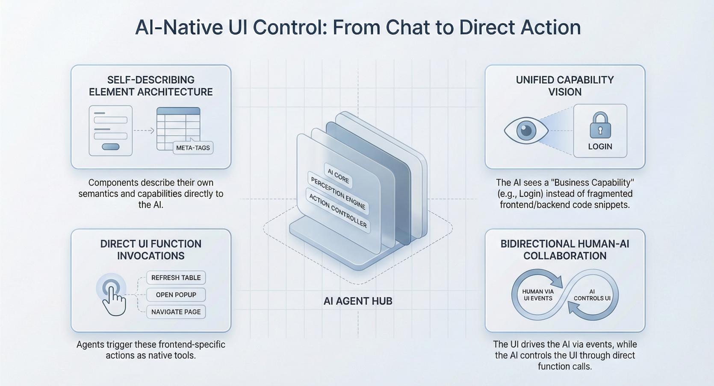

## Introduction

For most enterprise applications, the integration of Artificial Intelligence (AI) remains superficial. We typically see AI as a "chatbot sidecar"—a floating window that answers questions but remains disconnected from the application's core state. If a user wants the AI to "update the discount for these three line items," the AI usually generates a text response explaining *how* to do it, or at best, generates a JSON object that the user must manually copy.

This disconnect creates friction. True **AI native** development requires breaking the barrier between the backend reasoning engine and the frontend **UI**. It demands an architecture where **AI Agents** are not just text generators but intelligent operators capable of "seeing" the current page state and "touching" UI components to execute tasks.

This article explores the architectural patterns required to enable AI agents to directly manipulate frontend UIs, transforming them from passive advisors into active collaborators.

<!--truncate-->

## The Architecture of UI-Aware Agents

To enable an AI Agent to operate a UI, the system architecture must treat the frontend not just as a display layer, but as a structured environment of **tools** and **context** accessible to the LLM.

### 1. The Context Barrier

Traditionally, the backend (where the Agent lives) has no visibility into the client-side state (e.g., unsaved form data, current scroll position, selected table rows) unless explicitly posted via API.

**The Solution:** A mechanism to synchronize frontend state (ViewModel) into the Agent's context window automatically. This allows the AI to "read" the screen structurally, not visually (avoiding slow and error-prone OCR/vision models for pure data tasks).

### 2. The Action Barrier

Agents typically call backend APIs (e.g., `POST /api/orders`). However, many interactions require frontend logic: opening a modal, highlighting a field validation error, or switching tabs.

**The Solution:** Exposing **Page Functions** as executable tools for the Agent. The Agent should be able to emit a structured command that the frontend runtime interprets to execute local JavaScript functions.



## Core Capabilities for Human-AI Collaboration

Implementing this pattern enables three distinct interaction modes that go beyond simple chat.

### 1. Context-Aware Reasoning

The AI doesn't need to ask "What is the order status?" because the page data is injected into its context.

- **Example:** A user opens a customer detail page. The AI immediately has access to the customer's `ID`, `Name`, and `LastOrderDate` variables from the page model. 

### 2. Full-Stack Tool Invocation

The Agent can mix-and-match tools from the database, external APIs, and the **frontend UI**.

- **Backend Tool:** `queryInventory(sku)` (Checks database).
- **Frontend Tool:** `fillForm(quantity)` (Updates the input field on the user's screen).
- **Frontend Tool:** `showConfirmationModal()` (Triggers a React/Vue component).

This allows the AI to perform "hybrid" workflows: check stock (backend), then update the order form (frontend). 

### 3. "Action in Page" Confirmation (Human-in-the-Loop)

For high-stakes actions, the AI should not commit changes immediately. Instead, it should stage the changes in the UI for the user to review.

- **Pattern:** AI calculates values -> AI populates Form (Draft state) -> User Reviews -> User Clicks "Save".

This keeps the human in control while offloading the tedious data entry.

## Implementation Playbook

How do you build this? Below is a practical guide using **JitAI** as the reference implementation platform, as it natively supports the "Application-as-Context" paradigm.

### Step 1: Define the Page as a Tool Provider

In your page component (e.g., a React or Low-code page), declare specific functions that the AI is allowed to call.

- **Action:** In JitAI, create a **Page Function** (e.g., `updateGrade`).
- **Description:** Give it a clear docstring like: *"Updates the score and comment fields for the current student."* This helps the LLM understand *when* to use it.

### Step 2: Inject Page State

Configure the AI Assistant to receive the page's data model variables.

- **Action:** Bind the `AnswerSheet` data model to the Agent's input.
- **Result:** When the user engages the Agent, the entire structure of the answer sheet (student answer, standard answer, question text) is passed to the LLM automatically. 

### Step 3: Orchestrate the "Action in Page" Node

Use a workflow orchestration tool to define the hand-off between AI and UI.

- **Workflow:** `Start` -> `AI Agent (Reasoning)` -> `Action in Page (Update UI)` -> `Human Confirmation`.
- **Mechanism:** The Agent calculates the grade, and the workflow creates a "pause" state where the frontend updates the form fields. The process waits until the user clicks a button to proceed or finish. 

### Step 4: Subscribe to Frontend Events

The frontend must listen for the Agent's commands.

- **Event:** `Agent:ToolCall` or `Node:Paused`.
- **Handler:**

JavaScript

```plaintext
// Pseudo-code for handling AI instruction
assistant.on('ActionInPage', (payload) => {
  form.setValues({
    score: payload.suggestedScore,
    comment: payload.reasoning
  });
  notification.show("AI has drafted a grade. Please review.");
});

```

## Comparison: Traditional Chatbot vs. UI-Native Agent

| **Feature**     | **Traditional AI Chatbot**                     | **UI-Native Agent (JitAI)**                                                 |
| --------------- | ---------------------------------------------- | --------------------------------------------------------------------------- |
| **Data Access** | **Manual:** User copies/pastes text into chat. | **Automatic:** Agent reads page variables & component state. \[1\]          |
| **Output**      | **Text/Markdown:** "Here is the SQL query..."  | **Actions:** Agent updates form fields, switches tabs, opens dialogs. \[2\] |
| **State Sync**  | **Disconnected:** Chat history ≠ App state.    | **Unified:** Shared context between UI and Agent.                           |
| **Interaction** | **Conversational:** "Tell me X."               | **Operational:** "Do X for me."                                             |
| **Dev Effort**  | **High:** Custom middleware to bridge context. | **Low:** Native bindings for models/pages. \[3\]                            |

## How JitAI Addresses This

**JitAI** solves the "Frontend-Backend Barrier" through its unique **JAAP (JitAi Ai Application Protocol)**. Unlike standard frameworks where the UI and backend are loosely coupled via REST APIs, JitAI elements are "self-describing."

1.  **Interpretive Architecture:** Because the entire application structure (Pages, Models, Services) is defined in metadata, the AI can "read" the application's definition. It knows that `models.OrderTable` exists and has a `status` field without you writing a schema description manually. 
2.  **Visual Orchestration:** Developers can drag-and-drop an **"Action in page"** node directly into an AI Assistant's workflow. This node is specifically designed to pause execution and push data back to the frontend component.
3.  **Bi-Directional Interaction:** Not only does the page drive the AI (via user prompts), but the AI drives the page (via tool calls). For instance, an AI Agent can trigger a client-side function to "delete selected rows" by invoking a function defined in the Page element. 

This turns the AI from a "know-it-all" observer into a capable "worker" inside your application.

## Verification & Reproducibility

To verify the capabilities of UI-operating agents:

1.  **Market Standards:** Review current "Agentic UI" trends. Frameworks like Vercel's AI SDK are introducing "Generative UI" (streaming components). JitAI's approach differs by controlling *existing* enterprise UIs rather than generating ephemeral ones. \[Source: Vercel | Vercel AI SDK Generative UI | 2024 | [https://sdk.vercel.ai/docs/concepts/ui-generation/generative-ui](https://www.google.com/search?q=https://sdk.vercel.ai/docs/concepts/ui-generation/generative-ui)\]
2.  **Tooling Check:** Look for "Client-side Function Calling" support in LLM libraries (e.g., OpenAI's function calling API). While the model supports it, the *framework* (like JitAI) must execute the client-side code. \[Source: OpenAI | Function calling | n.d. | [https://platform.openai.com/docs/guides/function-calling](https://platform.openai.com/docs/guides/function-calling)\]
3.  **JitAI Demo:** In the JitAI `AI Demo` portal, locate the "Grading Assistant" example. Observe how the Agent reads the "Student Answer" field and populates the "Score" field without user data entry. 

## FAQ

**Q: Can the AI Agent trigger any function on my page?**

A: No. It can only trigger functions that you explicitly register as "Tools" and expose to the Agent. This ensures security and predictability.

**Q: Does this require the page to be built with a specific framework?**

A: In JitAI, this works natively with its built-in Page elements (Generic, AI Data Management). For external web pages, JitAI provides a JS SDK that allows you to register your own JavaScript functions (e.g., `window.myFunction`) as tools for the embedded Assistant. 

**Q: What happens if the AI tries to perform an action the user doesn't have permission for?**

A: JitAI Agents respect the platform's RBAC (Role-Based Access Control). You can configure tool permissions so that an Agent will fail (and report the error) if the current user lacks the necessary role to execute the underlying service function.

The next generation of enterprise apps will not just have "embedded AI"—they will be **AI-native**. This means the AI is no longer a guest in the application; it is a user with its own set of hands, capable of manipulating the UI to assist human users in real-time.

By adopting an architecture that exposes frontend state and functions as tools, developers can build workflows where humans and AI collaborate seamlessly on the same screen.

**Ready to build your first UI-operating Agent?**

Download the JitAI Desktop version to explore the "Grading Assistant" demo and see this architecture in action.

[Download JitAI](https://jit.pro/download) | [View Developer Tutorial](https://jit.pro/docs/tutorial)
