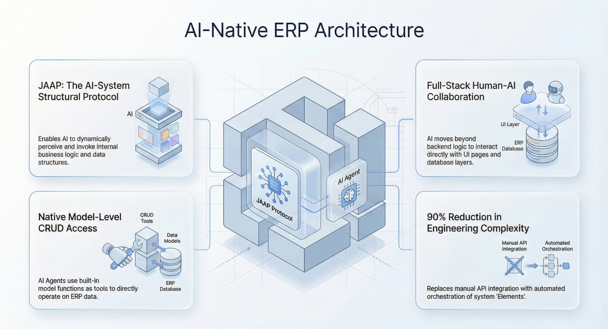

import Head from "@docusaurus/Head";

export const jsonLd = {
"@context": "https://schema.org",
"@graph": [
{
"@type": "Organization",
"@id": "https://jit.pro/#organization",
"name": "JitAI",
"legalName": "武汉万云网络科技有限公司",
"url": "https://jit.pro/",
"logo": {
"@type": "ImageObject",
"url": "https://jit-www.oss-accelerate.aliyuncs.com/logo/logo.svg"
},
"sameAs": [
"https://forum.jit.pro/",
"https://github.com/jitai-team",
"https://x.com/JitAi2017",
"https://www.instagram.com/jitai_2017",
"https://www.youtube.com/channel/UClvTNJPvBhek3aFuDy87RJQ",
"https://www.facebook.com/people/JitAi/61581485995674",
"https://www.linkedin.com/company/jitai2017"
]
},
{
"@type": "WebSite",
"@id": "https://jit.pro/#website",
"name": "JitAI",
"url": "https://jit.pro/",
"publisher": {
"@id": "https://jit.pro/#organization"
},
"inLanguage": [
"en",
"zh-CN"
]
},
{
"@type": "Blog",
"@id": "https://jit.pro/blog#blog",
"name": "Blog",
"url": "https://jit.pro/blog",
"isPartOf": {
"@id": "https://jit.pro/#website"
},
"publisher": {
"@id": "https://jit.pro/#organization"
},
"inLanguage": "en"
},
{
"@type": "WebPage",
"@id": "https://jit.pro/blog/ai-erp-database-7-day-query-analytics-checklist#webpage",
"url": "https://jit.pro/blog/ai-erp-database-7-day-query-analytics-checklist",
"name": "AI + ERP Database: A 7-Day Query & Analytics Checklist",
"description": "Learn what an AI database can do after connecting to an ERP database: a practical 7-day query and analytics checklist for teams.",
"isPartOf": {
"@id": "https://jit.pro/#website"
},
"breadcrumb": {
"@id": "https://jit.pro/blog/ai-erp-database-7-day-query-analytics-checklist#breadcrumb"
},
"inLanguage": "en"
},
{
"@type": "BreadcrumbList",
"@id": "https://jit.pro/blog/ai-erp-database-7-day-query-analytics-checklist#breadcrumb",
"itemListElement": [
{
"@type": "ListItem",
"position": 1,
"name": "Home",
"item": "https://jit.pro/"
},
{
"@type": "ListItem",
"position": 2,
"name": "Blog",
"item": "https://jit.pro/blog"
},
{
"@type": "ListItem",
"position": 3,
"name": "AI + ERP Database: A 7-Day Query & Analytics Checklist",
"item": "https://jit.pro/blog/ai-erp-database-7-day-query-analytics-checklist"
}
]
},
{
"@type": "BlogPosting",
"@id": "https://jit.pro/blog/ai-erp-database-7-day-query-analytics-checklist#blogposting",
"mainEntityOfPage": {
"@id": "https://jit.pro/blog/ai-erp-database-7-day-query-analytics-checklist#webpage"
},
"url": "https://jit.pro/blog/ai-erp-database-7-day-query-analytics-checklist",
"headline": "AI + ERP Database: A 7-Day Query & Analytics Checklist",
"name": "AI + ERP Database: A 7-Day Query & Analytics Checklist",
"description": "Learn what an AI database can do after connecting to an ERP database: a practical 7-day query and analytics checklist for teams.",
"datePublished": "2026-02-27T00:00:00.000Z",
"dateModified": "2026-02-27T00:00:00.000Z",
"inLanguage": "en",
"isPartOf": {
"@id": "https://jit.pro/blog#blog"
},
"author": {
"@id": "https://jit.pro/#organization"
},
"publisher": {
"@id": "https://jit.pro/#organization"
},
"image": [
"https://jit-www.oss-accelerate.aliyuncs.com/logo/logo_dark.svg"
],
"keywords": [
"AI database",
"ERP database query",
"ERP data analysis",
"automated reporting",
"anomaly detection",
"ERP analytics checklist",
"AI agent for ERP",
"system of record",
"semantic model",
"evidence packaging"
],
"timeRequired": "PT12M"
},
{
"@type": "FAQPage",
"@id": "https://jit.pro/blog/ai-erp-database-7-day-query-analytics-checklist#faq",
"isPartOf": {
"@id": "https://jit.pro/blog/ai-erp-database-7-day-query-analytics-checklist#webpage"
},
"inLanguage": "en",
"mainEntity": [
{
"@type": "Question",
"name": "Do we need a data warehouse before connecting AI to the ERP database?",
"acceptedAnswer": {
"@type": "Answer",
"text": "Not for week one. Warehouses help with scale and historical modeling, yet most trust issues start with definitions, joins, and permissions. You can build query-grade questions directly on the ERP database, then decide what to replicate later."
}
},
{
"@type": "Question",
"name": "Should we let an LLM generate SQL directly against production?",
"acceptedAnswer": {
"@type": "Answer",
"text": "Only with strong constraints. In practice, you want curated query templates, a semantic layer, permission-aware execution, and an audit log—so SQL generation stays bounded and reviewable."
}
},
{
"@type": "Question",
"name": "What’s the safest first “success metric” for the 7 days?",
"acceptedAnswer": {
"@type": "Answer",
"text": "Pick one cross-functional question that is painful today (for example, “shipped-not-billed with reasons”), then measure: time-to-answer, reconciliation rate vs. existing reports, and how often the answer ships with evidence."
}
},
{
"@type": "Question",
"name": "Where does anomaly detection belong in an ERP analytics rollout?",
"acceptedAnswer": {
"@type": "Answer",
"text": "After you have stable definitions. Anomaly detection on unstable metrics creates alert fatigue. Day 7 is about baselines and triage paths, not fancy models."
}
},
{
"@type": "Question",
"name": "When do we move from read-only queries to actions?",
"acceptedAnswer": {
"@type": "Answer",
"text": "When you can consistently answer “what changed and why” with evidence, and you have approvals, roles, and auditability ready. Otherwise write-back creates fast damage."
}
}
]
}
]
}

<Head>
    
</Head>

At 4:57 PM on a Friday, the operations lead asks, “Why did on-time shipping drop this week?” Someone pulls three ERP exports, merges them in a spreadsheet, and the numbers still don’t reconcile. Ten minutes later, the meeting ends with a guess—and a promise to “look deeper on Monday.”

Here’s the claim: **connecting AI to an ERP database only creates value when “questions become reproducible queries” in the first week**—with shared definitions, traceable evidence, and a baseline for anomalies. That week-one discipline is what turns an AI database into a system teams can trust.

<!--truncate-->

## What “AI connected to an ERP database” should mean in week one

Most ERP reporting pain is not a lack of dashboards. It’s a lack of **askable data**:

You can’t answer the same question twice and get the same result.  
You can’t explain *why* the number moved.  
You can’t show the evidence chain behind the answer.

So in the first week, the goal is narrow and practical: **make a set of high-frequency questions “query-grade”**—questions that map to stable joins, clear filters, and business definitions you can reuse.

To keep this safe, week one also assumes a constraint that real enterprises live with: the ERP database is a **system of record**. Read workflows are where credibility is earned; write-back comes later, behind approvals and audit trails.

## The 7-Day Query & Statistics Checklist

1.  **Day 1 — Prove connectivity and define “what is true”**  
    Start by turning the ERP database into an AI-readable map: key tables, primary keys, timestamps, and ownership boundaries (finance vs. ops vs. sales).  
    Then run a short set of “truth checks” that validate row counts and reconcile totals against known reports.  
    A good Day 1 output is a handful of reusable questions like: “What changed since yesterday?” and “Which records were modified after the last close?”
2.  **Day 2 — Master data sanity checks (the fastest ROI in read-only mode)**  
    Before you analyze transactions, stabilize the entities that define joins: customers, vendors, items, locations, chart of accounts.  
    Use AI-assisted queries to find duplicates, missing classifications, stale statuses, and inconsistent identifiers.  
    If you can’t trust the customer or item dimension, every downstream KPI becomes negotiable.
3.  **Day 3 — Order-to-cash: visibility across promises, shipments, and invoices**  
    Make the revenue pipeline explainable by connecting order state → fulfillment → billing → receivables.  
    Focus on “work-in-progress truths”: open orders past promise date, shipped-not-billed, invoice exceptions, aging by segment.  
    A useful pattern is: answer + evidence (IDs, timestamps, source tables) + a short narrative explaining the variance drivers.
4.  **Day 4 — Procure-to-pay: exceptions that block close and burn cash**  
    Build a set of queries that surface friction: open POs with no receipts, receipts with no invoices, invoice price variance vs. PO, and three-way match exceptions.  
    This is where “AI database” value often shows up as fewer escalations: the system can point to the exact documents and lines that created the exception.  
    Week-one success looks like shorter cycles for resolving mismatches, not new charts.
5.  **Day 5 — Inventory and operations: where “small errors” become real money**  
    Inventory questions are rarely single-table problems. They require joins across stock, movements, allocations, work orders, and sometimes quality.  
    Establish baseline queries for stockout risk, slow-moving inventory, negative inventory events, cycle count variance, and yield/variance by line.  
    If teams can ask, “What changed, where, and which transactions caused it?” you’re building operational trust.
6.  **Day 6 — Finance and reconciliation: make numbers explain themselves**  
    Finance needs repeatability more than creativity. Define the minimal reconciliation set: subledger-to-GL ties, posting status exceptions, accrual reasonability checks, and unusual journal patterns.  
    This is also where role-based access and evidence packaging matter most, because the questions touch sensitive data.  
    If your AI answers can point to the transactions and rules behind a number, you reduce the “spreadsheet court” problem.
7.  **Day 7 — Baseline anomaly detection and monitoring (without pretending it’s magic)**  
    Once you have query-grade metrics, set baselines: seasonality windows, expected ranges, and what counts as “material.”  
    Then add a lightweight monitoring layer that flags outliers and packages the investigation path: which metric moved, which slice explains it, and which transactions correlate.  
    This is a bridge to the next product shape: alerts, workflows, and eventually governed write-back.

## Why this checklist matches where the market is going

Three external signals explain why “AI + ERP database” is shifting from experiments to roadmap items:

First, agent adoption is moving into core enterprise applications. Gartner predicts **up to 40% of enterprise applications will include task-specific AI agents by 2026**, up from **less than 5% in 2025**.   
Second, most organizations are already testing agentic patterns. McKinsey reports **62% of respondents say their organizations are at least experimenting with AI agents**.   
Third, ERP vendors are explicitly pushing AI deeper into finance workflows. Gartner predicts finance organizations using cloud ERP with embedded AI assistants could see a **30% faster financial close by 2028**. 

Those are adoption signals. The bottleneck shows up one layer below the UI: **ERP data is relational, definition-heavy, and permissioned**. If your AI can’t reliably generate and explain the right joins, it can’t safely drive outcomes.

So the likely 12–18 month shape change looks like this:

More teams ship “askable ERP” first (natural language → governed queries).  
Then they productize monitoring (baselines, anomaly triage, evidence packaging).  
Then they gate write-back behind approvals, policies, and audit trails—because once AI can query the system of record, the business will ask it to change the system of record.

## A common misconception (and the counterargument)

The misconception: “Once AI can talk to the database, it can answer anything.”

In practice, raw database access creates two failure modes:

One is **definition drift**: the AI answers quickly, yet uses the wrong status field, the wrong time window, or the wrong join path—especially when ERP schemas reflect years of customizations.

The other is **confidence without evidence**: even if the number is correct, teams can’t verify it. That kills adoption faster than a slow dashboard ever did.

The response is not more prompting. It’s product discipline: constrain questions to query-grade patterns, attach evidence by default, and make definitions explicit. This is also why governance standards are rising in relevance for enterprise AI programs, including ISO/IEC 42001’s AI management system framing for risk, accountability, and continuous improvement.

## Where JitAI fits without turning this into a platform pitch

If you’re building this in-house, you’ll end up assembling the same components: database connectivity, a semantic model, permission-aware query execution, evidence packaging, and an audit trail. The engineering work is less about “chat” and more about turning ERP structure into reusable, inspectable capabilities.

That’s the shape JitAI is designed around: generating model elements from existing database schemas, so “questions” map to governed methods and reusable query patterns, and teams can evolve from read to governed actions as controls mature. If you want a concrete walkthrough of that approach, start with the [JitAI Tutorial](https://jit.pro/docs/tutorial).

Once you have a first set of query-grade workflows, a good next step is to stand up a sandbox connection and validate the 7-day checklist against your own schema and reporting definitions. You can [try JitAI](https://jit.pro/download) to explore that flow with a sample setup and adapt it to your ERP database constraints.

## Glossary (quick, practical definitions)

**AI database**  
In this context, it means an operational database that is made “AI-askable” through governed query interfaces, shared definitions, and evidence packaging—not a new database type.

**System of record**  
The authoritative store of business truth (orders, invoices, inventory, GL). Changes must be controlled, reviewable, and auditable.

**Semantic model**  
A shared layer that maps business concepts (customer, margin, on-time delivery) to tables, joins, and filters, so answers remain consistent across users and time.

**Evidence packaging**  
The habit of attaching query logic, record IDs, timestamps, and aggregation rules to every answer so humans can verify and audit it.

**Anomaly baseline**  
A defined “normal range” for a metric over time (and by segment), used to trigger investigation when behavior deviates materially.

## FAQ

### Do we need a data warehouse before connecting AI to the ERP database?

Not for week one. Warehouses help with scale and historical modeling, yet most trust issues start with definitions, joins, and permissions. You can build query-grade questions directly on the ERP database, then decide what to replicate later.

### Should we let an LLM generate SQL directly against production?

Only with strong constraints. In practice, you want curated query templates, a semantic layer, permission-aware execution, and an audit log—so SQL generation stays bounded and reviewable.

### What’s the safest first “success metric” for the 7 days?

Pick one cross-functional question that is painful today (for example, “shipped-not-billed with reasons”), then measure: time-to-answer, reconciliation rate vs. existing reports, and how often the answer ships with evidence.

### Where does anomaly detection belong in an ERP analytics rollout?

After you have stable definitions. Anomaly detection on unstable metrics creates alert fatigue. Day 7 is about baselines and triage paths, not fancy models.

### When do we move from read-only queries to actions?

When you can consistently answer “what changed and why” with evidence, and you have approvals, roles, and auditability ready. Otherwise write-back creates fast damage.
