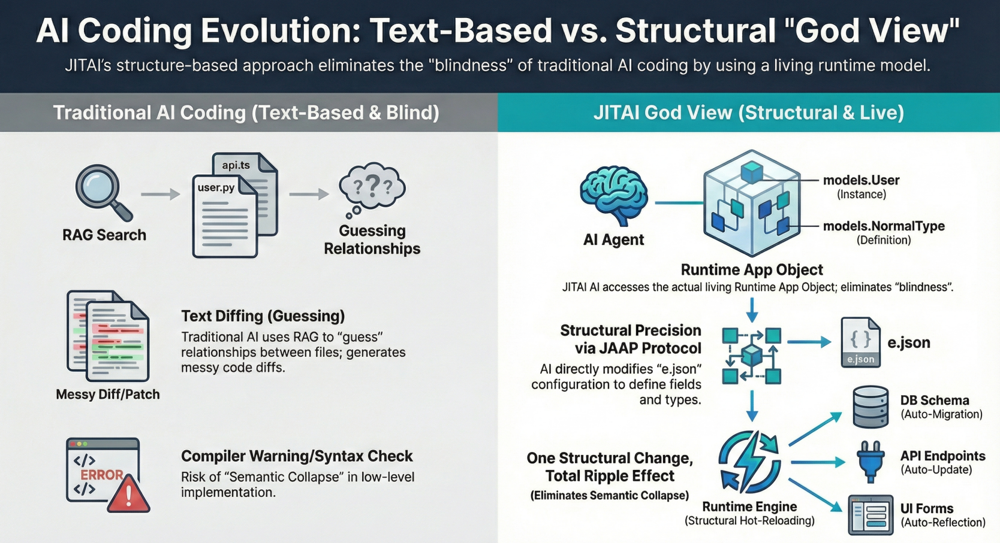

In the current landscape of AI-assisted development, most "AI coding" tools operate as sophisticated text completion engines. They predict the next token based on a localized file buffer or a retrieved snippet of code (RAG). While effective for generating boilerplate, this approach suffers from a critical blindness: the AI sees **files**, not **systems**.

For senior developers and architects, the limitation is obvious. An AI can write a Python function, but it rarely understands how that function impacts the global data model, the permissions schema, or the frontend component hierarchy. It lacks a "God View"—a holistic, real-time understanding of the running application’s structure.

This article explores how **JitAI** fundamentally shifts this paradigm through **JAAP (JitAi Application Protocol)** and the **MTI (Meta-Type-Instance)** architecture, elevating application structure to a first-class citizen that AI can natively understand, inspect, and modify.

<!--truncate-->

## The Blind Spot: Why "File-Based" AI Fails at Complexity

Traditional software development creates a disconnect between the *intent* (business logic) and the *implementation* (code scattered across hundreds of files).

- **Semantic Collapse:** As applications scale, business semantics get buried in implementation details. An "Order" isn't just a database table; it's a concept tied to approval workflows, inventory checks, and UI forms. AI reading `order.py` misses these lateral connections.
- **Context Window Constraints:** Even with expanded context windows (e.g., 128k or 1M tokens), feeding an entire repository to an LLM doesn't guarantee *reasoning*. The model must burn capacity just to parse syntax, leaving less capacity for architectural logic.
- **The "Keyhole" Problem:** RAG (Retrieval-Augmented Generation) typically fetches text chunks. If the AI changes a data model field, it doesn't inherently know it *must* also update the API serializer and the frontend type definition unless explicitly prompted.

To build truly autonomous **AI Agents** capable of complex system evolution, we need an architecture where the system *describes itself* to the AI.

## The JitAI Paradigm: Structure as a First-Class Citizen

JitAI addresses this through **JAAP**, a protocol that abstracts application complexity much like an operating system abstracts hardware. Instead of opaque code files, a JitAI application is composed of structured **Elements**.

### 1. The MTI Architecture (Meta-Type-Instance)

At the heart of this structural awareness is the **MTI** model. This is the "DNA" that gives the AI its "God View."

- **Meta (The Abstract Law):** Defines the fundamental capabilities of a category. For example, `models.Meta` defines what it means to be a "Data Model" (it has storage, fields, and CRUD operations).
- **Type (The Concrete Class):** A reusable implementation template. `models.NormalType` might be a standard relational table, while `models.AggregateType` is a virtual OLAP view. The AI understands that *all* elements of `models.NormalType` share specific behaviors.
- **Instance (The Living Object):** The actual business entity, e.g., `UserTable` or `OrderService`.

**How AI Sees It:**

When a JitAI Agent inspects an application, it doesn't just see `class User...`. It sees:

> "This is `UserTable`. It is an **Instance** of `models.NormalType`. Therefore, I know with certainty it supports `create()`, `query()`, and `delete()` methods, and it persists data to the configured database."

This structural certainty eliminates hallucination regarding available methods and system behaviors.

### 2. Application Inheritance and the "God View"

JitAI applications support deep inheritance. A new application can inherit from a "Base ERP App." The AI can traverse this inheritance tree at runtime.

- **Visibility:** The AI can query the `App` object to see exactly which elements are inherited, which are overridden, and which are new.
- **Safety:** Because the structure is defined by **Types**, the AI works within guardrails. It cannot accidentally delete a core system dependency defined in the parent `Meta` layer; the protocol enforces structural integrity.

## Architecture Diagram: Text vs. Structural AI

## Comparison: File-Based vs. Structural RAG

The following table highlights the difference between standard development and the JitAI structural approach.

| **Feature**            | **Standard "File-Based" Dev**                       | **JitAI "Structural" Dev (JAAP)**             |
| ---------------------- | --------------------------------------------------- | --------------------------------------------- |
| **Context Source**     | Raw code files / text chunks                        | Structured Element Metadata (JSON)            |
| **AI Understanding**   | Probabilistic (guessing intent from variable names) | Deterministic (knows capabilities via `Type`) |
| **Modification Scope** | Local file edits (regex/string replace)             | Global element reconfiguration                |
| **Integrity Check**    | Compile-time syntax errors                          | Runtime structural validation                 |
| **Impact Analysis**    | Requires full repo search/indexing                  | Direct traversal of dependency graph          |

_Note: In Standard Dev, developer maintenance overhead for understanding legacy code is often cited as ~42% of total time (Stripe, The Developer Coefficient, 2018)._

## Enabling "God View" at Runtime

JitAI is not just a code generator; it is a runtime platform. The AI Agent runs *inside* the environment.

### 1. Runtime Introspection

The Agent can invoke platform APIs like `app.getElement('models.User')` to retrieve the live definition of an element. It doesn't need to parse a file; it asks the system, "What are you?" and the system responds with a precise JSON definition.

### 2. Controlled Modification

When the AI needs to modify the app (e.g., "Add a data analysis page"), it doesn't write React code from scratch. It:

1.  Instantiates a new Element of `pages.DataAnalysisType`.
2.  Configures the `dataSources` parameter to point to existing Models.
3.  Saves the configuration.

The JitAI runtime engine immediately interprets this new configuration and renders a fully functional UI, complete with backend API bindings.

## Implementation Playbook: Building a Self-Modifying Agent

How do you leverage this power? Here is a step-by-step workflow for creating an Agent that can modify its own application structure.

1.  **Define the Goal:** Create an "Admin Agent" that can add new data tracking fields on demand.
2.  **Grant Permissions:** In the **Developer Portal**, create an **AI Agent** element. Ensure it has the `Model Management` tool enabled.
3.  **System Prompt Configuration:**
    - Instruct the Agent to first use `getAppStructure()` to understand existing models.
    - Use the "Check-Plan-Execute" pattern.
    - *Example Prompt:* "You are a system architect. When asked to add data fields, first identify the target Model Element. Check if the field exists. If not, use the `updateElementConfig` tool to append the new field definition to the `fields` array."

4.  **Runtime Execution:**
    - User: "We need to track 'Loyalty Points' for Customers."
    - Agent (Internal Monologue): "I see `models.Customer` exists. I will add `loyalty_points` of type `Number` to it."
    - Agent Action: Calls API to update `models.Customer`.
    - Result: The database schema updates instantly, and the "Customer Detail" page shows the new field.

## How to Verify / Reproduce

To verify the "God View" capabilities in your JitAI environment:

1.  **Inspect the Element Tree:** Open the **Developer Portal**. You will see the hierarchy of `Meta`, `Type`, and `Instance`. This tree *is* the source of truth the AI sees.
2.  **Switch to Source Code Mode:** Select an element (e.g., a Page) and click the `</>` icon. Notice how the logic is separated into `e.json` (Structure/Config) and script files (Logic). The AI primarily operates on `e.json` to alter structure.
3.  **Trigger an Agent:** Use the built-in "AI Assistant" in the IDE. Ask it: "What data models are related to the Order system?" It will traverse the element graph and list them accurately, proving it "sees" the connections, not just text matches.

## FAQ

**Q: Does JAAP replace writing code?**

**A:** No. JAAP handles the *structure* and *orchestration* (declarative). You still write specific business logic (imperative) in Python or TypeScript within the function hooks provided by the Elements.

**Q: Is this safe for production?**

**A:** Yes. Modifications via JAAP are transactional configuration changes. Unlike an AI rewriting a core library file and introducing a syntax error, JAAP ensures that a "Type" remains valid. If an invalid configuration is proposed, the platform rejects it before it takes effect.

**Q: Can I create my own "Types"?**

**A:** Absolutely. You can extend the framework by creating custom Meta or Type elements (e.g., a specialized "IoT Device" Type) that your Agents can then instantiate and manage.

## Conclusion

JitAI transforms the role of AI from a "coding assistant" to a "system architect." By exposing the application structure through **JAAP** and **MTI**, it grants AI the "God View" necessary to understand and evolve complex enterprise systems safely.

Ready to build apps that your AI can truly understand?

- [Download JitAI Desktop](https://jit.pro/download)
- [Read the JAAP Specification](https://jit.pro/docs/tutorial)
