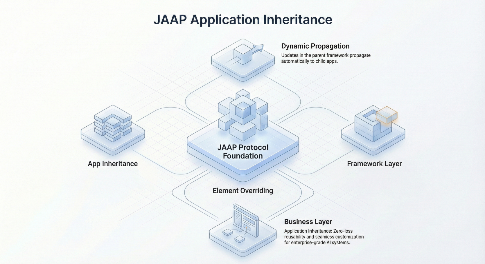

## Introduction

In the biological world, evolution drives resilience. A species shares a common genetic code (DNA) but adapts to different environments through mutation and differentiation. In contrast, enterprise software often suffers from entropy. As systems grow, they become rigid, brittle, and difficult to change—a phenomenon known as "software rot."

For senior developers and architects, the holy grail has always been **Application Inheritance**: the ability to build a "Child Application" that inherits all capabilities from a "Parent Application" by reference, while retaining the freedom to override specific behaviors for local needs. Unlike traditional code libraries or microservices reuse, true application inheritance implies a live, evolutionary link where improvements to the core system propagate automatically to all descendants, yet local adaptations remain intact.

This article explores how to architect systems that evolve rather than decay, using the principles of biological inheritance applied to software engineering.

<!--truncate-->

## The Biological Metaphor: Genotype vs. Phenotype

To understand application inheritance, we must separate the definition of the application from its execution.

- **Genotype (DNA):** The structural definition of the application (Models, Views, Logic, Permissions).
- **Phenotype (Organism):** The running application instance interacting with users and data.

In traditional development, when you duplicate a project to create a variant (e.g., a "US Version" and "EU Version" of an ERP), you are essentially cloning the organism. If the "US Version" fixes a critical bug, the "EU Version" does not benefit unless you manually transplant the fix (cherry-picking commits). This leads to divergence and maintenance nightmares.

**Application Inheritance** changes this paradigm. The Child Application points to the Parent's Genotype. It does not copy the code; it *references* it.

### The Mechanism of Differentiation

Just as biological organisms express traits differently based on environment, a Child Application allows for **selective overriding**.

1.  **Inheritance by Default:** If the Child does not define a component (e.g., `OrderProcessingService`), it uses the Parent's version.
2.  **Differentiation (Mutation):** If the Child needs a specific tax calculation, it defines its own `TaxService`. The runtime environment detects this "local mutation" and loads it instead of the Parent's version.
3.  **Evolutionary Propagation:** When the Parent improves the `OrderProcessingService`, the Child immediately uses the new version because it was never effectively "copied"—only referenced.

## How JitAI Addresses This: The JAAP Protocol

JitAI implements this evolutionary model through **JAAP (JitAi Application Protocol)**. JAAP treats the application structure not as implicit code, but as a "first-class citizen" that can be manipulated, inherited, and evolved.

### 1. Structural Inheritance (Meta → Type → Instance)

In JitAI, every element (Page, Service, Data Model) follows a strict hierarchical structure: **Meta (Abstract) → Type (Class/Template) → Instance (Concrete)**.

- **Meta:** Defines the fundamental behavior (e.g., `models.Meta`).
- **Type:** A reusable template (e.g., `models.NormalType`). Developers can create their own Types to encapsulate specific business logic patterns.
- **Instance:** The actual running element (e.g., `models.UserTable`).

This structure allows developers to "Make full use of Type element template capabilities" to enforce standards across the enterprise.

### 2. Application-Level Inheritance

Beyond individual elements, JitAI allows entire applications to inherit from one another. The runtime platform provides methods like `getParentsMetadata` to traverse this hierarchy, enabling a Child App to access configuration and environment variables "including those inherited from parent applications".

This capability transforms the "Copy-Paste" problem into a "Reference-Extend" solution. An enterprise can build a **Core HR App** and extend it into **Regional HR Apps**. The Regional Apps inherit all data models and workflows but can override the "Payroll Calculation" function to suit local laws.

### 3. AI as the Evolution Agent

Because JAAP makes the application structure explicit and self-describing, AI agents can understand and modify the system safely. "AI operates not on interfaces, but on the application structure itself". This means AI can assist in the "mutation" process—suggesting how a Child App should diverge from the Parent based on new requirements—without breaking the evolutionary link.

## Architecture: The Inheritance Hierarchy

The following diagram illustrates how requests are resolved in an inherited application environment. The runtime looks for the requested resource in the Child; if not found, it traverses up the chain to the Parent.

## Comparison: Strategies for Reuse

| **Strategy**                | **Mechanism**                                | **Pros**                                                                                                                 | **Cons**                                                                                                                        |
| --------------------------- | -------------------------------------------- | ------------------------------------------------------------------------------------------------------------------------ | ------------------------------------------------------------------------------------------------------------------------------- |
| **Copy-Paste (Forking)**    | Duplicating source code files.               | Zero dependencies; total freedom.                                                                                        | **Software Rot:** Updates in original are lost; maintenance cost doubles with every fork.                                       |
| **Shared Libraries**        | Packaging code into `.jar` / `.npm` modules. | Version control; strong encapsulation.                                                                                   | **"Dependency Hell":** Version conflicts; difficult to override internal behaviors without complex patterns (Strategy/Factory). |
| **Microservices**           | Reusing functionality via HTTP APIs.         | Technology agnostic; independent scaling.                                                                                | **Network Overhead:** Latency; distributed complexity; no UI/Frontend inheritance.                                              |
| **Application Inheritance** | Runtime resolution of structure (JAAP).      | **Evolutionary:** Automatic propagation of core updates; granular overriding of full-stack elements (UI + Data + Logic). | **Coupling:** Child apps are strongly coupled to the Parent's contract (Genotype).                                              |

## Implementation Playbook

To implement an evolutionary architecture using application inheritance, follow these steps:

### Step 1: Define the "Genotype" (Base Application)

Create a Base Application that contains only universal logic and data structures.

- **Data Models:** Define core entities like `User`, `Tenant`, `Subscription`.
- **Abstract Flows:** Create workflows with "hook" points (empty functions) intended to be overridden.
- **Standard UI:** Build generic layouts that read configuration dynamically.

### Step 2: Create the "Phenotype" (Child Application)

Initialize a new application that declares the Base Application as its parent.

- **Do not copy code.**
- **Configure Environment:** Use `getEnvVarsDefine` to verify which variables are inherited.

### Step 3: Implement Strategic Overrides

Identify where the Child needs to differ.

- **UI Differentiation:** If the Child needs a specific "Data Entry Page," extend the generic page type and override the `layout` configuration in `scheme.json`.
- **Logic Differentiation:** Create a service function with the *exact same name* as the Parent's function. The runtime will prioritize this local instance.

### Step 4: Verify Inheritance

Deploy the Child Application.

- Test a standard flow (handled by Parent).
- Test a specialized flow (handled by Child).
- **Evolution Test:** Update a standard flow in the Parent and ensure the Child reflects the change without redeployment of the Child itself.

## How to Verify / Reproduce

If you are using the JitAI platform, you can verify the inheritance mechanism as follows:

1.  **Check Metadata:** call `app.getParentsMetadata()` in a backend script. It should return an `OrderedDict` containing the `appId` and `version` of the parent hierarchy.
2.  **Inspect Element Definition:** Use `app.getElement(fullName)` on a Child App. If the element exists only in the Parent, the returned object should point to the Parent's resource, but executed within the Child's context (e.g., using Child's database connection).

## FAQ

**Q: Can I inherit from multiple parent applications?**

A: Typically, application inheritance follows a linear or tree-based hierarchy (Single Inheritance) to avoid the "Diamond Problem" of conflict resolution, though JAAP's internal protocol handles element-level composition.

**Q: What happens if I rename a function in the Parent?**

A: This acts as a "breaking change" in evolution. If the Child was overriding `FunctionA` and the Parent renames it to `FunctionB`, the Child's override may become an "orphan" (unused code), and the Child will start using the Parent's `FunctionB` (if compatible) or fail. Semantic versioning of the Parent App is crucial.

**Q: Does inheritance affect performance?**

A: There is a negligible lookup cost during the resolution phase (finding the right element). However, modern platforms like JitAI cache these resolutions heavily. The long-term efficiency gain in maintenance vastly outweighs runtime nanoseconds.

## Conclusion

Building software like biological evolution requires a shift in mindset. We must stop viewing applications as static artifacts that are "finished" and start viewing them as living lineages that adapt and grow.

By leveraging **Application Inheritance**, developers can maintain a "single source of truth" for core business logic while granting infinite flexibility for edge cases. Whether you call it "Evolutionary Architecture" or "Genotypic Programming," the result is the same: systems that get stronger, not weaker, over time.

**Ready to evolve your software architecture?**

[Download JitAI Desktop](https://jit.pro/download) to experiment with JAAP, or explore the [JitAI Tutorial](https://jit.pro/docs/tutorial) to build your first inherited application today.
