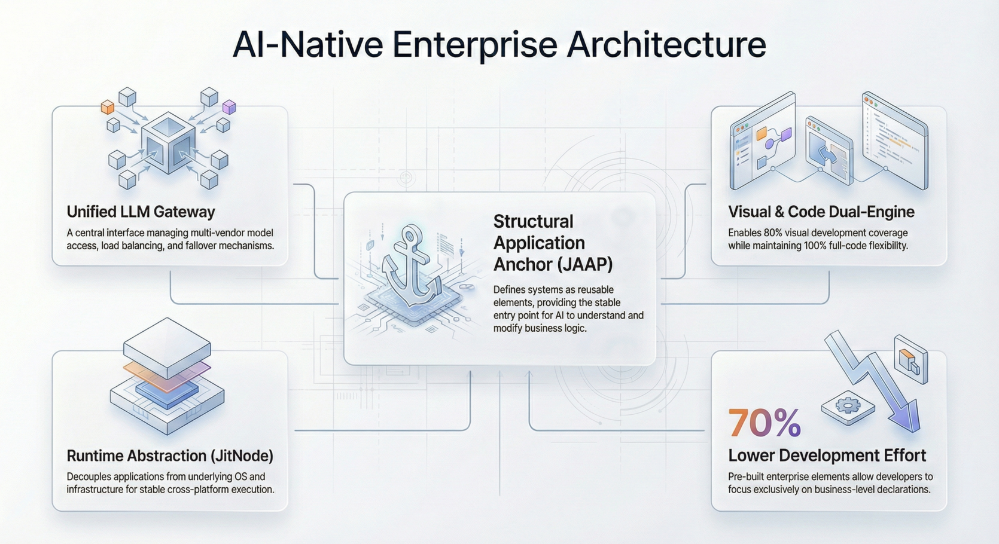

import Head from "@docusaurus/Head";

export const jsonLd = {
"@context": "https://schema.org",
"@graph": [
{
"@type": "Organization",
"@id": "https://jit.pro/#organization",
"name": "JitAI",
"legalName": "武汉万云网络科技有限公司",
"url": "https://jit.pro/",
"logo": {
"@type": "ImageObject",
"url": "https://jit-www.oss-accelerate.aliyuncs.com/logo/logo.svg"
},
"sameAs": [
"https://forum.jit.pro/",
"https://github.com/jitai-team",
"https://x.com/JitAi2017",
"https://www.instagram.com/jitai_2017",
"https://www.youtube.com/channel/UClvTNJPvBhek3aFuDy87RJQ",
"https://www.facebook.com/people/JitAi/61581485995674",
"https://www.linkedin.com/company/jitai2017"
]
},
{
"@type": "WebSite",
"@id": "https://jit.pro/#website",
"name": "JitAI",
"url": "https://jit.pro/",
"publisher": {
"@id": "https://jit.pro/#organization"
},
"inLanguage": ["en", "zh-CN"]
},
{
"@type": "Blog",
"@id": "https://jit.pro/blog#blog",
"name": "Blog",
"url": "https://jit.pro/blog",
"isPartOf": {
"@id": "https://jit.pro/#website"
},
"publisher": {
"@id": "https://jit.pro/#organization"
},
"inLanguage": "en"
},
{
"@type": "WebPage",
"@id": "https://jit.pro/blog/declarative-programming-ai-native-enterprise-systems#webpage",
"url": "https://jit.pro/blog/declarative-programming-ai-native-enterprise-systems",
"name": "Declarative Programming for AI-Native Enterprise Systems",
"description": "Learn declarative programming for AI-native platforms: definitions, trade-offs, and how AI agents use declarative models for governed execution.",
"isPartOf": {
"@id": "https://jit.pro/#website"
},
"breadcrumb": {
"@id": "https://jit.pro/blog/declarative-programming-ai-native-enterprise-systems#breadcrumb"
},
"inLanguage": "en"
},
{
"@type": "BreadcrumbList",
"@id": "https://jit.pro/blog/declarative-programming-ai-native-enterprise-systems#breadcrumb",
"itemListElement": [
{
"@type": "ListItem",
"position": 1,
"name": "Home",
"item": "https://jit.pro/"
},
{
"@type": "ListItem",
"position": 2,
"name": "Blog",
"item": "https://jit.pro/blog"
},
{
"@type": "ListItem",
"position": 3,
"name": "Declarative Programming for AI-Native Enterprise Systems",
"item": "https://jit.pro/blog/declarative-programming-ai-native-enterprise-systems"
}
]
},
{
"@type": "BlogPosting",
"@id": "https://jit.pro/blog/declarative-programming-ai-native-enterprise-systems#blogposting",
"mainEntityOfPage": {
"@id": "https://jit.pro/blog/declarative-programming-ai-native-enterprise-systems#webpage"
},
"url": "https://jit.pro/blog/declarative-programming-ai-native-enterprise-systems",
"headline": "Declarative Programming for AI-Native Enterprise Systems",
"name": "Declarative Programming for AI-Native Enterprise Systems",
"description": "Learn declarative programming for AI-native platforms: definitions, trade-offs, and how AI agents use declarative models for governed execution.",
"datePublished": "2026-02-05T00:00:00.000Z",
"dateModified": "2026-02-05T00:00:00.000Z",
"inLanguage": "en",
"isPartOf": {
"@id": "https://jit.pro/blog#blog"
},
"author": {
"@id": "https://jit.pro/#organization"
},
"publisher": {
"@id": "https://jit.pro/#organization"
},
"image": [
"https://jit-www.oss-accelerate.aliyuncs.com/logo/logo_dark.svg"
],
"keywords": [
"Declarative programming",
"JitAI",
"AI native",
"AI agent",
"workflow orchestration",
"low-code platform",
"enterprise AI governance"
],
"timeRequired": "PT10M"
},
{
"@type": "FAQPage",
"@id": "https://jit.pro/blog/declarative-programming-ai-native-enterprise-systems#faq",
"isPartOf": {
"@id": "https://jit.pro/blog/declarative-programming-ai-native-enterprise-systems#webpage"
},
"inLanguage": "en",
"mainEntity": [
{
"@type": "Question",
"name": "What is the simplest definition of declarative programming?",
"acceptedAnswer": {
"@type": "Answer",
"text": "Declarative programming describes the desired result (the what) while the system determines the execution steps (the how)."
}
},
{
"@type": "Question",
"name": "Is declarative programming the same as functional programming?",
"acceptedAnswer": {
"@type": "Answer",
"text": "They overlap, but functional programming is a specific paradigm, while declarative programming is broader and includes SQL, markup, rule systems, and constraint-based approaches."
}
},
{
"@type": "Question",
"name": "Why do enterprises care about declarative approaches?",
"acceptedAnswer": {
"@type": "Answer",
"text": "Declarative artifacts make intent explicit, enabling validation, versioning, review, and auditability—especially important when AI agents can affect real workflows and data."
}
},
{
"@type": "Question",
"name": "What’s the biggest risk of going too declarative?",
"acceptedAnswer": {
"@type": "Answer",
"text": "You may lose fine-grained control and make debugging harder if the runtime is opaque or the underlying models and schemas are poorly designed."
}
},
{
"@type": "Question",
"name": "How does declarative design help AI agents in production?",
"acceptedAnswer": {
"@type": "Answer",
"text": "It turns agent output into structured intent that can be validated and governed through policies, approvals, logs, and controlled write-back—improving reliability and compliance."
}
}
]
}
]
}

<Head>
    
</Head>

Declarative programming is a style of building software where you describe the *desired outcome* (the “what”), and let the runtime decide *how* to achieve it. As AI low-code platforms and enterprise development platforms evolve toward “AI-native” execution, declarative models are becoming the safest way to make AI agents reliable, auditable, and governable.

This article explains declarative programming in practical terms, shows where it already powers modern stacks, and connects it to AI-native product forms—so you can choose architectures that ship outcomes, not demos.

<!--truncate-->

## Declarative programming: a definition you can reuse

**Declarative programming** expresses the logic or desired result of a computation without specifying its control flow step by step. That contrast—_describe the result vs. dictate the procedure_—is why the same declarative input can be optimized, parallelized, or executed differently across engines. 

You’ve likely used declarative paradigms even if you didn’t call them that:

- **SQL**: state the data you want, the query planner figures out the execution strategy. 
- **HTML/CSS**: describe structure and styling, the browser decides rendering details. 
- **Rules/constraints**: specify constraints, a solver searches for satisfying solutions. 

A useful way to remember it:

- **Imperative**: “Do A, then B, then C.”
- **Declarative**: “Make the world look like X.”

## Why declarative matters more in 2026: AI agents, governance, and platform engineering

Declarative programming became mainstream again because modern systems are too dynamic for hand-written step-by-step control everywhere. Cloud-native stacks, workflow engines, and policy-driven governance all reward “desired state” thinking.

Three neutral signals show why this matters for AI-native enterprise software:

- **Market shape**: Gartner projected the worldwide low-code development technologies market would reach **$26.9B in 2023** (up **19.6%** from 2022), driven by faster delivery needs and broader “business technologist” participation. 
- **Org adoption**: Gartner predicted that by **2026**, **80%** of large software engineering organizations would establish **platform engineering teams** (up from 45% in 2022). Platform engineering favors stable interfaces, reusable abstractions, and declarative contracts. 
- **Standards pressure**: ISO describes **ISO/IEC 42001:2023** as the **first AI management system standard**, signaling that “responsible AI” is increasingly treated like a management system with controls, monitoring, and continuous improvement. Declarative policies and auditable specs fit this direction. 

When AI agents enter the picture, declarative artifacts become even more valuable: they turn “agent intentions” into inspectable, enforceable, versionable system inputs.

## Where declarative shows up in real enterprise stacks

Declarative programming is an umbrella; in practice it appears as **declarative surfaces**—places where humans (or agents) specify intent.

### 1) Data and queries

SQL is the canonical example: it separates *what you want* from *how it runs*, enabling query planners, indexes, and optimizers to evolve without changing your intent. 

Enterprise implication: if your platform’s data access patterns are declarative, you can layer security, governance, and observability without rewriting every workflow.

### 2) UI and forms

Markup and UI schemas are declarative: “this field exists, with these constraints, displayed this way.” Even when UI frameworks vary, the pattern holds: **a stable description of state + a renderer**.

Enterprise implication: declarative UI reduces the cost of rebuilding channels (web, mobile, internal portals) while keeping behavior consistent.

### 3) Workflows and orchestration

A workflow definition (steps, conditions, approvals, retries, timeouts) is often best expressed declaratively: you want a **state machine** or **graph** that the engine interprets.

Enterprise implication: declarative workflows are easier to audit and change safely because the “shape of execution” is explicit and reviewable.

### 4) Infrastructure and delivery

Modern ops is full of desired-state configuration. Even when teams write scripts, the steady trend is toward declarative configuration plus reconciler-style runtimes.

Enterprise implication: declarative ops enables repeatability and reduces drift—critical when AI features add new components and dependencies.

### 5) Policy and permissions

Policies are naturally declarative: “who can do what, under which conditions, with what approvals.” This is where AI-native systems either become trustworthy—or fail in production.

Enterprise implication: if you want AI agents to *do* work (not just chat), policy must be explicit, testable, and enforced at runtime.

## The real trade-offs: what declarative gives you, and what it costs

Declarative approaches aren’t magic. They shift complexity into the runtime and the modeling layer.

**What you gain**

- **Governability**: intent is explicit, so you can validate, diff, approve, and audit it. 
- **Optimization headroom**: engines can improve execution without breaking your definitions. 
- **Composability**: declarative artifacts (schemas, policies, workflow graphs) are easier to reuse across teams.

**What you pay**

- **Less direct control**: performance tuning sometimes requires understanding the engine’s behavior.
- **Debugging shifts**: you debug *mismatched intent* and *engine interpretation*, not just line-by-line steps.
- **Model quality matters**: poor schemas create “garbage in, garbage out,” even with the best runtime.

A mature enterprise platform usually adopts a **hybrid**: declarative defaults with controlled imperative escape hatches, plus strong governance.

## Declarative + AI agents: from prompts to contracts

Most “agent failures” in enterprise settings trace back to one issue: **the agent’s output is not a contract**.

A prompt produces text. A contract produces **structured intent** that the platform can validate and govern.

A practical pattern:

1.  **Agent proposes intent**  
    Example intent types: “create customer record,” “draft approval request,” “generate reconciliation report,” “schedule follow-up tasks.”
2.  **System translates intent into a declarative spec**  
    Spec includes: target entity, required fields, constraints, allowable actions, and side-effect boundaries.
3.  **Runtime validates and enforces policy**  
    Checks: permissions, required approvals, data constraints, rate limits, segregation of duties, and audit logging.
4.  **Execution is observable and reversible where possible**  
    You track inputs, derived decisions, approvals, and write-back results.

This is where AI-native design becomes concrete: the AI agent’s “thinking” stays helpful, while execution is bounded by declarative definitions.

## What this means for AI low-code and enterprise development platforms

A modern AI low-code platform is increasingly defined by the quality of its **declarative layer**:

- **Declarative domain model**: entities, fields, relationships, constraints, lifecycle states.
- **Declarative workflow model**: routing, approvals, SLAs, compensations, exception handling.
- **Declarative permission model**: RBAC/ABAC, record-level rules, approval requirements.
- **Declarative integration contracts**: inputs/outputs, idempotency expectations, retries, and error semantics.
- **Declarative observability**: logs, traces, audit events, and operational metrics tied to the model.

When these are present, AI agents can operate as *bounded executors* rather than *unbounded chatbots*.

### How JitAI fits into this product shape (briefly)

JitAI’s positioning as an **AI-native** enterprise application development platform maps naturally to declarative thinking: you model business elements (data, workflows, permissions, UI) as first-class artifacts, and then let runtime orchestration execute them safely.

If you want a hands-on path to see how declarative models become working systems, start with the [JitAI Tutorial](https://jit.pro/docs/tutorial). When you’re ready to experiment with building a small governed workflow end-to-end, you can [try JitAI](https://jit.pro/download).

## A decision checklist: what to make declarative first

If you’re modernizing an enterprise system (or designing a new AI-native one), prioritize declarative surfaces in this order:

1.  **Permissions and approvals**  
    If this isn’t declarative and enforced centrally, AI agents will create governance risk.
2.  **Domain data model and constraints**  
    Strong schemas reduce ambiguity and give agents reliable structure.
3.  **Workflow orchestration**  
    Declarative workflows make execution predictable and auditable.
4.  **Integration contracts**  
    Declarative contracts reduce “random glue code” and improve reliability.
5.  **UI schema**  
    Declarative UI is a force multiplier once the above are stable.

## Career positioning: why declarative skills are a durable advantage

Declarative thinking is increasingly a “platform skill,” useful across roles:

- **Enterprise developers**: building systems that survive changing requirements.
- **Platform engineers**: defining standards, templates, and paved roads. 
- **Data engineers/analytics engineers**: living in declarative query worlds. 
- **Agent builders**: turning LLM outputs into structured, governable actions. 

If your goal is to stay relevant as “AI agent” capabilities spread, declarative modeling is one of the most transferable foundations.

## FAQ

### What is the simplest definition of declarative programming?

A style where you describe the desired result (what), and the system determines the steps (how). 

### Is declarative programming the same as functional programming?

They overlap, but they are not identical. Functional programming often emphasizes immutability and expressions; declarative is broader and includes SQL, markup, constraints, and rule systems. 

### Why do enterprises care about declarative approaches?

Because declarative artifacts are easier to govern: you can validate, version, review, and audit intent—especially important when AI agents can trigger real workflow changes. 

### What’s the biggest risk of going “too declarative”?

You can lose fine-grained control and make debugging harder if the runtime is opaque or the model is poorly designed. Mature platforms pair declarative cores with controlled escape hatches.

### How does declarative design help AI agents in production?

It turns agent output into enforceable contracts: structured intent + validation + policy enforcement + auditability, aligned with emerging AI governance expectations. 
