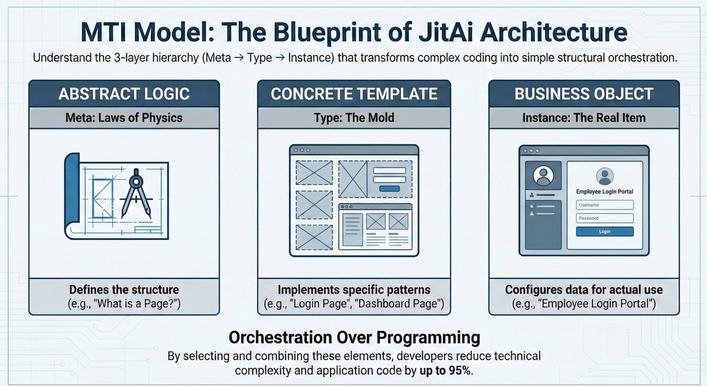

In the current wave of Generative AI, developers often treat Large Language Models (LLMs) as "super-powered autocomplete." We paste snippets of code into a chat window, ask for a function, and get text back. But when we try to build complex, enterprise-grade systems, this text-based approach hits a wall. The AI lacks a holistic understanding of the system's *structure*.

The missing link isn't a larger context window; it's a fundamental shift in how we structure software for machines to read. This concept is **Elementization** (元素化).

By redefining the smallest business unit of an application as an "Element"—a self-describing, bounded, and machine-readable object—we move from "AI writing code" to "AI architecting systems."

<!--truncate-->

## The "Implicit Structure" Problem

In traditional software engineering, the architecture of an application is often **implicit**. It lives in folder hierarchies, naming conventions, and the mental models of senior engineers.

- A "User Service" is just a file named `UserService.ts`.
- A "Data Model" is a SQL schema file.
- A "Page" is a React component.

To an AI, these are just text streams. Without explicit boundaries, the AI struggles to maintain consistency across modules. It doesn't "know" that changing the `User` model requires updating the `Auth` service and the `Login` page simultaneously. It merely guesses based on token probability.

For AI to become a true collaborator, the application structure must be elevated to a "first-class citizen".

## What is Elementization?

**Elementization** defines the "Element" as the atomic unit of an AI-native application. Unlike a raw code file, an Element is an encapsulated object that defines its own:

1.  **Semantics:** What it is (e.g., a "Service," a "Page," a "Model").
2.  **Capabilities:** What it can do (e.g., "Query Database," "Render UI").
3.  **Boundaries:** How it interacts with other elements.

In this paradigm, an application isn't just a collection of files; it is a structured graph of Elements that both humans and AI can query, understand, and manipulate.

### The Architecture of an Element: Meta, Type, Instance

To make Elements universally understandable to AI, they follow a strict hierarchical protocol, often referred to as the **Meta-Type-Instance** triad.



1.  **Meta :** The abstract definition. It defines the fundamental properties and behaviors of a category of elements. For example, `pages.Meta` defines what a "Page" is in the system.
2.  **Type :** A reusable template or class derived from Meta. This encapsulates technical implementation details. For example, `pages.GridPageType` might define a standard grid layout page, pre-wiring the logic for sorting and filtering.
3.  **Instance :** The specific business realization. This is where the developer (or AI) works. An instance, like `EmployeeDirectoryPage`, acts as a specific configuration of the `GridPageType`.

## Why This Changes the Game for AI Agents

When software is built with Elements, the AI Agent's role shifts from "writing text" to "orchestrating structure."

### 1. Structural Understanding vs. Text Prediction

Because Elements are self-describing, an AI Agent can inspect the application's `Meta` layer to understand exactly what tools are available. It doesn't need to hallucinate a database connection string; it sees a `Database` element instance and knows exactly which methods (e.g., `query`, `insert`) are valid.

### 2. Precise Modification

In a file-based project, asking AI to "add a phone number field to the user profile" might result in changes to three different files with varying syntax. In an Element-based system, the AI targets the specific `UserModel` instance and adds a `field` property. The system (via the `Type` logic) handles the underlying database migration and API updates automatically.

### 3. Safe Boundaries

The `Type` layer acts as a guardrail. If an AI tries to configure a "Login Page" instance with an invalid parameter, the strict definition of `LoginPageType` will reject it immediately. This creates a "correctness closed loop" that is difficult to achieve with raw code generation.

## Comparison: Code-Centric vs. Low-Code vs. Element-Native

| **Feature**        | **Traditional Code-Centric** | **Low-Code / No-Code**    | **AI-Native (Element-Based)**     |
| ------------------ | ---------------------------- | ------------------------- | --------------------------------- |
| **Primary Unit**   | Text Files / Classes         | Visual Blocks             | Semantic Elements                 |
| **Structure**      | Implicit (Mental Model)      | Rigid / Hidden            | Explicit / Machine-Readable       |
| **AI Integration** | "Copilot" (Autocomplete)     | "Black Box" (Hard to gen) | "Architect" (Direct manipulation) |
| **Extensibility**  | High (Infinite code)         | Low (Vendor lock-in)      | High (Custom Types)               |
| **Developer Exp**  | Editor + Terminal            | Drag & Drop               | Hybrid (Visual + Code)            |

## Implementation Playbook: Defining an Element

How does one actually define an Element? In systems like JitAI, this is often done using a combination of JSON configuration (for structure) and Python/TypeScript (for logic).

**Step 1: Define the Structure (e.g.,** `**e.json**`**)**

The configuration file declares the Element's identity and its `Type` parent.

```plaintext
{
  "title": "Employee Service",
  "type": "services.NormalType",
  "version": "1.0.0"
}

```

**Step 2: Implement Logic**

The business logic resides in standard code files, but it is encapsulated within the Element's directory structure.

```plaintext
# inner.py (Service function logic)
def calculate_bonus(salary, performance_score):
    if performance_score > 4.5:
        return salary * 0.2
    return salary * 0.1

```

**Step 3: AI Orchestration**

When an AI Agent needs to use this service, it doesn't parse the Python text. It sees the Element `EmployeeService` and its exposed function `calculate_bonus`, complete with input/output definitions derived from the Element's metadata.

## How JitAI Addresses This

**JitAI** is the first enterprise platform engineered entirely around this concept of Elementization. It utilizes the **JAAP (JitAi Application Protocol)** to strictly define the Meta-Type-Instance hierarchy.

- **Structure as First-Class Citizen:** In JitAI, the application structure is not a byproduct of code; it is the primary object that AI manipulates. This allows JitAI's agents to perform complex tasks like "Generate a CRM system" by instantiating and connecting dozens of Elements (Pages, Models, Workflows) in seconds.
- **The "Type" Ecosystem:** JitAI provides a rich library of pre-built Types (e.g., `ai-data-analysis-page`, `approval-workflow`). Developers can extend these or create their own, effectively teaching the AI new tricks by adding new Types to the library.
- **Zero-Gap Integration:** Because every part of the app—from the frontend UI to the backend database—is an Element, the AI has full visibility. It can trace a button click on a Page Element all the way to a field update in a Model Element.

## FAQ

**Q: Is Elementization just another name for Object-Oriented Programming (OOP)?**

A: While they share concepts like classes (Types) and objects (Instances), Elementization is broader. It encapsulates the *entire* lifecycle and deployment artifact, not just the runtime logic. An Element includes its UI configuration, database schema, and API permissions in one package.

**Q: Does this mean I can't write code anymore?**

A: No. Elementization is "Low-code for structure, Full-code for logic." You still write the core algorithms (like the Python example above), but you don't waste time wiring up the boilerplate architecture.

**Q: Can AI really understand custom business logic?**

A: Yes, because Elements are self-describing. When you create a custom Element, you define its inputs and outputs. The AI reads this metadata to understand how to invoke your custom logic correctly.

## Conclusion

The future of software development isn't just about faster typing; it's about better architectural understanding. By adopting **Elementization**, we bridge the gap between human intent and machine execution. We give AI Agents the structured map they need to navigate and build complex systems safely.

For architects and senior developers, this means shifting focus from maintaining file structures to designing high-level Element interactions—building the "Types" that AI will use to construct the world.

**Ready to see Elementization in action?**

[Download the JitAI Desktop Version](https://jit.pro/download) or explore the [Developer Guide](https://jit.pro/docs/tutorial) to build your first Element-based application today.
