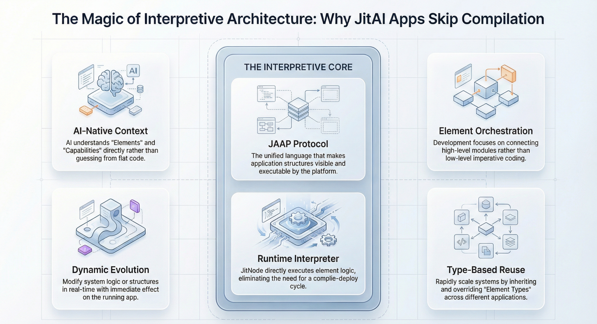

## Introduction

In the traditional software development lifecycle, the path from code to execution is paved with build artifacts. Whether it’s compiling Java to bytecode, transpiling TypeScript to JavaScript, or building Docker images, the "compile-build-deploy" cycle is the standard heartbeat of engineering. However, for **AI-native** applications that require rapid iteration and self-modification, this rigid cycle can become a bottleneck.

Enter **JitAI** and its core runtime engine, **JitNode**. By adopting an interpretive architecture based on the **JAAP** (JitAi Ai Application Protocol), JitAI shifts the paradigm from "compiling binaries" to "interpreting structures." This approach allows applications to evolve dynamically, treating business logic and structural definitions as first-class citizens that can be modified and executed in real-time without bringing down the system.

This article dissects the technical architecture of JitNode, explaining why it functions less like a traditional web server and more like a specialized operating system for AI applications.

<!--truncate-->

## The Shift: From Compiled Binaries to Interpretive Structures

The fundamental difference in JitAI’s architecture lies in how it handles application logic. In a standard compiled environment, source code is transformed into a machine-readable format (binary or bytecode) that is static. Changing a single line of code usually requires a full rebuild and redeployment.

JitAI operates on an **interpretive model**. The application is not a compiled binary but a collection of structured definitions (Elements) following the JAAP protocol.

### The Role of JAAP

JAAP acts as the "instruction set" for the JitNode runtime. It abstracts the complexity of CPU architecture, memory management, and device drivers—much like an Operating System abstracts hardware—allowing developers (and AI Agents) to focus purely on business logic .

When a JitAI application runs, JitNode does not execute a pre-built binary. Instead, it reads the JAAP definitions (stored in `e.json` files and associated code) and interprets them on the fly. This is analogous to how a browser interprets HTML/DOM or how the JVM interprets bytecode, but at a higher abstraction level tailored for enterprise business logic.

## Inside JitNode: The Virtualized Runtime Environment

**JitNode** is the execution engine that powers JitAI applications. It is a cross-platform runtime container available as a desktop install (Windows/macOS) or a Docker image (Linux/Server) .

### 1. Structure as a First-Class Citizen

Unlike frameworks where the application structure is implicit in the code (e.g., scattered across varying file paths and classes), JitNode treats the application structure as an explicit, manipulatable object. The runtime loads **Meta**, **Type**, and **Instance** elements to construct the application in memory.

- **Meta:** The high-level category (e.g., `models.Meta`).
- **Type:** The specific implementation template (e.g., `models.NormalType`).
- **Instance:** The actual business object (e.g., `models.User`).

This structure allows the runtime to understand *what* the application is composed of, not just execute blind logic.

### 2. Environment Virtualization and Isolation

JitNode supports running multiple environments (Development, Test, Production) on a single physical node or cluster. Each application version runs in isolation with its own independent Python dependency libraries, preventing "dependency hell" where one app's update breaks another.

### 3. Hot-Swapping and Dynamic Evolution

Because JitNode interprets the application structure at runtime, changes to the underlying element definitions can take effect immediately without a server restart.

- **Development Mode:** Developers can edit source code directly. JitNode detects these changes and "hot-reloads" the specific element, updating the running application instantly .
- **AI-Driven Modification:** Because the structure is explicit and interpretive, AI Agents can safely modify application elements (like adding a field to a Data Model or tweaking a Page layout) at runtime. The AI is not "writing code" in a text editor; it is manipulating the JAAP structure that JitNode interprets.

## Architecture Comparison: JitAI vs. Traditional Stacks

The following table highlights the operational differences between a standard compiled web application (e.g., Java/Spring or compiled Node.js) and a JitAI application running on JitNode.

| **Feature**              | **Traditional Compiled App**         | **JitAI Application (JitNode)**         |
| ------------------------ | ------------------------------------ | --------------------------------------- |
| **Execution Model**      | Compiled binary / Transpiled code    | Interpreted JAAP Elements               |
| **Structure Visibility** | Implicit (hidden in code logic)      | Explicit (Meta/Type/Instance hierarchy) |
| **Update Process**       | Rebuild → Repackage → Redeploy       | Modify Element → Hot Reload \[1\]       |
| **Dependency Mgmt**      | Shared or Container-level isolation  | Version-level isolation per App \[2\]   |
| **AI Integration**       | External API calls (Black box)       | Structural manipulation (White box)     |
| **Runtime modification** | Difficult (requires hot-swap agents) | Native capability                       |

## Implementation Playbook: Leveraging the Interpretive Model

To fully utilize the advantages of JitNode’s interpretive architecture, developers should follow this workflow for dynamic application management.

### Phase 1: Environment Setup

1.  **Install JitNode:** Deploy the Desktop version for local development or the Docker version for server environments \[NBLM: download-installation.md\].
2.  **Verify Directory Structure:** Familiarize yourself with the `home/environs` directory, where runtime data and application versions reside \[NBLM: runtime-platform\_\_jitnode-directory.md\].

### Phase 2: Dynamic Development

1.  **Use "Development Mode":** When deploying an app in the DevOps console, select "Include Source Code" to enable Development Mode.
2.  **Modify Elements:** Use the Visual Development Tool (IDE) to modify a Page or Service.
3.  **Observe Hot-Reload:** Save the changes. JitNode detects the file update in the `AppCode` directory and re-interprets the element. The change is reflected immediately in the browser without a build step.

### Phase 3: AI-Assisted Evolution

1.  **Invoke AI Agent:** Use the built-in AI Assistant to request a structural change (e.g., "Add a 'Priority' field to the Ticket model").
2.  **Runtime Reflection:** The AI modifies the underlying `e.json` and `model.py` files. JitNode interprets these changes, and the database schema is updated automatically via the platform's ORM capabilities.

## How to Verify: Hot-Swapping in Action

You can verify the "no compilation" claim by observing the file system and runtime behavior.

1.  **Locate Source:** Navigate to your application's directory: `home/environs/[EnvID]/[OrgID]/[AppID]/[Version]/`.
2.  **Manual Edit:** Open a backend service file (e.g., `services/MyService/inner.py`) in a standard text editor like VS Code.
3.  **Change Logic:** Modify a return value or log message.
4.  **Execute:** Trigger the service function from the frontend.
5.  **Result:** You will see the updated logic execute immediately. There was no `npm build`, `mvn package`, or container restart. The JitNode runtime detected the file change and re-loaded the Python module dynamically.

## FAQ

**Q: Does "Interpretive" mean it is slow?**

A: Not necessarily. While there is overhead compared to raw C++ binaries, JitNode optimizes performance by caching element definitions and using efficient underlying execution engines (like Python's runtime and optimized C libraries for heavy lifting). The bottleneck in enterprise apps is usually I/O (Database/Network), not CPU instruction interpretation.

**Q: Can I use third-party Python libraries?**

A: Yes. You can define dependencies in a `requirements.txt` file within your service element. JitNode manages these dependencies in an isolated environment for that application version.

**Q: Is the source code exposed in Production?**

A: No. When publishing for Production, you can choose to exclude source code. The application will run in "Production Mode" using only the necessary executable definitions, preventing unauthorized modification.

## Conclusion

JitAI’s interpretive architecture represents a significant shift in how we build and maintain enterprise software. By utilizing **JitNode** to interpret **JAAP** structures, organizations can break free from the rigid compile-deploy cycles of the past. This enables a new class of **AI-native** applications that can adapt, evolve, and grow alongside the business needs, driven by both human developers and intelligent agents.

Ready to experience hot-swapping development?

[Download JitNode Desktop](https://jit.pro/download) | [Read the Tutorial](https://jit.pro/docs/tutorial)
