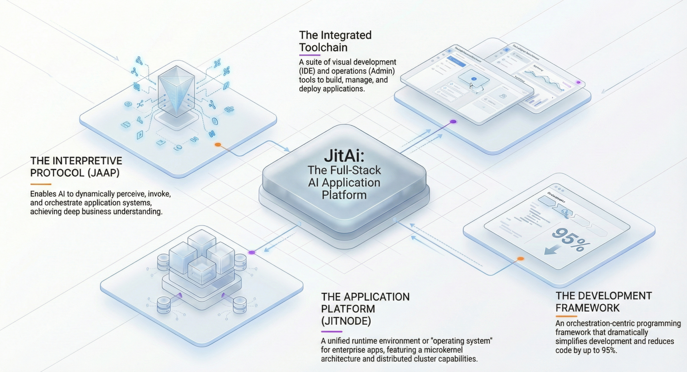

For decades, software engineering has evolved to abstract complexity away from developers—from assembly to high-level languages, and from monoliths to microservices. However, the rise of Large Language Models (LLMs) presents a fundamental paradox: while LLMs excel at processing unstructured natural language, modern software is built on rigid, structured logic that is opaque to AI.

To bridge this gap, we must move beyond simply embedding AI calls into legacy code. We need a new paradigm of **Software Engineering** where the application structure itself is intelligible and mutable by AI. This represents the shift to **AI native** development.

This article dissects **JitAI**, a platform designed not as a low-code tool, but as a reconstructed engineering system comprising four layers: Protocol, Platform, Framework, and Tools. We will explore how this stack enables **AI agents** to function as core system architects rather than mere chat interfaces.

<!--truncate-->

## The Structural Gap in Legacy Stacks

In traditional architectures (MVC, Microservices), the "business logic" is buried inside compiled code or scattered across API endpoints. An AI agent trying to interact with such a system faces two hurdles:

1.  **Invisibility:** The AI cannot "see" the system's capabilities without extensive documentation or schema definition (like OpenAPI specs), which are often outdated.
2.  **Rigidity:** The AI can call a function, but it cannot fundamentally alter the workflow or user interface (UI) to suit a dynamic context.

**AI-native** engineering requires the application structure to be an "first-class citizen"—explicit, standardized, and accessible at runtime.

## The JitAI Stack: A Four-Layer Reconstruction

JitAI addresses this by defining a complete technology stack. It is not just a library; it is a holistic system defined by the equation:

> **JitAI = Protocol + Platform + Framework + Tools**

### 1. Protocol: JAAP (JitAI Ai Application Protocol)

At the foundation lies JAAP, a unified architectural language. Unlike traditional code where structure is implicit, JAAP defines application composition through explicit, self-describing metadata.

- **Structure as Data:** Applications are collections of "Elements" (Pages, Models, Services) defined in JSON configuration files (`e.json`).
- **AI Readability:** Because the application structure is declarative, an LLM can read the `e.json` definitions to understand exactly what data models exist, which service functions are available, and how pages are composed.
- **Standardization:** JAAP decouples the business definition from the runtime execution, similar to how HTML decouples content from the browser rendering engine.

### 2. Platform: The Runtime Container

The **Platform** (JitNode) is the engine that interprets JAAP. It acts as a virtualized operating system for AI applications.

- **Cross-Platform Execution:** JitNode runs on Windows, macOS, Linux, or Docker, providing a consistent environment regardless of the underlying infrastructure.
- **Environment Virtualization:** It supports creating multiple isolated runtime environments (Dev, Test, Prod) on a single node, managing resource scheduling and load balancing.
- **Hot-Swapping:** Since the application is defined by protocol files, the platform can update individual elements (like a specific AI Agent or Page) in real-time without restarting the entire system.

### 3. Framework: The Element System

The **Framework** provides the building blocks. It employs a three-tier inheritance model: **Meta → Type → Instance**.

- **Meta:** The abstract definition of a capability (e.g., `models.Meta` for data tables, `aiagents.Meta` for agents).
- **Type:** The concrete implementation class (e.g., `models.NormalType`, `aiagents.ReActType`). Developers can extend these to create custom reusable types.
- **Instance:** The actual usage in an application (e.g., a "Customer Table" or "Support Agent").

This hierarchy allows developers (and AI) to create complex functionality by instantiating pre-built Types rather than writing boilerplate code.

### 4. Tools: Dual-Mode Development

The **Tools** layer (IDEApp) is itself a JitAI application. It provides a "Dual-Mode" environment:

- **Visual Orchestration:** Drag-and-drop interfaces for defining UI, workflows, and data models.
- **Full-Code Programming:** A built-in code editor (VSCode-like experience) for writing complex business logic in Python, TypeScript, or React.
- **Synchronization:** Changes in the visual editor instantly reflect in the code files, and vice versa, ensuring that the "structure" remains valid and parsable by AI.

## Implementation Playbook: Building an AI-Native Function

How does this stack translate to actual development? Let's trace the creation of a "Smart Approval Agent" that interacts with both data and UI.

### Step 1: Define the Protocol (Data Model)

Instead of creating a SQL table, you define a Data Model Element.

- **Action:** Create a `LeaveRequest` model with fields `Applicant`, `Days`, and `Reason`.
- **Result:** A JSON definition is generated. The platform automatically provisions the database table and generates CRUD APIs.

### Step 2: Orchestrate the Logic (Service & Agent)

Create a Service Element for business logic (e.g., `CheckLeaveBalance`) and an AI Agent.

- **Action:** In the Agent's configuration, add the `CheckLeaveBalance` service and `LeaveRequest` model as **Tools**.
- **AI Integration:** Because these elements adhere to JAAP, the Agent automatically understands their schemas. You don't need to write manual function definitions for the LLM; the protocol handles it.

### Step 3: UI-AI Collaboration

This is the distinct "AI-native" capability. The AI Agent is not just a backend job; it can control the frontend.

- **Action:** Embed the Agent into a "Generic Page".
- **Logic:** Configure an event: "On Agent Tool Call -> Update Page Variable".
- **Result:** When a user types "Apply for 3 days leave," the Agent parses the intent, calls the internal model to create a draft record, and *immediately* pushes the data to the UI form for the user to confirm.

### Comparison: Traditional vs. JitAI Development

| **Feature**          | **Traditional Development**            | **JitAI (AI-Native)**            |
| -------------------- | -------------------------------------- | -------------------------------- |
| **System Structure** | Implicit in code (Java/Python classes) | Explicit in Protocol (JAAP JSON) |
| **AI Integration**   | External API calls / Plugins           | Native "Element" participation   |
| **Development Mode** | Code-first                             | Visual Orchestration + Full Code |
| **UI Control**       | Hardcoded logic                        | AI-driven dynamic updates        |
| **Extensibility**    | Libraries / Microservices              | Meta/Type Inheritance System     |

## How to Verify / Reproduce

To validate the "AI-native" nature of this architecture, you can perform the following test using the JitAI Desktop version:

1.  **Install:** Download the JitAI Desktop node (Windows/Mac).
2.  **Inspect:** Open the application directory. You will see the folder structure strictly following `home/environs/...`.
3.  **Code Check:** Open any element's `e.json` file. Observe how `functionList` explicitly defines methods. This file is what allows the LLM to "read" your code structure.
4.  **Runtime Modification:** In the IDE, use the built-in AI Assistant to "Add a phone number field to the Customer model." Watch as the AI modifies the `e.json` and `model.py` files directly, and the changes reflect instantly in the running app without a recompile cycle.

## How JitAI Addresses the AI-Native Era

JitAI fundamentally shifts the role of the developer from "writing code" to "defining structure." By providing a complete **software engineering** (System)—not just a tool—it solves the fragmentation problem.

- **Unified Semantics:** The **Protocol** ensures that humans, machines, and AI agents share a single understanding of the system.
- **Deep Integration:** The **Framework** allows AI to access full-stack capabilities (database, cache, UI events) securely via standard interfaces.
- **Evolution:** The **Platform** ensures that as AI models improve, the underlying application structure remains stable and manageable.

This architecture enables enterprises to build applications where AI is not a feature, but the core engine of business logic execution.

## FAQ

Q: Is JitAI a low-code platform?

A: While it offers visual tools, it is fundamentally a full-stack engineering platform. It supports full-code development (Python/React) and produces standard, exportable source code, avoiding the "black box" limitations of traditional low-code tools.

Q: Can I use my own LLMs?

A: Yes. The framework supports mainstream vendors (OpenAI, Anthropic) and provides interfaces for private models (via Ollama or similar) through standard "AI LLM Elements."

Q: How does this differ from LangChain?

A: LangChain is a library for chaining LLM calls. JitAI is a complete application runtime and development system. JitAI may use technologies like LangGraph internally for agent orchestration, but it also handles the database, UI rendering, authentication, and deployment which libraries do not cover.

Q: What happens if I want to migrate away?

A: JitAI applications are built on open languages (Python/React) and stored as standard files. You can export the source code. However, the runtime orchestration relies on the JitNode platform to interpret the JAAP protocol.

Ready to build true AI-native applications?

Download the [JitAI Desktop](https://jit.pro/download) Version to start developing, or explore the Developer Guide to master the JAAP protocol.
