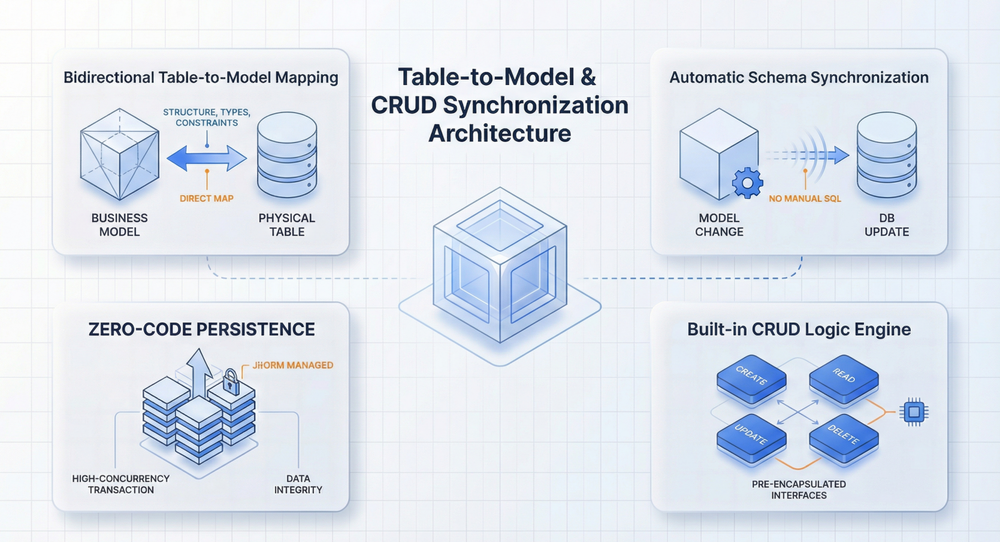

import Head from "@docusaurus/Head";

export const jsonLd = {
"@context": "https://schema.org",
"@graph": [
{
"@type": "Organization",
"@id": "https://jit.pro/#organization",
name: "JitAI",
legalName: "武汉万云网络科技有限公司",
url: "https://jit.pro/",
logo: {
"@type": "ImageObject",
url: "https://jit-www.oss-accelerate.aliyuncs.com/logo/logo.svg",
},
sameAs: [
"https://forum.jit.pro/",
"https://github.com/jitai-team",
"https://x.com/JitAi2017",
"https://www.instagram.com/jitai_2017",
"https://www.youtube.com/channel/UClvTNJPvBhek3aFuDy87RJQ",
"https://www.facebook.com/people/JitAi/61581485995674",
"https://www.linkedin.com/company/jitai2017",
],
},
{
"@type": "WebSite",
"@id": "https://jit.pro/#website",
name: "JitAI",
url: "https://jit.pro/",
publisher: {
"@id": "https://jit.pro/#organization",
},
inLanguage: ["en", "zh-CN"],
},
{
"@type": "Blog",
"@id": "https://jit.pro/blog#blog",
name: "Blog",
url: "https://jit.pro/blog",
isPartOf: {
"@id": "https://jit.pro/#website",
},
publisher: {
"@id": "https://jit.pro/#organization",
},
inLanguage: "en",
},
{
"@type": "WebPage",
"@id": "https://jit.pro/blog/jitai-external-database-table-to-model-crud-sync#webpage",
url: "https://jit.pro/blog/jitai-external-database-table-to-model-crud-sync",
name: "JitAI Quick Start: Table-to-Model Mapping & CRUD Sync",
description:
"Connect external databases in JitAI, map tables to data models, and validate CRUD sync with transactions, process orchestration, and permission audit.",
isPartOf: {
"@id": "https://jit.pro/#website",
},
breadcrumb: {
"@id": "https://jit.pro/blog/jitai-external-database-table-to-model-crud-sync#breadcrumb",
},
inLanguage: "en",
},
{
"@type": "BreadcrumbList",
"@id": "https://jit.pro/blog/jitai-external-database-table-to-model-crud-sync#breadcrumb",
itemListElement: [
{
"@type": "ListItem",
position: 1,
name: "Home",
item: "https://jit.pro/",
},
{
"@type": "ListItem",
position: 2,
name: "Blog",
item: "https://jit.pro/blog",
},
{
"@type": "ListItem",
position: 3,
name: "JitAI Quick Start: Table-to-Model Mapping & CRUD Sync",
item: "https://jit.pro/blog/jitai-external-database-table-to-model-crud-sync",
},
],
},
{
"@type": "BlogPosting",
"@id": "https://jit.pro/blog/jitai-external-database-table-to-model-crud-sync#blogposting",
mainEntityOfPage: {
"@id": "https://jit.pro/blog/jitai-external-database-table-to-model-crud-sync#webpage",
},
url: "https://jit.pro/blog/jitai-external-database-table-to-model-crud-sync",
headline: "JitAI Quick Start: Table-to-Model Mapping & CRUD Sync",
name: "JitAI Quick Start: Table-to-Model Mapping & CRUD Sync",
description:
"Connect external databases in JitAI, map tables to data models, and validate CRUD sync with transactions, process orchestration, and permission audit.",
datePublished: "2026-02-09T00:00:00.000Z",
dateModified: "2026-02-09T00:00:00.000Z",
inLanguage: "en",
isPartOf: {
"@id": "https://jit.pro/blog#blog",
},
author: {
"@id": "https://jit.pro/#organization",
},
publisher: {
"@id": "https://jit.pro/#organization",
},
image: ["https://jit-www.oss-accelerate.aliyuncs.com/logo/logo_dark.svg"],
keywords: [
"JitAI",
"quick start",
"external database",
"data model",
"table-to-model mapping",
"CRUD sync testing",
"process orchestration",
"permission audit",
"transaction management",
"RBAC",
],
timeRequired: "PT12M",
},
{
"@type": "FAQPage",
"@id": "https://jit.pro/blog/jitai-external-database-table-to-model-crud-sync#faq",
isPartOf: {
"@id": "https://jit.pro/blog/jitai-external-database-table-to-model-crud-sync#webpage",
},
inLanguage: "en",
mainEntity: [
{
"@type": "Question",
name: "What is table-to-model mapping in an enterprise app platform?",
acceptedAnswer: {
"@type": "Answer",
text: "Table-to-model mapping is the deterministic translation of an existing database table into an application data model, including field names, types, primary keys, constraints, and relationships, so business logic can use stable model semantics while persisting to the source database.",
},
},
{
"@type": "Question",
name: "What is the minimum CRUD sync test suite before production?",
acceptedAnswer: {
"@type": "Answer",
text: "At minimum: create/read/update/delete smoke tests that verify database state, plus a rollback test that proves multi-step writes are atomic, and a permission test that blocks writes for read-only roles while allowing scoped writes for authorized roles.",
},
},
{
"@type": "Question",
name: "How do I choose direct write-back vs staged synchronization?",
acceptedAnswer: {
"@type": "Answer",
text: "Use direct write-back when the external database is the system of record and you can obtain least-privilege credentials. Use staged sync when ownership, schema evolution, performance isolation, or approval-based write-back requires decoupling and controlled propagation.",
},
},
{
"@type": "Question",
name: "Why do transaction tests matter for CRUD sync?",
acceptedAnswer: {
"@type": "Answer",
text: "Real business actions usually involve multiple writes. Transaction tests validate atomicity (no partial updates), correct rollback on errors, and predictable behavior under concurrency—so the model layer and database remain consistent.",
},
},
{
"@type": "Question",
name: "What should a permission audit cover for database write-backs?",
acceptedAnswer: {
"@type": "Answer",
text: "A permission audit should record who initiated the action, what operation was attempted, which records were targeted, when it happened, the decision/approval context (if any), and the final outcome. High-risk actions should require stronger authorization and produce more detailed logs.",
},
},
],
},
],
};

<Head>
    
</Head>

Enterprise teams rarely get the luxury of a clean greenfield database. Most “AI-native” applications still have to **connect to legacy systems of record**, import existing tables as **data models**, and prove that **create/update/delete** operations stay correct under real-world constraints like permissions, transactions, and auditing.

This guide explains a practical, repeatable way to connect an external database, map tables into application data models, and run CRUD sync tests you can trust—using patterns that fit AI low-code platforms and enterprise development platforms.

<!--truncate-->

## Why table-to-model mapping is now a baseline skill

Data integration is no longer a “data team only” concern. It has become product infrastructure.

- The global **data integration** market was estimated at **USD 15.18B in 2024** and is projected to reach **USD 30.27B by 2030** (12.1% CAGR). 
- Another industry forecast estimates the market growing from **USD 17.58B (2025)** to **USD 33.24B (2030)** (13.6% CAGR). 

For enterprise agentic workflows, the reason is simple: once an agent can take business actions, your platform must enforce **data correctness**, **write-back safety**, and **permission auditability** in the same way your core app does.

If you want a guided hands-on walkthrough of JitAI’s development workflow, start with the [**JitAI Tutorial**](https://jit.pro/docs/tutorial). When you want to reproduce the steps locally or in a private environment, install via [**try JitAI**](https://jit.pro/download).

## Definitions you can reuse in architecture reviews

**External database connection**  
A managed configuration (host/port/db/user/secret, pooling, environment separation) that allows your application runtime to read and write data in a non-local database.

**Table-to-model mapping**  
A deterministic transformation from database schema to application data model: names, types, keys, constraints, relationships, defaults, and indexing.

**CRUD sync testing**  
A test suite that verifies Create/Read/Update/Delete operations behave correctly across:

1.  the application model layer, and 2) the database state—especially under concurrency, transactions, and permissions.

**Permission audit**  
Controls that determine who can execute which business actions and how those actions are recorded (who/what/when/where/outcome). NIST audit guidance emphasizes capturing event details like event type, time, source, outcome, and identities. 

## Two integration shapes you should decide upfront

### 1) Direct write-back into the external database

Your app connects to the same database that already hosts the tables. “Sync” here mostly means correctness and safety: your model layer writes to the source of truth, and reads always reflect the latest state.

Use this when:

- The external DB is already a system of record.
- You can obtain least-privilege credentials.
- You can accept the external schema lifecycle (or manage it via controlled migrations).

### 2) Replicated or staged sync (external DB stays authoritative)

Your app maintains its own application database, then synchronizes to/from the external DB through scheduled jobs, events, or change-data-capture pipelines.

Use this when:

- The external DB is owned by another team/system and schema changes are hard to coordinate.
- You need isolation for performance, availability, or governance.
- You want a “controlled write-back” path (approval, replay, rollback).

This article focuses on the **direct write-back** shape first (quickest path), then shows how to extend your test plan to staged sync.

## Quick Start in JitAI: connect DB, import table, generate model fields

### Step 1: Create a database connection (securely)

JitAI supports creating multiple database connections inside one application (dev/test/prod separation, multi-system integration). It recommends storing secrets (user/password) in **environment variables** and provides a built-in **Test Connection** workflow for validation. 

Also confirm the target database vendor is supported. JitAI lists native support for common OLTP databases (e.g., SQLite, MySQL, PostgreSQL, Oracle, SQL Server, DM8) and provides guidance on when to use each. 

**Practical checklist**

- Separate dev/test/prod database instances.
- Use least-privilege DB users (only required schemas/tables/verbs).
- Prefer private networking (VPC/internal) over public exposure.
- Validate connection pooling and timeouts early (before importing models).

### Step 2: Import an existing table as a data model

For legacy integration, JitAI provides a “create model from existing database tables” flow:

- Select creation method “Based on Existing Database Tables”
- Choose the database connection
- Select the table
- Generate model fields and map DB fields to data types 

This is where table-to-model mapping becomes concrete and reviewable, which is exactly what enterprise teams want for change control.

### Step 3: Understand what “data table model” means in JitAI

In JitAI’s ORM model types, a **data table model** corresponds to a database table, and changes to model fields can be synchronized to the database—reducing manual schema maintenance overhead. 

That correspondence is the foundation for reliable CRUD tests: you can validate behavior at the model layer and verify the database state deterministically.

## Mapping rules that prevent 80% of production surprises

When importing a table, do a fast review with these rules:

### Naming & identity

- Confirm the primary key strategy (auto-increment, UUID, composite key).
- Establish a consistent field naming convention (avoid collisions with reserved keywords).
- Decide how you represent business identifiers vs. database identifiers.

### Types & constraints

- Verify numeric precision/scale (money fields are common failure points).
- Verify timezone handling for timestamps.
- Confirm nullability matches business reality (a nullable column often becomes a hidden bug generator).

### Relationships

- Decide whether relationships are enforced by foreign keys, application logic, or both.
- For cross-system integration, treat relationships as *contracts*: document them and test them.

### Indexing for the “first real query”

- Add indexes for your top read paths (list pages, lookup by business key, time-based filters).
- Validate performance with realistic cardinality, not toy data.

## CRUD sync test plan: from smoke tests to production-grade confidence

A credible CRUD sync test plan goes beyond “I can insert a row”.

### 1) Smoke tests: prove the pipe works

Run these immediately after import:

- **Read**: query first 10 rows through the model layer (pagination + ordering).
- **Create**: insert a minimal valid row; verify it appears in DB.
- **Update**: update one field; verify DB changes and any updated timestamps.
- **Delete**: delete the row; verify DB deletion (or soft-delete flag).

JitAI’s built-in visual **Data Management** interface supports CRUD operations (add/edit/delete, batch ops, import/export) without requiring code, which makes smoke testing fast and repeatable for teams. 

### 2) Functional correctness tests: business rules

Add these once the pipe is proven:

- Required field enforcement (fail fast with clear errors).
- Unique constraints (idempotency keys, natural keys).
- Default values (DB defaults vs. application defaults).
- Soft delete policies (if used): read filters must respect them.

### 3) Consistency & transaction tests: the “multi-step write” reality

Enterprise actions often require multiple writes: create an order, create order lines, decrement inventory, emit an event.

JitAI’s transaction model documents a default request-level transaction (Repeatable Read), commit on success, rollback on exception, plus support for explicit “requires new transaction” semantics. 

**Tests you should run**

- **Atomicity**: fail step 3 of 5 and confirm no partial writes.
- **Rollback**: force an exception and verify DB state matches pre-test snapshot.
- **Isolation**: run two concurrent updates and verify outcomes match your design (last-write-wins vs. conflict detection).
- **Requires-new**: isolate a critical side effect (e.g., write an audit/event record) and confirm it persists even if outer work rolls back (only when you intend that).

### 4) Permission audit tests: “who can change what”

CRUD sync tests are incomplete without authorization checks.

At minimum validate:

- Read-only roles cannot write (create/update/delete blocked).
- Scoped roles can write only within permitted records (tenant/org boundaries).
- Privileged actions (refunds, entitlement changes) require stronger permissions and produce stronger logs.

Tie your audit schema to a recognized control framework. NIST’s Audit & Accountability family gives a reusable checklist for audit record content and event coverage.   
For data quality governance, teams often align processes with standards like **ISO 8000-1:2022** (data quality overview), which helps formalize “what good data means” across systems. 

## How process orchestration fits: CRUD is the primitive, workflows are the product

CRUD correctness is necessary. It rarely is sufficient.

In enterprise applications, the business outcome often requires **process orchestration**:

- validations and enrichment,
- approvals,
- conditional branching,
- retries and compensations,
- notifications and downstream updates.

JitAI’s platform overview describes workflow and service capabilities designed for business process modeling and orchestration, which is where CRUD actions turn into reliable end-to-end execution. 

**A practical pattern**

- Keep models as the canonical data contract.
- Put multi-step business actions into orchestrated services/workflows.
- Make approvals and high-risk write-backs explicit steps.
- Log the action intent, decision, and final write result (permission audit).

## Common pitfalls (and the quickest fixes)

### “It worked in dev, then failed in prod”

Cause: secrets and endpoints hardcoded, networking differs, permissions differ.  
Fix: use environment variables for DB credentials, enforce least privilege, and run connection + CRUD smoke tests per environment. 

### “The mapping looks right, but dates and money are wrong”

Cause: timezone assumptions, precision/scale mismatch.  
Fix: add explicit mapping rules for timezones and numeric precision; write a golden-data test set.

### “Batch updates are slow”

Cause: missing indexes, N+1 queries, large scans.  
Fix: profile the top queries, add indexes, use batch operations where appropriate, and verify with realistic data volume.

### “Deletes are dangerous”

Cause: hard-delete with no audit trail.  
Fix: adopt soft-delete where required, and log delete intent/outcome with actor identity and timestamps.

## FAQ

### How do I decide between importing tables 1:1 vs. building a canonical model?

Start 1:1 when speed matters and the external schema is stable. Choose a canonical model when multiple systems feed the domain and you need consistent semantics, validation, and governance.

### What’s the minimum CRUD test suite before going live?

Smoke tests (read/create/update/delete), plus transaction rollback, plus permission enforcement for at least two roles (read-only vs. editor).

### Do I need CDC for “sync”?

Not for direct write-back into the same database. CDC becomes valuable when you replicate/stage data across systems or need event-driven downstream processing.

### How should I handle schema evolution safely?

Treat the data model as a contract: version your changes, run mapping regression tests, and validate backward compatibility for read paths before enabling write paths.

### Where should audit logs live?

Use a structured log schema that captures actor, action, target, timestamp, outcome, and correlation IDs. Align the fields with audit guidance like NIST AU controls for completeness. 
