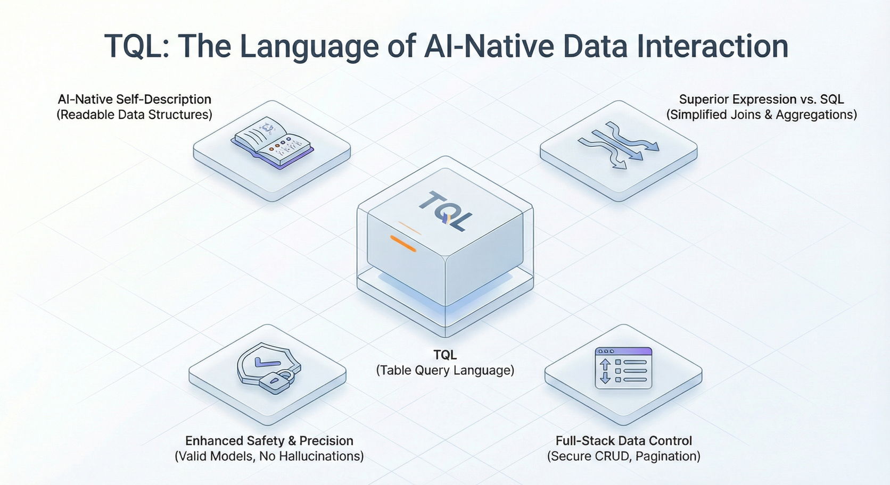

## Introduction

In the race to build **AI-native** applications, developers often hit a hard wall: the data layer. While Large Language Models (LLMs) excel at processing unstructured text, they struggle to interact reliably with the rigid, structured world of enterprise relational databases. Traditional approaches like "Text-to-SQL" are prone to hallucinations, often inventing non-existent tables or misinterpreting complex schemas.

Enter **JitORM**, a data persistence framework reimagined for the era of **AI Agents**. Unlike traditional ORMs that primarily serve human developers writing static code, JitORM is designed to expose business logic and data structures in a format that AI can understand, reason about, and query safely.

This article explores how JitORM evolves beyond standard CRUD, introducing **Aggregated Table Models** and **Extended Table Models**, and how its proprietary **Table Query Language (TQL)** provides a deterministic interface for AI-driven data analysis.

<!--truncate-->

## The AI-Data Gap

Traditional application architectures hide the "meaning" of data inside complex codebases (Service layers, DTOs). An AI Agent trying to answer a question like "What is the trend of monthly order amounts?" often lacks the context to know which tables to join or how to calculate "amounts" correctly.

- **The Hallucination Risk:** Asking an LLM to write raw SQL often results in syntax errors or queries against imaginary columns.
- **The Context Window Limit:** Feeding entire database schemas to an LLM consumes massive tokens and confuses the model.
- **The Security Void:** Direct SQL generation opens vectors for injection attacks and unauthorized data access.

JitORM addresses these by treating the **application structure** as a first-class citizen , making metadata explicit and accessible to the AI runtime.

## Advanced Modeling: Pre-Calculating "Thoughts"

JitORM introduces specialized model types that encapsulate complex data relationships, effectively giving the AI a "simplified view" of the business.

### 1. Aggregated Table Models (The Analyst)

**Aggregated Table Models** act as virtual tables designed for complex analysis. They do not correspond to a single physical table but instead define rules for fetching and calculating data from multiple sources.

- **Multi-table Horizontal Joins:** Similar to SQL `JOIN`, this feature connects scattered information (e.g., connecting `Orders` with `Customers` and `Products`) into a unified row structure.
- **Group Aggregate Statistics:** Similar to `GROUP BY`, this allows developers to pre-define calculations like `SUM`, `AVG`, `MAX`, or `COUNT`.

**Why this matters for AI:** Instead of asking an **AI Agent** to construct a complex 10-table join, you expose an Aggregated Model named `MonthlySalesStats`. The AI simply queries this single "virtual" table, significantly reducing the cognitive load and error rate.

### 2. Extended Table Models (The Context Builder)

Business requirements evolve faster than database schemas. **Extended Table Models** allow developers to append new dimensions to an existing "Base Table" without altering the underlying database structure.

- **Dynamic Association:** You can link an `Employee` table (Base) with a `Sales Records` table to add a virtual field `Annual Sales`.
- **Baseline Filtering:** Configure conditions so the extension only applies to relevant subsets (e.g., only "Active" employees).

**Why this matters for AI:** It allows the AI to see a comprehensive "360-degree view" of an entity (e.g., a Customer with all their calculated Lifetime Value) without the developer needing to create massive, redundant flat tables.

## TQL: The Language of AI Data Interaction

Perhaps the most critical innovation in JitORM is **TQL (Table Query Language)**. TQL is a domain-specific language designed to be safer and more expressive for **AI Agents** than raw SQL.

### Architecture Overview

### TQL and Q Expressions

TQL utilizes **Q Expressions** for filtering, which abstracts away the syntactic complexity of SQL `WHERE` clauses.

- **Determinism:** TQL queries are structured, reducing the ambiguity that leads to SQL errors.
- **Safety:** The underlying engine handles sanitization and permission checking (RBAC) automatically.
- **Logic:** Supports operators like `like` (contains), `in` (list membership), and `range` checks.

**Example TQL Concept:**

Instead of `SELECT * FROM orders WHERE amount > 1000`, an Agent might generate a TQL payload that the system interprets as `previewTData(tStr="...", limit=50)`. The `tStr` allows Python-style multi-line formatting, making it easy for LLMs to generate structured queries.

## Implementation Playbook: Building a Sales Analysis Agent

Here is how a developer leverages JitORM to build an **AI Agent** capable of analyzing sales data.

### Step 1: Define the Base Models

Create standard Data Models for your core entities: `Customer`, `Order`, `Product`. Define fields using JitAi’s strict data types (e.g., `Money`, `Stext`).

### Step 2: Create an Aggregated Model

Build a `SalesAnalysis` model.

- **Configure Joins:** Connect `Order` to `Order Details` and `Product`.
- **Define Aggregations:** Create a field `TotalRevenue` that sums `Order.amount`.
- **Set Permissions:** Ensure only the "Manager" role can access this model.

### Step 3: Enable AI Access

In the **AI Agent** configuration:

1.  Add `SalesAnalysis` to the Agent's "Tools" list.
2.  The "self-describing" nature of JitORM means the Agent automatically ingests the model's schema (fields, types, descriptions).

### Step 4: Run the Agent

When a user asks, *"Show me the top products by revenue last month,"* the Agent:

1.  Identifies `SalesAnalysis` as the correct tool.
2.  Generates a TQL query using Q Expressions to filter by date (`last month`).
3.  Calls `previewTData` to retrieve the result.
4.  Returns the structured data to the UI for rendering (e.g., as a chart).

## Comparison: SQL vs. Traditional ORM vs. JitORM

| **Feature**       | **Raw SQL (Text-to-SQL)** | **Traditional ORM (Hibernate/EF)** | **JitORM (AI-Native)**           |
| ----------------- | ------------------------- | ---------------------------------- | -------------------------------- |
| **Interface**     | String-based              | Code-based (Classes)               | Metadata-based (Self-describing) |
| **AI Safety**     | Low (Injection risk)      | N/A (Requires compilation)         | High (Sandboxed execution)       |
| **Complex Joins** | Prone to Hallucination    | Hard to express dynamically        | Defined via Aggregated Models    |
| **Context**       | Missing (Implicit)        | Buried in code                     | Explicit (Available to Agent)    |
| **Execution**     | Direct DB hit             | Compiled binary                    | Interpreted Runtime              |

## How JitAI Addresses This

**JitAI** is the platform that powers JitORM. It operates on the **JAAP (JitAi Ai Application Protocol)**, which ensures that every application element—from pages to data models—is structurally visible to the AI.

In JitAI, the **AI Agent** isn't an external bot trying to guess your database schema; it is a native participant in the runtime environment.

- **Unified Context:** The AI shares the same "Type/Instance" structure as the human developer.
- **Zero-Hallucination Structure:** Because the Agent queries the *definition* (e.json) of the Aggregated Model, it cannot query a field that doesn't exist.
- **Visual Orchestration:** Developers can visually build these complex data relationships without writing thousands of lines of joining logic, accelerating the setup of AI-ready data layers.

## How to Verify / Reproduce

To verify the capabilities of JitORM described here:

1.  **Install JitNode:** Download the Desktop version of the JitAI runtime.
2.  **Access Developer Portal:** Open the IDE and navigate to "Data Models".
3.  **Inspect "Aggregate Table":** Try creating a new model and selecting "Aggregated Table" to see the visual join and group configuration interface.
4.  **Check TQL:** In a Service Function, use the `previewTData` method and observe how it accepts TQL strings to query your new model.

## FAQ

**Q: Can JitORM connect to my existing database?**

**A:** Yes. JitORM supports generating Data Table Models from existing database tables (Reverse Engineering). It natively supports MySQL, PostgreSQL, Oracle, SQL Server, and DM (Dameng).

**Q: Does TQL replace SQL completely?**

**A:** No. TQL is used for the application layer and AI interaction. JitORM translates TQL into optimized SQL for the underlying database execution.

**Q: Is JitORM only for Python?**

**A:** JitORM's logic layer in JitAI often uses Python for backend service functions, but the framework itself is language-agnostic regarding the definition (JSON-based metadata).

**Q: Can I use Extended Models on a legacy database without altering the schema?**

**A:** Yes. Extended Models function as a logical overlay. They do not require `ALTER TABLE` commands on your physical database, making them safe for legacy system integration.

## Conclusion

The evolution from "Software" to "Smartware" requires a fundamental rethink of how we architect data access. **JitORM** provides the structural scaffolding necessary for **AI Agents** to become reliable, secure, and context-aware enterprise workers. By moving complexity into **Aggregated** and **Extended** models and utilizing **TQL**, developers can finally stop fighting hallucinations and start shipping value.

**Ready to build your first AI-native data layer?**

[Download JitAI Desktop](https://jit.pro/download) or explore the [JitAI Tutorial](https://jit.pro/docs/tutorial) to get started.
