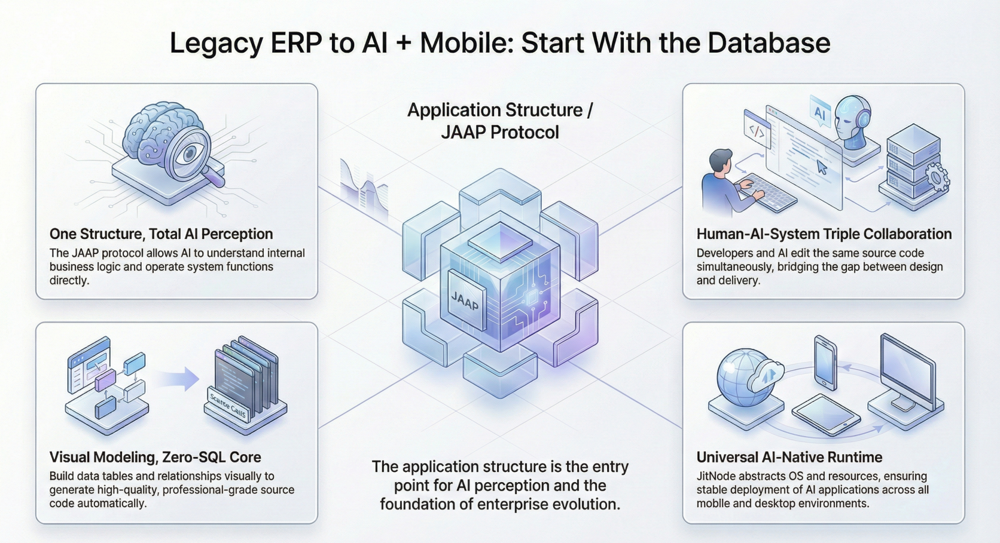

import Head from "@docusaurus/Head";

export const jsonLd = {
"@context": "https://schema.org",
"@graph": [
{
"@type": "Organization",
"@id": "https://jit.pro/#organization",
"name": "JitAI",
"legalName": "武汉万云网络科技有限公司",
"url": "https://jit.pro/",
"logo": {
"@type": "ImageObject",
"url": "https://jit-www.oss-accelerate.aliyuncs.com/logo/logo.svg"
},
"sameAs": [
"https://forum.jit.pro/",
"https://github.com/jitai-team",
"https://x.com/JitAi2017",
"https://www.instagram.com/jitai_2017",
"https://www.youtube.com/channel/UClvTNJPvBhek3aFuDy87RJQ",
"https://www.facebook.com/people/JitAi/61581485995674",
"https://www.linkedin.com/company/jitai2017"
]
},
{
"@type": "WebSite",
"@id": "https://jit.pro/#website",
"name": "JitAI",
"url": "https://jit.pro/",
"publisher": {
"@id": "https://jit.pro/#organization"
},
"inLanguage": [
"en",
"zh-CN"
]
},
{
"@type": "Blog",
"@id": "https://jit.pro/blog#blog",
"name": "Blog",
"url": "https://jit.pro/blog",
"isPartOf": {
"@id": "https://jit.pro/#website"
},
"publisher": {
"@id": "https://jit.pro/#organization"
},
"inLanguage": "en"
},
{
"@type": "WebPage",
"@id": "https://jit.pro/blog/legacy-erp-upgrade-ai-mobile-database-first#webpage",
"url": "https://jit.pro/blog/legacy-erp-upgrade-ai-mobile-database-first",
"name": "Legacy ERP to AI + Mobile: Start With the Database",
"description": "A database-first path to modernize a legacy ERP with mobile access and AI: ship read-first wins, then add approval-gated write-back with auditability.",
"isPartOf": {
"@id": "https://jit.pro/#website"
},
"breadcrumb": {
"@id": "https://jit.pro/blog/legacy-erp-upgrade-ai-mobile-database-first#breadcrumb"
},
"inLanguage": "en"
},
{
"@type": "BreadcrumbList",
"@id": "https://jit.pro/blog/legacy-erp-upgrade-ai-mobile-database-first#breadcrumb",
"itemListElement": [
{
"@type": "ListItem",
"position": 1,
"name": "Home",
"item": "https://jit.pro/"
},
{
"@type": "ListItem",
"position": 2,
"name": "Blog",
"item": "https://jit.pro/blog"
},
{
"@type": "ListItem",
"position": 3,
"name": "Legacy ERP to AI + Mobile: Start With the Database",
"item": "https://jit.pro/blog/legacy-erp-upgrade-ai-mobile-database-first"
}
]
},
{
"@type": "BlogPosting",
"@id": "https://jit.pro/blog/legacy-erp-upgrade-ai-mobile-database-first#blogposting",
"mainEntityOfPage": {
"@id": "https://jit.pro/blog/legacy-erp-upgrade-ai-mobile-database-first#webpage"
},
"url": "https://jit.pro/blog/legacy-erp-upgrade-ai-mobile-database-first",
"headline": "Legacy ERP to AI + Mobile: Start With the Database",
"name": "Legacy ERP to AI + Mobile: Start With the Database",
"description": "A database-first path to modernize a legacy ERP with mobile access and AI: ship read-first wins, then add approval-gated write-back with auditability.",
"datePublished": "2026-02-25T00:00:00.000Z",
"dateModified": "2026-02-25T00:00:00.000Z",
"inLanguage": "en",
"isPartOf": {
"@id": "https://jit.pro/blog#blog"
},
"author": {
"@id": "https://jit.pro/#organization"
},
"publisher": {
"@id": "https://jit.pro/#organization"
},
"image": [
"https://jit-www.oss-accelerate.aliyuncs.com/logo/logo_dark.svg"
],
"keywords": [
"legacy ERP upgrade",
"ERP modernization",
"painless ERP upgrade",
"upgrade without replacing ERP",
"ERP mobile",
"ERP voice query",
"AI agent",
"database-first modernization",
"approval workflow",
"audit trail",
"JitAI"
],
"timeRequired": "PT12M"
},
{
"@type": "FAQPage",
"@id": "https://jit.pro/blog/legacy-erp-upgrade-ai-mobile-database-first#faq",
"isPartOf": {
"@id": "https://jit.pro/blog/legacy-erp-upgrade-ai-mobile-database-first#webpage"
},
"inLanguage": "en",
"mainEntity": [
{
"@type": "Question",
"name": "Do we need to migrate data before we add AI and mobile?",
"acceptedAnswer": {
"@type": "Answer",
"text": "You can start without migrating the system of record. With safe database connectivity and schema-bound models, teams can deliver mobile query and AI-assisted retrieval while keeping data in place."
}
},
{
"@type": "Question",
"name": "What if our ERP has critical logic in the application layer?",
"acceptedAnswer": {
"@type": "Answer",
"text": "Begin with read paths and constrain write paths. For write-back, use change proposals, approvals, and verification steps, and only automate actions whose constraints you can enforce."
}
},
{
"@type": "Question",
"name": "How do we keep performance predictable?",
"acceptedAnswer": {
"@type": "Answer",
"text": "Use replicas for analytics-heavy access, cache common mobile lookups, and keep AI queries schema-bound with controlled query templates so natural-language requests do not become arbitrary SQL."
}
},
{
"@type": "Question",
"name": "What metrics prove this is working?",
"acceptedAnswer": {
"@type": "Answer",
"text": "Track time-to-answer, reduced screenshot-driven handoffs, faster exception resolution, and fewer manual reconciliations. When write-back starts, monitor approval latency, error rates, and rollback frequency."
}
}
]
}
]
}

<Head>
    
</Head>

At 4:57 PM on a Friday, a warehouse supervisor is on the loading dock with a phone in one hand and a pallet tag in the other.  
They need one number from the ERP—available-to-promise—yet the “real” screen only works on a desktop behind a VPN, so they message someone for a screenshot. The screenshot arrives late, the shipment goes out wrong, and Monday starts with a reconciliation fire drill.

Here’s the claim: **the fastest path to “AI + mobile” on a legacy ERP is to treat the existing database as the starting interface, ship a thin action layer on top, and graduate to governed write-back only when controls are in place.**

<!--truncate-->

## Why legacy ERP modernization stalls where it hurts most

Most ERP upgrade conversations begin with UI refresh or full replacement.  
That choice quietly creates a false binary: “suffer with desktop screens” or “rewrite the world.”

In practice, the pain shows up in three daily moments: the floor, the field, and the end-of-month.  
Mobile access is missing when decisions happen away from a desk. AI help is missing when someone needs the *why* behind a number. Audits get harder when people work around the system with spreadsheets and chat screenshots.

When the system of record stays locked behind an old interface, the organization compensates with shadow workflows.  
If the workaround becomes the habit, the ERP becomes a database that people fear to touch directly—yet can’t stop depending on.

## The contrarian starting point: your database is already the contract

Legacy ERPs change slowly at the schema level.  
Tables, keys, and “what the fields mean” tend to be stable because changing them breaks reporting, integrations, and reconciliation.

That stability is a modernization lever.  
If you can connect safely to the database, you can deliver value without waiting for a rip-and-replace program.

This is why the “connect the database first” approach scales across industries.  
It works whether the ERP is on-prem, hosted, or hybrid, because the starting artifact is the same: the operational data model.

A market signal supports the urgency: **the ERP market keeps growing, and hybrid patterns keep expanding**, meaning “modern + legacy together” is becoming normal operations, not a temporary exception. 

## What “just connect the database” actually means

It does **not** mean giving an AI agent raw admin credentials and hoping for the best.  
It means building a controlled access layer that can start read-only and evolve.

In many “old system meets AI” implementations, teams discover the same minimum viable set of integration surfaces: database connectivity, file import/export, and whatever interfaces exist. A database connection often becomes the fastest starting point because it is already there. 

To make this safe and enterprise-grade, treat database connectivity as a product capability with explicit boundaries:

- define *read paths* for questions, search, and reporting
- define *write paths* for actions, changes, and updates
- put approvals, audit, and permissions on the write paths long before you automate them

If your goal is “AI + mobile,” then your design target is also shifting. Gartner has argued enterprise apps are moving away from keyboard-centric interaction as assistants get embedded into workflows. 

## A practical blueprint: database-first → mobile-first → AI-first

Below is a minimal, reusable sequence that turns a legacy ERP into an AI-and-mobile experience without forcing a replacement program.

1.  **Connect the ERP database with least-privilege access (start read-only).**  
    Use a dedicated integration user, restrict to required schemas/tables, and prefer a replica for analytics-heavy use.
2.  **Map tables into governed domain models.**  
    Normalize field meanings, enforce data types, and attach business semantics so “status” or “amount” is never ambiguous.
3.  **Ship mobile queries first: search, lookups, and role-based dashboards.**  
    The first win is “answers on the floor” without screenshots, VPN friction, or training people on old screens.
4.  **Add natural-language and voice query on top of the same models.**  
    If the model is schema-bound, the AI can translate requests into safe, explainable queries and return grounded results.
5.  **Introduce “propose, don’t execute” actions.**  
    The agent drafts a change (e.g., merge duplicate vendors, update an order stage, flag an exception) and packages evidence.
6.  **Gate consequential write-back with approvals, then audit and verify.**  
    Human-in-the-loop is the bridge from usefulness to production safety, especially for systems of record.

This is where a platform approach helps. In JitAI, teams typically import database tables into ORM-like data models, reuse those models for mobile UI and agent tools, and then apply approvals and auditing as part of the execution layer; the workflow is easier to see end-to-end when it’s built in a single governed runtime. If you want a concrete walkthrough, start with the [JitAI Tutorial](https://jit.pro/docs/tutorial).

## Why this approach compounds instead of fragmenting

Database-first modernization creates one set of “truth objects” you can reuse everywhere.  
The same governed models power mobile screens, analytics, and AI tool calls.

That reusability matters because AI features rarely stay small.  
A “voice query for inventory” becomes “explain anomalies,” then “recommend a transfer,” then “draft a purchase plan,” and eventually “apply approved changes.”

If your models are consistent and permissioned, this expansion stays manageable.  
If each feature ships its own bespoke SQL, its own hidden assumptions, and its own security shortcuts, you get a system that looks modern but behaves unpredictably.

There is also a strategic tailwind: **task-specific AI agents are expected to become embedded in enterprise applications rapidly**. Gartner predicts up to **40% of enterprise apps will include task-specific AI agents by 2026**, up from under 5% in 2025. 

That prediction is less important as a number and more important as a product signal.  
If your ERP experience is heading toward agent-augmented workflows, you need a schema-bound, governed execution layer underneath.

## The common objection: “Database-first will bypass business logic”

This concern is valid.  
Many ERPs encode rules in stored procedures, triggers, or application-layer validations that you can’t ignore.

Database-first modernization works when you treat “direct data access” as a controlled interface, not a shortcut.  
If the logic lives in the ERP, then the action layer must either call that logic, emulate it safely, or constrain write-back to fields that are designed for controlled updates.

A practical response pattern looks like this:

Start read-only so value arrives without risk.  
Then for write-back, require change proposals, approvals, and verification steps that compare “before/after” against constraints you define.

If the rule is too complex to replicate, then automate less and guide more.  
If the field is too sensitive, then block it behind an approval policy or remove it from the agent’s tool surface entirely.

Governance standards are moving the same direction. ISO describes ISO/IEC 42001:2023 as an AI management system standard, reflecting the broader expectation that AI capabilities need formal controls and accountability in organizations.

## Industry dynamics in one chain: signal → bottleneck → the next product shape

The adoption signal is clear: enterprises want embedded assistants and task-specific agents inside business apps.   
At the same time, user interaction is shifting toward assistant-led experiences, including on mobile; Gartner predicts mobile app usage could drop as assistants take over more interaction. 

The bottleneck is also clear: old systems can store the truth, yet they struggle to deliver it in the moment of work.  
When teams bolt AI on top without schema grounding, permission boundaries, and auditability, they get impressive demos and fragile production behavior.

So the likely product shape over the next 12–18 months looks consistent:  
a governed “action layer” that connects to systems of record, exposes schema-bound models as tools, delivers mobile-first access, then adds agentic workflows with approvals and auditing built in.

If your legacy ERP is where the data lives, then modernization becomes an integration-and-governance problem first.  
The UI replacement debate can wait until you’re already winning with outcomes.

## Where to start this quarter

Start with one “on-the-floor” journey where mobile access is currently a bottleneck.  
Pick a workflow that is frequent, time-sensitive, and currently supported by screenshots, chats, or manual exports.

Then scope the first release to read-only and role-based.  
If the app answers questions reliably, adoption follows naturally because it reduces friction without changing how the ERP works.

Finally, plan write-back as a second milestone, not a hidden feature.  
If a change can affect revenue recognition, inventory valuation, or customer commitments, treat it like a controlled deployment with approvals, audit, and rollback strategy.

If you want a fast sandbox to test database-to-model mapping and an agent-ready execution layer, [try JitAI](https://jit.pro/download).

## FAQ

### Do we need to migrate data before we add AI and mobile?

No for starting value.  
If you can connect safely and model the schema, you can deliver mobile query and AI-assisted retrieval without moving the system of record.

### What if our ERP has critical logic in the application layer?

Then automate read paths first and constrain write paths.  
For write-back, route changes through approvals and verification, and only enable actions whose constraints you can enforce.

### How do we keep performance predictable?

Prefer read replicas for heavy analytics and caching for common mobile lookups.  
For AI queries, keep them schema-bound and optimize the query templates you allow, so “natural language” does not equal “arbitrary SQL.”

### What metrics prove this is working?

Look for reduced time-to-answer, fewer screenshot-driven handoffs, faster exception resolution, and fewer manual reconciliations.  
When you introduce write-back, track approval latency, error rates, and rollback frequency.
