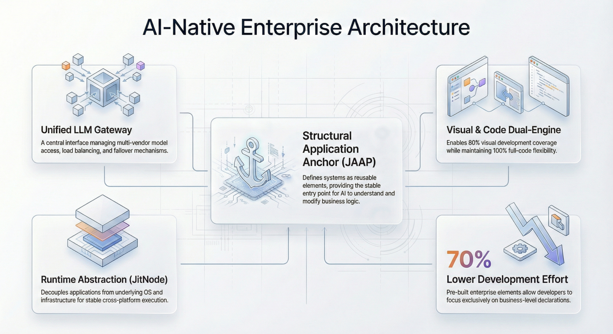

import Head from "@docusaurus/Head";

export const jsonLd = {
"@context": "https://schema.org",
"@graph": [
{
"@type": "Organization",
"@id": "https://jit.pro/#organization",
"name": "JitAI",
"legalName": "武汉万云网络科技有限公司",
"url": "https://jit.pro/",
"logo": {
"@type": "ImageObject",
"url": "https://jit-www.oss-accelerate.aliyuncs.com/logo/logo.svg"
},
"sameAs": [
"https://forum.jit.pro/",
"https://github.com/jitai-team",
"https://x.com/JitAi2017",
"https://www.instagram.com/jitai_2017",
"https://www.youtube.com/channel/UClvTNJPvBhek3aFuDy87RJQ",
"https://www.facebook.com/people/JitAi/61581485995674",
"https://www.linkedin.com/company/jitai2017"
]
},
{
"@type": "WebSite",
"@id": "https://jit.pro/#website",
"name": "JitAI",
"url": "https://jit.pro/",
"publisher": {
"@id": "https://jit.pro/#organization"
},
"inLanguage": [
"en",
"zh-CN"
]
},
{
"@type": "Blog",
"@id": "https://jit.pro/blog#blog",
"name": "Blog",
"url": "https://jit.pro/blog",
"isPartOf": {
"@id": "https://jit.pro/#website"
},
"publisher": {
"@id": "https://jit.pro/#organization"
},
"inLanguage": "en"
},
{
"@type": "WebPage",
"@id": "https://jit.pro/blog/llms-enterprise-systems-agents-governance#webpage",
"url": "https://jit.pro/blog/llms-enterprise-systems-agents-governance",
"name": "LLMs in Enterprise Systems: Agents, Governance, Delivery",
"description": "Learn how LLMs power AI agents in enterprise systems—architecture, governance, and a practical path to ship governed workflows with JitAI.",
"isPartOf": {
"@id": "https://jit.pro/#website"
},
"breadcrumb": {
"@id": "https://jit.pro/blog/llms-enterprise-systems-agents-governance#breadcrumb"
},
"inLanguage": "en"
},
{
"@type": "BreadcrumbList",
"@id": "https://jit.pro/blog/llms-enterprise-systems-agents-governance#breadcrumb",
"itemListElement": [
{
"@type": "ListItem",
"position": 1,
"name": "Home",
"item": "https://jit.pro/"
},
{
"@type": "ListItem",
"position": 2,
"name": "Blog",
"item": "https://jit.pro/blog"
},
{
"@type": "ListItem",
"position": 3,
"name": "LLMs in Enterprise Systems: Agents, Governance, Delivery",
"item": "https://jit.pro/blog/llms-enterprise-systems-agents-governance"
}
]
},
{
"@type": "BlogPosting",
"@id": "https://jit.pro/blog/llms-enterprise-systems-agents-governance#blogposting",
"mainEntityOfPage": {
"@id": "https://jit.pro/blog/llms-enterprise-systems-agents-governance#webpage"
},
"url": "https://jit.pro/blog/llms-enterprise-systems-agents-governance",
"headline": "LLMs in Enterprise Systems: Agents, Governance, Delivery",
"name": "LLMs in Enterprise Systems: Agents, Governance, Delivery",
"description": "Learn how LLMs power AI agents in enterprise systems—architecture, governance, and a practical path to ship governed workflows with JitAI.",
"datePublished": "2026-02-03T00:00:00.000Z",
"dateModified": "2026-02-03T00:00:00.000Z",
"inLanguage": "en",
"isPartOf": {
"@id": "https://jit.pro/blog#blog"
},
"author": {
"@id": "https://jit.pro/#organization"
},
"publisher": {
"@id": "https://jit.pro/#organization"
},
"image": [
"https://jit-www.oss-accelerate.aliyuncs.com/logo/logo_dark.svg"
],
"keywords": [
"LLMs",
"AI agent",
"JitAI",
"RAG",
"tool calling",
"function calling",
"workflow orchestration",
"LLMOps",
"AI governance"
],
"timeRequired": "PT12M"
},
{
"@type": "FAQPage",
"@id": "https://jit.pro/blog/llms-enterprise-systems-agents-governance#faq",
"isPartOf": {
"@id": "https://jit.pro/blog/llms-enterprise-systems-agents-governance#webpage"
},
"inLanguage": "en",
"mainEntity": [
{
"@type": "Question",
"name": "What is the difference between an LLM and an AI agent?",
"acceptedAnswer": {
"@type": "Answer",
"text": "An LLM is the model that generates and transforms text. An AI agent is a system pattern where the model can plan and execute steps using tools, workflow state, and governance controls."
}
},
{
"@type": "Question",
"name": "Do we need RAG if we already have a strong model?",
"acceptedAnswer": {
"@type": "Answer",
"text": "When answers must reflect current internal policies, tickets, contracts, or product docs, retrieval grounds outputs in authoritative sources and supports auditability."
}
},
{
"@type": "Question",
"name": "What makes an LLM system enterprise-ready?",
"acceptedAnswer": {
"@type": "Answer",
"text": "Enterprise readiness comes from the surrounding system: identity and permissions, tool allowlists and validation, audit logs, evaluation gates, monitoring, and controlled write-back to systems of record."
}
},
{
"@type": "Question",
"name": "Is ISO/IEC 42001 required to deploy LLMs?",
"acceptedAnswer": {
"@type": "Answer",
"text": "Not universally. Many teams use it as a management-system reference to structure AI governance, lifecycle controls, and continuous improvement, especially during procurement and compliance reviews."
}
},
{
"@type": "Question",
"name": "How do we reduce hallucinations in production?",
"acceptedAnswer": {
"@type": "Answer",
"text": "Use retrieval grounding, constrain outputs to schemas, add verification steps, and route high-impact actions through approvals or safe fallbacks when confidence is low."
}
},
{
"@type": "Question",
"name": "When should we keep humans in the loop?",
"acceptedAnswer": {
"@type": "Answer",
"text": "Keep human approval for changes that affect money, entitlements, compliance decisions, or irreversible records, and for workflows where evaluations show residual uncertainty."
}
}
]
}
]
}

<Head>
    
</Head>

Large Language Models (LLMs) are no longer “just chat.” In enterprise settings, they’re becoming a new *runtime capability* that can reason over context, call tools, and drive workflows—if you wrap them in the right system design.

This guide explains LLM terminology you can reuse, how LLMs evolve into AI agents, and what “production-ready” looks like for AI-native enterprise applications—especially in low-code and enterprise development platforms.

<!--truncate-->

## What an LLM is (and what it is not)

An **LLM (Large Language Model)** is a deep learning model trained to predict the next token across massive corpora, which makes it good at language understanding and generation: summarization, extraction, translation, classification, drafting, and code-related tasks. 

An LLM **does not inherently have**:

- Verified knowledge of your business data
- Permission to update records safely
- Deterministic behavior
- A memory of your systems of record

Those capabilities come from **the surrounding system**: retrieval, tool integration, identity & permissions, workflow controls, logging, evaluations, and monitoring.

## Why LLMs matter to enterprise development platforms

Enterprise teams are adopting AI quickly, but the value shows up when LLMs are integrated into systems and workflows, not when they’re used as standalone chat.

Two neutral signals illustrate the direction of travel:

- In 2024, **71%** of respondents reported using **generative AI** in at least one business function, and **78%** reported using **AI** overall. 
- In 2024, **private investment in generative AI reached $33.9B**, up **18.7%** year-over-year, and generative AI represented **20%+** of AI private investment. 

These trends create a practical product requirement: enterprises need a way to turn LLM capability into **repeatable, governed outcomes** inside business systems.

## Key terms you can reuse in architecture reviews

### LLM (model)

The probabilistic engine that generates or transforms text (and often other modalities) given input context.

### Prompt (instruction + context)

The text (and sometimes structured data) you provide to steer the model’s output.

### Context window

The amount of input the model can consider in a single run. It shapes what you can reliably do in one step, and pushes you toward chunking, retrieval, and workflow decomposition. 

### RAG (retrieval-augmented generation)

A pattern that *retrieves* relevant documents (policies, tickets, product docs, contracts) and injects them into the model context so answers can be grounded and verifiable.

### Tool calling / function calling

A pattern where the model selects external tools (APIs, DB queries, workflow steps). In production, the “call” must be validated and executed by an orchestrator you control.

### AI agent

An application pattern where an LLM can **plan and act** across steps using tools and state, typically with memory and workflow control. (In other words, an “agent” is an LLM inside a system that can execute.) 

### System (for enterprise LLMs)

A governed runtime around the model: identity, permissions, retrieval, tools, workflow, policies, audit logs, evaluations, observability, and safe write-back.

This is where enterprise-grade reliability comes from.

## LLMs → agents: the shift enterprises are actually making

Many teams start with an assistant: “answer questions” and “draft content.” The next step is agentic: “complete work.”

A useful real-world adoption signal: McKinsey & Company reports that **62%** of respondents say their organizations are at least experimenting with **AI agents**. 

That experimentation typically fails or succeeds based on one factor: **whether the agent is allowed to change business state safely**.

## The enterprise LLM stack (what you actually need)

Think in layers. You can implement these in any architecture, but skipping a layer usually shows up later as reliability, compliance, or cost problems.

### 1) Experience layer

- Chat, copilot panels, “generate” buttons, inline suggestions
- Human-in-the-loop approvals for sensitive actions

### 2) Orchestration layer

- Prompt templates, routing, tool selection constraints
- Multi-step workflows (plan → retrieve → act → verify → write back)
- Guardrails and state machines for deterministic control points

### 3) Knowledge & data layer

- RAG over documents
- Connectors to databases / ERP / CRM / ticketing / BI
- Data classification, redaction, and lineage

### 4) Governance & safety layer

- Identity, RBAC/ABAC, approvals
- Audit trails and tamper-evident logs
- Risk management alignment (internal + external standards)

### 5) Evaluation & operations layer (LLMOps)

- Offline test sets and regression gates
- Online monitoring: tool-call failure rates, hallucination signals, latency, cost
- Incident response and rollback strategies

## Design constraints that decide whether an LLM system works

### Reliability: “good answers” vs “repeatable outcomes”

For workflows, accuracy is necessary but not sufficient. You need:

- Structured outputs (schemas)
- Verification steps (rules, retrieval citations, secondary checks)
- Failure handling (retry with constraints, fallback paths, human escalation)

### Security & privacy: data boundaries must be explicit

Common requirements:

- PII/secret detection and redaction
- Tenant isolation
- Tool-call allowlists and parameter validation
- Prompt injection defenses (treat retrieved text as untrusted input)

### Cost & latency: agents can get expensive fast

Agentic workflows often multiply calls: retrieve + reason + tool + verify + summarize. You’ll want:

- Caching for retrieval and repeated prompts
- “Small model first” routing for classification/extraction
- Budget controls per task and per tenant (tokens, tool calls, timeouts)

### Observability: you can’t manage what you can’t see

At minimum track:

- Task completion rate (end-to-end)
- Tool-call error rate and timeouts
- Human approval rates
- Hallucination/grounding signals (e.g., retrieval coverage, citation match)
- Unit cost per completed workflow

## What this means for AI low-code platforms

LLMs unlock “natural language to app” demos, but enterprise value comes from **how fast you can ship governed workflows**.

A practical platform advantage appears when you can:

- Model business objects and permissions once
- Reuse workflow orchestration patterns across teams
- Connect LLM outputs to real state transitions with audits
- Operate the system with evaluation gates and monitoring

This is the difference between “AI features” and **AI-native execution**.

In JitAI’s approach, the LLM is treated as a controllable execution component inside a governed system—so it can participate in workflows, operate over structured business objects, and write back safely with auditability and permissions. If you want a hands-on walkthrough, start with the [JitAI Tutorial](https://jit.pro/docs/tutorial), then [try JitAI](https://jit.pro/download).

## A practical build path: shipping an LLM system that can act safely

Here’s a repeatable sequence you can apply to most enterprise agent scenarios (support, ops, finance, procurement, HR, compliance).

### Step 1: Define the job as a workflow, not a prompt

Write down:

- Inputs (ticket, form, email, record)
- Required outputs (fields, decisions, updates)
- Allowed actions (create/update/notify/approve)
- Human approval points

### Step 2: Design tool interfaces first

Create a small set of tools with strict schemas:

- Search knowledge base
- Fetch record by ID
- Update record with allowed fields
- Create task / send notification
- Request approval

The model should never “freehand” these.

### Step 3: Add retrieval with measurable coverage

For every task:

- Define which sources are authoritative
- Log retrieved docs and passage IDs
- Fail closed if retrieval returns nothing for high-stakes tasks

### Step 4: Put policy in the system layer

Policies should be enforceable without trusting the model:

- RBAC/ABAC permission checks
- Field-level write restrictions
- Mandatory approvals for specific actions
- Data loss prevention rules

### Step 5: Make verification a first-class step

Examples:

- Cross-check extracted numbers against source text
- Validate formats and constraints
- Run “consistency checks” (dates, totals, required fields)

### Step 6: Build an evaluation gate before production

Create:

- A small gold dataset (50–200 cases)
- Success criteria (accuracy + workflow completion)
- Regression tests for new prompts/tools/models

### Step 7: Operate with monitoring + incident playbooks

Decide:

- What triggers escalation (tool failures, high uncertainty, policy violations)
- How to roll back unsafe changes
- How to do post-incident reviews (root cause + new eval cases)

## Roles and career positioning (what to learn in 2026)

If your search intent includes career direction, here’s a practical map of where LLM work is concentrating:

- **LLM application engineer**: builds RAG + tool workflows, schemas, evals
- **Agent/workflow engineer**: designs multi-step orchestration with safety gates
- **LLMOps / AI operations**: monitoring, cost control, regression testing, release management
- **AI governance partner**: maps controls to ISO/NIST, builds documentation and review processes
- **AI product builder**: chooses where LLMs should act vs suggest, designs UX for approvals

The strongest profiles combine: *systems thinking + data boundaries + workflow design + evaluation discipline*.

## FAQ

### What’s the difference between an LLM and an AI agent?

An LLM is the model. An AI agent is an application pattern where the model can plan and execute steps using tools, state, and policies.

### Do we need RAG if we already have a strong model?

If answers must reflect your latest internal policies, contracts, tickets, or product docs, retrieval is how you ground outputs and make them auditable.

### What makes an LLM system “enterprise-ready”?

Identity and permissions, tool validation, audit logs, evaluation gates, monitoring, and safe write-back controls.

### Is ISO/IEC 42001 required to deploy LLMs?

Not universally, but it provides a recognizable management system structure that helps with procurement, compliance reviews, and cross-team alignment. 

### How do we reduce hallucinations in production?

Use retrieval grounding, constrain outputs to schemas, add verification steps, and fail closed (or require approval) for high-impact actions.

### When should we keep humans in the loop?

When actions touch money, entitlements, compliance decisions, or irreversible record changes—or when your evals show uncertainty remains high.
