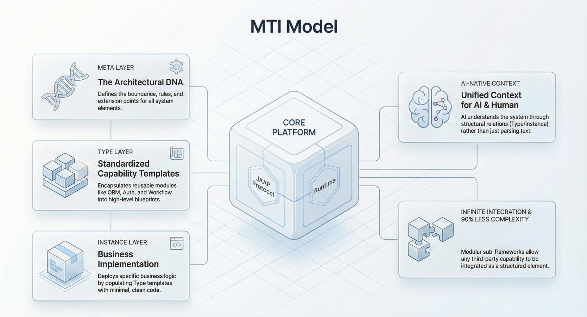

In the era of AI-native development, traditional software architectures face a unique challenge: **opacity**. Large Language Models (LLMs) struggle to understand and safely modify complex, implicit codebases where business logic is buried in thousands of lines of spaghetti code. To build systems that AI agents can truly collaborate on, we must treat system structure not as a byproduct of code, but as a first-class citizen.

This necessity gave rise to the **Meta-Type-Instance (MTI)** model—a hierarchical architectural pattern that decouples interface definitions, implementation logic, and runtime configuration. By creating an **Explicit Structure**, the MTI model transforms application development from writing opaque text to orchestrating semantic elements.

<!--truncate-->

## The Core Problem: Implicit vs. Explicit Structure

In traditional Object-Oriented Programming (OOP), the structure of an application is implicit. It exists only within the Abstract Syntax Tree (AST) of the compiled code. An AI agent trying to modify a "User Service" must parse the entire file, understand the specific framework conventions (Spring, Django, NestJS), and hope it doesn't break a hidden dependency.

The MTI model solves this by **Elementization**—breaking the application down into discrete, self-describing units defined by a strict protocol.

### The MTI Hierarchy

The MTI model organizes every component of a system into three distinct layers:

1.  **Meta (The Protocol):** Defines the abstract capability and interface. It tells the system *what* an element is.
2.  **Type (The Implementation):** Provides the specific logic or driver. It tells the system *how* the element functions.
3.  **Instance (The Configuration):** Represents the concrete usage in a business scenario. It configures the *state* and *parameters*.

## Deep Dive: The Three Layers

### 1. Meta: The Structural Contract

The **Meta** layer acts as the system's legislative branch. It defines the standard behavior and data structure for a family of elements. For example, a `services.Meta` element might define that all services must have a `functionList` and an `invoke()` method.

- **Role:** Standardization and Discovery.
- **AI Value:** Allows the AI to instantly recognize "This is a Service" or "This is a Database" without analyzing implementation code.

### 2. Type: The Logic Encapsulation

The **Type** layer acts as the executive branch. It implements the logic defined by the Meta. This is where developers write code (Python, TypeScript, Java) to interface with third-party APIs, databases, or algorithms.

- **Role:** Technical Implementation and Reuse.
- **Example:** Under `llms.Meta` (LLM Provider), you might have `llms.OpenAI` (OpenAI implementation) and `llms.Local` (Local model implementation).
- **Extensibility:** Developers can create custom **Types** to extend the system's capabilities (e.g., creating a new `IoTDeviceType` to connect to factory sensors).

### 3. Instance: The Business Context

The **Instance** layer represents the actual usage of the software. An instance is created by selecting a **Type** and configuring its parameters.

- **Role:** Business Logic and State.
- **Example:** A "Marketing Copywriter" instance uses the `llms.OpenAI` Type, configured with a specific API Key and system prompt.
- **Isolation:** Changing an Instance's configuration does not affect the underlying Type logic, ensuring stability.

## How JitAI Addresses This: The JAAP Protocol

JitAI implements the MTI model through the **JAAP (JitAi Ai Application Protocol)**. JAAP elevates the application structure to an "Explicit Structure" that is readable and writable by both humans and AI agents.

### The Breakdown of JAAP Elements

In JitAI, everything is an element following the MTI pattern. This includes visible components like Pages and invisible ones like Logic Functions.

| **MTI Layer** | **JitAI Example (LLM)**       | **JitAI Example (Database)** | **Responsibility**                                            |
| ------------- | ----------------------------- | ---------------------------- | ------------------------------------------------------------- |
| **Meta**      | `llms.Meta`                   | `storages.Meta`              | Defines input/output schema and required methods.             |
| **Type**      | `llms.OpenAI`, `llms.Bailian` | `storages.AliyunOssType`     | Encapsulates the SDK calls, retries, and API handling.        |
| **Instance**  | `MyCreativeHelper`            | `UserAvatarStorage`          | Holds API keys, bucket names, and business-specific settings. |

### Why This Matters for AI Agents

Because JitAI exposes this structure explicitly via JSON configurations (e.g., `e.json`), an AI agent can:

1.  **Read:** "I see `MyCreativeHelper` is an instance of `llms.OpenAI`."
2.  **Analyze:** "It is missing a `fallback_model` configuration defined in `llms.Meta`."
3.  **Act:** "I will update the Instance configuration to add the fallback," without ever risking breaking the Python code inside the `llms.OpenAI` Type.

## Implementation Playbook: Extending the System

One of the most powerful features of the MTI model is **non-intrusive extensibility**. Developers can extend the framework by adding new Types without modifying the core platform.

### Scenario: Adding a Custom "DingTalk Notification" Service

**Step 1: Identify the Meta**

Determine which family the new function belongs to. For a notification bot, we reuse the existing Notification or Robot Meta, or create a generic Service Meta.

- *Target:* `services.Meta` (Generic Service) or a custom `imRobots.Meta`.

**Step 2: Create the Type**

Create a new directory for your Type element.

- *Directory:* `imRobots/DingTalkType/`
- _Definition (_`_e.json_`*):* Declare that `type = "imRobots.Meta"`.
- _Logic (_`_index.py_`*):* Implement the code to call DingTalk's Webhook API.

**Step 3: Create the Instance**

In your visual editor or configuration, instantiate your new Type.

- *Instance:* `HR_Alert_Bot`
- *Config:* Set the specific Webhook URL and Secret for the HR department channel.

**Step 4: Usage**

Other parts of the system (Agents, Workflows) can now refer to `HR_Alert_Bot` purely by its defined capabilities, unaware of the underlying API complexity.

## Comparison: MTI vs. Traditional OOP

| **Feature**          | **Traditional OOP / MVC**               | **JitAI MTI Model**                       |
| -------------------- | --------------------------------------- | ----------------------------------------- |
| **Structure Source** | Implicit in code (AST).                 | Explicit in configuration (`e.json`).     |
| **AI Modification**  | AI must rewrite code files (High risk). | AI modifies instance config (Low risk).   |
| **Extensibility**    | Inheritance, Interface implementation.  | Registering new **Types** under **Meta**. |
| **Granularity**      | Classes and Objects.                    | Elements (Meta/Type/Instance).            |
| **Interoperability** | Rigid, requires recompilation.          | Dynamic, protocol-based binding.          |

## How to Verify / Reproduce

To see the MTI model in action within a JitAI project:

1.  **Locate the** `**e.json**` **file:** Every element in a JitAI application has an `e.json` file.
2.  **Check the** `**type**` **field:** This field points to the **Type** element.
    - *Example:* `"type": "pages.GridPageType"` indicates this Instance uses the Grid Page implementation.

3.  **Trace the Hierarchy:**
    - Open `framework/JitWeb/pages/regular-page.md` (or similar docs).
    - See that `pages.GridPageType` points to `pages.Meta`.
    - This confirms the `Meta -> Type -> Instance` lineage.

## FAQ

**Q: Is "Meta" just an Interface?**

A: Conceptually, yes. In JitAI, it is a structural contract that defines what configuration fields (`inputArgs`) and methods (`functionList`) the Type must support.

**Q: Can I modify official Types provided by JitAI?**

A: Yes. Because they are just elements in the system, you can inherit from them or copy-paste them to create your own modified version (e.g., `MyCustomOpenAIType`) to override specific behaviors while keeping the same interface.

**Q: Does MTI add overhead to development?**

A: It shifts the effort. Instead of writing boilerplate code for every instance, you write the Type logic once and then configure Instances rapidly. For AI agents, this structure drastically reduces the complexity of generating valid applications.

## Conclusion

The Meta-Type-Instance model is not just an architectural preference; it is a prerequisite for **AI-Native** software engineering. By decoupling the definition (Meta), the implementation (Type), and the usage (Instance), JitAI creates a structured environment where humans and AI agents can collaborate safely and efficiently.

Ready to build with explicit structure?

[Download JitAI Desktop](https://jit.pro/download) to explore the MTI architecture in the Developer Portal, or read the [JitAI Tutorial](https://jit.pro/docs/tutorial) to build your first AI Agent.
