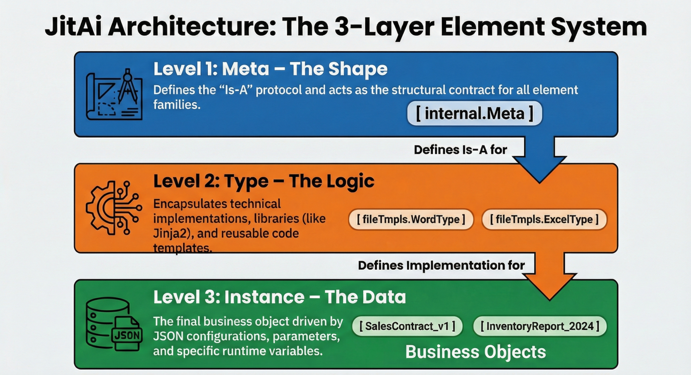

## Introduction

In traditional software engineering, Object-Oriented Programming (OOP) gave us Classes and Objects. This worked well when humans were the only ones reading and writing code. However, as we transition to **AI-native** development, where **AI agents** act as co-developers and system operators, traditional class hierarchies often lack the semantic transparency required for an LLM to safely manipulate system behavior.

To build a **software system** that is truly accessible to AI, we must elevate "structure" to a first-class citizen. This is achieved through the **Meta-Type-Instance (MTI)** model. Unlike simple inheritance, MTI creates a three-tier architectural space that decouples interface definition (Meta), technical implementation (Type), and business configuration (Instance). This separation allows AI agents to reason about system capabilities (Meta) and generate business value (Instances) while developers focus on encapsulation (Types).

<!--truncate-->

## The Anatomy of the MTI Model

The MTI model organizes software elements into three distinct layers of abstraction. This hierarchy is not just for code organization; it is a governance model for how AI and humans collaborate on the same codebase.

### 1. Meta: The Abstract Contract

The **Meta** layer defines the fundamental capabilities and interface contracts of a functional domain. It tells the system (and the AI) *what* a component is, but not *how* it works. It serves as the top-level classification.

- **Role:** Defines structural protocols (inputs, outputs, events).
- **Mutability:** Immutable by the runtime AI; defined by platform architects.
- **Example:** A "Page Meta" defines that any page must have a URL, a title, and a rendering lifecycle.

### 2. Type: The Technical Implementation

The **Type** layer provides the concrete technical implementation of a Meta. This is where developers write code (Python, React, etc.) to encapsulate logic, third-party integrations, or complex algorithms.

- **Role:** Encapsulates technical complexity and logic.
- **Mutability:** Extended by developers; selected by AI.
- **Example:** Under the "Page Meta," you might have a "MarkdownPage Type" (for static docs) and a "VueFullCodePage Type" (for complex apps). Both act as pages but function very differently internally.

### 3. Instance: The Business Realization

The **Instance** layer is the specific usage of a Type, configured with business data. This is the layer where AI agents operate most frequently—creating, modifying, and deleting instances by adjusting configuration files (typically JSON) rather than rewriting core code.

- **Role:** Fulfills a specific business requirement.
- **Mutability:** Highly mutable by users and AI agents.
- **Example:** "Q3 Financial Report" is an *Instance* of the "MarkdownPage Type."

### Architecture Diagram: The MTI Hierarchy



## Why MTI is Critical for AI Agents

In a standard codebase, business logic and technical implementation are often interwoven. If you ask an AI to "add a DingTalk notification," it might try to inject HTTP request code directly into a business function. This leads to brittle, unmaintainable code.

The MTI model acts as a guardrail. Because the **Type** encapsulates the technical implementation (e.g., the DingTalk SDK integration code), the AI agent only needs to instantiate that Type and provide the necessary configuration (Instance).

### Key Benefits for Scalability

1.  **Isolation of Complexity:** Developers can build complex Types (e.g., a "Vector Database Type" handling sharding and embeddings) while the AI simply uses them as tools.
2.  **Standardized Discovery:** AI agents can query the system for all available Types under a specific Meta to discover capabilities dynamically.
3.  **Safe Evolution:** You can upgrade the code within a Type without breaking the thousands of Instances that rely on it, provided the Meta contract remains fulfilled.

## How JitAI Addresses This

JitAI operationalizes the MTI model through the **JAAP (JitAi Ai Application Protocol)**. Unlike platforms that simply bolt AI onto existing APIs, JitAI treats the application structure itself as data that AI can read and modify.

### The JAAP Implementation

In JitAI, every element follows the MTI structure. For example, in the AI Knowledge Base domain:

- **Meta:** `rags.Meta` (Defines retrieval capabilities)
- **Type:** `rags.NormalType` (Standard RAG implementation)
- **Instance:** `My_Customer_Support_KB` (Specific knowledge base)

This allows JitAI to offer "Dual-Mode" development. A developer can write a custom Type (e.g., a proprietary RAG algorithm) in Python code, and a business user (or AI) can immediately use that Type in the visual editor to create Instances.

### Comparison: Traditional vs. MTI-Driven Development

| **Feature**             | **Traditional Frameworks** | **JitAI (MTI Model)**            |
| ----------------------- | -------------------------- | -------------------------------- |
| **Primary Abstraction** | Classes / Interfaces       | Meta / Type / Instance           |
| **AI Interaction**      | Code generation (Copilot)  | Structural modification (Agents) |
| **Extensibility**       | Inheritance / Decorators   | Type extensions / Overrides      |
| **Configuration**       | ENV files / DB tables      | Instance `e.json` & config files |
| **Logic Reuse**         | Libraries / Modules        | Element Families                 |

## Implementation Playbook: Extending the System

One of the most powerful features of MTI is the ability to extend the system by creating new Types that inherit from existing Metas. Here is how you actuate this extensibility in a real-world scenario (e.g., adding a custom "DingTalk Robot" integration).

### Step 1: Identify the Meta

Determine which family your new component belongs to. For a chat bot, this would fall under the `imRobots` Meta.

### Step 2: Create the Type Element

Instead of writing a standalone script, you create a new Type directory structure. This encapsulates the SDK logic.

- **Path:** `imRobots/dingTalkStreamType/`
- **Definition (**`**e.json**`**):** Declare that `type` points to the Meta.
- **Implementation:** Write the Python logic to handle the DingTalk Stream mode protocol.

### Step 3: Instantiate via Configuration

Once the Type is defined, you (or the AI) create an Instance simply by creating a config file.

- **File:** `my_bot/e.json`
- **Content:**

JSON

```plaintext
{
  "type": "imRobots.dingTalkStreamType",
  "title": "HR Assistant Bot",
  "authConfig": { "clientId": "..." }
}

```

## How to Verify / Reproduce

To verify the MTI separation in a JitAI project, you can inspect the file structure directly:

1.  **Locate Definitions:** Navigate to the `framework` or application directory.
2.  **Check** `**e.json**`**:** Open the configuration file of any element.
    - Look for the `type` field.
    - If it points to a definition like `pages.MarkdownPageType`, you are looking at an **Instance**.
    - If you look at the source of `MarkdownPageType` and it references `pages.Meta`, you are looking at a **Type**.

3.  **Trace the Logic:** Observe that the Instance contains *no code*, only configuration (title, content path), while the Type contains the logic (`.py` or `.ts` files) that processes that configuration.

## FAQ

**Q: Is MTI different from standard Class-Object relations in Java/C#?**

A: Yes. While similar conceptually, MTI in this context elevates "Type" to a runtime entity that can be defined, swapped, and configured dynamically without recompiling the core platform. It is closer to the **Meta-Object Facility (MOF)** standard used in systems engineering than simple OOP class inheritance.

**Q: Can I create my own Meta?**

A: Yes. While the framework provides standard Metas (Pages, Services, Models), advanced architects can define entirely new Metas to introduce new categories of software elements into the platform.

**Q: Does the AI really understand "Types"?**

A: Yes. Because Types are self-describing elements within the JAAP protocol, the AI can read a Type's definition to understand what inputs it requires and what capabilities it offers, allowing it to "use" the tool correctly without hallucinating API signatures.

## Conclusion

The MTI model solves a fundamental challenge in the age of AI engineering: how to grant agents the power to build systems without giving them the power to create chaos. By rigidly separating the abstract contract (Meta), the technical encapsulation (Type), and the business application (Instance), we create a structured space where AI and humans can collaborate safely.

**Next Steps:**

- **Download:** Experience the MTI model in action with the JitAI Desktop version. [Download here](https://jit.pro/download).
- **Learn:** Read the developer guide on extending element families. [Documentation](https://jit.pro/docs/tutorial).
