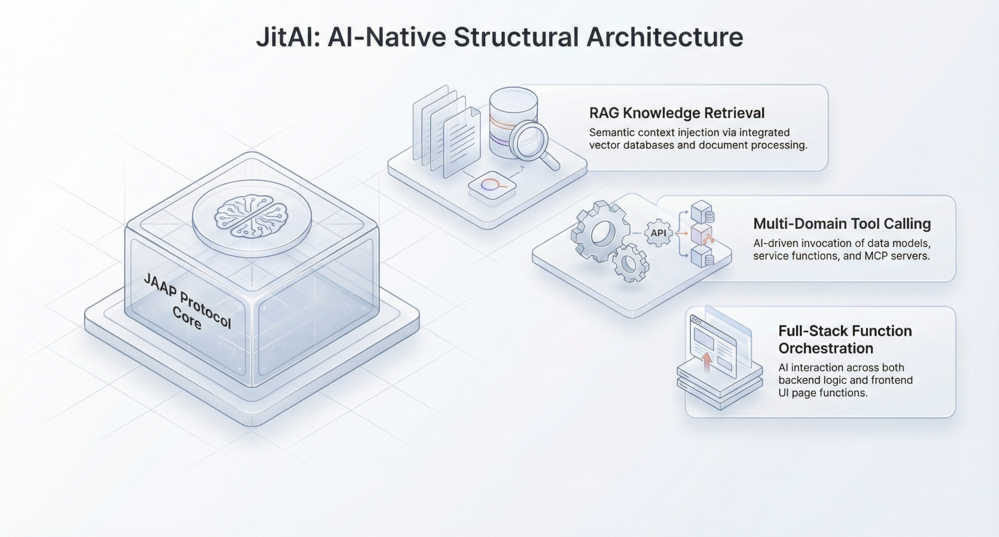

import Head from "@docusaurus/Head";

export const jsonLd = {
"@context": "https://schema.org",
"@graph": [
{
"@type": "Organization",
"@id": "https://jit.pro/#organization",
"name": "JitAI",
"legalName": "武汉万云网络科技有限公司",
"url": "https://jit.pro/",
"logo": {
"@type": "ImageObject",
"url": "https://jit-www.oss-accelerate.aliyuncs.com/logo/logo.svg"
},
"sameAs": [
"https://forum.jit.pro/",
"https://github.com/jitai-team",
"https://x.com/JitAi2017",
"https://www.instagram.com/jitai_2017",
"https://www.youtube.com/channel/UClvTNJPvBhek3aFuDy87RJQ",
"https://www.facebook.com/people/JitAi/61581485995674",
"https://www.linkedin.com/company/jitai2017"
]
},
{
"@type": "WebSite",
"@id": "https://jit.pro/#website",
"name": "JitAI",
"url": "https://jit.pro/",
"publisher": {
"@id": "https://jit.pro/#organization"
},
"inLanguage": [
"en",
"zh-CN"
]
},
{
"@type": "Blog",
"@id": "https://jit.pro/blog#blog",
"name": "Blog",
"url": "https://jit.pro/blog",
"isPartOf": {
"@id": "https://jit.pro/#website"
},
"publisher": {
"@id": "https://jit.pro/#organization"
},
"inLanguage": "en"
},
{
"@type": "WebPage",
"@id": "https://jit.pro/blog/rag-tool-calling-function-calling-boundaries-patterns#webpage",
"url": "https://jit.pro/blog/rag-tool-calling-function-calling-boundaries-patterns",
"name": "RAG, Tool Calling, Function Calling: Boundaries & Patterns",
"description": "Learn clear boundaries between RAG, tool calling, and function calling—and practical patterns to combine retrieval, vector databases, and agentic AI safely in enterprise systems.",
"isPartOf": {
"@id": "https://jit.pro/#website"
},
"breadcrumb": {
"@id": "https://jit.pro/blog/rag-tool-calling-function-calling-boundaries-patterns#breadcrumb"
},
"inLanguage": "en"
},
{
"@type": "BreadcrumbList",
"@id": "https://jit.pro/blog/rag-tool-calling-function-calling-boundaries-patterns#breadcrumb",
"itemListElement": [
{
"@type": "ListItem",
"position": 1,
"name": "Home",
"item": "https://jit.pro/"
},
{
"@type": "ListItem",
"position": 2,
"name": "Blog",
"item": "https://jit.pro/blog"
},
{
"@type": "ListItem",
"position": 3,
"name": "RAG, Tool Calling, Function Calling: Boundaries & Patterns",
"item": "https://jit.pro/blog/rag-tool-calling-function-calling-boundaries-patterns"
}
]
},
{
"@type": "BlogPosting",
"@id": "https://jit.pro/blog/rag-tool-calling-function-calling-boundaries-patterns#blogposting",
"mainEntityOfPage": {
"@id": "https://jit.pro/blog/rag-tool-calling-function-calling-boundaries-patterns#webpage"
},
"url": "https://jit.pro/blog/rag-tool-calling-function-calling-boundaries-patterns",
"headline": "RAG, Tool Calling, Function Calling: Boundaries & Patterns",
"name": "RAG, Tool Calling, Function Calling: Boundaries & Patterns",
"description": "Learn clear boundaries between RAG, tool calling, and function calling—and practical patterns to combine retrieval, vector databases, and agentic AI safely in enterprise systems.",
"datePublished": "2026-02-06T00:00:00.000Z",
"dateModified": "2026-02-06T00:00:00.000Z",
"inLanguage": "en",
"isPartOf": {
"@id": "https://jit.pro/blog#blog"
},
"author": {
"@id": "https://jit.pro/#organization"
},
"publisher": {
"@id": "https://jit.pro/#organization"
},
"image": [
"https://jit-www.oss-accelerate.aliyuncs.com/logo/logo_dark.svg"
],
"keywords": [
"RAG",
"retrieval-augmented generation",
"knowledge base",
"vector database",
"semantic retrieval",
"tool calling",
"function calling",
"agentic AI",
"AI governance",
"enterprise low-code"
],
"timeRequired": "PT12M"
},
{
"@type": "FAQPage",
"@id": "https://jit.pro/blog/rag-tool-calling-function-calling-boundaries-patterns#faq",
"isPartOf": {
"@id": "https://jit.pro/blog/rag-tool-calling-function-calling-boundaries-patterns#webpage"
},
"inLanguage": "en",
"mainEntity": [
{
"@type": "Question",
"name": "What’s the simplest way to explain the difference to non-ML stakeholders?",
"acceptedAnswer": {
"@type": "Answer",
"text": "RAG helps the model look things up. Tool calling lets the model do things through external capabilities. Function calling adds a typed contract so actions can be validated, logged, and governed."
}
},
{
"@type": "Question",
"name": "Do I always need a vector database for RAG?",
"acceptedAnswer": {
"@type": "Answer",
"text": "Not always. Smaller corpora can work with classical search or hybrid approaches. Vector search becomes valuable as content grows, becomes less keyword-friendly, or needs semantic matching."
}
},
{
"@type": "Question",
"name": "Can function calling eliminate hallucinations?",
"acceptedAnswer": {
"@type": "Answer",
"text": "No. It reduces malformed calls and improves enforcement, but you still need retrieval quality, semantic validation, and postconditions to ensure correctness."
}
},
{
"@type": "Question",
"name": "When should I add a human-in-the-loop step?",
"acceptedAnswer": {
"@type": "Answer",
"text": "Add it when actions change system-of-record state with high impact—finance, access control, customer-facing messages—or when policy requires approval trails."
}
},
{
"@type": "Question",
"name": "Is “agentic RAG” just RAG plus tools?",
"acceptedAnswer": {
"@type": "Answer",
"text": "In many production systems, yes. Retrieval becomes one tool among several, and the agent decides when to retrieve, how to refine queries, and when to call other systems."
}
}
]
}
]
}

<Head>
    
</Head>

Retrieval-Augmented Generation (RAG), tool calling, and function calling often get blended together in enterprise discussions—especially when teams try to turn “chat with a knowledge base” into agentic workflows that can **search, decide, and update records**.  
This article draws clean boundaries, then shows composable patterns you can reuse to ship reliable, governed AI features inside low-code and enterprise development platforms.

<!--truncate-->

## Why the boundaries matter now

In 2025, enterprise teams moved from demos to production, and the “default stack” for LLM apps hardened around **retrieval + actions + governance**. One data point that signals how mainstream retrieval has become: Databricks reported that **70% of companies** in its analysis were using **vector databases and RAG** to customize LLMs. 

Market signals tell the same story. MarketsandMarkets projects the **vector database market** rising from **~$2.65B (2025)** to **~$8.95B (2030)**, reflecting strong growth as semantic retrieval becomes a core infrastructure layer. 

At the same time, governance is becoming more formalized. ISO/IEC **42001:2023** positions itself as the first AI management system standard, pushing organizations to treat AI delivery as an auditable management system, not a one-off feature. 

These shifts make it essential to separate:

- **How the model gets information** (RAG),
- **How the model takes actions** (tool calling),
- **How actions become contract-driven and enforceable** (function calling).

## Definitions you can reuse in architecture reviews

### RAG (Retrieval-Augmented Generation): “bring your own evidence”

RAG is an information-access pattern: retrieve relevant context from an external corpus (docs, tickets, product specs, policies), then condition generation on that retrieved context.  
The key idea is that the model’s response becomes **grounded** in up-to-date, organization-specific sources, with provenance and refreshability that pure prompting can’t provide. 

What RAG changes in your system:

- Adds a **retrieval pipeline** (indexing, embedding, semantic search, reranking).
- Shifts quality work from “prompt tweaks” to **data + retrieval quality**.
- Makes “answers” more explainable when you keep citations and snippets.

What RAG does *not* do:

- It does not execute business operations.
- It does not guarantee correctness; it improves *evidence access*.

### Tool calling: “choose an external capability during a run”

Tool calling is an action-selection pattern: the model decides to call external tools (search, database read, calculators, ticket creation, workflow triggers), and an orchestrator executes them and returns results to the model.  
This turns the model from a text generator into a **planner/controller** that can incorporate live outputs. Tool-augmented LLM behavior is widely studied as a distinct capability area. 

What tool calling changes in your system:

- Introduces an **orchestrator loop**: model → tool call → tool result → model.
- Adds a **tool registry** and operational concerns (timeouts, retries, rate limits).
- Raises security stakes because tools can touch real data and state.

### Function calling: “tool calling with a typed contract”

Function calling is tool calling with **structured interfaces**: calls must match a declared schema (arguments, types, constraints), making calls easier to validate, log, and govern.  
In practice, function calling becomes the bridge from “the model suggested an action” to “the system executed an action under strict constraints,” which is crucial for enterprise reliability.

What function calling changes in your system:

- Enables **validation** (schema checks) before execution.
- Improves **observability** (consistent logs + argument capture).
- Reduces tool errors caused by malformed parameters.

Research and benchmarks increasingly treat “structured output” and schema-constrained generation as a first-class problem because it directly affects multi-step agent reliability. 

## The clean boundary line: Context vs Actions vs Contracts

A simple mental model:

- **RAG = Context path**  
  Retrieves information to improve reasoning and grounding.
- **Tool calling = Action path**  
  Lets the system do work in external systems.
- **Function calling = Contract layer**  
  Makes actions enforceable, auditable, and safer to operate at scale.

If you keep these layers distinct, you can evolve each independently:

- Improve retrieval quality without changing business logic.
- Add tools without reindexing your knowledge base.
- Tighten schemas and policies without rewriting prompts.

## Common failure modes (and how to design around them)

### RAG failure modes

1.  **Low recall**: the right doc never gets retrieved.  
    Mitigation: hybrid retrieval, better chunking, query rewriting, domain embeddings, reranking, and “golden question” test sets.
2.  **High recall, low precision**: retrieval floods irrelevant chunks.  
    Mitigation: reranking, metadata filters, smaller candidate sets, stronger query intent classification.
3.  **Stale or ungoverned corpora**: retrieval returns outdated policy.  
    Mitigation: lifecycle rules (expiry, ownership, review cadence), and surfacing doc timestamps/owners in citations.

### Tool calling failure modes

1.  **Over-calling tools** (cost/latency explosion).  
    Mitigation: tool budgets, caching, “tool-first” routing only when needed, and offline evaluation of call policies.
2.  **Under-calling tools** (hallucinated answers when a tool is required).  
    Mitigation: explicit “must call” gates for high-stakes intents (pricing, compliance, account changes).
3.  **Prompt injection via retrieved text** that tries to redirect actions.  
    Mitigation: treat retrieved text as untrusted, isolate it from tool instruction channels, and require contract checks for any write.

### Function calling failure modes

1.  **Schema drift** (tool API changes, model still uses old fields).  
    Mitigation: versioned schemas, compatibility layers, contract tests, and deprecation windows.
2.  **Partial correctness** (schema-valid but semantically wrong arguments).  
    Mitigation: semantic validators (business rules), postconditions, and “explain + confirm” flows for risky actions.
3.  **Silent tool failures** (timeouts interpreted as empty success).  
    Mitigation: typed error returns, retries with backoff, and explicit “tool result required” states.

## Composition patterns you can reuse

### Pattern 1: RAG-only knowledge assistant (read-only, fast to ship)

Use when the product scope is: Q&A, onboarding, internal documentation, policy explanation.

Core loop:

- Retrieve → generate → cite sources.

Design notes:

- Add response citations and “open source snippet” UX for trust.
- Track retrieval metrics separately from generation metrics.

### Pattern 2: RAG + tool calling for “agentic search” (read + verify)

Use when the assistant must combine internal docs with live systems (inventory, CRM status, incident dashboards).

Core loop:

- Route intent → retrieve internal context → call read-tools as needed → synthesize.

Design notes:

- Make read-tools first-class (SQL read, ticket lookup, analytics query).
- Require the model to cite whether a claim came from retrieved docs or live tool results.

### Pattern 3: Tool calling without RAG (transactional copilots)

Use when the job is operational and the knowledge base adds little value: generating a report, running a workflow, transforming data.

Core loop:

- Plan steps → call tools → format output.

Design notes:

- This lives or dies by tool reliability, schemas, and permissions.
- Add deterministic fallbacks for critical steps.

### Pattern 4: RAG + function calling for governed write-back (enterprise “real work”)

Use when the assistant must safely update records: create tickets, draft contracts, update order status, initiate approvals.

Core loop:

- Retrieve policy/constraints → propose action → function call with validated args → execute → write audit log.

Design notes:

- Treat write tools as a separate tier with stricter policies.
- Add human approvals for certain thresholds (money, entitlements, external comms).

This is where AI-native enterprise platforms can shine. In JitAI-style system design, you typically model:

- the **data entities** you can read/write,
- the **workflow states** and approvals,
- the **permission model** (who can trigger what),  
  then bind agent behaviors to those contracts so “AI execution” inherits governance from the platform runtime.  
  If you want a concrete walkthrough of building governed flows, start with the [JitAI Tutorial](https://jit.pro/docs/tutorial). If you prefer to explore hands-on, you can also [try JitAI](https://jit.pro/download).

### Pattern 5: Multi-step workflows with “contracts at every step”

Use when tasks require multiple systems: “resolve invoice discrepancy,” “process a refund,” “triage a customer escalation.”

Core loop:

- Step planner (model) produces a step list.
- Each step becomes a function call with schema + validators.
- The orchestrator enforces budgets, approvals, and rollback plans.

Design notes:

- Persist intermediate state (what was attempted, what succeeded).
- Make the workflow resumable (idempotent calls, checkpoints).

## A reference architecture for low-code + enterprise development platforms

You can implement the above patterns with a layered architecture that keeps responsibilities clean:

### 1) Retrieval layer (RAG)

- Connectors: docs, wikis, tickets, CRM notes, PDFs.
- Indexing: chunking, embeddings, metadata tagging.
- Retrieval: semantic search + reranking + filters.
- Evidence: store snippet IDs for audit and citation.

### 2) Tool layer (capabilities)

- Read tools: search APIs, DB queries, analytics queries.
- Write tools: ticket creation, updates, workflow transitions.
- Tool registry: ownership, versions, rate limits, test coverage.

### 3) Contract layer (function calling)

- Schemas for every tool (inputs, constraints, outputs, errors).
- Validators: business rules, permission checks, threshold checks.
- Policy engine: allowlists, environment separation (prod vs sandbox).

### 4) Orchestrator (runtime)

- Routing: which pattern to use for which intent.
- Safety: tool budgets, timeouts, retries, human-in-the-loop gates.
- Observability: logs, traces, evaluation hooks, cost tracking.

### 5) Governance & risk management alignment

Enterprise teams increasingly map this to governance frameworks and standards, including AI risk management guidance (like NIST AI RMF) and AI management system standards (like ISO/IEC 42001). 

## Evaluation: measure the right things

### RAG metrics (quality of context)

- Retrieval recall/precision on curated test questions.
- Citation usefulness (did cited snippets actually support the claim?).
- Freshness and coverage (how many key docs are indexed and current?).

### Tool/function metrics (quality of actions)

- Tool-call success rate (by tool, version, and input type).
- Argument validity rate (schema-valid + business-valid).
- Time-to-complete workflow (latency distribution, not just average).
- Human override rate (how often users reject/redo actions).

### System metrics (production readiness)

- Incident rate and blast radius (what happens when a tool breaks?).
- Audit completeness (can you reconstruct “why” and “who approved”?).
- Cost-per-task (including retrieval, tool calls, retries, and approvals).

## A decision checklist (fast routing rules)

Use these rules to pick the right combination quickly:

- If the user asks “what is / how does / where is the policy,” start with **RAG-only**.
- If the user asks “check current status,” add **read tools**; don’t rely on documents.
- If the user asks “do something in the system,” require **function calling** with schemas.
- If the action touches money, permissions, or external comms, add **approval gates**.
- If you can’t explain an output with evidence or tool results, treat it as **unsafe**.

## FAQ

### What’s the simplest way to explain the difference to non-ML stakeholders?

RAG helps the model “look things up.” Tool calling lets the model “do things.” Function calling makes “doing things” contract-driven and governable.

### Do I always need a vector database for RAG?

Not always. Smaller corpora can work with classical search or hybrid approaches. Vector search becomes valuable as content grows, becomes less keyword-friendly, or needs semantic matching.

### Can function calling eliminate hallucinations?

No. It reduces a specific class of failures (malformed calls) and improves enforcement. You still need retrieval quality, validation, and postconditions to ensure semantic correctness.

### When should I add a human-in-the-loop step?

When the action changes system-of-record state with high impact (finance, access control, customer-facing messages) or when policy requires approval trails.

### Is “agentic RAG” just RAG plus tools?

In many production systems, yes: retrieval becomes one tool among several, and the agent chooses when to retrieve, how to refine queries, and when to call other systems.
