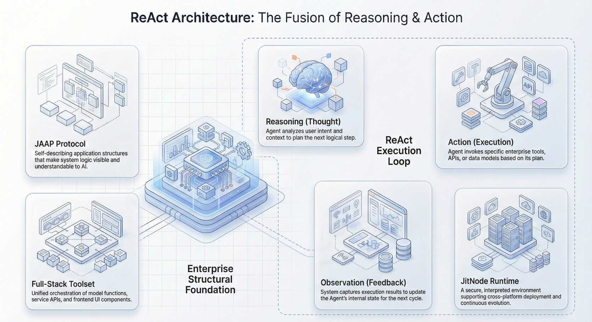

The evolution of Generative AI has moved rapidly from passive "Chatbots" that generate text to active **AI Agents** that execute tasks. At the heart of this transition is the **ReAct (Reasoning and Acting)** architecture. Unlike simple request-response models, a ReAct agent operates in a continuous loop: it observes the environment, reasons about the next step, acts using tools, and observes the results again.

For enterprise developers and architects, the challenge lies in moving this architecture from Python scripts to a production-grade **Full-Stack Execution Engine**—one that can manipulate backend databases and frontend user interfaces simultaneously.

This article dissects the engineering principles behind such an engine, focusing on the reasoning loop, tool invocation strategies, and state management.

<!--truncate-->

## The ReAct Architecture: Reasoning + Acting

The ReAct paradigm, introduced by Yao et al. (2022), enables Large Language Models (LLMs) to solve complex tasks by interleaving thought traces with action execution.

### The Execution Loop

An enterprise-grade agent execution engine typically follows this lifecycle:

1.  **Input Parsing**: The agent receives a user goal (e.g., "Refund order #123 and update the inventory").
2.  **Reasoning (Thought)**: The LLM analyzes the request against available tools. It determines it needs to query the order status first.
3.  **Action**: The engine constructs a structured call to the specific tool (e.g., `getOrderStatus(id=123)`).
4.  **Observation**: The tool executes (hitting a database or API) and returns the output (e.g., `{"status": "delivered", "amount": 50}`).
5.  **Iteration**: The LLM observes this output and generates the next thought ("Order is delivered. I can proceed with the refund.").
6.  **Termination**: The loop continues until the goal is met or a `max_iterations` limit is reached.

## The "Full-Stack" Challenge: Backend vs. Frontend Tools

Most agent frameworks excel at **backend** tools—querying databases or calling REST APIs. However, true enterprise automation often requires **frontend** manipulation, such as navigating a UI, filling complex forms, or triggering client-side validation logic.

### 1. Backend Tool Invocation

Backend tools are deterministic. They map 1:1 to functions or API endpoints.

- **Mechanism**: The agent selects a tool (e.g., `update_customer_record`).
- **Execution**: The engine executes the function in a secure server-side sandbox.
- **Security**: Requires strict Role-Based Access Control (RBAC) to prevent unauthorized data mutations \[1\].

### 2. Frontend Tool Invocation

Frontend tools allow the AI to "drive" the user interface. This is significantly harder to engineer because it requires the agent to have awareness of the client-side state.

- **Mechanism**: The agent emits an instruction that the frontend client intercepts.
- **Execution**: The client executes JavaScript logic (e.g., `openModal()`, `refreshTable()`) or navigates routes.
- **Latency**: Must be near real-time to avoid UI lag.

## How JitAI Addresses This

JitAI provides a production-ready implementation of this architecture through its **AIAgent** element family. It treats the "application structure" as a first-class citizen, allowing the AI to understand and manipulate both backend logic and frontend components natively.

### 1. The ReAct Agent Element (`aiagents.ReActType`)

In JitAI, creating a ReAct agent is not just writing a prompt; it involves instantiating an `aiagents.ReActType` element. This element encapsulates the entire reasoning loop, handling:

- **Tool Orchestration**: Dynamic composition of business tools.
- **Context Maintenance**: Preserving conversation history and intermediate variable states.
- **Lifecycle Management**: Handling startup, execution, and completion states.

According to the internal architecture, the JitAI Agent supports **"decomposition and execution of complex business logic"** by automatically selecting appropriate tools based on user intent \[NBLM: framework\_\_JitAi\_\_AIAgent.md | "decomposition and execution of complex business logic" | AIAgent\].

### 2. Full-Stack Tool Integration

JitAI distinguishes itself by enabling agents to invoke **Full-Stack Elements** natively \[NBLM: ai-agent\_\_agent-tools.md | "enabling intelligent invocation of full-stack elements across both frontend and backend" | Tools in Agent\]:

- **Model Functions**: The agent can directly perform CRUD operations (Create, Read, Update, Delete) on Data Models without writing SQL or API wrappers. For example, an agent can "delete these 3 customers" by calling the model's delete function directly.
- **Service Functions**: Encapsulated business logic (Python) that can be invoked as atomic tools.
- **Page Functions (Frontend)**: Critically, JitAI agents can invoke functions defined on the frontend page. This enables **"AI controls Web Pages"** scenarios, where an agent can proactively fill forms, switch tabs, or trigger client-side calculations \[NBLM: ai-assistant\_\_develop-human-ai-collaboration-enterprise-assistant\_\_index.md | "AI can not only understand user operations on pages but also dynamically adjust its decisions" | Developing Human-AI Collaborative Enterprise Assistant\].
- **MCP Services**: Support for the **Model Context Protocol (MCP)**, allowing standardized connection to external data sources and tools.

### 3. Integrated State & Permission Tracking

State management is handled via the **AI Assistant** runtime state, which acts as a "memory bank" storing user inputs, node outputs, and intermediate variables \[NBLM: ai-assistant\_\_ai-assistant-state.md | "Runtime state data is the 'memory bank' during AI assistant process execution" | AI Assistant Runtime State\].

Furthermore, JitAI enforces **Role-Based Tool Permissions**. You can restrict sensitive tools (e.g., "Approve Loan") to specific user roles. If an unauthorized user asks the agent to perform that task, the agent will refuse based on the underlying JAAP (JitAi Application Protocol) constraints \[NBLM: ai-agent\_\_agent-tools.md | "By restricting tool function access to specific roles, developers can prevent privilege escalation" | Tools in Agent\].

## Implementation Playbook

Here is a strategic guide to implementing a Full-Stack ReAct Agent using JitAI principles.

### Phase 1: Define the Brain (Agent Configuration)

1.  **Create the Element**: Instantiate a new `aiagents.ReActType` element.
2.  **Select the LLM**: Choose a model with strong reasoning capabilities (e.g., models from OpenAI, Anthropic, or Alibaba Cloud Bailian).
3.  **System Prompt**: Define the agent's persona and constraints.
    - _Tip_: Use "whitelists" for constraints rather than "blacklists" to prevent hallucinations \[NBLM: advanced-guide\_\_agent-prompt-writing-techniques.md | "Use 'whitelists' rather than 'blacklists' to constrain fields and behaviors" | Practical writing tips\].

### Phase 2: Equip the Hands (Tool Registration)

1.  **Backend Tools**: Register existing **Service Functions** (e.g., `CalculateTax`) and **Model Functions** (e.g., `QueryOrders`) as tools. The system automatically exposes the function signatures to the LLM.
2.  **Frontend Tools**: If the agent needs to manipulate the UI, register **Page Functions**. For example, a `fillForm` function that takes a JSON object and populates input fields.
3.  **MCP Integration**: If connecting to external systems (like a Git repo or Slack), register the corresponding MCP server.

### Phase 3: Orchestrate the Flow (AI Assistant)

1.  **Wrap in Assistant**: Place the Agent inside an **AI Assistant** element. This provides the chat interface and session management.
2.  **Visual Orchestration**: Use the drag-and-drop designer to connect the "Start" node to the "Agent" node.
3.  **Human-in-the-Loop**: For high-risk actions (e.g., "Delete Data"), enable **"Confirm Execution"**. This pauses the agent and requires user approval before the tool runs \[NBLM: ai-agent\_\_agent-tools.md | "Agent pauses before execution and requests user confirmation" | Manual confirmation before tool execution\].

## Comparative Analysis: Agent Architectures

| **Feature**      | **Standard Chatbot**  | **RAG Chatbot**       | **JitAI ReAct Agent**          |
| ---------------- | --------------------- | --------------------- | ------------------------------ |
| **Primary Goal** | Conversation          | Information Retrieval | Task Execution                 |
| **Logic Engine** | LLM (Stateless)       | LLM + Vector DB       | ReAct Loop (Stateful)          |
| **Tool Scope**   | None (Text only)      | Read-only (Search)    | **Full-Stack (Read/Write/UI)** |
| **UI Control**   | Passive               | Passive               | **Active (Can drive UI)**      |
| **Security**     | Prompt Injection Risk | Context Leakage Risk  | **RBAC on Tool Execution**     |

_Note: Data derived from qualitative architectural comparison._

## How to Verify & Reproduce

To ensure your ReAct agent is functioning correctly, you must inspect the **reasoning trace**.

1.  **Enable Detailed Logs**: In the AI Assistant configuration, set the logging level to **"Output Detailed Process Logs"**. This is crucial for debugging.
2.  **Observe the Trace**:
    - Look for the `Thought`: Is the agent correctly identifying the missing information?
    - Look for the `Action`: Is the tool call syntax correct?
    - Look for the `Observation`: Did the tool return the expected JSON?

3.  **Verify UI Actions**: Open the browser's developer console. When the agent triggers a Frontend Tool, verify that the corresponding JavaScript function fires with the correct parameters.

## FAQ

**Q: Can the agent get stuck in a loop?**

**A:** Yes. ReAct agents can sometimes repeat the same thought. JitAI mitigates this by allowing you to set a `maxIterations` limit on the agent configuration.

**Q: How does the agent know how to use my custom tools?**

**A:** JitAI uses the "Self-Describing" nature of JAAP elements. When you register a function, its name, description, and parameter types are automatically serialized into the prompt's context window \[NBLM: ai-agent\_\_agent-tools.md | "Applications built on JitAi's interpretive system architecture feature self-describing elements" | Tools in Agent\].

**Q: Is it safe to let an AI delete database records?**

**A:** Only if you implement proper safeguards. You should enable the "Confirm Execution" setting for destructive tools, forcing a human approval step before the action commits.

**Ready to build your first Full-Stack Agent?**

Download the [JitAI Desktop Version](https://jit.pro/download) today and follow the [AI Customer Service Tutorial](https://jit.pro/docs/tutorial) to deploy a production-grade agent in minutes.
