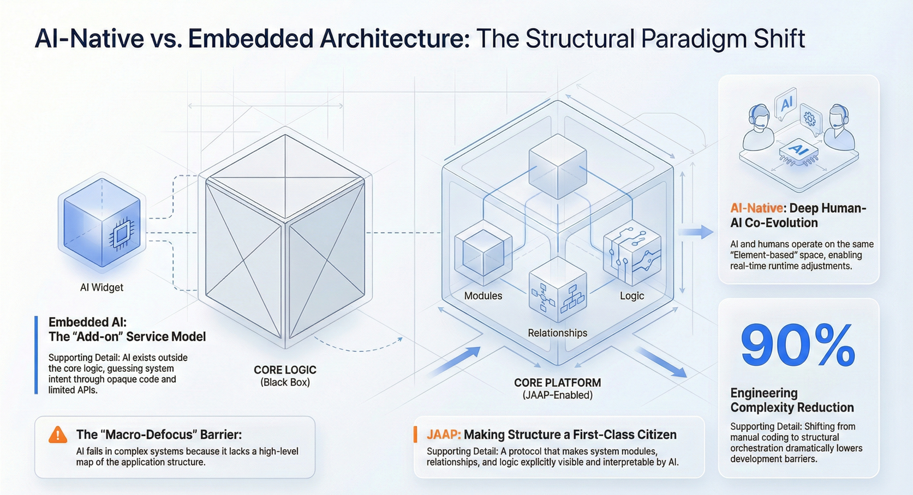

The industry is currently witnessing a massive divergence in how developers integrate **AI** into software. On one side, we have "AI features"—chatbots grafted onto legacy systems via APIs. On the other, we are seeing the emergence of **AI-native applications**—systems designed from the ground up to be understood, operated, and evolved by **AI agents**.

For senior developers and architects, understanding the difference between "embedding AI" and "building AI-native" is no longer academic; it is the difference between shipping a fragile demo and deploying a robust enterprise system. The fundamental dividing line is not the model you use (GPT-4 vs. Claude 3) or the size of your vector database. It is whether your application’s *structure* is visible to the AI.

<!--truncate-->

## The "Embedded AI" Trap: Why APIs Aren't Enough

In the traditional development paradigm, applications are compiled "black boxes." When we embed AI, we typically give an LLM a narrow keyhole (an API) to peer through.

### The Context Window Bottleneck

Even with expanding context windows (128k–1M+ tokens), feeding an entire codebase or complex database schema into a prompt remains inefficient and error-prone. When an **AI agent** tries to understand a legacy application, it must rely on "ragged" retrieval—guessing which code snippets or documentation are relevant.

- **Latency:** Processing massive contexts per turn introduces unacceptable latency.
- **Lost Nuance:** Business logic buried in imperative code (e.g., nested `if-else` statements inside a compiled service) is often invisible to the agent unless explicitly exposed via function calling definitions.

### The "Black Box" Logic Problem

In traditional software, the "structure" of the application (relationships between entities, permissions, flow logic) is implicit. It lives in the mind of the developer and the lines of code.

- **External Plugin Syndrome:** The AI acts as an outsider. It can trigger an action, but it doesn't understand the *consequences* or the *state* of that action within the broader system.
- **Fragility:** If a developer changes a variable name or a database column, the AI’s prompt instructions often break because the AI relies on hard-coded text descriptions rather than a live structural definition.

## The Fundamental Dividing Line: Structure as a First-Class Citizen

To build a true **AI native application**, we must invert the relationship. Instead of the AI struggling to interpret the code, the application must present itself in a standardized, machine-readable structure.

### From Implicit Code to Explicit Protocols

The core shift lies in elevating the "Application Structure" to a first-class citizen.

- **Traditional:** Code defines structure implicitly.
- **AI-Native:** A protocol defines structure explicitly; code implements the logic within that structure.

When the structure is explicit, an AI agent doesn't need to read 10,000 lines of Python to understand that "Employee" relates to "Department." It simply queries the structural definition.

### Making the Application "Readable" to AI

An AI-native system exposes a self-describing model. This allows the AI to:

1.  **Traverse Relationships:** Understand that deleting a "User" might cascade to "Orders."
2.  **Verify Permissions:** Check role-based access controls (RBAC) dynamically before suggesting an action.
3.  **Self-Heal:** Detect when a tool definition no longer matches the underlying service signature.

## Architecture Comparison: Embedded vs. Native

The following diagram illustrates the architectural gap. In the embedded model, the AI navigates a maze of disconnected endpoints. In the structural native model, the AI interfaces with a unified map.

## How JitAI Addresses This: The JAAP Protocol

**JitAI** fundamentally redefines this relationship through the **JAAP (JitAi Ai Application Protocol)**. Unlike platforms that simply chain API calls (like LangChain or Coze), JitAI forces the application structure to be explicit and shared between the human developer and the AI.

### Unified Meta-Type-Instance Model

JitAI uses a rigorous hierarchical structure: **Meta (Definition) → Type (Classification) → Instance (Realization)**.

- **Shared Understanding:** The AI operates not on opaque code, but on the application structure itself. Because the structure is standardized via JAAP, the AI can "see" the exact capabilities of the system at runtime.
- **No "Translation" Loss:** When a developer creates a "Service Element" or "Data Model," it is immediately registered in a format the AI understands. There is no need to manually write complex OpenAPI specs just so the AI can read them; the element *is* the spec.

### AI as a System Participant

In the JitAI architecture, AI is not an external plugin. It utilizes the same Type/Instance structural model as the human developers.

- **Runtime Comprehension:** The AI can understand the system structure at runtime and, under controlled conditions, participate in modifying the application.
- **Deep Integration:** AI agents can directly manipulate data models, call service functions, and interact with frontend pages because all these elements are defined by the same underlying protocol.

This approach solves the "Context Window" problem by replacing raw text analysis with structured queries. The AI doesn't need to read the whole app; it just reads the map.

## Implementation Playbook: Designing for AI Visibility

To move towards this architecture (even outside of JitAI), engineering teams must adopt new standards.

1.  **Define a Schema for Logic:** Stop burying business rules in arbitrary functions. Use state machines or rule engines that export their logic as JSON/YAML.
2.  **Standardize Tool Definitions:** Ensure every function in your codebase has a rigorous, machine-readable definition (inputs, outputs, side effects) that is auto-updated in CI/CD.
3.  **Decouple Structure from Implementation:** Create a "metadata layer" that describes *what* your app does, separate from *how* it does it. This is the layer the AI will interact with.

## Comparison of Approaches

The table below contrasts the typical approach of embedding AI against a structural AI-native approach.

| **Feature**            | **Embedded AI (The "Plugin" Model)** | **Structural AI Native (The "System" Model)** |
| ---------------------- | ------------------------------------ | --------------------------------------------- |
| **Primary Interface**  | Natural Language -> API Call         | Natural Language -> Structural Operation      |
| **System Visibility**  | Low (Opaque Black Box)               | High (Transparent White Box)                  |
| **Evolution Cost**     | High (Must update prompts manually)  | Low (Structure auto-updates AI context)       |
| **Hallucination Risk** | High (Guesses based on descriptions) | Reduced (Constrained by valid structure)      |
| **Role of AI**         | Assistant / External Tool            | System Participant / Co-builder               |

_(Note: Qualitative comparison based on architectural principles.)_

## How to Verify the "Native" Capability

To determine if a platform or framework is truly AI-native versus just AI-embedded, ask these three technical questions:

1.  **Can the AI describe the system?** Ask the AI to list all available services and their dependencies. If it relies on a hard-coded system prompt to answer, it's embedded. If it queries a live metadata registry, it's native.
2.  **Does refactoring break the AI?** Rename a core business entity. If the AI agent continues to work without prompt engineering, the system is structure-aware.
3.  **Is the "God Prompt" necessary?** Does the system require a massive system prompt describing the API documentation? True AI-native systems inject context dynamically based on the structural graph, eliminating the need for static context dumps.

## FAQ

**Q: Does building "AI Native" mean I cannot use standard code?**

A: No. It means your code must be wrapped in or described by a standardized protocol (like JAAP) so the AI can understand its boundaries and capabilities. You still write business logic in languages like Python or TypeScript.

**Q: How does this affect data privacy?**

A: Structured protocols actually enhance privacy. Because the AI interacts with a defined metadata layer, you can enforce permissions at the structural level (e.g., "AI Role cannot access HR Table") rather than relying on the AI to "promise" not to read data.

**Q: Is this just for low-code platforms?**

A: While visual tools benefit heavily, the principle applies to pro-code environments. "Structure as a First-Class Citizen" is an architectural pattern, not just a UI feature. It aligns with modern trends in Platform Engineering where infrastructure is defined as code/data.

## Conclusion

The transition from "Embedding AI" to "Building AI-Native" is the defining challenge for the next generation of software architects. It requires moving away from treating AI as a magical chat interface and towards treating it as a core system component that requires a visible, navigable structure.

By adopting protocols that make application structure explicit—as exemplified by **JitAI's JAAP**—developers can build systems where AI is not just a visitor, but a native inhabitant capable of deep reasoning and reliable operation.

**Ready to see a structural AI-native platform in action?**

[Download JitAI Desktop](https://jit.pro/download) or explore the [Developer Tutorial](https://jit.pro/docs/tutorial).
