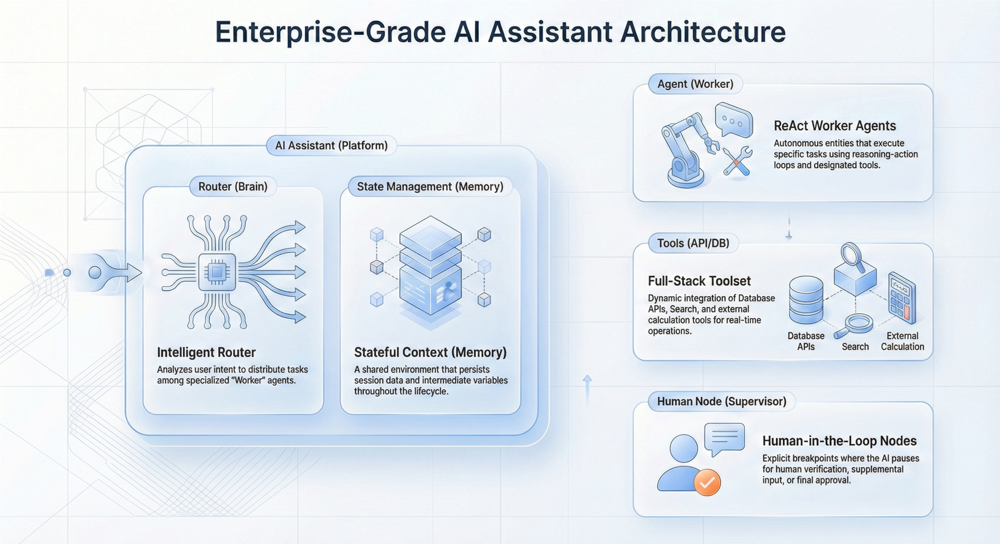

The transition from simple "chatbot" interfaces to complex **AI Agents** is redefining enterprise software architecture. While a single LLM call can handle a basic query, real-world business processes—like automated grading, loan approval, or technical support—require a team of specialized agents working in concert.

This architectural shift introduces significant complexity. Developers must now manage **multi-agent collaboration**, maintain conversation state across long-running processes, and critically, integrate **human-in-the-loop (HITL)** mechanisms to ensure safety and accuracy.

In this deep dive, we explore how to move beyond rigid code-based chains to flexible, visual orchestration of AI Assistants, focusing on routing, function execution, and seamless human-AI handoffs.

<!--truncate-->

## The Architecture of an Enterprise AI Assistant

In modern **AI native** development, an "AI Assistant" is not just a prompt wrapper; it is a stateful runtime container that orchestrates multiple Actors (Agents) and Tools to achieve a goal.

Unlike linear chains, production-grade assistants often require a graph-based architecture where execution can loop, branch, and pause.

### Core Components of the Flow

1.  **The Router (The "Brain"):** Analyzes user intent and directs the request to the appropriate specialist Agent.
2.  **The Agents (The "Workers"):** Autonomous entities equipped with specific tools (Database APIs, Search, Calculators) executing in a ReAct (Reasoning + Acting) loop.
3.  **State Management (The "Memory"):** A shared context that persists data (User Input, Node Outputs, Intermediate Variables) across the entire session.
4.  **Human Nodes (The "Supervisor"):** Explicit breakpoints where the AI pauses execution to request human confirmation or additional input.

## Visual Orchestration: Moving Beyond "Spaghetti Code"

Hard-coding multi-agent interactions often leads to brittle systems that are hard to debug. Visual orchestration abstracts this complexity, allowing developers to treat Agents, Functions, and Logic as composable nodes.

### 1. Intelligent Routing

The **Router Node** acts as the traffic controller. Instead of hard-coded `if/else` statements, it uses an LLM to classify input semantics dynamically. For example, a router can distinguish between a user asking to "reset password" (routing to an IT Support Agent) versus "upgrade license" (routing to a Sales Agent).

### 2. The ReAct Agent Node

Within the flow, an **AI Agent Node** encapsulates the prompt, model configuration, and accessible tools. It operates autonomously to solve its assigned sub-task.

- **Tools:** Can include database queries, API calls, or document retrievers.
- **Feedback Loop:** The agent observes the output of its tools and decides whether to continue reasoning or return a final answer.

### 3. Human-in-the-Loop (HITL) Integration

For enterprise applications, full autonomy is often risky. **Human Interaction Nodes** allow the workflow to pause and "call back" to the UI.

- **Action in Conversation:** The assistant renders a confirmation card in the chat interface (e.g., "I am about to refund order #123. Confirm?").
- **Action in Page:** The assistant triggers a modal or highlights a component on the user's screen, waiting for a specific UI event before proceeding.

## Implementation Playbook: Building a "Collaborative Grading Assistant"

Let's walk through building a practical **AI Assistant** that helps teachers grade student essays. This requires collaboration between an AI (for analysis) and a human (for final grade validation).

### Step 1: Define the Agents

Create a specialized **Grading Agent** with the system prompt: *"You are an expert academic grader. Analyze the text for grammar, coherence, and argument strength. Output a score out of 100 and brief comments."*

### Step 2: Orchestrate the Flow

Using a visual editor, connect the nodes:

1.  **Start Node:** Receives the student's essay text.
2.  **AI Agent Node (Grading):** Processes the text and outputs a suggested score and critique.
3.  **Human Interaction Node (Confirm):** Pauses execution. Displays the AI's suggestion to the teacher.
    - *Branch A (Approved):* Teacher accepts the score.
    - *Branch B (Rejected/Edited):* Teacher modifies the score manually.

4.  **Function Node (Save):** Writes the final confirmed score to the `Answer Sheet` database table.

### Step 3: Bind to User Interface

The power of this pattern lies in the **AI-UI Handshake**. The "Human Interaction Node" isn't just a backend pause; it triggers a specific UI state.

- When the flow hits the **Confirm** node, the frontend receives a `waiting` event.
- The UI renders a form pre-filled with the AI's suggested grade.
- When the teacher clicks "Submit", the frontend sends the `resume` signal with the final data, and the backend flow completes the database update.

## Comparison: Code-First vs. Visual Orchestration

| **Feature**           | **Traditional Code-Based Frameworks**                                          | **Visual Orchestration (JitAi)**                                           |
| --------------------- | ------------------------------------------------------------------------------ | -------------------------------------------------------------------------- |
| **Flow Design**       | Defined in Python/JS code (e.g., chains). Hard to visualize complex branching. | Drag-and-drop nodes. Immediate visibility of logic and data paths.         |
| **State Management**  | Manual handling of memory/history. Complex persistence setup.                  | Built-in state engine. Data automatically passed/stored between nodes.     |
| **Human-in-the-Loop** | Requires custom interrupt logic and webhook handling.                          | Native "Human Interaction" nodes that pause/resume flows out-of-the-box.   |
| **Tool Integration**  | Manual API wrapping and schema definition.                                     | Auto-discovery of system functions (Services/Models) as tools.             |
| **UI Integration**    | Loosely coupled. UI must poll or manage complex WebSocket states.              | Event-driven. Nodes trigger specific frontend events (e.g., `open_modal`). |

## How JitAi Addresses This

**JitAi** provides a comprehensive **AI Assistant** element that natively integrates visual orchestration with your application's business logic. Unlike standalone AI builders, JitAi's assistants are fully aware of your application's structure (JAAP protocol).

- **Unified Graph Engine:** JitAi uses a graph-based execution engine (conceptually similar to LangGraph) but exposes it through a no-code/low-code visual interface. You can drag an **AI Agent Node**, bind it to a **Knowledge Base**, and connect it to a **Service Function** without writing boilerplate glue code.
- **Deep UI/AI Collaboration:** JitAi breaks the barrier between backend AI and frontend UI. An assistant can pause its flow, trigger an **Action in Page** event, wait for the user to click a button or fill a form in the React/Vue frontend, and then resume execution with the new data.
- **Full-Stack Awareness:** Because JitAi understands your Data Models and Services, these can be added as **Tools** to any Agent with a single click. The platform automatically handles permission control and schema generation for the LLM.

## How to Verify / Reproduce

To experience visual orchestration of multi-agent flows:

1.  **Download JitNode:** Install the desktop version of JitAi to get the local development environment.
2.  **Create an AI Assistant:** In the JitAi IDE, navigate to `AI Assistants` -> `New Generic AI Assistant`.
3.  **Add Nodes:** Drag an **AI Agent Node** and a **Human Interaction Node** onto the canvas.
4.  **Configure Tools:** Select an existing Data Model (e.g., "Customer Table") and add it as a tool to the Agent.
5.  **Test:** Use the built-in debug chat window to send a request. Watch the flow highlight active nodes in real-time as it processes your input, pauses for confirmation, and executes the final database write.

## FAQ

**Q: What is the difference between an AI Agent and an AI Assistant in this context?**

A: An **AI Agent** is a task-specific worker focused on execution (reasoning + tools). an **AI Assistant** is the higher-level orchestrator (the flow) that manages user interaction, routes tasks to different Agents, and handles state across the session.

**Q: Can I use custom Python code within the visual flow?**

A: Yes. You can use **Function Nodes** to execute any backend Python logic (Service Functions). These functions can be purely algorithmic or call external APIs.

**Q: How is data passed between nodes?**

A: The Assistant maintains a **Runtime State**. Each node reads inputs (like `userInput`) from this state and writes its results (e.g., `agentOutput`) back to it. You can inspect and modify this state during debugging.

## Conclusion

Visual orchestration transforms the development of **multi-agent systems** from a complex coding challenge into a structured architectural process. By leveraging visual flows for routing and state management, developers can build robust **AI Assistants** that seamlessly blend autonomous AI capabilities with necessary human oversight.

**Ready to build your first orchestrated AI Assistant?**

[Download JitAi Desktop](https://jit.pro/download) | [View the Orchestration Tutorial](https://jit.pro/docs/tutorial)
