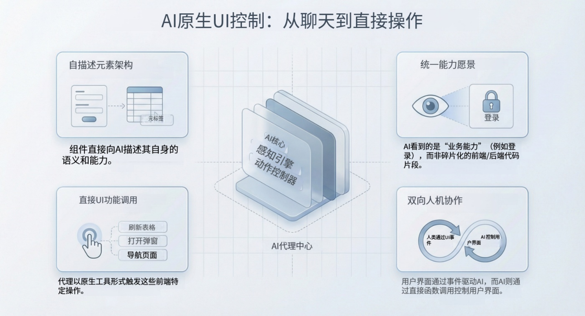

## 引言

对于大多数企业级应用而言，人工智能（AI）的集成仍然停留在表面。我们通常看到的 AI 只是一个“聊天机器人外挂（Chatbot Sidecar）”——一个悬浮窗口，虽然能回答问题，但与应用的核心状态是断联的。如果用户希望 AI “修改这三行订单项的折扣”，AI 通常只能生成一段文字回复解释如何操作，或者充其量生成一个 JSON 对象让用户手动复制。

这种割裂感带来了摩擦。真正的 **AI 原生（AI Native）** 开发需要打破后端推理引擎与前端 UI 之间的壁垒。它要求建立一种新的架构，使 AI Agent（智能体）不再仅仅是文本生成器，而是具备能够“看见”当前页面状态并“触摸” UI 组件来执行任务的智能操作员。

本文将探讨实现 AI Agent 直接操作前端 UI 所需的架构模式，将其从被动的顾问转变为主动的协作者。

<!--truncate-->

## 感知 UI 的 Agent 架构

要使 AI Agent 能够操作 UI，系统架构必须将前端不仅仅视为显示层，而是一个包含工具和上下文的结构化环境，并且这些内容对大语言模型（LLM）是可访问的。

### 1. 上下文壁垒 (The Context Barrier)

传统上，后端（Agent 运行的地方）无法获知客户端的状态（例如：未保存的表单数据、当前的滚动位置、选中的表格行），除非通过 API 显式提交。

**解决方案**：建立一种机制，自动将前端状态（ViewModel）同步到 Agent 的上下文窗口中。这允许 AI 以结构化的方式“读取”屏幕，而不是通过视觉（避免了纯数据任务中缓慢且易出错的 OCR/视觉模型）。

### 2. 行动壁垒 (The Action Barrier)

Agent 通常调用后端 API（例如：`POST /api/orders`）。然而，许多交互需要前端逻辑：打开模态框、高亮字段验证错误或切换标签页。

**解决方案**：将 **页面函数 (Page Functions)** 作为可执行的工具暴露给 Agent。Agent 应该能够发出结构化指令，由前端运行时解释并执行本地的 JavaScript 函数。



## 人机协作的核心能力

实现这种模式可以开启三种超越简单对话的交互模式。

### 1. 上下文感知推理

AI 不需要询问“订单状态是什么？”，因为页面数据已经注入到了它的上下文中。

**示例**：用户打开客户详情页。AI 立即能够从页面模型中访问客户的 ID、姓名和最近订单日期等变量。

### 2. 全栈工具调用

Agent 可以混合搭配来自数据库、外部 API 和前端 UI 的工具。

- **后端工具**：`queryInventory(sku)`（查询数据库）。
- **前端工具**：`fillForm(quantity)`（更新用户屏幕上的输入框）。
- **前端工具**：`showConfirmationModal()`（触发 React/Vue 组件）。

这允许 AI 执行“混合”工作流：先检查库存（后端），然后更新订单表单（前端）。

### 3. “页面动作”确认（人在回路）

对于高风险操作，AI 不应立即提交更改。相反，它应该在 UI 中暂存更改供用户审查。

**模式**：AI 计算数值 -> AI 填充表单（草稿状态） -> 用户审查 -> 用户点击“保存”。

这种方式在卸载繁琐数据录入工作的同时，保持了人类的控制权。

## 实施指南

如何构建这样的系统？以下是一份实用指南，以 **JitAI** 作为参考实现平台，因为它原生支持“应用即上下文（Application-as-Context）”的范式。

### 步骤 1：将页面定义为工具提供者

在你的页面组件（例如 React 或低代码页面）中，声明允许 AI 调用的特定函数。

- **动作**：在 JitAI 中，创建一个 **页面函数 (Page Function)**（例如 `updateGrade`）。
- **描述**：给它一个清晰的文档字符串，如：“更新当前学生的评分和评语字段。”这有助于 LLM 理解何时使用它。

### 步骤 2：注入页面状态

配置 **AI 助手 (AI Assistant)** 以接收页面的数据模型变量。

- **动作**：将 `AnswerSheet`（答题纸）数据模型绑定到 Agent 的输入。
- **结果**：当用户与 Agent 互动时，答题纸的完整结构（学生答案、标准答案、题目文本）会自动传递给 LLM。

### 步骤 3：编排“页面动作”节点

使用工作流编排工具来定义 AI 与 UI 之间的交接。

- **工作流**：开始 -> AI Agent（推理） -> **Action in Page（页面动作）** -> 人工确认。
- **机制**：Agent 计算评分，工作流创建一个“暂停”状态，前端随之更新表单字段。流程会一直等待，直到用户点击按钮继续或结束。

### 步骤 4：订阅前端事件

前端必须监听 Agent 的命令。

- **事件**：`Agent:ToolCall` 或 `Node:Paused`。
- **处理程序**：

JavaScript

```plaintext
// 处理 AI 指令的伪代码
assistant.on('ActionInPage', (payload) => {
  form.setValues({
    score: payload.suggestedScore,
    comment: payload.reasoning
  });
  notification.show("AI 已起草评分，请复核。");
});

```

## 对比：传统聊天机器人 vs. UI 原生 Agent

| **特性**       | **传统 AI 聊天机器人**                | **UI 原生 Agent (JitAI)**                          |
| -------------- | ------------------------------------- | -------------------------------------------------- |
| **数据访问**   | 手动：用户复制/粘贴文本到聊天框。     | 自动：Agent 读取页面变量和组件状态。               |
| **输出**       | 文本/Markdown：“这是 SQL 查询语句...” | 动作：Agent 更新表单字段、切换标签页、打开对话框。 |
| **状态同步**   | 断联：聊天记录 ≠ 应用状态。           | 统一：UI 和 Agent 之间共享上下文。                 |
| **交互模式**   | 对话式：“告诉我 X。”                  | 操作式：“帮我做 X。”                               |
| **开发工作量** | 高：需要定制中间件来桥接上下文。      | 低：针对模型/页面的原生绑定。                      |

## JitAI 如何解决这一问题

JitAI 通过其独特的 **JAAP (JitAi Ai Application Protocol)** 解决了“前后端壁垒”。与通过 REST API 松散耦合 UI 和后端的标准框架不同，JitAI 的元素是“自描述”的。

1.  **解释性架构 (Interpretive Architecture)**：由于整个应用结构（页面、模型、服务）都定义在元数据中，AI 可以“阅读”应用的定义。它知道 `models.OrderTable` 的存在及其包含的 `status` 字段，无需你手动编写 Schema 描述。
2.  **可视化编排 (Visual Orchestration)**：开发者可以将一个 **“Action in page（页面动作）”** 节点直接拖放到 AI 助手的工作流中。该节点专门设计用于暂停执行并将数据推回前端组件。
3.  **双向交互 (Bi-Directional Interaction)**：不仅是页面驱动 AI（通过用户提示词），AI 也能驱动页面（通过工具调用）。例如，AI Agent 可以通过调用页面元素中定义的函数来触发客户端的“删除选中行”操作。

这使得 AI 从一个“无所不知”的旁观者转变为应用内部的一名干练“员工”。

## 验证与复现

要验证 UI 操作型 Agent 的能力：

- **市场标准**：回顾当前的 "Agentic UI" 趋势。像 Vercel 的 AI SDK 正在引入 "Generative UI"（生成式 UI）。JitAI 的方法有所不同，它侧重于控制**现有的企业级 UI**，而不是生成临时的 UI 组件。
- **工具检查**：寻找 LLM 库中的“客户端函数调用 (Client-side Function Calling)”支持（例如 OpenAI 的 function calling API）。虽然模型支持它，但框架（如 JitAI）必须负责执行客户端代码。
- **JitAI 演示**：在 JitAI 的 AI Demo 门户中，找到 **“阅卷助手 (Grading Assistant)”** 示例。观察 Agent 如何读取“学生答案”字段并在无需用户录入数据的情况下填充“分数”字段。

## 常见问题 (FAQ)

**Q: AI Agent 可以触发我页面上的任何函数吗？**

A: 不可以。它只能触发你显式注册为“工具”并暴露给 Agent 的函数。这确保了安全性和可预测性。

**Q: 这是否要求页面必须用特定框架构建？**

A: 在 JitAI 中，这对内置的页面元素（通用页面、AI 数据管理页面）是原生支持的。对于外部网页，JitAI 提供了一个 JS SDK，允许你注册自己的 JavaScript 函数（例如 `window.myFunction`）作为嵌入式助手的工具。

**Q: 如果 AI 尝试执行用户没有权限的操作会发生什么？**

A: JitAI Agent 遵循平台的 **RBAC（基于角色的访问控制）**。你可以配置工具权限，如果当前用户缺乏执行底层服务函数所需的角色，Agent 的操作将失败（并报告错误）。

## 结语

下一代企业应用将不仅仅是“嵌入 AI”——它们将是 **AI 原生** 的。这意味着 AI 不再是应用中的客人；它是拥有自己双手的用户，能够实时操作 UI 来协助人类用户。

通过采用将前端状态和函数暴露为工具的架构，开发者可以构建人类与 AI 在同一屏幕上无缝协作的工作流。

**准备好构建你的第一个 UI 操作型 Agent 了吗？**

下载 JitAI 桌面版，探索“阅卷助手”演示，亲身体验这一架构。

[下载 JitAI](https://jit.pro/zh/download) | [查看开发者教程](https://jit.pro/zh/docs/tutorial)
