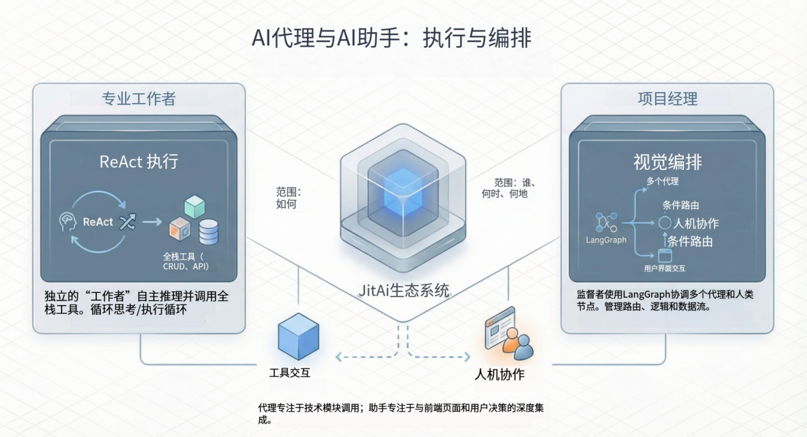

import Head from "@docusaurus/Head";

export const jsonLd = {
"@context": "https://schema.org",
"@graph": [
{
"@type": "Organization",
"@id": "https://jit.pro/#organization",
"name": "JitAI",
"legalName": "武汉万云网络科技有限公司",
"url": "https://jit.pro/",
"logo": {
"@type": "ImageObject",
"url": "https://jit-www.oss-accelerate.aliyuncs.com/logo/logo.svg"
},
"sameAs": [
"https://forum.jit.pro/",
"https://github.com/jitai-team",
"https://x.com/JitAi2017",
"https://www.instagram.com/jitai_2017",
"https://www.youtube.com/channel/UClvTNJPvBhek3aFuDy87RJQ",
"https://www.facebook.com/people/JitAi/61581485995674",
"https://www.linkedin.com/company/jitai2017"
]
},
{
"@type": "WebSite",
"@id": "https://jit.pro/#website",
"name": "JitAI",
"url": "https://jit.pro/",
"publisher": {
"@id": "https://jit.pro/#organization"
},
"inLanguage": [
"en",
"zh-CN"
]
},
{
"@type": "Blog",
"@id": "https://jit.pro/zh/blog#blog",
"name": "Blog",
"url": "https://jit.pro/zh/blog",
"isPartOf": {
"@id": "https://jit.pro/#website"
},
"publisher": {
"@id": "https://jit.pro/#organization"
},
"inLanguage": "zh-CN"
},
{
"@type": "WebPage",
"@id": "https://jit.pro/zh/blog/ai-agents-vs-ai-assistants-enterprise-2026#webpage",
"url": "https://jit.pro/zh/blog/ai-agents-vs-ai-assistants-enterprise-2026",
"name": "AI Agents vs AI Assistants：企业在 2026 年需要什么",
"description": "用可落地的方式定义 AI agent（智能体）与 AI assistant（助手），解释两者在企业工作流中的差异与价值，并给出用 LLM 交付可治理结果的建设路径。",
"isPartOf": {
"@id": "https://jit.pro/#website"
},
"breadcrumb": {
"@id": "https://jit.pro/zh/blog/ai-agents-vs-ai-assistants-enterprise-2026#breadcrumb"
},
"inLanguage": "zh-CN"
},
{
"@type": "BreadcrumbList",
"@id": "https://jit.pro/zh/blog/ai-agents-vs-ai-assistants-enterprise-2026#breadcrumb",
"itemListElement": [
{
"@type": "ListItem",
"position": 1,
"name": "首页",
"item": "https://jit.pro/zh/"
},
{
"@type": "ListItem",
"position": 2,
"name": "博客",
"item": "https://jit.pro/zh/blog"
},
{
"@type": "ListItem",
"position": 3,
"name": "AI Agents vs AI Assistants：企业在 2026 年需要什么",
"item": "https://jit.pro/zh/blog/ai-agents-vs-ai-assistants-enterprise-2026"
}
]
},
{
"@type": "BlogPosting",
"@id": "https://jit.pro/zh/blog/ai-agents-vs-ai-assistants-enterprise-2026#blogposting",
"mainEntityOfPage": {
"@id": "https://jit.pro/zh/blog/ai-agents-vs-ai-assistants-enterprise-2026#webpage"
},
"url": "https://jit.pro/zh/blog/ai-agents-vs-ai-assistants-enterprise-2026",
"headline": "AI Agents vs AI Assistants：企业在 2026 年需要什么",
"name": "AI Agents vs AI Assistants：企业在 2026 年需要什么",
"description": "用可落地的方式定义 AI agent（智能体）与 AI assistant（助手），解释两者在企业工作流中的差异与价值，并给出用 LLM 交付可治理结果的建设路径。",
"datePublished": "2026-02-03T00:00:00.000Z",
"dateModified": "2026-02-03T00:00:00.000Z",
"inLanguage": "zh-CN",
"isPartOf": {
"@id": "https://jit.pro/zh/blog#blog"
},
"author": {
"@id": "https://jit.pro/#organization"
},
"publisher": {
"@id": "https://jit.pro/#organization"
},
"image": [
"https://jit-www.oss-accelerate.aliyuncs.com/logo/logo_dark.svg"
],
"keywords": [
"AI agent",
"AI 助手",
"代理人工智能",
"大型语言模型",
"工具调用",
"流程编排",
"企业人工智能治理",
"检索增强生成"
],
"timeRequired": "PT12M"
},
{
"@type": "FAQPage",
"@id": "https://jit.pro/zh/blog/ai-agents-vs-ai-assistants-enterprise-2026#faq",
"isPartOf": {
"@id": "https://jit.pro/zh/blog/ai-agents-vs-ai-assistants-enterprise-2026#webpage"
},
"inLanguage": "zh-CN",
"mainEntity": [
{
"@type": "Question",
"name": "我需要同时有 AI assistant 和 AI agent 吗？",
"acceptedAnswer": {
"@type": "Answer",
"text": "很多团队会同时采用。assistant 负责意图捕获与透明呈现，agent 负责后台执行、重试与闭环跟进。混合形态也更利于分阶段提升自主性并控制风险。"
}
},
{
"@type": "Question",
"name": "什么时候用“agent”会显得过重？",
"acceptedAnswer": {
"@type": "Answer",
"text": "当工作主要是阅读、总结、起草、推荐，执行仍由用户完成时，assistant 加少量受限动作往往更快落地，治理与运营成本也更低。"
}
},
{
"@type": "Question",
"name": "最值得先加的“agentic”能力是什么？",
"acceptedAnswer": {
"@type": "Answer",
"text": "优先建立“任务记录 + 分步执行 + 全量日志”。明确状态与可回放轨迹会显著提升可靠性、可审计性与调试效率，即使自主性设置得很保守也有效。"
}
},
{
"@type": "Question",
"name": "如何在生产环境评估 AI agent？",
"acceptedAnswer": {
"@type": "Answer",
"text": "使用工作流级指标：完成率、异常率、完成时长、单任务成本、事故率；同时建设离线回归测试集，用真实流程抽样覆盖常见路径与高风险边界。"
}
},
{
"@type": "Question",
"name": "RAG 对 agent 也重要吗？",
"acceptedAnswer": {
"@type": "Answer",
"text": "重要。agent 需要基于可追溯的上下文来规划步骤与给出可解释理由；在此基础上，还要配套工具治理与编排机制，保证行动在权限、策略与审批边界内发生。"
}
}
]
}
]
}

<Head>
    
</Head>

“AI agent（智能体）”与“AI assistant（助手）”经常被混用，但它们对应的产品行为、风险特征与建设路径并不相同。对于正在评估 AI 低代码平台与企业开发平台的团队，先把术语讲清楚，后续在架构选择、治理控制与指标设计上会更稳、更可复用。

本文用可落地的方式定义“AI agent”和“AI assistant”，说明区分它们在企业工作流中的关键价值，并给出一条用 LLM 交付“可治理结果”的清晰路径。

<!--truncate-->

## 术语为什么会变得混乱

市场在很短时间内从“能回答问题的聊天机器人”推进到“能规划步骤、调用工具、更新记录”的系统。很多产品把两种能力混在一起：前台是对话式助手，后台是带自动化特征的智能体执行。

这种组合很实用，但也会把责任边界变得模糊。一旦系统能够改变业务状态（工单、订单、审批、权限），那么“它如何做决策”和“谁授权它这么做”会变成产品层面的硬需求，而不再是实现细节。

## 可直接复用在架构评审中的定义

### AI assistant：以对话为中心、用户在环的帮助

AI assistant 以交互为主。它响应用户提示，解释、起草、总结、检索内部知识；在明确指令下，它也可以执行边界清晰的动作。

在多数企业落地中，assistant 的能力来源于“上下文”与“约束”：通过 RAG 读取你的文档与知识库，同时用权限与确认机制把动作限定在安全范围内。它非常适合知识型工作与“引导式生产力”。

### AI agent：以目标为中心、具备规划与工具调用的执行

AI agent 以目标为主。你给它一个目标（或它从请求中推导目标），它可以拆解步骤、选择工具、收集信息，并通过多步动作把流程推进到结果。

智能体通常依赖一个编排层（工具注册、策略、审批、重试、日志），因为它的核心价值不在“一次回答”，而在“完成一条工作流”。

### Agentic AI：更像连续谱，而非二选一

现实中，自主性可以像旋钮一样调节。很多生产系统只做有限的“agentic”：能规划并调用工具，同时对高影响操作（付款、授权、记录更新）保留人工审批。

用“自主等级”去思考，有助于安全交付：先从只读辅助开始，再加入受限写回，再扩展到在可证明安全、可审计的范围内提升自主性。

## 企业为什么现在更在意这件事

有两股力量推动“assistant → agent”的演进。

第一，采用正在从试验走向规模化。一项 2025 年全球调研显示，23% 的受访者表示其组织已在至少一个职能中规模化 agentic AI，另有 39% 正在试验 AI agents。

第二，投资与市场预期快速抬升，但口径不同会导致预测差异。比如，有估算把 AI agents 市场规模定在 2025 年约 78.4 亿美元，并预测 2030 年约 526.2 亿美元；另一个估算把 “agentic AI” 细分市场定在 2025 年约 72.9 亿美元，未来也呈现快速增长。数字会因定义不同而变化，但方向一致：具备“行动能力”的系统正在成为主流企业品类。

## 一个可落地的能力模型：assistant 与 agent 在生产环境里哪里不同

如果你在构建或采购平台，下列差异会直接体现在落地阶段。

1.  意图处理  
    Assistants 更关注“答案质量”和“用户满意度”。Agents 更关注“任务完成”，往往跨越多步与更长时间跨度。
2.  状态与记忆  
    Assistants 可以在每次对话里近似无状态，外加可选短期记忆。Agents 需要明确状态：任务记录、步骤历史、工具结果、重试与检查点。
3.  工具体系  
    Assistants 通常只调用少量工具（搜索、总结、起草、创建工单）。Agents 需要可治理的工具目录，包含权限、schema、限流与沙箱。
4.  错误恢复  
    Assistants 可以回问用户澄清。Agents 需要检测失败、在安全边界内重试、升级给人类处理，并留下可审计轨迹。
5.  安全与治理  
    Assistants 常借助 UI 约束。Agents 需要系统级控制：工具调用前的策略校验、审批门禁、对动作的全链路可观测。

## 团队真正会交付的产品形态

### 助手形态：“AI 在界面里”

这通常是最常见的起步方式：把 assistant 嵌入产品 UI 或门户，帮助用户找信息、起草内容、生成结构化输出、导航复杂系统。

对企业开发平台而言，助手形态往往与这些能力结合效果更好：

- 对文档、工单、Runbook、政策与规范做 RAG
- “答案 + 来源”结构，提升可验证性
- 动作范围窄、需要确认的写回（创建记录、发起请求、生成邮件草稿）

这条路线往往能最快获得可量化价值，同时把运营风险压到较低水平。

### 智能体形态：“AI 在工作流引擎里”

当真实痛点来自跨系统、跨步骤的协调（分流、路由、审批、异常处理、跟进闭环）时，agent 形态会更有吸引力。

在企业场景里，agents 通常需要：

- 能可靠运行步骤的工作流/编排层
- 与组织对齐的权限模型（RBAC/ABAC）
- 对高影响步骤的人在环门禁
- 日志、回放、评测体系，用于持续改进

这也是 AI 原生低代码平台能发挥价值的地方：如果平台把数据模型、流程、权限与审计日志作为一等能力，交付 agent 行为会更易治理，脚本与提示词的“外挂式拼接”会更少。

## 如何选择 assistant 还是 agent：决策清单

用这些问题来选“足够简单且能跑通”的方案。

适合从 AI assistant 开始的情况：

- 工作主要是阅读、总结、起草、解释
- 成功标准是“用户完成得更快”，而不是“系统自主完成”
- 写回动作很少、可逆，或总是需要用户确认
- 你希望快速上线，治理成本尽量低

适合向 AI agent 迁移的情况：

- 工作流跨多个系统、角色与交接点
- 步骤可重复，可被编码为策略与工具
- 你能定义动作的安全边界（能改什么、何时改、怎么改）
- 你更需要可靠性能力（重试、排队、升级）而不是更漂亮的聊天界面

适合采用混合模式的情况：

- 用户希望有对话式前端
- 运营侧需要后台完成、监控与异常处理

成熟的企业落地通常会收敛到这种混合：assistant 负责意图捕获与透明呈现，agent 负责执行与闭环跟进。

## 可复用的企业架构参考

下面是一种跨平台、跨行业都适用的参考模式。

1.  可治理的上下文层

- 知识检索与来源追踪
- 数据访问策略（行/字段级控制）
- PII 处理规则与必要的脱敏

1.  工具与动作层

- 工具显式化、版本化、schema 校验
- 每个工具都有权限、限流与安全默认值
- 高风险工具需要审批或双人控制

1.  编排层

- 任务状态机：queued → running → blocked → completed → failed
- 带护栏的重试与升级路径
- 全量日志：提示词、工具入参/出参、决策、审批

1.  评测与运营层

- 离线回归测试集
- 在线监控漂移、失败模式与成本
- 反馈闭环，用于更新提示词、工具与策略

如果你希望用 AI 原生低代码环境快速把这些积木搭起来，[JitAI 教程](https://jit.pro/zh/docs/tutorial) 会以贴近平台概念的方式讲解，能自然映射到 assistant 与 agent 两类产品形态。

## 治理：从第一天就按可审计来设计

当系统从“帮我写”走向“帮我做”，治理会成为必选项。

国际标准与监管信号越来越强调 AI 系统的生命周期控制、风险管理、透明性与责任机制。ISO/IEC 42001 给出了 AI 管理体系（AIMS）的要求，许多组织把它当成规模化部署 AI 的实用治理参照。

同时，欧盟《AI 法案》（EU AI Act）等监管也让全球团队把 AI 治理当作产品需求来对待，因为义务与时间线可能会因运营地区与系统类型而触发。

面向 agents 的一个务实治理基线包括：

- 工具访问最小权限（默认不授予“管理员级”能力）
- 敏感操作的职责分离（审批门禁）
- 每次动作与工具调用的不可篡改日志
- 明确回退机制：安全停止、升级处理、可回滚
- 针对代表性工作流的定期评测，包含对抗性测试

## 实施路线：从 assistant 走向 agent，同时避免失控

成功的团队通常按阶段交付。

阶段 1：只读 assistant（2–6 周）

- 对内部知识做 RAG
- “回答 + 引用”模式
- 安全与隐私护栏
- 指标：节省时间、分流率、用户满意度

阶段 2：带受限动作的 assistant（4–10 周）

- 少量安全工具（生成工单草稿、填表、生成检查清单）
- 写回前必须显式确认
- 指标：周期缩短、交接减少、错误降低

阶段 3：带审批的 agent（8–16 周）

- 多步计划与任务编排
- 高风险步骤的人在环门禁
- 日志、重试、升级
- 指标：完成率、异常率、平均解决时长

阶段 4：更高自主与多智能体协作（持续迭代）

- 按领域拆分的专用 agents（支持、财务运营、IT 运营）
- 任务路由与负载均衡协作
- 更强的评测与变更管理

如果你希望在一个“可治理地基”上快速原型（模型、工作流、权限与可观测性），你可以 [试用 JitAI](https://jit.pro/zh/download)，把平台运行时作为“AI 动作转化为可观察系统行为”的载体。

## 常见失败模式（以及预防方法）

边界不清  
如果你无法一句话说清 AI 被允许改动什么内容，自动化就会变得不安全。先定义工具作用域、权限与审批规则，再提升自主性。

工具泛滥  
让 agent “什么都能调用”会导致不可预测。保持工具目录小而精，新增工具前先有测试与监控。

静默错误  
系统如果不记录工具输出、重试与决策，就无法调试与审计。日志要覆盖可回放所需的关键要素。

指标选错  
Assistants 常用“回答质量”来衡量。Agents 需要用工作流结果来衡量：完成率、延迟、成本、事故率。

## 三个企业场景，让差异更直观

场景 1：客服分流与预处理

- Assistant：总结对话、检索知识库、起草回复、建议下一步
- Agent：创建工单、路由到正确队列、补齐缺失字段、安排跟进，在条件满足时更新状态
- 治理：退款、权益、政策例外需要审批门禁

场景 2：报价到回款（Quote-to-Cash）异常处理

- Assistant：解释发票失败原因、起草客户沟通、建议修复步骤
- Agent：收集缺失数据、按规则校验、更新 ERP/CRM 记录、通知相关方
- 治理：严格权限；财务入账动作采用双人控制

场景 3：访问权限申请与开通

- Assistant：起草申请、解释最小权限选项、校验政策
- Agent：编排审批、通过工具开通权限、验证成功、记录证据
- 治理：审计日志、职责分离、自动撤权触发机制

## FAQ

### 我需要同时有 AI assistant 和 AI agent 吗？

很多团队会同时采用。assistant 让系统更易用、更透明，agent 负责后台执行与闭环跟进。混合形态也更利于逐步提升自主性并控制风险。

### 什么时候用“agent”会显得过重？

当工作主要是阅读、起草、推荐，执行仍由用户完成时，assistant 加少量受限动作往往更快、更稳。

### 最值得先加的“agentic”能力是什么？

一个带逐步执行与日志的任务记录。哪怕自主性很低，明确状态与日志也能显著提升可靠性、可审计性与调试效率。

### 如何在生产环境评估 AI agent？

用工作流级指标：完成率、异常率、完成时长、单任务成本、事故率；再配合从真实流程抽样构建的离线回归测试集。

### RAG 对 agent 也重要吗？

重要。agents 也需要“有根据的上下文”来正确规划并给出可解释理由。差别在于 agents 还需要工具治理与编排机制来安全行动。
