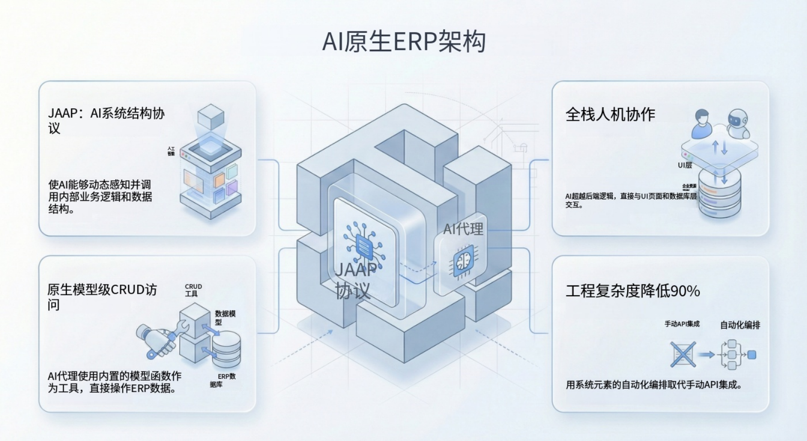

import Head from "@docusaurus/Head";

export const jsonLd = {
"@context": "https://schema.org",
"@graph": [
{
"@type": "Organization",
"@id": "https://jit.pro/#organization",
"name": "JitAI",
"legalName": "武汉万云网络科技有限公司",
"url": "https://jit.pro/",
"logo": {
"@type": "ImageObject",
"url": "https://jit-www.oss-accelerate.aliyuncs.com/logo/logo.svg"
},
"sameAs": [
"https://forum.jit.pro/",
"https://github.com/jitai-team",
"https://x.com/JitAi2017",
"https://www.instagram.com/jitai_2017",
"https://www.youtube.com/channel/UClvTNJPvBhek3aFuDy87RJQ",
"https://www.facebook.com/people/JitAi/61581485995674",
"https://www.linkedin.com/company/jitai2017"
]
},
{
"@type": "WebSite",
"@id": "https://jit.pro/#website",
"name": "JitAI",
"url": "https://jit.pro/",
"publisher": {
"@id": "https://jit.pro/#organization"
},
"inLanguage": [
"en",
"zh-CN"
]
},
{
"@type": "Blog",
"@id": "https://jit.pro/zh/blog#blog",
"name": "Blog",
"url": "https://jit.pro/zh/blog",
"isPartOf": {
"@id": "https://jit.pro/#website"
},
"publisher": {
"@id": "https://jit.pro/#organization"
},
"inLanguage": "zh-CN"
},
{
"@type": "WebPage",
"@id": "https://jit.pro/zh/blog/ai-erp-database-7-day-query-analytics-checklist#webpage",
"url": "https://jit.pro/zh/blog/ai-erp-database-7-day-query-analytics-checklist",
"name": "AI + ERP 数据库：7 天查询与分析清单",
"description": "一份面向企业团队的 7 天清单，说明 AI 连接 ERP 数据库后如何在第一周把高频问题打磨为可复现查询，建立证据链、统一口径，并为异常监控设定基线。",
"isPartOf": {
"@id": "https://jit.pro/#website"
},
"breadcrumb": {
"@id": "https://jit.pro/zh/blog/ai-erp-database-7-day-query-analytics-checklist#breadcrumb"
},
"inLanguage": "zh-CN"
},
{
"@type": "BreadcrumbList",
"@id": "https://jit.pro/zh/blog/ai-erp-database-7-day-query-analytics-checklist#breadcrumb",
"itemListElement": [
{
"@type": "ListItem",
"position": 1,
"name": "Home",
"item": "https://jit.pro/"
},
{
"@type": "ListItem",
"position": 2,
"name": "Blog",
"item": "https://jit.pro/zh/blog"
},
{
"@type": "ListItem",
"position": 3,
"name": "AI + ERP 数据库：7 天查询与分析清单",
"item": "https://jit.pro/zh/blog/ai-erp-database-7-day-query-analytics-checklist"
}
]
},
{
"@type": "BlogPosting",
"@id": "https://jit.pro/zh/blog/ai-erp-database-7-day-query-analytics-checklist#blogposting",
"mainEntityOfPage": {
"@id": "https://jit.pro/zh/blog/ai-erp-database-7-day-query-analytics-checklist#webpage"
},
"url": "https://jit.pro/zh/blog/ai-erp-database-7-day-query-analytics-checklist",
"headline": "AI + ERP 数据库：7 天查询与分析清单",
"name": "AI + ERP 数据库：7 天查询与分析清单",
"description": "聚焦第一周可交付价值：把高频业务问题沉淀为查询级问题，输出可追溯证据链，设定异常基线，并给出从只读到受治理写回的演进路径。",
"datePublished": "2026-02-27T00:00:00.000Z",
"dateModified": "2026-02-27T00:00:00.000Z",
"inLanguage": "zh-CN",
"isPartOf": {
"@id": "https://jit.pro/zh/blog#blog"
},
"author": {
"@id": "https://jit.pro/#organization"
},
"publisher": {
"@id": "https://jit.pro/#organization"
},
"image": [
"https://jit-www.oss-accelerate.aliyuncs.com/logo/logo_dark.svg"
],
"keywords": [
"AI 数据库",
"ERP数据库查询",
"ERP数据分析",
"报表自动生成",
"异常检测",
"查询级问题",
"记录系统",
"语义模型",
"证据链",
"受治理写回",
"审批",
"审计链路"
],
"timeRequired": "PT12M"
},
{
"@type": "FAQPage",
"@id": "https://jit.pro/zh/blog/ai-erp-database-7-day-query-analytics-checklist#faq",
"isPartOf": {
"@id": "https://jit.pro/zh/blog/ai-erp-database-7-day-query-analytics-checklist#webpage"
},
"inLanguage": "zh-CN",
"mainEntity": [
{
"@type": "Question",
"name": "连接 ERP 数据库做 AI 分析，第一周最重要的产出是什么？",
"acceptedAnswer": {
"@type": "Answer",
"text": "把一组高频业务问题打磨成可复现的“查询级问题”：口径一致、关联路径稳定、过滤条件清晰，并且每个答案默认附带可回到明细的证据链。"
}
},
{
"@type": "Question",
"name": "需要先上数据仓库/数仓建模后再做吗？",
"acceptedAnswer": {
"@type": "Answer",
"text": "第一周通常不需要。多数信任问题来自口径、关联与权限边界，先在 ERP 只读层把问题做成可复现查询，再决定哪些数据需要复制到仓库做规模化与历史建模。"
}
},
{
"@type": "Question",
"name": "能直接让大模型对生产库生成并执行 SQL 吗？",
"acceptedAnswer": {
"@type": "Answer",
"text": "需要强约束与治理能力：权限感知执行、可审计日志、受控模板/语义层与可回放证据。缺少这些控制时，定义漂移与不可复核会显著拖慢采用。"
}
},
{
"@type": "Question",
"name": "异常检测应该放在什么时候做？",
"acceptedAnswer": {
"@type": "Answer",
"text": "在指标口径与查询稳定之后再做。先设定基线（季节性窗口、合理波动区间、物料性阈值），再叠加轻量监控与“证据打包”的排查路径，避免告警疲劳。"
}
},
{
"@type": "Question",
"name": "什么时候可以从只读走向写回？",
"acceptedAnswer": {
"@type": "Answer",
"text": "当团队能够稳定回答“哪里变了、为何变、由哪些交易造成”，并且审批、策略、审计链路与权限模型到位后，再逐步推进受治理写回。"
}
}
]
}
]
}

<Head>
    
</Head>

周五下午 4:57，运营负责人问：“这周准时发货率怎么掉了？”有人导出三份 ERP 数据，在表格里一顿合并，数字依旧对不上。十分钟后会议结束，结论停在猜测上，并留下一句“周一再深挖”。

本文的核心判断：**AI 连接 ERP 数据库要在第一周创造价值，关键在于把问题沉淀为可复现的查询**——定义一致、证据可追、异常有基线。第一周把这件事做扎实，团队才会逐步建立信任。

<!--truncate-->

## 第一周里，“AI 连接 ERP 数据库”该达成什么

很多 ERP 报表的痛点并非只源自缺少仪表盘，更常见的情况是**数据很难被稳定地提问**：

- 同一个问题问两次，结果可能不一致
- 指标波动出现后，难以讲清原因
- 缺少从答案回到明细的证据链

所以第一周的目标要足够聚焦、足够务实：把一组高频问题打磨成“**查询级问题**”——能够对应稳定的关联路径、清晰的过滤条件、可复用的业务口径。

同时第一周默认企业常见约束：ERP 数据库属于**记录系统（system of record）**。只读阶段用来建立可信度；写回会在更后面出现，并由审批与审计链路守住边界。

## 7 天查询与统计清单

### 第 1 天——验证连通性，先把“真相边界”划出来

把 ERP 数据库整理成 AI 可读的地图：关键表、主键、时间戳、数据归属边界（财务/运营/销售）。  
然后做一组“真值校验”：行数、关键汇总与既有报表对账。  
第 1 天的理想产出是几条可复用问题：例如“昨天到今天发生了哪些变化？”“关账后哪些记录还被修改过？”

### 第 2 天——主数据体检（只读模式下最快见效）

先稳住决定关联质量的实体：客户、供应商、物料、库位、科目表。  
用 AI 辅助查询定位重复、缺分类、状态过期、编码不一致等问题。  
当客户或物料维表不可靠，下游 KPI 很容易陷入争论。

### 第 3 天——订单到回款（O2C）：把承诺、发货、开票串起来

把订单状态 → 履约 → 开票 → 应收连成一条可解释链路。  
优先覆盖“在途事实”：超承诺日期未发货、已发货未开票、发票异常、按客群/区域的账龄。  
建议固定输出结构：答案 + 证据（单据 ID、时间戳、来源表）+ 简短原因叙述。

### 第 4 天——采购到付款（P2P）：卡关、拖延与现金消耗的来源

用查询把摩擦点拉出来：未收货的未结 PO、已收货未到票、发票与 PO 的价格差异、三单匹配异常。  
很多场景的价值来自“少扯皮、少升级”：系统能直接指到异常的单据与行项目。  
第一周的成功信号体现为异常闭环更快，而非图表更多。

### 第 5 天——库存与运营：小误差如何变成真金白银

库存问题往往跨多表：现存、出入库、分配、工单，有时还涉及质检。  
建立一组基线查询：缺货风险、呆滞库存、负库存事件、盘点差异、产线良率/损耗差异。  
当团队能持续回答“哪里变了、为何变、由哪些交易造成”，运营信任会快速累积。

### 第 6 天——财务与对账：让数字自己能说明白

财务更看重可重复性：先定义最小对账集合——分账到总账勾稽、过账状态异常、应计合理性检查、异常分录模式。  
此处也最需要基于角色的权限与证据打包，因为会触及敏感数据。  
当答案能明确指向交易与规则，“表格法庭”会逐步失去主导权。

### 第 7 天——异常基线与轻量监控

当查询级指标稳定后，设定基线：季节性窗口、合理波动区间、物料性阈值。  
再叠加轻量监控：发现异常时，直接打包排查路径——哪个指标变了、哪个切片解释了变化、哪些交易高度相关。  
这一步会把能力推向下一阶段：告警、流程，以及更后面的受治理写回。

## 这份清单与市场趋势的对应关系

有三条外部信号说明“AI + ERP 数据库”正在从实验走向路线图：

- Gartner 预测，到 2026 年，**最多 40% 的企业应用会内置面向具体任务的 AI Agents**，而 2025 年该比例低于 5%。
- McKinsey 的 2025 调研显示，**62% 的受访者表示其组织至少在试验 AI agents**。
- Gartner 同时预测，使用内嵌 AI 助手的云 ERP 财务组织，到 2028 年有望实现**财务关账速度提升 30%**。

这些信号反映采用在加速。瓶颈通常出现在 UI 下方：ERP 数据具有强关系结构、强口径约束、强权限边界。关联路径与证据链稳定后，团队才会把结果用于决策。

未来 12–18 个月，一个更常见的演进顺序会是：  
1）先做“可提问的 ERP”（自然语言 → 受治理查询）  
2）再把监控产品化（基线、异常分诊、证据打包）  
3）最后推进受治理写回（审批、策略、审计链路齐备）

## 常见误解与应对

误解：“AI 只要能连数据库，就能回答所有问题。”

现实中会出现两类高频失败：

- **定义漂移**：选错状态字段、时间窗口、关联路径，尤其是多年定制过的 ERP
- **缺少证据**：数值就算正确，团队也很难复核，采用进度会明显放慢

应对方法依赖产品纪律：问题进入查询级模式、默认附带证据、口径显式化。企业 AI 治理标准的影响力也在上升，例如 ISO/IEC 42001 提供了 AI 管理体系的框架，用于风险、责任与持续改进。

## JitAI 在这里的角色

如果你选择自研，往往会搭起同一套组件：数据库连通、语义模型、权限感知的查询执行、证据打包、审计链路。工程重点落在把 ERP 结构沉淀成可复用、可检查的能力。

JitAI 的设计方向与此一致：从既有数据库 Schema 生成模型元素，让“问题”能映射到受治理的方法与可复用查询模式，并在控制成熟后，从只读逐步演进到受治理动作。想看具体路径可以从[JitAI 教程](https://jit.pro/zh/docs/tutorial)开始。

当你已经跑通一组查询级工作流，下一步适合用沙箱连接，把这份 7 天清单对照你的 Schema 与报表口径逐条验证。你也可以[试用 JitAI](https://jit.pro/zh/download)用示例配置快速搭起可运行的验证环境。
