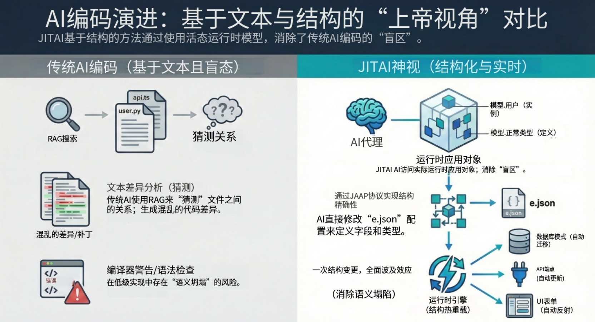

在当下的 AI 辅助开发领域，大多数“AI 编程”工具本质上只是复杂的文本补全引擎。它们基于本地文件缓冲区或检索到的代码片段（RAG）来预测下一个 token。虽然这种方法在生成样板代码（boilerplate）时行之有效，但它存在一个致命盲点：AI 看到的是文件，而不是系统。

对于资深开发者和架构师而言，这种局限性显而易见。AI 可以编写一个 Python 函数，但它很少理解这个函数如何影响全局数据模型、权限模式或前端组件层级。它缺乏一种“上帝视角”（God View）——即对运行中应用结构的整体、实时理解。

本文将探讨 JitAI 如何通过 JAAP（JitAi Application Protocol）和 MTI（Meta-Type-Instance）架构从根本上改变这一范式，将应用结构提升为 AI 可以原生理解、检查和修改的一等公民（first-class citizen）。

<!--truncate-->

## 盲点：为何“基于文件”的 AI 在复杂性面前失效

传统软件开发在意图（业务逻辑）和实现（分散在数百个文件中的代码）之间制造了断裂。

- **语义坍塌（Semantic Collapse）：** 随着应用规模扩大，业务语义被掩埋在实现细节中。“订单”不仅仅是一个数据库表；它是一个与审批工作流、库存检查和 UI 表单紧密相连的概念。AI 仅阅读 `order.py` 无法捕捉这些横向联系。
- **上下文窗口限制：** 即使拥有扩展的上下文窗口（如 128k 或 1M token），将整个仓库代码“喂”给 LLM 并不保证它能进行有效推理。模型必须消耗大量算力来解析语法，留给架构逻辑的容量所剩无几。
- **“管窥”问题（The "Keyhole" Problem）：** RAG（检索增强生成）通常只抓取文本块。如果 AI 修改了一个数据模型字段，除非显式提示，否则它本身并不知道还必须同步更新 API 序列化器和前端类型定义。

要构建真正能够进行复杂系统演进的自主 AI Agent，我们需要一种系统能向 AI 自我描述的架构。

## JitAI 范式：结构作为一等公民

JitAI 通过 JAAP 解决了这一问题。JAAP 是一种协议，它像操作系统抽象硬件一样抽象了应用开发的复杂性。JitAI 应用不再由不透明的代码文件组成，而是由结构化的**元素（Elements）**构成。

### 1. MTI 架构 (Meta-Type-Instance)

这种结构感知的核心是 MTI 模型。这是赋予 AI“上帝视角”的“DNA”。

- **Meta（元 - 抽象法则）：** 定义一个类别的基本能力。例如，`models.Meta` 定义了“数据模型”意味着什么（它拥有存储、字段和 CRUD 操作）。
- **Type（类型 - 具体类）：** 可复用的实现模板。`models.NormalType` 可能是一个标准关系型表，而 `models.AggregateType` 是一个虚拟 OLAP 视图。AI 理解 `models.NormalType` 的所有元素都共享特定的行为。
- **Instance（实例 - 活体对象）：** 实际的业务实体，例如 `UserTable`（用户表）或 `OrderService`（订单服务）。

**AI 如何看待它：**

当一个 JitAI Agent 检查应用时，它不仅仅看到 `class User...`。它看到的是：

“这是 `UserTable`。它是 `models.NormalType` 的一个**Instance**。因此，我确切地知道它支持 `create()`、`query()` 和 `delete()` 方法，并且它将数据持久化到配置的数据库中。”

这种结构上的确定性消除了关于可用方法和系统行为的幻觉。

### 2. 应用继承与“上帝视角”

JitAI 应用支持深度继承。一个新应用可以继承自“基础 ERP 应用”。AI 可以在运行时遍历这个继承树。

- **可见性：** AI 可以查询 App 对象，确切地看到哪些元素是继承的，哪些是被覆盖的，哪些是新增的。
- **安全性：** 由于结构是由 Type 定义的，AI 在护栏内工作。它无法意外删除父级 Meta 层定义的系统核心依赖；协议强制执行结构完整性。

## 架构图：文本 AI vs. 结构化 AI

### 对比：基于文件 RAG vs. 结构化 RAG

下表重点比较了标准开发与 JitAI 结构化方法的差异。

| **特性**        | **标准“基于文件”的开发**       | **JitAI“结构化”开发 (JAAP)** |
| --------------- | ------------------------------ | ---------------------------- |
| **上下文来源**  | 原始代码文件 / 文本块          | 结构化的元素元数据 (JSON)    |
| **AI 理解方式** | 概率性 (通过变量名猜测意图)    | 确定性 (通过 Type 确知能力)  |
| **修改范围**    | 本地文件编辑 (正则/字符串替换) | 全局元素重配置               |
| **完整性检查**  | 编译时语法错误                 | 运行时结构验证               |
| **影响分析**    | 需要全仓库搜索/索引            | 直接遍历依赖图谱             |

> **注：** 在标准开发中，开发者用于理解遗留代码的维护开销通常被认为占总时间的 ~42% (Stripe, The Developer Coefficient, 2018)。

## 在运行时启用“上帝视角”

JitAI 不仅仅是一个代码生成器；它是一个运行时平台。AI Agent 在这个环境中运行。

### 1. 运行时内省 (Runtime Introspection)

Agent 可以调用平台 API，如 `app.getElement('models.User')` 来检索元素的实时定义。它不需要解析文件；它询问系统“你是什么？”，系统则以精确的 JSON 定义作为响应。

### 2. 受控修改 (Controlled Modification)

当 AI 需要修改应用（例如，“添加一个数据分析页面”）时，它不会从头编写 React 代码。它会：

1.  实例化一个新的 `pages.DataAnalysisType` **元素**。
2.  配置 `dataSources` 参数以指向现有的 **Models**。
3.  保存配置。

JitAI 运行时引擎会立即解释这个新配置并渲染一个功能齐全的 UI，其中包含完整的后端 API 绑定。

## 实施手册：构建自修改 Agent

如何利用这种能力？以下是创建一个可以修改自身应用结构的 Agent 的分步工作流。

1.  **定义目标：** 创建一个“管理员 Agent”，可以按需添加新的数据跟踪字段。
2.  **授予权限：** 在开发者门户（Developer Portal）中，创建一个 AI Agent 元素。确保它启用了模型管理工具（Model Management tool）。
3.  **系统提示词配置：**
    - 指示 Agent 首先使用 `getAppStructure()`（获取应用结构）来理解现有模型。
    - 使用“检查-规划-执行”模式。
    - *提示词示例：* “你是一名系统架构师。当被要求添加数据字段时，首先识别目标模型元素。检查字段是否存在。如果不存在，使用 `updateElementConfig` 工具将新字段定义追加到 fields 数组中。”

4.  **运行时执行：**
    - **用户：** “我们需要跟踪客户的‘忠诚度积分’。”
    - **Agent (内心独白)：** “我看到 `models.Customer` 存在。我将向其添加类型为 Number 的 `loyalty_points`。”
    - **Agent 动作：** 调用 API 更新 `models.Customer`。
    - **结果：** 数据库 Schema 瞬间更新，“客户详情”页面自动显示新字段。

## 如何验证 / 复现

要在您的 JitAI 环境中验证“上帝视角”能力：

1.  **检查元素树：** 打开开发者门户。您将看到 Meta、Type 和 Instance 的层级结构。这棵树是 AI 所看到的单一事实来源（Source of Truth）。
2.  **切换到源代码模式：** 选择一个元素（例如，一个页面）并点击 `</>` 图标。注意逻辑是如何分离为 `e.json`（结构/配置）和脚本文件（逻辑）的。AI 主要操作 `e.json` 来改变结构。
3.  **触发 Agent：** 使用 IDE 内置的“AI 助手”。问它：“与订单系统相关的数据模型有哪些？”它将遍历元素图谱并准确列出它们，证明它“看”到了连接，而不仅仅是文本匹配。

## 常见问题 (FAQ)

**Q: JAAP 会取代编写代码吗？**

A: 不会。JAAP 处理结构和编排（声明式）。您仍然需要在元素提供的函数钩子（Hook）中用 Python 或 TypeScript 编写特定的业务逻辑（命令式）。

**Q: 这对生产环境安全吗？**

A: 是的。通过 JAAP 进行的修改是事务性的配置变更。与 AI 重写核心库文件并引入语法错误不同，JAAP 确保“Type”保持有效。如果提议了无效配置，平台会在生效前拒绝它。

**Q: 我可以创建自己的“Types”吗？**

A: 当然。您可以通过创建自定义的 Meta 或 Type 元素（例如，一个专门的“IoT 设备”Type）来扩展框架，您的 Agent 随后可以实例化并管理这些元素。

## 结语

JitAI 将 AI 的角色从“编码助手”转变为“系统架构师”。通过 JAAP 和 MTI 暴露应用结构，它赋予了 AI 理解和安全演进复杂企业系统所必需的“上帝视角”。

准备好构建您的 AI 能真正理解的应用了吗？

[下载 JitAI Desktop](https://jit.pro/zh/download)
