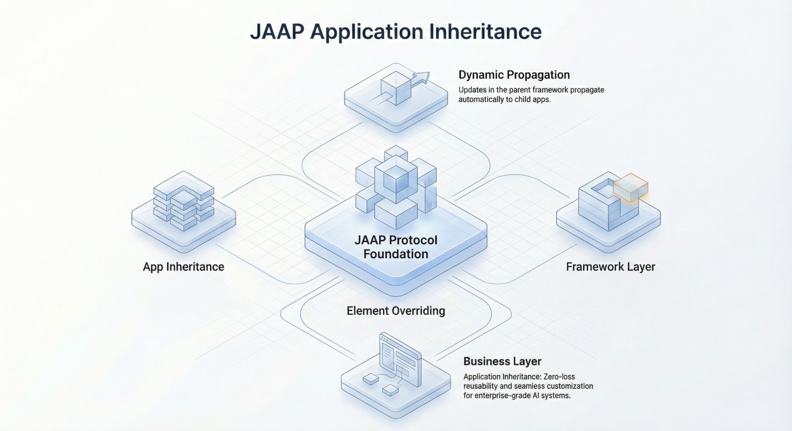

## 引言

在生物界，进化是适应力的源泉。一个物种共享一套通用的遗传代码（DNA），但通过变异和分化来适应不同的环境。相比之下，企业软件往往深受“熵增”之苦。随着系统规模的扩大，它们变得僵化、脆弱且难以修改——这种现象被称为“软件腐烂（Software Rot）”。

对于资深开发者和架构师而言，“应用继承（Application Inheritance）”一直是工程领域的圣杯：构建一个“子应用（Child Application）”，通过引用直接继承“父应用（Parent Application）”的所有能力，同时保留针对本地需求重写特定行为的自由。这不同于传统的代码库引用或微服务复用，真正的应用继承意味着一种实时的、进化的连接——核心系统的改进会自动传播到所有后代应用，而本地的适配修改依然保持完整。

本文将探讨如何运用生物学遗传原理指导软件工程，构建出能够自我进化而非逐渐衰败的系统架构。

<!--truncate-->

## 生物学隐喻：基因型 vs 表型

要理解应用继承，我们必须将“应用的定义”与其“执行”分离开来。

- **基因型（Genotype/DNA）**：应用的结构定义（数据模型、视图、逻辑、权限）。
- **表型（Phenotype/Organism）**：与用户和数据交互的运行中应用实例。

在传统开发中，当你复制一个项目来创建一个变体（例如 ERP 的“美国版”和“欧洲版”）时，你本质上是在克隆生物体。如果“美国版”修复了一个关键 Bug，“欧洲版”无法自动受益，除非你手动移植该修复（Cherry-picking commits）。这导致了版本分叉和维护噩梦。

应用继承改变了这一范式。子应用指向父应用的“基因型”。它不是复制代码，而是**引用**代码。

### 分化机制

正如生物体根据环境表达不同的性状，子应用允许选择性的**重写（Overriding）**。

1.  **默认继承**：如果子应用没有定义某个组件（例如 `OrderProcessingService`），它直接使用父应用的版本。
2.  **分化（变异）**：如果子应用需要特定的税务计算，它定义自己的 `TaxService`。运行时环境会检测到这个“本地变异”，并加载它来替代父应用的版本。
3.  **进化传播**：当父应用改进了 `OrderProcessingService`，子应用会立即使用新版本，因为它从未被“复制”过——仅仅是被引用。

## JitAI 的解决方案：JAAP 协议

JitAI 通过 **JAAP (JitAi Application Protocol)** 实现了这一进化模型。JAAP 将应用结构视为“一等公民”，使其可被操作、继承和演进。

### 1. 结构化继承 (Meta → Type → Instance)

在 JitAI 中，每一个元素（页面、服务、数据模型）都遵循严格的层级结构：Meta（抽象）→ Type（类/模板）→ Instance（具体实例）。

- **Meta**：定义基础行为（例如 `models.Meta`）。
- **Type**：可复用的模板（例如 `models.NormalType`）。开发者可以创建自己的 Type 来封装特定的业务逻辑模式。
- **Instance**：实际运行的元素（例如 `models.UserTable`）。

这种结构允许开发者“合理利用继承（Use Inheritance Reasonably）”，充分发挥 Type 元素的模板能力，从而在企业范围内强制执行标准。

### 2. 应用级继承

除了单个元素，JitAI 允许整个应用之间进行继承。运行平台提供了如 `getParentsMetadata` 等方法来遍历这种层级结构，使子应用能够访问配置和环境变量，“包括那些从父应用继承的变量（including those inherited from parent applications）”。

这一能力将“复制-粘贴”问题转化为“引用-扩展”方案。企业可以构建一个“核心 HR 应用”，并将其扩展为多个“区域 HR 应用”。区域应用继承所有数据模型和工作流，但可以重写“薪资计算（Payroll Calculation）”函数以适应当地法律。

### 3. AI 作为进化代理

由于 JAAP 使应用结构显式化且自描述，AI Agent 可以安全地理解和修改系统。“AI 操作的不是接口，而是应用结构本身（AI operations on application structure）”。这意味着 AI 可以辅助“变异”过程——根据新需求建议子应用应如何从父应用分化——而不会破坏进化链路。

## 架构：继承层级

下图展示了在继承应用环境中请求是如何被解析的。运行时（Runtime）首先在子应用中查找请求的资源；如果未找到，则沿链向上遍历至父应用。

## 对比：复用策略

| **策略**                      | **机制**                            | **优点**                                                                 | **缺点**                                                                        |
| ----------------------------- | ----------------------------------- | ------------------------------------------------------------------------ | ------------------------------------------------------------------------------- |
| **复制-粘贴 (Forking)**       | 复制代码文件。                      | 零依赖；完全自由。                                                       | **软件腐烂**：原始版本的更新丢失；维护成本随每个分支翻倍。                      |
| **共享库 (Shared Libraries)** | 将代码打包为 `.jar` / `.npm` 模块。 | 版本控制；强封装。                                                       | **依赖地狱**：版本冲突；难以在不使用复杂模式（策略/工厂）的情况下重写内部行为。 |
| **微服务**                    | 通过 HTTP API 复用功能。            | 技术栈无关；独立扩展。                                                   | **网络开销**：延迟；分布式复杂性；无法实现 UI/前端继承。                        |
| **应用继承**                  | 运行时结构解析 (JAAP)。             | **进化性**：核心更新自动传播；全栈元素（UI + 数据 + 逻辑）的细粒度重写。 | **耦合**：子应用与父应用的契约（基因型）强耦合。                                |

## 实施指南

要使用应用继承实现演进式架构，请遵循以下步骤：

### Step 1: 定义“基因型”（基座应用）

创建一个仅包含通用逻辑和数据结构的基座应用（Base Application）。

- **数据模型**：定义核心实体，如用户（User）、租户（Tenant）、订阅（Subscription）。
- **抽象流程**：创建带有“钩子”点（空函数）的工作流，旨在被重写。
- **标准 UI**：构建动态读取配置的通用布局。

### Step 2: 创建“表型”（子应用）

初始化一个新应用，并声明基座应用为其父应用。**不要复制代码**。

- **配置环境**：使用 `getEnvVarsDefine` 验证哪些变量被继承。

### Step 3: 实施战略性覆盖

识别子应用需要差异化的地方。

- **UI 分化**：如果子应用需要特定的“数据录入页面（Data Entry Page）”，扩展通用页面类型并在 `scheme.json` 中重写布局配置。JitAI 的数据录入页面原生支持继承机制。
- **逻辑分化**：创建一个与父应用函数**同名**的服务函数。运行时将优先执行这个本地实例。

### Step 4: 验证继承

部署子应用。

1.  测试标准流程（由父应用处理）。
2.  测试专用流程（由子应用处理）。
3.  **进化测试**：更新父应用中的标准流程，确保子应用在无需重新部署的情况下即反映该更改。

## 如何验证 / 复现

如果您正在使用 JitAI 平台，可以通过以下方式验证继承机制：

1.  **检查元数据**：在后端脚本中调用 `app.getParentsMetadata()`。它应返回一个包含父级层级 `appId` 和 `version` 的 `OrderedDict`。
2.  **检查元素定义**：在子应用上使用 `app.getElement(fullName)`。如果该元素仅存在于父应用中，返回的对象应指向父应用的资源，但在子应用的上下文中执行（例如，使用子应用的数据库连接）。

## 常见问题 (FAQ)

**Q: 我可以继承多个父应用吗？**

A: 通常，应用继承遵循线性或树状层级（单继承）以避免冲突解决中的“菱形问题（Diamond Problem）”，尽管 JAAP 的内部协议处理了元素级的组合。

**Q: 如果我重命名了父应用中的函数会怎样？**

A: 在进化过程中，这被视为“破坏性变更（Breaking Change）”。如果子应用正在重写 `FunctionA`，而父应用将其重命名为 `FunctionB`，子应用的重写将变成“孤儿”（未使用的代码），子应用将开始使用父应用的 `FunctionB`（如果兼容）或报错。父应用的语义化版本控制至关重要。

**Q: 继承会影响性能吗？**

A: 在解析阶段（查找正确元素）会有可忽略不计的查找成本。然而，像 JitAI 这样的现代平台会大量缓存这些解析结果。维护方面的长期效率收益远超运行时的纳秒级损耗。

## 结论

像生物进化一样构建软件需要思维方式的转变。我们必须停止将应用视为“已完成”的静态工件，开始将其视为能够适应和成长的生命谱系。

通过利用**应用继承**，开发者可以在维护核心业务逻辑“单一事实来源（Single Source of Truth）”的同时，为边缘情况提供无限的灵活性。无论你称之为“演进式架构”还是“基因型编程”，结果都是一样的：系统随着时间的推移变得更强，而不是更弱。

**准备好进化你的软件架构了吗？**

下载 [JitAI Desktop](https://jit.pro/zh/download)体验 JAAP，或[探索 JitAI 教程](https://jit.pro/zh/docs/tutorial)构建你的第一个继承应用。
