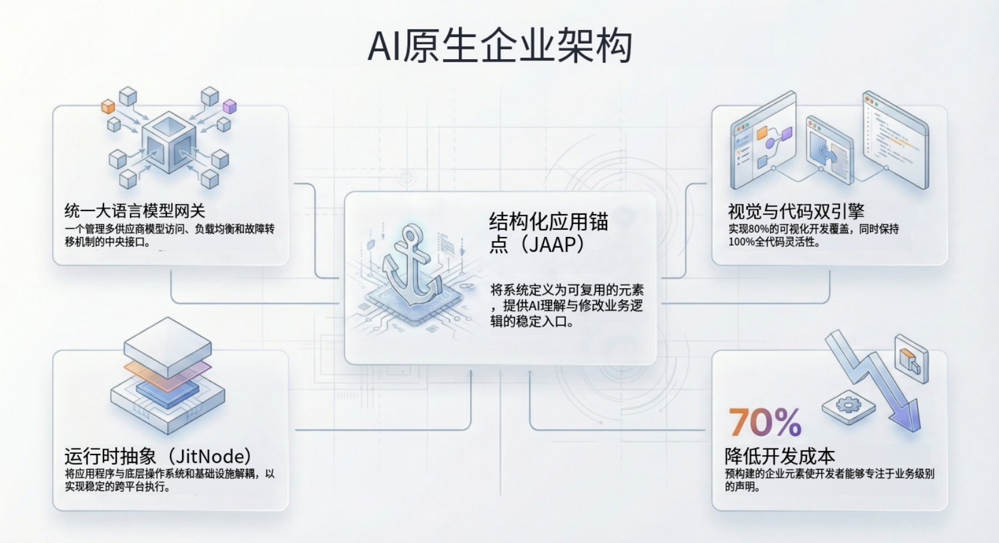

import Head from "@docusaurus/Head";

export const jsonLd = {
"@context": "https://schema.org",
"@graph": [
{
"@type": "Organization",
"@id": "https://jit.pro/#organization",
"name": "JitAI",
"legalName": "武汉万云网络科技有限公司",
"url": "https://jit.pro/",
"logo": {
"@type": "ImageObject",
"url": "https://jit-www.oss-accelerate.aliyuncs.com/logo/logo.svg"
},
"sameAs": [
"https://forum.jit.pro/",
"https://github.com/jitai-team",
"https://x.com/JitAi2017",
"https://www.instagram.com/jitai_2017",
"https://www.youtube.com/channel/UClvTNJPvBhek3aFuDy87RJQ",
"https://www.facebook.com/people/JitAi/61581485995674",
"https://www.linkedin.com/company/jitai2017"
]
},
{
"@type": "WebSite",
"@id": "https://jit.pro/#website",
"name": "JitAI",
"url": "https://jit.pro/",
"publisher": {
"@id": "https://jit.pro/#organization"
},
"inLanguage": ["en", "zh-CN"]
},
{
"@type": "Blog",
"@id": "https://jit.pro/zh/blog#blog",
"name": "Blog",
"url": "https://jit.pro/zh/blog",
"isPartOf": {
"@id": "https://jit.pro/#website"
},
"publisher": {
"@id": "https://jit.pro/#organization"
},
"inLanguage": "zh-CN"
},
{
"@type": "WebPage",
"@id": "https://jit.pro/zh/blog/declarative-programming-ai-native-enterprise-systems#webpage",
"url": "https://jit.pro/zh/blog/declarative-programming-ai-native-enterprise-systems",
"name": "面向 AI 原生企业系统的声明式编程（Declarative Programming）",
"description": "从工程视角解释声明式编程及其在数据、工作流、权限治理中的落点，并说明为何它是 AI 原生企业系统里让 AI agent 更可靠、可审计、可治理的关键路径。",
"isPartOf": {
"@id": "https://jit.pro/#website"
},
"breadcrumb": {
"@id": "https://jit.pro/zh/blog/declarative-programming-ai-native-enterprise-systems#breadcrumb"
},
"inLanguage": "zh-CN"
},
{
"@type": "BreadcrumbList",
"@id": "https://jit.pro/zh/blog/declarative-programming-ai-native-enterprise-systems#breadcrumb",
"itemListElement": [
{
"@type": "ListItem",
"position": 1,
"name": "首页",
"item": "https://jit.pro/"
},
{
"@type": "ListItem",
"position": 2,
"name": "博客",
"item": "https://jit.pro/zh/blog"
},
{
"@type": "ListItem",
"position": 3,
"name": "面向 AI 原生企业系统的声明式编程（Declarative Programming）",
"item": "https://jit.pro/zh/blog/declarative-programming-ai-native-enterprise-systems"
}
]
},
{
"@type": "BlogPosting",
"@id": "https://jit.pro/zh/blog/declarative-programming-ai-native-enterprise-systems#blogposting",
"mainEntityOfPage": {
"@id": "https://jit.pro/zh/blog/declarative-programming-ai-native-enterprise-systems#webpage"
},
"url": "https://jit.pro/zh/blog/declarative-programming-ai-native-enterprise-systems",
"headline": "面向 AI 原生企业系统的声明式编程（Declarative Programming）",
"name": "面向 AI 原生企业系统的声明式编程（Declarative Programming）",
"description": "从工程视角解释声明式编程及其在企业技术栈中的常见落点，并给出声明式 + AI agent 的可落地契约路径，帮助构建可治理的 AI 原生企业系统。",
"datePublished": "2026-02-05T00:00:00.000Z",
"dateModified": "2026-02-05T00:00:00.000Z",
"inLanguage": "zh-CN",
"isPartOf": {
"@id": "https://jit.pro/zh/blog#blog"
},
"author": {
"@id": "https://jit.pro/#organization"
},
"publisher": {
"@id": "https://jit.pro/#organization"
},
"image": ["https://jit-www.oss-accelerate.aliyuncs.com/logo/logo_dark.svg"],
"keywords": [
"声明式编程",
"JitAI",
"AI 原生",
"AI agent",
"流程编排",
"低代码平台",
"企业人工智能治理"
],
"timeRequired": "PT10M"
},
{
"@type": "FAQPage",
"@id": "https://jit.pro/zh/blog/declarative-programming-ai-native-enterprise-systems#faq",
"isPartOf": {
"@id": "https://jit.pro/zh/blog/declarative-programming-ai-native-enterprise-systems#webpage"
},
"inLanguage": "zh-CN",
"mainEntity": [
{
"@type": "Question",
"name": "声明式编程最简单的定义是什么？",
"acceptedAnswer": {
"@type": "Answer",
"text": "描述期望结果（what），运行时决定实现步骤（how）。"
}
},
{
"@type": "Question",
"name": "声明式编程等同于函数式编程吗？",
"acceptedAnswer": {
"@type": "Answer",
"text": "两者有交集，但边界不同。函数式更强调不可变与表达式；声明式覆盖 SQL、标记语言、约束求解、规则系统等更广的范围。"
}
},
{
"@type": "Question",
"name": "企业为什么在意声明式？",
"acceptedAnswer": {
"@type": "Answer",
"text": "因为声明式产物更容易治理：可验证、可版本化、可评审、可审计，尤其适用于 AI agent 可能触发真实业务变更的场景。"
}
},
{
"@type": "Question",
"name": "声明式做得过头有什么风险？",
"acceptedAnswer": {
"@type": "Answer",
"text": "当运行时不透明或模型设计不佳时，细粒度控制会更困难，调试成本会上升。成熟平台通常提供受控的命令式扩展点。"
}
},
{
"@type": "Question",
"name": "声明式如何帮助 AI agent 上生产？",
"acceptedAnswer": {
"@type": "Answer",
"text": "它把 agent 输出升级为可执行契约：结构化意图 + 校验 + 策略强制 + 审计闭环，并支持可观测与可控回写。"
}
}
]
}
]
}

<Head>
    
</Head>

声明式编程是一种构建软件的方式：你描述想要的目标（“what”），运行时负责决定如何实现（“how”）。随着 AI 低代码平台与企业开发平台走向“AI 原生（AI-native）”执行，声明式模型正在成为让 AI agent 更可靠、可审计、可治理的关键路径。

本文用工程视角解释声明式编程，说明它在现代技术栈中的常见落点，并把它与 AI 原生产品形态连接起来，帮助你做出能交付结果、可持续演进的架构选择。

<!--truncate-->

## 声明式编程：可复用的定义

声明式编程表达“计算想得到的结果”，无需逐步写出控制流程。因为输入描述的是“目标”，同一份声明式定义可以被不同引擎优化、并行化，或在不同执行策略下运行。

你很可能早就用过声明式范式，只是没特意给它命名：

- **SQL**：说明想要的数据，查询优化器决定执行计划
- **HTML/CSS**：描述结构与样式，浏览器决定渲染细节
- **规则/约束**：给出约束条件，求解器搜索满足条件的解

一个好记的对照：

- **命令式（Imperative）**：先做 A，再做 B，再做 C
- **声明式（Declarative）**：让系统呈现为 X 的状态

## 2026 年声明式更关键：AI agent、治理与平台工程

声明式在近年再次走向主流，原因很直接：现代系统动态性更高，靠手写逐步控制流程很难覆盖所有变化。云原生、工作流引擎、策略驱动治理都偏好“目标状态（desired state）”的思路。

从企业软件趋势看，有三个相对中性的信号：

- **市场形态**：Gartner 的预测显示，低代码开发技术市场在 2023 年将达到 **269 亿美元**，同比增长 **19.6%**，驱动力来自更快交付与更广泛的业务技术人员参与。 
- **组织采用**：Gartner 预测到 2026 年，大型软件工程组织中 **80%** 将建立平台工程团队，作为可复用组件与服务的内部供给方。 
- **标准压力**：ISO 将 **ISO/IEC 42001:2023** 描述为全球首个 AI 管理体系标准，强调以管理体系方式建立控制、监测与持续改进。 

当 AI agent 进入核心业务流程时，声明式产物的价值更突出：它把“意图”变成可检查、可约束、可版本化的系统输入。

## 声明式在企业技术栈中的典型落点

声明式是一个“伞概念”。在真实系统里，它体现为一组“声明式界面（declarative surfaces）”，人或 agent 用它来表达意图。

### 1）数据与查询

SQL 是典型代表：它分离“想要什么”和“怎么执行”，查询优化器、索引与执行器可以持续演进，意图保持稳定。

企业含义：当数据访问具备声明式入口，安全、治理与可观测能力更容易统一叠加，而不需要重写每条业务流程。

### 2）UI 与表单

标记语言与 UI schema 天生偏声明式：字段、约束、展示方式被描述为结构化定义，渲染器负责呈现与交互细节。

企业含义：声明式 UI 降低多端重建成本（Web、移动端、内部门户等），并让行为更一致。

### 3）工作流与编排

工作流定义（步骤、条件、审批、重试、超时）通常更适合用声明式表达：你想要的是一个状态机/图结构，由引擎解释执行。

企业含义：执行“形状”显式可见，更易审计，也更容易做安全变更。

### 4）基础设施与交付

现代运维大量采用目标状态配置。即便团队仍写脚本，长期趋势也在走向“声明式配置 + 对账式（reconciler）运行时”。

企业含义：可重复、抗漂移，AI 功能引入更多组件与依赖时更关键。

### 5）策略与权限

策略天然偏声明式：“谁在什么条件下可以做什么，需要哪些审批”。AI 原生系统的可信度往往在这里分水岭。

企业含义：当你希望 AI agent 做真实工作，策略需要清晰、可测试，并在运行时强制执行。

## 真实权衡：声明式带来的收益与成本

声明式不会消灭复杂度，它会把一部分复杂度移动到运行时与建模层。

**你得到的：**

- **可治理性**：意图清晰，可校验、可 diff、可审批、可审计
- **优化空间**：执行引擎可迭代优化而不破坏定义
- **可组合性**：schema、策略、工作流图更容易跨团队复用

**你付出的：**

- **直接控制减少**：性能调优有时需要理解引擎行为
- **调试方式改变**：更多在排查“意图与引擎解释不一致”，而不是逐行跟踪
- **模型质量门槛更高**：schema 设计粗糙会让系统在规模化后放大问题

成熟的平台常见做法：以声明式为默认，提供受控的命令式“逃生口”，并配套严格治理。

## 声明式 + AI agent：从提示词走向契约

企业场景里的很多 “agent 失败” 追根到底都指向同一点：**agent 输出缺少契约属性**。

提示词产出通常是文本；契约产出是一份结构化意图，平台能验证并治理。

一个可落地的模式：

1.  **Agent 提出意图**  
    例：创建客户记录、发起审批申请、生成对账报表、安排跟进任务等
2.  **系统把意图翻译为声明式规格（spec）**  
    spec 包含：目标实体、必填字段、约束、允许动作、可产生的副作用边界
3.  **运行时验证并强制策略**  
    校验权限、审批要求、数据约束、限流、职责分离、审计记录等
4.  **执行可观测，并尽量可回滚**  
    记录输入、派生决策、审批链路与回写结果

这样设计后，agent 的推理仍然能提供效率，执行边界由声明式定义与运行时治理来兜底。

## 对 AI 低代码与企业开发平台意味着什么

一个现代 AI 低代码平台的竞争力，越来越取决于声明式层的质量：

- **声明式领域模型**：实体、字段、关系、约束、生命周期状态
- **声明式工作流模型**：路由、审批、SLA、补偿、异常处理
- **声明式权限模型**：RBAC/ABAC、记录级规则、审批要求
- **声明式集成契约**：输入输出、幂等、重试、错误语义
- **声明式可观测**：日志、链路、审计事件、与模型绑定的运行指标

这些基础具备后，AI agent 才能以“受边界约束的执行者”参与业务，而不是停留在聊天层面。

## JitAI 与这种产品形态的关系（简述）

JitAI 作为 AI 原生企业应用开发平台的定位，与声明式思路契合：把业务元素（数据、流程、权限、UI）建模为一等产物，再由运行时编排安全执行。

想直观看到声明式模型如何变成可运行系统，可以从 [JitAI 教程](https://jit.pro/zh/docs/tutorial) 开始；准备好搭一个端到端的可治理小流程后，可以试用 [JitAI](https://jit.pro/zh/download)。

## 决策清单：优先声明式化的顺序

在系统现代化或从零设计 AI 原生系统时，建议按以下顺序推进：

1.  **权限与审批**：集中声明式定义并强制执行
2.  **领域数据模型与约束**：强 schema 降低歧义，给 agent 稳定结构
3.  **工作流编排**：让执行更可预测、更可审计
4.  **集成契约**：减少“随机胶水代码”，提高可靠性
5.  **UI schema**：在前面稳定后，多端扩展会更省力

## 职业视角：声明式能力为何更耐久

声明式思维正在变成“平台级能力”，跨角色都适用：

- 企业开发者：构建能承受需求变化的系统
- 平台工程师：定义标准、模板与“铺好的路（paved road）”
- 数据工程/分析工程：长期工作在声明式查询世界
- Agent 构建者：把 LLM 输出转成结构化、可治理的动作

当 AI agent 能力继续下沉到执行层，声明式建模会成为更通用的底座能力。

## 常见问题（FAQ）

**声明式编程最简单的定义是什么？**  
描述期望结果，系统决定实现步骤。

**声明式编程等同于函数式编程吗？**  
两者有交集，概念边界不同。函数式更强调不可变与表达式；声明式覆盖 SQL、标记语言、约束求解、规则系统等更广的范围。 

**企业为什么在意声明式？**  
因为声明式产物更容易治理：可验证、可版本化、可评审、可审计，尤其适用于 AI agent 可能触发真实业务变更的场景。

**声明式做得“过头”有什么风险？**  
运行时不透明或模型设计不佳时，细粒度控制会变难，调试成本会上升。成熟平台通常会提供受控的命令式扩展点。

**声明式如何帮助 AI agent 上生产？**  
它把 agent 输出变成可执行契约：结构化意图 + 校验 + 策略强制 + 审计闭环，并且与 AI 治理趋势更对齐。
