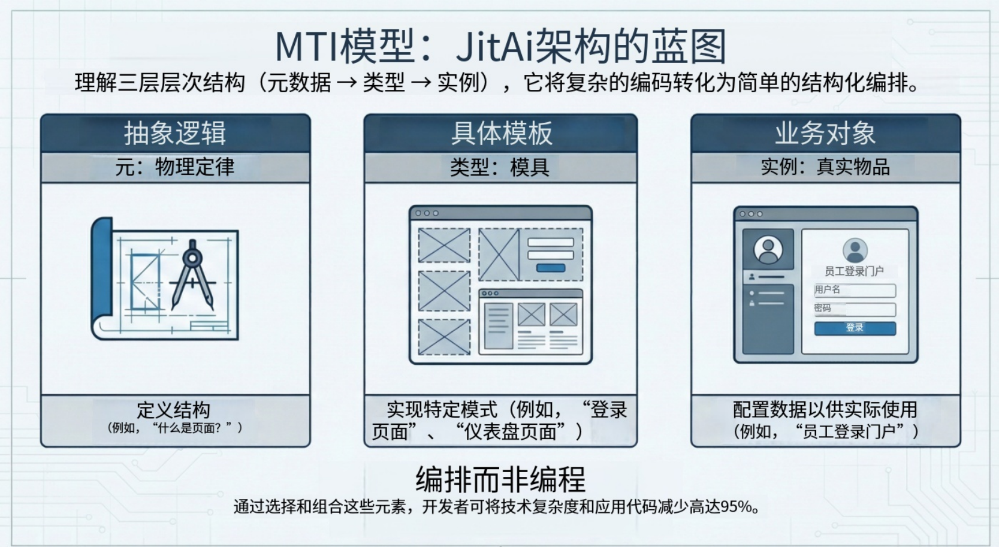

在当前的生成式 AI 浪潮中，开发者往往将大语言模型（LLM）视为“超能力的自动补全工具”。我们把代码片段粘贴到聊天窗口，要求它写一个函数，然后得到文本回复。然而，当我们试图构建复杂的企业级系统时，这种基于文本的方法就遇到了瓶颈——AI 缺乏对系统结构的整体理解。

缺失的一环并不是更大的上下文窗口，而是我们组织软件供机器阅读的方式发生了根本性转变。这个概念就是 **Elementization（元素化）**。

通过将应用原本最小的业务单元重新定义为“元素（Element）”——一种自描述、有边界且机器可读的对象——我们正从“AI 写代码”迈向“AI 构建系统架构”。

<!--truncate-->

## “隐性结构”难题

在传统的软件工程中，应用程序的架构往往是隐性的。它存在于文件夹层级、命名规范以及资深工程师的心智模型中。

- “用户服务”只是一个名为 `UserService.ts` 的文件。
- “数据模型”是一个 SQL 架构文件。
- “页面”是一个 React 组件。

对于 AI 来说，这些都只是文本流。由于缺乏显式的边界，AI 很难维持跨模块的一致性。它并不“知道”修改用户模型需要同步更新认证服务和登录页面。它仅仅是基于 Token 概率进行猜测。

为了让 AI 成为真正的协作者，必须将应用结构提升为“一等公民”。

## 什么是元素化？

元素化将“元素（Element）”定义为 AI 原生应用的原子单位。与原始代码文件不同，元素是一个封装的对象，它定义了自己的：

1.  **语义（Semantics）**：它是什么（例如：“服务”、“页面”、“模型”）。
2.  **能力（Capabilities）**：它能做什么（例如：“查询数据库”、“渲染 UI”）。
3.  **边界（Boundaries）**：它如何与其他元素交互。

在这种范式下，应用不再仅仅是文件的集合；它是一个由元素构成的结构化图谱，人类和 AI 都可以对其进行查询、理解和操作。

## 元素的架构：Meta、Type、Instance

为了让 AI 能够通用地理解元素，它们遵循一套严格的分层协议，通常被称为 **Meta-Type-Instance（元-类型-实例）** 三元组。



- **Meta (元素)**：抽象定义。它定义了一类元素的基本属性和行为。例如，`pages.Meta` 定义了系统中的“页面”是什么。
- **Type (类型)**：源自 Meta 的可复用模板或类。它封装了技术实现细节。例如，`pages.GridPageType`  可能定义了一个标准的网格布局页面，预置了排序和筛选的逻辑。
- **Instance (实例)**：具体的业务实现。这是开发者（或 AI）工作的地方。一个实例，如 `EmployeeDirectoryPage`，是 `GridPageType` 的具体配置。

## 这为何改变了 AI Agent 的游戏规则

当软件由元素构建时，AI Agent（智能体）的角色从“编写文本”转变为“编排结构”。

### 1. 结构理解 vs. 文本预测

由于元素是自描述的，AI Agent 可以检查应用的 Meta 层，确切地了解有哪些工具可用。它不需要幻想数据库连接字符串；它能看到一个 `Database` 元素实例，并确切知道哪些方法（如 `query`, `insert`）是有效的。

### 2. 精确修改

在基于文件的项目中，要求 AI “给用户档案增加一个电话号码字段”可能会导致三个不同文件中语法各异的更改。在基于元素的系统中，AI 只需要定位到具体的 `UserModel` 实例并添加一个字段属性。系统（通过 Type 逻辑）会自动处理底层的数据库迁移和 API 更新。

### 3. 安全边界

Type 层充当了护栏。如果 AI 试图用无效参数配置一个“登录页”实例，`LoginPageType` 的严格定义会立即拒绝它。这创造了一个在纯代码生成中难以实现的“正确性闭环”。

## 对比：代码中心 vs. 低代码 vs. 元素原生

| **特性**     | **传统代码中心 (Code-Centric)** | **低代码 / 无代码 (Low-Code)** | **AI 原生 (基于元素)**     |
| ------------ | ------------------------------- | ------------------------------ | -------------------------- |
| **基本单位** | 文本文件 / 类                   | 可视化积木                     | **语义化元素**             |
| **结构**     | 隐性 (心智模型)                 | 僵化 / 隐藏                    | **显式 / 机器可读**        |
| **AI 集成**  | "Copilot" (自动补全)            | "黑盒" (难以生成)              | **"架构师" (直接操作)**    |
| **扩展性**   | 高 (无限代码)                   | 低 (厂商锁定)                  | **高 (自定义 Types)**      |
| **开发体验** | 编辑器 + 终端                   | 拖拽                           | **混合 (可视化 + 全代码)** |

## 实战指南：定义一个元素

实际上该如何定义一个元素？在像 JitAI 这样的系统中，这通常是通过结合 JSON 配置（用于结构）和 Python/TypeScript（用于逻辑）来完成的。

### 第一步：定义结构 (例如 `e.json`)

配置文件声明了元素的身份及其 Type 父级。

```plaintext
{
  "title": "Employee Service",
  "type": "services.NormalType",
  "version": "1.0.0"
}

```

### 第二步：实现逻辑

业务逻辑驻留在标准代码文件中，但被封装在元素的目录结构内。

```plaintext
# inner.py (服务函数逻辑)
def calculate_bonus(salary, performance_score):
    if performance_score > 4.5:
        return salary * 0.2
    return salary * 0.1

```

### 第三步：AI 编排

当 AI Agent 需要使用此服务时，它不会去解析 Python 文本。它看到的是元素 `EmployeeService` 及其暴露的函数 `calculate_bonus`，以及从元素元数据中派生出的完整的输入/输出定义。

## JitAI 如何实现这一点

JitAI 是首个完全围绕“元素化”概念设计的企业级平台。它利用 **JAAP (JitAi Application Protocol)** 严格定义了 Meta-Type-Instance 层级。

- **结构作为一等公民**：在 JitAI 中，应用结构不是代码的副产品；它是 AI 操作的主要对象。这使得 JitAI 的智能体能够在几秒钟内通过实例化并连接数十个元素（页面、模型、工作流）来执行诸如“生成 CRM 系统”之类的复杂任务。
- **"Type" 生态系统**：JitAI 提供了一个丰富的预置 Type 库（例如 `ai-data-analysis-page` AI 数据分析页, `approval-workflow` 审批流）。开发者可以扩展这些 Type 或创建自己的 Type，通过向库中添加新 Type 来有效地教会 AI 新技能。
- **零间隙集成**：因为应用的每个部分——从前端 UI 到后端数据库——都是一个元素，AI 拥有完全的可见性。它可以追踪从页面元素上的按钮点击一直到模型元素中的字段更新的全过程。

## 常见问题 (FAQ)

**Q: 元素化只是面向对象编程 (OOP) 的另一个名字吗？**

A: 虽然它们共享类 (Types) 和对象 (Instances) 等概念，但元素化的范围更广。它封装了整个生命周期和部署产物，而不仅仅是运行时逻辑。一个元素在一个包中包含了它的 UI 配置、数据库模式和 API 权限。

**Q: 这是否意味着我不能再写代码了？**

A: 不是。元素化是“结构层低代码，逻辑层全代码”。你仍然编写核心算法（如上面的 Python 示例），但你不必浪费时间去编写样板架构代码。

**Q: AI 真的能理解自定义业务逻辑吗？**

A: 是的，因为元素是自描述的。当你创建一个自定义元素时，你定义了它的输入和输出。AI 读取这些元数据以理解如何正确调用你的自定义逻辑。

## 结语

软件开发的未来不仅仅是更快的打字速度，而是更好的架构理解。通过采用元素化，我们弥合了人类意图与机器执行之间的鸿沟。我们为 AI Agent 提供了它们安全导航和构建复杂系统所需的结构化地图。

对于架构师和资深开发者来说，这意味着将重心从维护文件结构转移到设计高层级的元素交互——构建 AI 用以此构建世界的“Types”。

---

**准备好见证元素化的实际效果了吗？**

下载 [JitAI 桌面版](https://jit.pro/zh/download)或探索开发者指南，立即构建你的第一个AI 原生应用。
