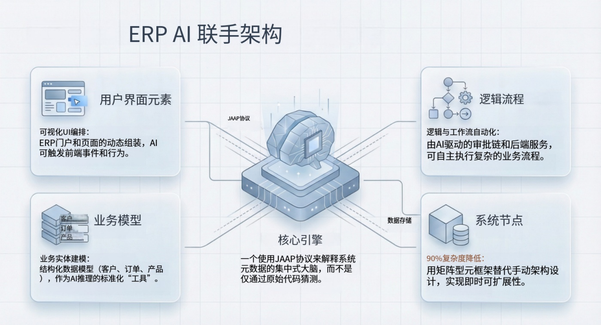

import Head from "@docusaurus/Head";

export const jsonLd = {
"@context": "https://schema.org",
"@graph": [
{
"@type": "Organization",
"@id": "https://jit.pro/#organization",
"name": "JitAI",
"legalName": "武汉万云网络科技有限公司",
"url": "https://jit.pro/",
"logo": {
"@type": "ImageObject",
"url": "https://jit-www.oss-accelerate.aliyuncs.com/logo/logo.svg"
},
"sameAs": [
"https://forum.jit.pro/",
"https://github.com/jitai-team",
"https://x.com/JitAi2017",
"https://www.instagram.com/jitai_2017",
"https://www.youtube.com/channel/UClvTNJPvBhek3aFuDy87RJQ",
"https://www.facebook.com/people/JitAi/61581485995674",
"https://www.linkedin.com/company/jitai2017"
]
},
{
"@type": "WebSite",
"@id": "https://jit.pro/#website",
"name": "JitAI",
"url": "https://jit.pro/",
"publisher": {
"@id": "https://jit.pro/#organization"
},
"inLanguage": [
"en",
"zh-CN"
]
},
{
"@type": "Blog",
"@id": "https://jit.pro/zh/blog#blog",
"name": "Blog",
"url": "https://jit.pro/zh/blog",
"isPartOf": {
"@id": "https://jit.pro/#website"
},
"publisher": {
"@id": "https://jit.pro/#organization"
},
"inLanguage": "zh-CN"
},
{
"@type": "WebPage",
"@id": "https://jit.pro/zh/blog/erp-ai-assistant-from-data-lookup-to-auto-filled-forms#webpage",
"url": "https://jit.pro/zh/blog/erp-ai-assistant-from-data-lookup-to-auto-filled-forms",
"name": "ERP AI 助手：从查数到自动填单",
"description": "一条可落地的能力路径：从只读的数据问答与口径解释，演进到草稿态交易辅助、从非结构化输入自动填充 ERP 表单，并在触碰记录系统之前通过提案与审批实现可控写回与可审计执行。",
"isPartOf": {
"@id": "https://jit.pro/#website"
},
"breadcrumb": {
"@id": "https://jit.pro/zh/blog/erp-ai-assistant-from-data-lookup-to-auto-filled-forms#breadcrumb"
},
"inLanguage": "zh-CN"
},
{
"@type": "BreadcrumbList",
"@id": "https://jit.pro/zh/blog/erp-ai-assistant-from-data-lookup-to-auto-filled-forms#breadcrumb",
"itemListElement": [
{
"@type": "ListItem",
"position": 1,
"name": "Home",
"item": "https://jit.pro/"
},
{
"@type": "ListItem",
"position": 2,
"name": "博客",
"item": "https://jit.pro/zh/blog"
},
{
"@type": "ListItem",
"position": 3,
"name": "ERP AI 助手：从查数到自动填单",
"item": "https://jit.pro/zh/blog/erp-ai-assistant-from-data-lookup-to-auto-filled-forms"
}
]
},
{
"@type": "BlogPosting",
"@id": "https://jit.pro/zh/blog/erp-ai-assistant-from-data-lookup-to-auto-filled-forms#blogposting",
"mainEntityOfPage": {
"@id": "https://jit.pro/zh/blog/erp-ai-assistant-from-data-lookup-to-auto-filled-forms#webpage"
},
"url": "https://jit.pro/zh/blog/erp-ai-assistant-from-data-lookup-to-auto-filled-forms",
"headline": "ERP AI 助手：从查数到自动填单",
"name": "ERP AI 助手：从查数到自动填单",
"description": "从“查数与口径解释”到“自动填单与可控写回”的路线图：定义 ERP AI assistant/chatbot/voice assistant/agent，给出 6 阶段能力阶梯与可复用参考架构（数据平面、动作平面、控制平面），并提供可执行交付计划与常见风险规避方法。",
"datePublished": "2026-02-26T00:00:00.000Z",
"dateModified": "2026-02-26T00:00:00.000Z",
"inLanguage": "zh-CN",
"isPartOf": {
"@id": "https://jit.pro/zh/blog#blog"
},
"author": {
"@id": "https://jit.pro/#organization"
},
"publisher": {
"@id": "https://jit.pro/#organization"
},
"image": [
"https://jit-www.oss-accelerate.aliyuncs.com/logo/logo_dark.svg"
],
"keywords": [
"ERP AI 助手",
"ERP AI assistant",
"ERP AI chatbot",
"ERP 语音助手",
"ERP voice assistant",
"ERP 自动填单",
"ERP form auto-fill",
"ERP 数据问答",
"AI agent",
"审批流",
"approval workflow",
"可控写回",
"governed write-back",
"审计链路",
"audit trail",
"system of record",
"JitAI",
"ERP"
],
"timeRequired": "PT12M"
},
{
"@type": "FAQPage",
"@id": "https://jit.pro/zh/blog/erp-ai-assistant-from-data-lookup-to-auto-filled-forms#faq",
"isPartOf": {
"@id": "https://jit.pro/zh/blog/erp-ai-assistant-from-data-lookup-to-auto-filled-forms#webpage"
},
"inLanguage": "zh-CN",
"mainEntity": [
{
"@type": "Question",
"name": "ERP AI 助手最快的第一个用例是什么？",
"acceptedAnswer": {
"@type": "Answer",
"text": "从“一条工作流的查数 + 解释口径”开始（库存、订单、发票任选其一）。价值立竿见影，风险也更低。"
}
},
{
"@type": "Question",
"name": "什么时候应该加语音？",
"acceptedAnswer": {
"@type": "Answer",
"text": "当用户远离工位操作：仓库、车间、外勤服务。对话式交互经常组合聊天、语音与提醒。"
}
},
{
"@type": "Question",
"name": "自动填单能否在不改 ERP UI 的前提下落地？",
"acceptedAnswer": {
"@type": "Answer",
"text": "可以。自动填单可作为 sidecar：抽取字段、生成草稿 payload，再通过 API/集成层写入草稿或提案，不要求改动核心 UI。"
}
},
{
"@type": "Question",
"name": "怎样才算“企业级”的自动填单？",
"acceptedAnswer": {
"@type": "Answer",
"text": "证据、校验与治理：每个字段都有来源，每次改动都有差异视图，每次提交都有审批与日志。"
}
},
{
"@type": "Question",
"name": "除了数据表，还需要哪些数据？",
"acceptedAnswer": {
"@type": "Answer",
"text": "业务定义、代码表、审批规则、异常处理手册。仅有表结构通常无法表达语义。"
}
},
{
"@type": "Question",
"name": "如何衡量成功？",
"acceptedAnswer": {
"@type": "Answer",
"text": "看交易完成时间、错误率、返工率、审批周期、采用率；同时为 grounding 与字段映射准确率建立评估测试。"
}
}
]
}
]
}

<Head>
    
</Head>

ERP AI 助手最初解决的是一个很朴素的问题：**更快地查到数字，并把口径讲清楚**。当架构成熟后，它会进一步演进为受治理的“行动伙伴”，能够**起草业务单据、自动填充 ERP 表单，并在触碰记录系统（system of record）之前完成审批流转**。

本文梳理一条可落地的能力路径：从“查数”走向“自动填单”，并总结企业团队在交付过程中常用的技术模式，尤其适用于“ERP 数据库已存在、无法推倒重来”的场景。

<!--truncate-->

## 为什么 ERP AI 助手正从“加分项”走向“标配”

三个信号解释了 ERP AI 助手加速普及的原因。

第一，**以 Agent 为核心的人机交互（agent-style UX）正在成为企业应用的主流交互模型**。Gartner 预测，到 2026 年，**高达 40% 的企业应用将内置面向具体任务的 AI Agents**，而 2025 年时这一比例 **低于 5%**。

第二，许多组织已经进入试验阶段。McKinsey 2025 年全球调研显示，**62% 的受访者表示其组织至少在尝试 AI agents**。

第三，治理预期正在快速补齐。**ISO/IEC 42001** 给出了 AI 管理体系（AIMS）的要求与指南，让企业能够把政策、风险控制与持续改进对齐到一套可执行的标准框架上，尤其适用于“会影响业务流程”的 AI 能力。

落到 ERP 场景，结果非常直接：当团队开始用自然语言问问题之后，下一步就会追求**业务结果**——起草采购申请、完成收货过账、准备发票、预填变更申请等。

## 架构评审可复用的一组定义

### ERP AI assistant（ERP AI 助手）

嵌入或贴近 ERP 工作流的用户侧能力，利用语言理解来**检索上下文、解释结果，并辅助完成交易/单据**。

### ERP AI chatbot（ERP AI 聊天机器人）

以对话问答与引导式导航为主的界面形态：“给我看未清采购订单”“库存下降的原因是什么”“把逾期发票总结一下”。不少指南把它视为对话式 ERP 体验的入门形态。

### ERP voice assistant（ERP 语音助手）

为“解放双手”的场景优化的对话界面（仓库、车间、外勤）。常见的对话式交互模式会组合 **语音指令、聊天与主动提醒**。

### ERP agent（ERP 智能体/代理）

能够**规划并执行多步任务**的助手，通过受控的工具/动作完成“创建草稿申请”“填充字段”“发起审批”“审批通过后提交更新”等步骤。很多“ERP AI chatbot”的讨论也逐步纳入了这条从对话到（半）自治执行的演进路径。

## 能力阶梯：从“查数”到“自动填单”的一条路

可以把 ERP AI 助手的成熟度分为 6 个阶段。每个阶段都能交付价值，同时把控制措施继续收紧。

### 阶段 1：数据问答（只读、理解 Schema）

**用户价值：** 不用翻菜单就能得到答案。  
**例子：** ATP、未清订单、逾期发票、GR/IR 状态、发运异常。

**关键要求：** 答案必须基于**真实数据库**生成，并且查询逻辑需满足权限约束。

### 阶段 2：解释、对比、总结（仍然只读）

**用户价值：** 把“发生了什么、为什么”讲清楚，支持跨时间窗口、跨实体、跨异常的对比分析。  
**例子：** “价格偏差最大的 10 个供应商”“交期为什么突然变长”“哪些 SKU 有缺货风险”。

这一阶段会暴露检索与口径的坑：指标定义、业务规则、主数据语义必须显式化。

### 阶段 3：工作流引导（草稿模式）

**用户价值：** 在交易界面内变成“操作副驾”。  
**例子：** “为下个月创建 500 件的采购申请草稿”“准备退货订单草稿”“预填供应商银行信息变更申请”。

这一阶段的写入应落在**草稿工作区**，记录系统不应被直接改动。

### 阶段 4：从非结构化输入自动填充 ERP 表单

**用户价值：** 消灭复制粘贴，降低漏填与错填。  
**例子：** 从邮件、PDF、图片、聊天记录中抽取字段，预填入库单、费用报销、供应商准入表单。

不少 AI 表单助手会强调：从邮件/文档/聊天中**抽取字段并给出实时建议**，辅助填充业务系统表单。

实务中，这种模式在仓储与采购场景落地很快，涵盖表格到表单抽取、子表自动填充等。

### 阶段 5：提案 → 审批（可控写回）

**用户价值：** 缩短周期，同时具备明确的责任边界。  
**例子：** “提议更新状态”“提议合并供应商”“提议改价”“提议解除信用冻结”。

助手生成一份**变更提案**：包含证据、影响预览、回滚方案，然后路由给正确的审批人。

### 阶段 6：带护栏的自动过账

**用户价值：** 低风险工作走向直通式处理（STP）。  
**例子：** 低金额补货自动过账、自动应用对账匹配规则、带置信检查的自动关单。

这一阶段对运行控制的要求最高：策略边界、审计链路、幂等、监控、持续评估缺一不可。

## “ERP 自动填单”到底意味着什么（以及它为什么比看起来更难）

自动填单要做到可靠，需要把 **抽取 + 查询匹配 + 规则 + 校验** 组合起来，单靠文本生成很难稳定。

### 1）字段抽取（非结构化 → 结构化）

输入来自邮件、PDF、扫描件 PO、聊天信息、供应商文件等。  
助手抽取候选值并给出置信度，同时保留原文片段作为证据。

### 2）主数据匹配（“代码问题”）

ERP 表单往往不接受自由文本，需要编码：物料号、供应商号、工厂/库位、税码、付款条件等。  
助手需要把“蓝色部件”解析到正确的物料编码，并受组织、语言、有效期等上下文约束。

### 3）业务规则（策略与流程对齐）

审批、阈值、必填项因实体与场景而异。  
采购自动化相关讨论常强调：AI 可辅助采购订单流程，包含**重复字段自动回填与异常检测**等能力。

### 4）提交前校验（避免过账后补救）

校验包括 Schema 约束、跨字段一致性、预算限制、重复检测，以及“为何填这个值”的可解释性。

一个很实用的模式：每一张自动填好的表单都配套 **差异视图（哪些字段变化）**、**来源证据**，以及可配置的**提交路径**（必要时走审批）。

## 参考架构：一次建设，多模块复用

可扩展的 ERP AI 助手更像一个产品子系统，聊天界面只是一部分。

### Data plane（数据平面）

- 连接 ERP 数据库与相邻系统（WMS、CRM、HR、工单系统等）的 **connectors**
- 受治理的只读层，满足行/列级权限
- 表、键、关系与业务定义的元数据模型

### Action plane（动作平面）

- 一份显式动作（tools）目录，具备强类型输入/输出：
    - Query actions（读）
    - Draft actions（写入沙箱/草稿区）
    - Proposal actions（生成变更提案）
    - Commit actions（写回），并以审批为门控

### Control plane（控制平面）

- **策略与权限引擎**：谁能问、谁能看、谁能提议、谁能批准
- **审批工作流**：路由、委托、SLA、升级
- **审计链路**：证据打包、提示/工具调用记录、审批记录、最终写入
- **评估体系**：grounding、字段映射准确率、动作正确性测试

这类架构趋势也出现在许多“ERP AI chatbot”的讨论里，它们更关注集成、护栏与运行控制，而不只谈 UI。

## 一份可执行的交付计划（把“这条路”做成项目）

### 第一步：先做 3 条高频“查数”用户旅程（2–4 周）

从真实用户里选出高频问题：

- 库存可用性与异常
- 订单状态与延误
- 发票账龄与争议

交付物：带权限的数据问答，答案可追溯到表、定义与口径规则。

### 第二步：在同一批旅程上补齐“解释与总结”（2–4 周）

交付物：对比视图（周环比等）、异常解释、“显示 SQL/来源”模式（面向高级用户）。

### 第三步：上线草稿态的交易辅助（3–6 周）

选一个表单：

- 采购申请（PR）
- 收货（GR）
- 客户主数据变更申请

交付物：逐字段建议、校验、差异预览。

### 第四步：开启文档驱动的自动填充（3–6 周）

交付物：上传/邮箱接入、字段抽取、主数据匹配、置信度评分、人工复核。

### 第五步：为写回引入审批（持续迭代）

交付物：提案对象、审批路由、审计日志、带幂等的安全提交。

## 常见失败模式（以及团队常用的规避方式）

### 字段幻觉与静默错配

用强类型工具与 Schema 约束输出，避免“看起来像对的 JSON”。

### 主数据歧义

用消歧 UI、置信阈值、候选列表，并绑定组织上下文。

### 权限过大

用策略层对齐角色，同时把草稿写入与提交写回分层隔离。

### 治理叙事薄弱

用 AI 管理体系思路把控制、监控与持续改进运营化，并可对齐 ISO/IEC 42001 的实践框架。

## JitAI 在这条路线图里的位置（不动你的记录系统）

当 ERP 数据库必须继续作为事实来源（source of truth），你需要的平台能力通常包括：

- 连接既有数据库
- 把数据表建模为可复用的领域对象
- 暴露可控动作：查询/草稿/提案/提交
- 把审批与可审计性内置到写回流程中

这正是 JitAI 重点覆盖的产品形态：在遗留 ERP 之上构建受治理的动作层与助手交互，逐步把流程现代化。你可以先跟随 [JitAI 教程](https://jit.pro/zh/docs/tutorial) 进行上手实践，再在准备好用自家 Schema 做原型时 [试用 JitAI](https://jit.pro/zh/download)。

## FAQ

### ERP AI 助手最快的第一个用例是什么？

从“一条工作流的查数 + 解释口径”开始（库存、订单、发票任选其一）。价值立竿见影，风险也更低。

### 什么时候应该加语音？

当用户远离工位操作：仓库、车间、外勤服务。对话式交互经常组合聊天、语音与提醒。

### 自动填单能否在不改 ERP UI 的前提下落地？

可以。自动填单可作为 sidecar：抽取字段、生成草稿 payload，再通过 API/集成层写入草稿或提案，不要求改动核心 UI。

### 怎样才算“企业级”的自动填单？

证据、校验与治理：每个字段都有来源，每次改动都有差异视图，每次提交都有审批与日志。

### 除了数据表，还需要哪些数据？

业务定义、代码表、审批规则、异常处理手册。仅有表结构通常无法表达语义。

### 如何衡量成功？

看交易完成时间、错误率、返工率、审批周期、采用率；同时为 grounding 与字段映射准确率建立评估测试。
