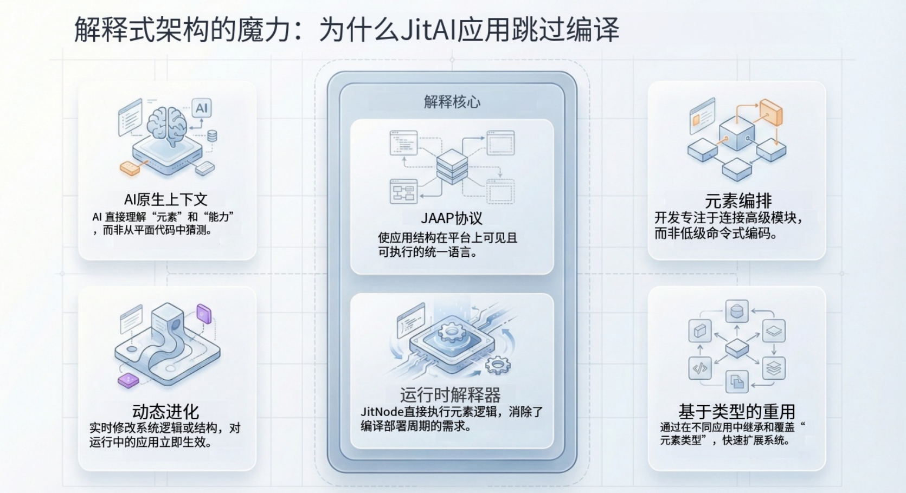

## 引言

在传统的软件开发生命周期中，从代码到执行的路径是由构建产物铺就的。无论是将 Java 编译为字节码，将 TypeScript 转译为 JavaScript，还是构建 Docker 镜像，“编译-构建-部署”的循环是工程的标准心跳。然而，对于需要快速迭代和自修改的 AI 原生应用来说，这种僵化的循环可能会成为瓶颈。

JitAI 及其核心运行时引擎 **JitNode** 应运而生。通过采用基于 **JAAP (JitAi Ai Application Protocol)** 的解释型架构，JitAI 将范式从“编译二进制”转变为“解释结构”。这种方法允许应用动态演进，将业务逻辑和结构定义视为一等公民，可以在运行时实时修改和执行，而无需停机。

本文将剖析 JitNode 的技术架构，解释为什么它不仅仅是一个传统的 Web 服务器，更像是一个专为 AI 应用设计的操作系统。

<!--truncate-->

## 转变：从编译型二进制到解释型结构

JitAI 架构的根本区别在于它处理应用逻辑的方式。在标准的编译环境中，源代码被转换为静态的机器可读格式（二进制或字节码）。修改一行代码通常需要完全的重新构建和重新部署。

JitAI 采用解释型模型运行。应用不是编译后的二进制文件，而是遵循 JAAP 协议的结构化定义（Elements，即元素）的集合。

### JAAP 的角色

JAAP 充当 JitNode 运行时的“指令集”。它抽象了 CPU 架构、内存管理和设备驱动程序的复杂性——就像操作系统抽象硬件一样——允许开发者（以及 AI Agent）纯粹专注于业务逻辑。

当 JitAI 应用运行时，JitNode 不会执行预构建的二进制文件。相反，它会即时读取 JAAP 定义（存储在 `e.json` 文件和相关代码中）并进行解释。这类似于浏览器解释 HTML/DOM 或 JVM 解释字节码，但在针对企业业务逻辑的更高抽象层面上。

## 深入 JitNode：虚拟化运行时环境

**JitNode** 是驱动 JitAI 应用的执行引擎。它是一个跨平台的运行时容器，提供桌面安装版（Windows/macOS）或 Docker 镜像（Linux/Server）。

### 1. 结构作为一等公民 (Structure as a First-Class Citizen)

不同于那些应用结构隐含在代码中（例如分散在不同文件路径和类中）的框架，JitNode 将应用结构视为显式的、可操作的对象。运行时加载 Meta（元类）、Type（类型）和 Instance（实例）元素以在内存中构建应用。

- **Meta (元类)：** 高级类别（例如 `models.Meta`）。
- **Type (类型)：** 特定的实现模板（例如 `models.NormalType`）。
- **Instance (实例)：** 实际的业务对象（例如 `models.User`）。

这种结构允许运行时理解应用的组成部分，而不仅仅是执行盲目的逻辑。

### 2. 环境虚拟化与隔离 (Environment Virtualization and Isolation)

JitNode 支持在单个物理节点或集群上运行多个环境（开发、测试、生产）。每个应用版本都在隔离环境中运行，拥有自己独立的 Python 依赖库，防止“依赖地狱”，即一个应用的更新破坏了另一个应用。

### 3. 热重载与动态演进 (Hot-Swapping and Dynamic Evolution)

由于 JitNode 在运行时解释应用结构，对底层元素定义的更改可以立即生效，无需重启服务器。

- **开发模式 (Development Mode)：** 开发者可以直接编辑源代码。JitNode 检测这些更改并“热重载”特定元素，即时更新运行中的应用。
- **AI 驱动的修改 (AI-Driven Modification)：** 由于结构是显式且可解释的，AI Agent 可以在运行时安全地修改应用元素（例如向数据模型添加字段或调整页面布局）。AI 不是在文本编辑器中“写代码”；它是在操作 JitNode 解释的 JAAP 结构。

## 架构对比：JitAI vs. 传统技术栈

下表突出了标准编译型 Web 应用（例如 Java/Spring 或编译型 Node.js）与运行在 JitNode 上的 JitAI 应用之间的操作差异。

| **特性**       | **传统编译型应用**         | **JitAI 应用 (JitNode)**        |
| -------------- | -------------------------- | ------------------------------- |
| **执行模型**   | 编译后的二进制 / 转译代码  | 解释型 JAAP 元素                |
| **结构可见性** | 隐式（隐藏在代码逻辑中）   | 显式（Meta/Type/Instance 层级） |
| **更新流程**   | 重建 → 重新打包 → 重新部署 | 修改元素 → 热重载               |
| **依赖管理**   | 共享或容器级隔离           | 每个应用的版本级隔离            |
| **AI 集成**    | 外部 API 调用（黑盒）      | 结构化操作（白盒）              |
| **运行时修改** | 困难（需要热插拔代理）     | 原生能力                        |

## 实施手册：利用解释型模型

为了充分利用 JitNode 解释型架构的优势，开发者应遵循以下工作流进行动态应用管理。

### 第一阶段：环境设置

1.  **安装 JitNode：** 部署用于本地开发的桌面版或用于服务器环境的 Docker 版本。
2.  **验证目录结构：** 熟悉 `home/environs` 目录，这是运行时数据和应用版本驻留的地方。

### 第二阶段：动态开发

1.  **使用“开发模式”：** 在 DevOps 控制台部署应用时，选择“包含源代码”以启用开发模式。
2.  **修改元素：** 使用可视化开发工具 (IDE) 修改页面或服务。
3.  **观察热重载：** 保存更改。JitNode 检测 AppCode 目录中的文件更新并重新解释该元素。更改无需构建步骤即可立即反映在浏览器中。

### 第三阶段：AI 辅助演进

1.  **调用 AI Assistant：** 使用内置的 AI Assistant 请求结构性变更（例如，“给 Ticket 模型添加一个 'Priority' 字段”）。
2.  **运行时反射：** AI 修改底层的 `e.json` 和 `model.py` 文件。JitNode 解释这些更改，并通过平台的 ORM 能力自动更新数据库 Schema。

## 如何验证：热重载实战

你可以通过观察文件系统和运行时行为来验证“无需编译”的主张。

1.  **定位源码：** 导航到你的应用目录：`home/environs/[EnvID]/[OrgID]/[AppID]/[Version]/`。
2.  **手动编辑：** 在 VS Code 等标准文本编辑器中打开一个后端服务文件（例如 `services/MyService/inner.py`）。
3.  **更改逻辑：** 修改返回值或日志消息。
4.  **执行：** 从前端触发该服务函数。
5.  **结果：** 你将看到更新后的逻辑立即执行。没有 npm build、mvn package 或容器重启。JitNode 运行时检测到文件更改并动态重新加载了 Python 模块。

## FAQ

**Q: “解释型”是否意味着它很慢？**

**A:** 不一定。虽然与原生 C++ 二进制文件相比存在开销，但 JitNode 通过缓存元素定义并使用高效的底层执行引擎（如 Python 运行时和用于繁重任务的优化 C 库）来优化性能。企业级应用的瓶颈通常是 I/O（数据库/网络），而不是 CPU 指令解释。

**Q: 我可以使用第三方 Python 库吗？**

**A:** 可以。你可以在服务元素的 `requirements.txt` 文件中定义依赖项。JitNode 会在该应用版本的隔离环境中管理这些依赖项。

**Q: 源代码在生产环境中会暴露吗？**

**A:** 不会。在发布到生产环境时，你可以选择排除源代码。应用将以“生产模式”运行，仅使用必要的可执行定义，防止未经授权的修改。

## 结语

JitAI 的解释型架构代表了我们构建和维护企业软件方式的重大转变。通过利用 [JitNode](https://jit.pro/zh/docs/reference/runtime-platform/jitnode-directory) 解释 [JAAP](https://jit.pro/zh/docs/reference/runtime-platform/JAAP) 结构，组织可以摆脱过去僵化的编译-部署循环。这使得一类新的 AI 原生应用成为可能，它们可以适应、演进并随业务需求增长，由人类开发者和智能体共同驱动。
