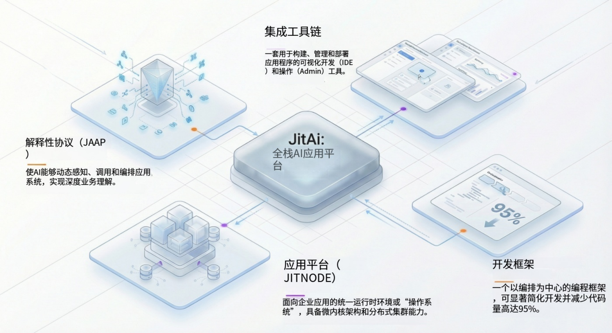

几十年来，软件工程的发展一直致力于将复杂性从开发者手中抽象出来——从汇编语言到高级语言，从单体架构到微服务。然而，大语言模型（LLMs）的兴起带来了一个根本性的悖论：虽然 LLM 擅长处理非结构化的自然语言，但现代软件却是建立在对 AI 不透明的、僵化且结构化的逻辑之上的。

为了弥合这一差距，我们不能仅仅是在遗留代码中嵌入 AI 调用。我们需要一种新的**软件工程范式**，在这种范式中，应用结构本身对 AI 既是可理解的（Intelligible），也是可修改的（Mutable）。这代表了向 **AI 原生（AI-Native）** 开发的转变。

本文将深度解析 **JitAI**，它并非一个简单的低代码工具，而是一套重构的工程体系，由四层组成：**协议（Protocol）、平台（Platform）、框架（Framework）和工具（Tools）**。我们将探讨这一技术栈如何使 AI Agent（智能体）成为核心的系统架构师，而不仅仅是聊天接口。

<!--truncate-->

## 遗留技术栈的结构性缺口

在传统架构（如 MVC、微服务）中，“业务逻辑”被深埋在编译后的代码中或分散在 API 端点之间。一个试图与此类系统交互的 AI Agent 面临两大障碍：

1.  **不可见性（Invisibility）**：如果没有详尽的文档或 Schema 定义（如通常过时的 OpenAPI 规范），AI 无法“看清”系统的能力。
2.  **僵化性（Rigidity）**：AI 可以调用函数，但无法根据动态上下文从根本上改变工作流或用户界面（UI）。

AI 原生工程要求应用结构成为**“一等公民”**——它是显式的、标准化的，并且在运行时可访问。

## JitAI 技术栈：四层重构

JitAI 通过定义一套完整的技术栈来解决这个问题。它不仅仅是一个库，而是一个由以下公式定义的整体系统：

**JitAI = 协议 + 平台 + 框架 + 工具**

### 1. 协议：JAAP (JitAI Ai Application Protocol)

位于基础层的是 **JAAP**（JitAI AI 应用协议），这是一种统一的架构语言。与结构隐式的传统代码不同，JAAP 通过显式的、自描述的元数据定义应用组成。

- **结构即数据（Structure as Data）**：应用是“**元素（Elements）**”（如页面、模型、服务）的集合，定义在 JSON 配置文件（`e.json`）中。
- **AI 可读性（AI Readability）**：由于应用结构是声明式的，LLM 可以读取 `e.json` 定义，准确理解存在哪些数据模型、哪些服务函数可用以及页面是如何构成的。
- **标准化（Standardization）**：JAAP 将业务定义与运行时执行解耦，类似于 HTML 将内容与浏览器渲染引擎解耦。

### 2. 平台：运行时容器

平台层即 **JitNode**，它是解释 JAAP 的引擎。它充当了 AI 应用的虚拟化操作系统。

- **跨平台执行**：JitNode 可在 Windows、macOS、Linux 或 Docker 上运行，无论底层基础设施如何，都能提供一致的环境。
- **环境虚拟化**：它支持在单个节点上创建多个隔离的**运行时环境（Runtime Environments）**（如开发、测试、生产），管理资源调度和负载均衡。
- **热更新（Hot-Swapping）**：由于应用由协议文件定义，平台可以实时更新单个元素（如特定的 AI Agent 或页面），而无需重启整个系统。

### 3. 框架：元素体系

框架层提供了构建模块。它采用三层继承模型：**Meta（元）→ Type（类型）→ Instance（实例）**。

- **Meta（元元素）**：能力的抽象定义（例如 `models.Meta`用于数据表，`aiagents.Meta` 用于智能体）。
- **Type（类型元素）**：具体的实现类（例如 `models.NormalType`，`aiagents.ReActType`）。开发者可以扩展这些类型以创建自定义的可复用类型。
- **Instance（实例元素）**：应用中的实际用法（例如“客户表”或“客服 Agent”）。

这种层级结构允许开发者（和 AI）通过实例化预置的 **Type** 来创建复杂功能，而无需编写样板代码。

### 4. 工具：双模式开发

工具层（**IDEApp**）本身就是一个 JitAI 应用。它提供了“**双模式（Dual-Mode）**”环境：

- **可视化编排（Visual Orchestration）**：用于定义 UI、工作流和数据模型的拖拽式界面。
- **全代码编程（Full-Code Programming）**：内置的代码编辑器（类 VSCode 体验），用于使用 Python、TypeScript 或 React 编写复杂的业务逻辑。
- **同步（Synchronization）**：可视化编辑器中的更改会立即反映在代码文件中，反之亦然，确保“结构”始终有效且可被 AI 解析。

## 实施手册：构建一个 AI 原生功能

这套技术栈如何转化为实际开发？让我们追踪创建一个与数据和 UI 交互的“智能审批 Agent”的过程。

### 步骤 1：定义协议（数据模型）

你不再创建 SQL 表，而是定义一个**数据模型元素（Data Model Element）**。

- **动作**：创建一个 `LeaveRequest`（请假申请）模型，包含申请人、天数和原因字段。
- **结果**：生成 JSON 定义。平台自动配置数据库表并生成 CRUD API。

### 步骤 2：编排逻辑（服务 & Agent）

创建用于业务逻辑的**服务元素（Service Element）**（如 `CheckLeaveBalance`）和一个 **AI Agent**。

- **动作**：在 Agent 的配置中，将 `CheckLeaveBalance` 服务和 `LeaveRequest` 模型添加为**工具（Tools）**。
- **AI 集成**：由于这些元素遵循 JAAP，Agent 会自动理解它们的 Schema。你无需为 LLM 编写手动函数定义；协议会处理这一切。

### 3. UI-AI 协同

这是独特的“AI 原生”能力。AI Agent 不仅仅是一个后端任务；它可以控制前端。

- **动作**：将 Agent 嵌入到一个“**通用页面（Generic Page）**”中。
- **逻辑**：配置一个事件：“当 Agent 工具调用时 -> 更新页面变量”。
- **结果**：当用户输入“申请 3 天休假”时，Agent 解析意图，调用内部模型创建草稿记录，并立即将数据推送到 UI 表单供用户确认。

## 对比：传统开发 vs. JitAI 开发

| **特性**     | **传统开发**                      | **JitAI (AI 原生)**          |
| ------------ | --------------------------------- | ---------------------------- |
| **系统结构** | 隐式存在于代码中 (Java/Python 类) | 显式存在于协议中 (JAAP JSON) |
| **AI 集成**  | 外部 API 调用 / 插件              | 原生“元素”参与               |
| **开发模式** | 代码优先 (Code-first)             | 可视化编排 + 全代码          |
| **UI 控制**  | 硬编码逻辑                        | AI 驱动的动态更新            |
| **扩展性**   | 库 / 微服务                       | Meta/Type 继承体系           |

## 如何验证 / 复现

要验证此架构的“AI 原生”性质，你可以使用 JitAI 桌面版执行以下测试：

1.  **安装**：下载 JitAI Desktop 节点（Windows/Mac）。
2.  **检查**：打开应用目录。你会看到文件夹结构严格遵循 `home/environs/...`。
3.  **代码检查**：打开任何元素的 `e.json` 文件。观察 `functionList` 如何显式定义方法。正是这个文件允许 LLM “读取”你的代码结构。
4.  **运行时修改**：在 IDE 中，使用内置的 **AI 助理** “给客户模型增加一个手机号字段”。观察 AI 如何直接修改 `e.json` 和 `model.py` 文件，并且更改在运行中的应用里即时生效，无需重新编译。

## JitAI 如何应对 AI 原生时代

JitAI 从根本上将开发者的角色从“编写代码”转变为“定义结构”。通过提供完整的软件工程（系统）——而不仅仅是工具——它解决了碎片化问题。

- **统一语义**：协议确保人、机器和 AI Agent 对系统有着单一的理解。
- **深度集成**：框架允许 AI 通过标准接口安全地访问全栈能力（数据库、缓存、UI 事件）。
- **演进**：平台确保随着 AI 模型的改进，底层的应用结构保持稳定和可管理。

这种架构使企业能够构建这样的应用：AI 不是一个附加特性，而是业务逻辑执行的核心引擎。

## FAQ

Q: JitAI 是低代码平台吗？

A: 虽然它提供了可视化工具，但它本质上是一个全栈工程平台。它支持全代码开发（Python/React）并生成标准的、可导出的源代码，避免了传统低代码工具的“黑盒”限制。

Q: 我可以使用自己的 LLM 吗？

A: 可以。框架通过标准的“AI 大模型元素（AI LLM Elements）”支持主流供应商（OpenAI, Anthropic）并提供私有模型接口（通过 Ollama 或类似工具）。

Q: 这与 LangChain 有什么不同？

A: LangChain 是一个用于链接 LLM 调用的库。JitAI 是一个完整的应用运行时和开发系统。JitAI 内部可能使用类似 LangGraph 的技术进行 Agent 编排，但它还处理数据库、UI 渲染、身份验证和部署，这些是库无法覆盖的。

Q: 如果我想迁移怎么办？

A: JitAI 应用基于开放语言（Python/React）构建，并以标准文件存储。你可以导出源代码。但是，运行时编排依赖于 JitNode 平台来解释 JAAP 协议。

准备好构建真正的 AI 原生应用了吗？

下载 [JitAI Desktop](https://jit.pro/zh/download) 版本 开始开发，或探索开发者指南以掌握 JAAP 协议。
