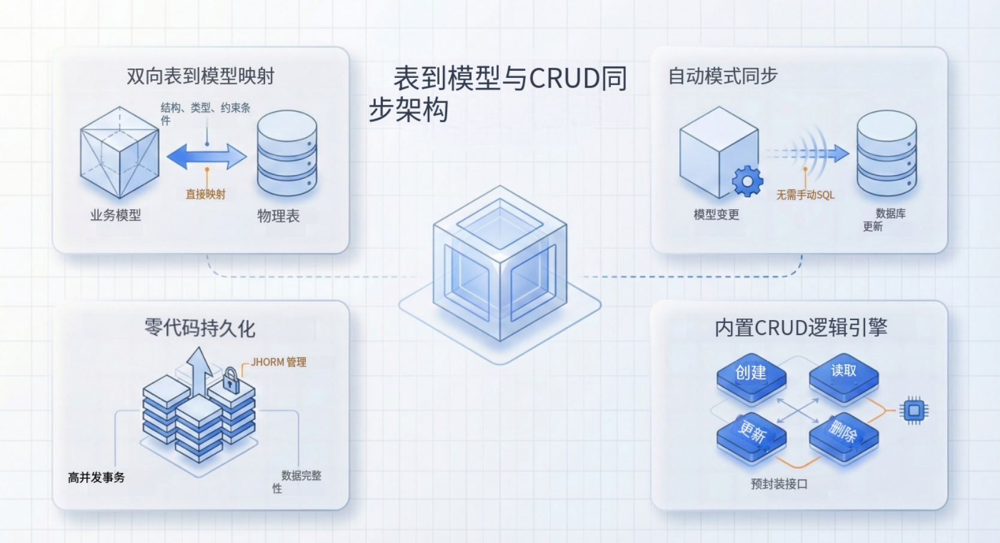

import Head from "@docusaurus/Head";

export const jsonLd = {
"@context": "https://schema.org",
"@graph": [
{
"@type": "Organization",
"@id": "https://jit.pro/#organization",
"name": "JitAI",
"legalName": "武汉万云网络科技有限公司",
"url": "https://jit.pro/",
"logo": {
"@type": "ImageObject",
"url": "https://jit-www.oss-accelerate.aliyuncs.com/logo/logo.svg"
},
"sameAs": [
"https://forum.jit.pro/",
"https://github.com/jitai-team",
"https://x.com/JitAi2017",
"https://www.instagram.com/jitai_2017",
"https://www.youtube.com/channel/UClvTNJPvBhek3aFuDy87RJQ",
"https://www.facebook.com/people/JitAi/61581485995674",
"https://www.linkedin.com/company/jitai2017"
]
},
{
"@type": "WebSite",
"@id": "https://jit.pro/#website",
"name": "JitAI",
"url": "https://jit.pro/",
"publisher": {
"@id": "https://jit.pro/#organization"
},
"inLanguage": [
"en",
"zh-CN"
]
},
{
"@type": "Blog",
"@id": "https://jit.pro/zh/blog#blog",
"name": "Blog",
"url": "https://jit.pro/zh/blog",
"isPartOf": {
"@id": "https://jit.pro/#website"
},
"publisher": {
"@id": "https://jit.pro/#organization"
},
"inLanguage": "zh-CN"
},
{
"@type": "WebPage",
"@id": "https://jit.pro/zh/blog/jitai-table-to-model-mapping-crud-sync#webpage",
"url": "https://jit.pro/zh/blog/jitai-table-to-model-mapping-crud-sync",
"name": "JitAI 快速入门：表到模型映射与 CRUD 同步",
"description": "连接外部数据库，将既有数据表映射为数据模型，并在事务、权限与审计约束下运行 CRUD 同步测试，验证可控回写与可运营的流程编排能力。",
"isPartOf": {
"@id": "https://jit.pro/#website"
},
"breadcrumb": {
"@id": "https://jit.pro/zh/blog/jitai-table-to-model-mapping-crud-sync#breadcrumb"
},
"inLanguage": "zh-CN"
},
{
"@type": "BreadcrumbList",
"@id": "https://jit.pro/zh/blog/jitai-table-to-model-mapping-crud-sync#breadcrumb",
"itemListElement": [
{
"@type": "ListItem",
"position": 1,
"name": "Home",
"item": "https://jit.pro/"
},
{
"@type": "ListItem",
"position": 2,
"name": "博客",
"item": "https://jit.pro/zh/blog"
},
{
"@type": "ListItem",
"position": 3,
"name": "JitAI 快速入门：表到模型映射与 CRUD 同步",
"item": "https://jit.pro/zh/blog/jitai-table-to-model-mapping-crud-sync"
}
]
},
{
"@type": "BlogPosting",
"@id": "https://jit.pro/zh/blog/jitai-table-to-model-mapping-crud-sync#blogposting",
"mainEntityOfPage": {
"@id": "https://jit.pro/zh/blog/jitai-table-to-model-mapping-crud-sync#webpage"
},
"url": "https://jit.pro/zh/blog/jitai-table-to-model-mapping-crud-sync",
"headline": "JitAI 快速入门：表到模型映射与 CRUD 同步",
"name": "JitAI 快速入门：表到模型映射与 CRUD 同步",
"description": "连接外部数据库，将既有数据表映射为数据模型，并在事务、权限与审计约束下运行 CRUD 同步测试，验证可控回写与可运营的流程编排能力。",
"datePublished": "2026-02-09T00:00:00.000Z",
"dateModified": "2026-02-09T00:00:00.000Z",
"inLanguage": "zh-CN",
"isPartOf": {
"@id": "https://jit.pro/zh/blog#blog"
},
"author": {
"@id": "https://jit.pro/#organization"
},
"publisher": {
"@id": "https://jit.pro/#organization"
},
"image": [
"https://jit-www.oss-accelerate.aliyuncs.com/logo/logo_dark.svg"
],
"keywords": [
"JitAI",
"快速入门",
"外部数据库",
"数据模型",
"表到模型映射",
"CRUD 同步测试",
"流程编排",
"权限审计",
"事务管理",
"基于角色的访问控制"
],
"timeRequired": "PT12M"
},
{
"@type": "FAQPage",
"@id": "https://jit.pro/zh/blog/jitai-table-to-model-mapping-crud-sync#faq",
"isPartOf": {
"@id": "https://jit.pro/zh/blog/jitai-table-to-model-mapping-crud-sync#webpage"
},
"inLanguage": "zh-CN",
"mainEntity": [
{
"@type": "Question",
"name": "如何在 1:1 导入与构建规范化模型之间取舍？",
"acceptedAnswer": {
"@type": "Answer",
"text": "当交付速度更重要且外部 schema 相对稳定时，可先按 1:1 导入快速验证链路与写入风险。多个系统共同供给同一业务领域、需要统一语义与校验治理时，优先构建规范化模型以获得更稳的演进与可控性。"
}
},
{
"@type": "Question",
"name": "上线前最小 CRUD 测试套件是什么？",
"acceptedAnswer": {
"@type": "Answer",
"text": "至少包含读/增/改/删的冒烟测试并核验数据库状态，再补充一次事务回滚验证，以及两类角色的权限约束测试（只读与可编辑），确保写入在授权范围内发生且可追溯。"
}
},
{
"@type": "Question",
"name": "“同步”一定需要 CDC 吗？",
"acceptedAnswer": {
"@type": "Answer",
"text": "同库直接回写通常不需要 CDC。跨系统复制或分阶段同步、以及需要事件驱动下游处理的场景，CDC 更有价值，可用于捕获变更并实现可重放、可观测的同步链路。"
}
},
{
"@type": "Question",
"name": "如何安全处理 schema 演进？",
"acceptedAnswer": {
"@type": "Answer",
"text": "把数据模型当作契约：为变更做版本化管理，维护映射回归测试，在启用写路径前先验证读路径的向后兼容性，并把高风险字段变更纳入审批与审计。"
}
},
{
"@type": "Question",
"name": "审计日志应该放在哪里？",
"acceptedAnswer": {
"@type": "Answer",
"text": "采用结构化日志 schema，记录 actor、action、target、timestamp、outcome、correlation IDs 等关键字段；对高风险动作补充审批上下文与结果证明，以便支持追责、合规检查与故障复盘。"
}
}
]
}
]
}

<Head>
    
</Head>

企业团队很少能享受“从零开始设计一套干净数据库”的奢侈条件。许多 “AI 原生（AI-native）” 应用仍然需要连接遗留的记录系统（systems of record），把现有数据表导入为数据模型，并在权限、事务、审计等真实约束下证明：新增 / 更新 / 删除（CRUD）始终正确可靠。

本指南给出一套实用、可复用的方法：连接外部数据库，将表映射为应用数据模型，并运行一组你可以信任的 CRUD 同步测试——这些模式适用于 AI 低代码平台与企业开发平台。

<!--truncate-->

## 为什么“表到模型映射”已成为基础能力

数据集成不再只是“数据团队才关心的事”，它已经演进为产品基础设施。

- 全球数据集成市场在 2024 年估算为 **151.8 亿美元**，预计到 2030 年达到 **302.7 亿美元**（**12.1% CAGR**）。
- 另一份行业预测认为市场将从 **175.8 亿美元（2025）** 增长到 **332.4 亿美元（2030）**（**13.6% CAGR**）。

对企业级 Agentic workflow 来说，原因很直接：一旦智能体能够执行业务动作，平台需要用与核心应用一致的方式约束 **数据正确性、回写安全性、权限可审计性**。

如果你想跟随引导式的实操流程了解 JitAI 的开发工作流，请从 [**JitAI 教程**](https://jit.pro/zh/docs/tutorial) 开始。若你希望在本地或私有环境复现实验步骤，请通过[试用 JitAI](https://jit.pro/zh/download)。

## 架构评审可复用的定义

### 外部数据库连接（External database connection）

一组受管控的配置（host/port/db/user/secret、连接池、环境隔离等），使应用运行时能够在非本地数据库中读写数据。

### 表到模型映射（Table-to-model mapping）

把数据库 schema 确定性地转换为应用数据模型：命名、类型、主键、约束、关系、默认值与索引等。

### CRUD 同步测试（CRUD sync testing）

一套测试用例，验证 Create / Read / Update / Delete 在以下两层都符合预期：

1.  应用模型层
2.  数据库状态（尤其在并发、事务、权限约束下）

### 权限审计（Permission audit）

决定“谁能执行哪些业务动作”，并记录动作发生的过程与结果（who/what/when/where/outcome）。NIST 的审计指导强调应捕获事件类型、时间、来源、结果与身份信息等关键字段。

## 开始前先定的两种集成形态

### 1）直接回写外部数据库（Direct write-back into the external database）

应用直接连接承载现有表的同一数据库。“同步”的核心聚焦在正确性与安全性：模型层写入“事实来源”，读取始终反映最新状态。

适用场景：

- 外部 DB 本身已经是 system of record
- 能获得最小权限（least-privilege）凭据
- 能接受外部 schema 的生命周期，或能通过可控迁移管理它

### 2）复制/分阶段同步（Replicated or staged sync，外部 DB 仍为权威源）

应用维护自己的应用数据库，然后通过定时任务、事件、CDC（change-data-capture）管道与外部 DB 做双向或单向同步。

适用场景：

- 外部 DB 归属其他团队/系统，schema 变更难协调
- 需要在性能、可用性、治理上做隔离
- 需要“可控回写”路径（审批、重放、回滚）

本文先聚焦“直接回写”（最快验证路径），并说明如何把测试计划扩展到分阶段同步。

## JitAI 快速开始：连接 DB、导入表、生成模型字段

### Step 1：创建数据库连接（安全优先）

JitAI 支持在一个应用中创建多个数据库连接（dev/test/prod 隔离、多系统集成）。建议将密钥（用户名/密码）存入环境变量，并提供内置的 **Test Connection** 流程用于验证连通性。

同时确认目标数据库类型是否受支持。JitAI 列出对常见 OLTP 数据库的原生支持（如 SQLite、MySQL、PostgreSQL、Oracle、SQL Server、DM8），并提供适用场景建议。

实用检查清单：

- dev/test/prod 使用独立数据库实例
- 使用最小权限 DB 用户（仅所需 schema/table/verb）
- 优先私网（VPC / 内网）连接，减少公网暴露
- 尽早验证连接池与超时策略（在导入模型之前）

### Step 2：把既有表导入为数据模型

面向遗留系统集成，JitAI 提供“基于现有数据库表创建模型”的流程：

- 选择创建方式：**Based on Existing Database Tables**
- 选择数据库连接
- 选择数据表
- 生成模型字段，并把 DB 字段映射为数据类型

这一步让“表到模型映射”变得具体可审查，也更符合企业团队对变更控制的要求。

### Step 3：理解 JitAI 中的 “data table model”

在 JitAI 的 ORM 模型类型里，**data table model** 对应数据库表；模型字段变更可同步到数据库，从而减少手工维护 schema 的成本。

这种对应关系是可靠 CRUD 测试的基础：你可以在模型层验证行为，并对数据库状态进行确定性核验。

## 能避免 80% 线上事故的映射规则

导入表后，用下面的规则做一次快速评审：

### 命名与标识

- 确认主键策略（自增、UUID、复合主键）
- 建立一致的字段命名规范，避免与保留关键字冲突
- 明确业务标识（business id）与数据库标识（db id）的表达方式

### 类型与约束

- 核验数值精度/小数位（金额字段最容易出错）
- 核验时间戳的时区处理规则
- 确认可空性与业务现实一致（可空列容易成为隐性 bug 生成器）

### 关系

- 明确关系由外键约束、应用逻辑、或两者共同保证
- 跨系统集成场景，把关系视为“契约”：文档化并纳入测试

### 为“第一条真实查询”做索引

- 为核心读路径加索引（列表页、业务键查询、按时间过滤）
- 用接近真实的基数（cardinality）做性能验证，避免玩具数据误导

## CRUD 同步测试计划：从冒烟到生产级信心

可信的 CRUD 同步测试计划不止是“插入一行成功”。

### 1）冒烟测试：先证明链路可用

导入后立即执行：

- Read：通过模型层查询前 10 行（分页 + 排序）
- Create：插入一条最小合法记录，并验证 DB 中可见
- Update：更新一个字段，验证 DB 变更与更新时间戳逻辑
- Delete：删除记录，验证 DB 删除或软删标志位变化

JitAI 内置可视化 Data Management 界面支持 CRUD（新增/编辑/删除、批量操作、导入导出），无需写代码即可快速重复冒烟测试。

### 2）功能正确性测试：业务规则

链路确认后再补齐：

- 必填字段校验（失败要快速、错误信息清晰）
- 唯一性约束（幂等键、自然键）
- 默认值（DB 默认值 vs 应用默认值）
- 软删策略（若启用）：读取过滤必须始终生效

### 3）一致性与事务测试：贴近“多步写入”现实

企业动作常涉及多次写入：创建订单、创建明细、扣减库存、发出事件等。

JitAI 的事务模型说明：默认请求级事务（Repeatable Read），成功提交、异常回滚，并支持显式的 “requires new transaction” 语义。

建议测试：

- 原子性：在 5 步写入的第 3 步失败，确认没有部分写入
- 回滚：强制抛异常，验证 DB 状态与测试前快照一致
- 隔离性：并发执行两次更新，验证结果符合你的设计（后写覆盖、冲突检测等）
- requires-new：隔离关键副作用（如审计/事件记录），确认其在外层回滚时仍能保留（仅在你明确期望时）

### 4）权限审计测试：谁能改什么

没有授权校验的 CRUD 同步测试并不完整。

至少覆盖：

- 只读角色无法写入（Create/Update/Delete 被阻断）
- 受限角色只允许在授权范围内写入（租户/组织边界）
- 高风险动作（退款、权限变更）需要更强权限，并生成更强审计记录

将审计 schema 对齐到可复用的控制框架。NIST 的 Audit & Accountability 家族提供了审计记录内容与覆盖范围的检查清单。数据质量治理层面，团队也常参考 ISO 8000-1:2022（数据质量概览）来形式化跨系统的“好数据”定义。

## 流程编排如何嵌入：CRUD 是原语，工作流才是产品

CRUD 正确性是必要条件。企业应用还需要把业务结果做成可运营的流程：

- 校验与补全（enrichment）
- 审批
- 条件分支
- 重试与补偿
- 通知与下游更新

JitAI 的平台能力概览描述了用于业务流程建模与编排的工作流与服务能力，这正是把 CRUD 动作提升为端到端可靠执行的关键层。

一个实用模式：

- 模型作为规范化的数据契约（canonical data contract）
- 多步业务动作放入可编排的服务/工作流
- 审批与高风险回写做成显式步骤
- 记录动作意图、决策过程与最终写入结果（权限审计）

## 常见坑与最快修复方式

### “dev 能跑，prod 就挂”

原因：密钥与端点硬编码、网络环境差异、权限差异。  
修复：DB 凭据使用环境变量；强制最小权限；每个环境都跑连接 + CRUD 冒烟测试。

### “映射看着对，日期和金额却不对”

原因：时区假设、精度/小数位不匹配。  
修复：为时区与数值精度写清映射规则；准备一组 golden-data 测试集。

### “批量更新很慢”

原因：缺索引、N+1 查询、大范围扫描。  
修复：对核心查询路径做 profiling；补索引；使用批处理；用真实数据量验证。

### “删除很危险”

原因：硬删且缺少审计链路。  
修复：在需要时使用软删；记录删除意图/结果、操作者身份与时间戳。

## FAQ

### 如何在 1:1 导入与构建规范化模型之间取舍？

当速度更重要且外部 schema 稳定，先做 1:1。多个系统共同供给同一领域、需要统一语义/校验/治理时，选择规范化模型更稳。

### 上线前最小 CRUD 测试套件是什么？

冒烟测试（读/增/改/删）+ 事务回滚 + 至少两类角色的权限约束（只读 vs 可编辑）。

### “同步”一定需要 CDC 吗？

同库直接回写通常不需要。跨系统复制/分阶段同步、或需要事件驱动的下游处理时，CDC 价值更高。

### 如何安全处理 schema 演进？

把数据模型当作契约：版本化变更，运行映射回归测试，上线写路径前先验证读路径的向后兼容性。

### 审计日志应该放在哪里？

使用结构化日志 schema，包含 actor、action、target、timestamp、outcome、correlation IDs，并参考 NIST AU 控制项对字段完备性做对齐。
