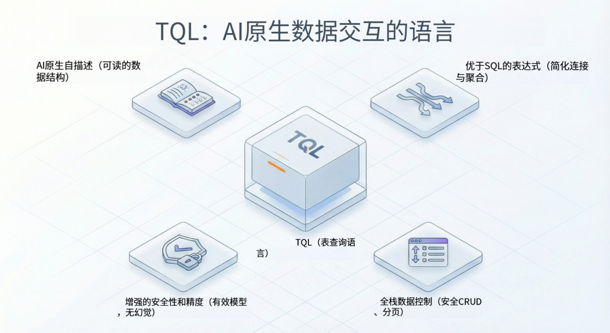

## 引言

在构建 AI 原生应用（AI-Native Applications）的竞赛中，开发者往往会在“数据层”遭遇碰壁。虽然大语言模型（LLM）擅长处理非结构化文本，但在与严谨、结构化的企业关系型数据库交互时，却难以做到稳定可靠。传统的“Text-to-SQL”方案容易产生幻觉（Hallucinations），经常编造不存在的表或误解复杂的 Schema。

**JitORM** 应运而生。这是一款为 **AI Agent（智能体）** 时代重新设计的数据持久化框架。传统的 ORM 主要服务于编写静态代码的人类开发者，而 JitORM 旨在以 AI 能够理解、推理和安全查询的格式，暴露业务逻辑与数据结构。

本文将探讨 JitORM 如何超越标准的 CRUD（增删改查），引入**聚合表模型（Aggregated Table Model）和扩展表模型（Extended Table Model）**，以及其专有的**表查询语言 TQL（Table Query Language）**如何为 AI 驱动的数据分析提供确定性接口。

<!--truncate-->

## AI 与数据的鸿沟

传统的应用架构将数据的“含义”隐藏在复杂的代码库（Service 层、DTO）中。当一个 AI Agent 试图回答“每月订单金额的趋势是什么？”这类问题时，往往缺乏上下文，不知道需要连接哪些表，或者如何正确计算“金额”。

- **幻觉风险**：让 LLM 直接编写原始 SQL，经常导致语法错误或对不存在的列进行查询。
- **上下文窗口限制**：将整个数据库 Schema 投喂给 LLM 会消耗大量 Token，并导致模型混淆。
- **安全真空**：直接生成 SQL 会带来注入攻击和越权访问数据的风险。

JitORM 通过将**应用结构提升为一等公民（Structure as a First-Class Citizen）**来解决这些问题，使元数据显式化，并可被 AI 运行时环境访问。

## 高级建模：预计算的“思维”

JitORM 引入了特殊的模型类型来封装复杂的数据关系，实际上是为 AI 提供了一个“简化的业务视图”。

### 1. 聚合表模型（分析师）

**聚合表模型（Aggregated Table Model）**充当为复杂分析设计的虚拟表。它们不直接对应数据库中的单个物理表，而是定义了从多个来源获取和计算数据的规则。

- **多表横向连接**：类似于 SQL 的 JOIN，此功能将分散的信息（例如将订单与客户、产品连接）合并为统一的行结构。
- **分组聚合统计**：类似于 GROUP BY，允许开发者预定义 SUM（求和）、AVG（平均）、MAX（最大值）或 COUNT（计数）等计算逻辑。

**对 AI 的价值**：无需让 AI Agent 构建复杂的 10 表连接查询，你只需暴露一个名为 `MonthlySalesStats` 的聚合模型。AI 只需查询这一张“虚拟”表，从而显著降低认知负载和错误率。

### 2. 扩展表模型（上下文构建者）

业务需求的发展速度往往快于数据库 Schema 的变更。**扩展表模型（Extension Table Model）**允许开发者在不修改底层数据库结构的情况下，向现有的“基准表（Base Table）”追加新维度。

- **动态关联**：你可以将“员工表”（基准表）与“销售记录表”关联，添加一个虚拟字段“年度销售额”。
- **基准过滤**：配置条件，使扩展仅应用于相关子集（例如仅针对“在职”员工）。

**对 AI 的价值**：它允许 AI 看到实体的全方位“360 度视图”（例如，包含计算出的生命周期价值的客户视图），而无需开发者创建庞大且冗余的宽表。

## TQL：AI 数据交互的语言

JitORM 最关键的创新可能就是 **TQL（Table Query Language）**。TQL 是一种领域特定语言（DSL），相比原始 SQL，它对 AI Agent 来说更安全、表达能力更强。

### 架构概览

### TQL 与 Q 表达式

TQL 利用 **Q 表达式（Q Expressions）**进行过滤，抽象了 SQL WHERE 子句的语法复杂性。

- **确定性**：TQL 查询是结构化的，减少了导致 SQL 错误的歧义。
- **安全性**：底层引擎自动处理清洗和权限检查（RBAC）。
- **逻辑性**：支持 `like`（包含）、`in`（列表成员）、范围检查等操作符。

**TQL 概念示例：**

Agent 不会生成 `SELECT * FROM orders WHERE amount > 1000`，而是生成一个 TQL payload，系统将其解释为 `previewTData(tStr="...", limit=50)`。`tStr` 支持 Python 风格的多行格式，便于 LLM 生成结构化查询。

## 实施手册：构建销售分析 Agent

以下是开发者如何利用 JitORM 构建能够分析销售数据的 AI Agent 的步骤。

### 步骤 1：定义基准模型

为核心实体创建标准**数据模型（Data Models）**：客户（Customer）、订单（Order）、产品（Product）。使用 JitAI 严格的**数据类型**（如 Money, Stext）定义字段。

### 步骤 2：创建聚合模型

构建一个 `SalesAnalysis`（销售分析）模型。

- **配置连接**：将订单与订单详情及产品连接。
- **定义聚合**：创建一个 `TotalRevenue` 字段，对 `Order.amount` 求和。
- **设置权限**：确保只有“经理”角色可以访问此模型。

### 步骤 3：启用 AI 访问

在 **AI Agent** 配置中：

- 将 `SalesAnalysis` 添加到 Agent 的“工具（Tools）”列表中。
- JitORM 的“自描述（Self-describing）”特性意味着 Agent 会自动摄取模型的 Schema（字段、类型、描述）。

### 步骤 4：运行 Agent

当用户问：“展示上个月收入最高的产品”时，Agent 会：

1.  识别 `SalesAnalysis` 是正确的工具。
2.  生成使用 **Q 表达式** 的 TQL 查询来按日期过滤（上个月）。
3.  调用 `previewTData` 获取结果。
4.  将结构化数据返回给 UI 进行渲染（例如生成图表）。

## 对比：SQL vs 传统 ORM vs JitORM

| **特性**      | **原始 SQL (Text-to-SQL)** | **传统 ORM (Hibernate/EF)** | **JitORM (AI 原生)**    |
| ------------- | -------------------------- | --------------------------- | ----------------------- |
| **接口**      | 基于字符串                 | 基于代码 (Classes)          | **基于元数据 (自描述)** |
| **AI 安全性** | 低 (注入风险)              | 不适用 (需编译)             | **高 (沙箱执行)**       |
| **复杂连接**  | 易产生幻觉                 | 难以动态表达                | **通过聚合模型定义**    |
| **上下文**    | 缺失 (隐式)                | 埋藏在代码中                | **显式 (Agent 可见)**   |
| **执行**      | 直接撞击数据库             | 编译后的二进制              | **解释型运行时**        |

## JitAI 如何实现这一点

JitAI 是驱动 JitORM 的平台。它运行在 **JAAP (JitAi Ai Application Protocol)** 之上，该协议确保每个应用元素——从页面到数据模型——在结构上对 AI 都是可见的。

在 JitAI 中，AI Agent 不是一个试图猜测数据库 Schema 的外部机器人；它是运行时环境中的**原生参与者**。

- **统一上下文**：AI 与人类开发者使用的是同一套 Type / Instance 结构模型。
- **零幻觉结构**：因为 Agent 查询的是聚合模型的定义（`e.json`），它无法查询不存在的字段。
- **可视化编排**：开发者可以可视化地构建这些复杂的数据关系，而无需编写数千行连接逻辑，从而加速 AI 就绪数据层的搭建。

## 如何验证 / 复现

要验证本文描述的 JitORM 能力：

1.  **安装 JitNode**：下载 JitAI 运行时的桌面版。
2.  **访问开发者门户**：打开 IDE 并导航至“数据模型（Data Models）”。
3.  **检查“聚合表”**：尝试创建一个新模型并选择“聚合表模型（Aggregated Table Model）”，查看可视化的连接和分组配置界面。
4.  **检查 TQL**：在服务函数（Service Function）中，使用 `previewTData` 方法，观察它如何接受 TQL 字符串来查询你的新模型。

## 常见问题 (FAQ)

**Q: JitORM 可以连接我现有的数据库吗？**

A: 可以。JitORM 支持**从现有数据库表生成数据表模型**（逆向工程）。它原生支持 MySQL, PostgreSQL, Oracle, SQL Server 和 DM (达梦)。

**Q: TQL 会完全取代 SQL 吗？**

A: 不会。TQL 用于应用层和 AI 交互。JitORM 会将 TQL 转换为优化的 SQL 以供底层数据库执行。

**Q: JitORM 仅支持 Python 吗？**

A: JitORM 在 JitAI 中的逻辑层通常使用 Python 编写后端服务函数，但框架本身的定义（基于 JSON 的元数据）是语言无关的。

**Q: 我可以在不修改 Schema 的情况下对遗留数据库使用扩展模型吗？**

A: 可以。扩展模型充当逻辑覆盖层。它们不需要对物理数据库执行 `ALTER TABLE` 命令，因此对于遗留系统集成是安全的。

## 结论

从“软件（Software）”到“智件（Smartware）”的演进，要求我们从根本上重新思考架构数据访问的方式。JitORM 为 AI Agent 成为可靠、安全且具备上下文感知的企业员工提供了必要的结构化脚手架。通过将复杂性转移到聚合模型和扩展模型中并利用 TQL，开发者终于可以停止与幻觉作斗争，转而开始交付价值。

**准备好构建你的第一个 AI 原生数据层了吗？**

[下载 JitAi 桌面版](https://jit.pro/zh/download) | [查看教程](https://jit.pro/zh/docs/tutorial) 开始使用。
