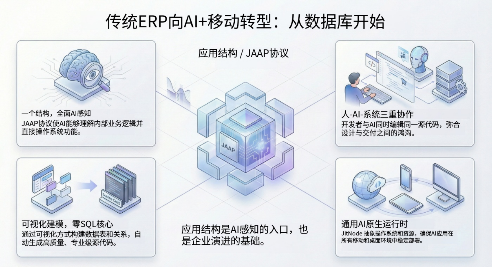

import Head from "@docusaurus/Head";

export const jsonLd = {
"@context": "https://schema.org",
"@graph": [
{
"@type": "Organization",
"@id": "https://jit.pro/#organization",
"name": "JitAI",
"legalName": "武汉万云网络科技有限公司",
"url": "https://jit.pro/",
"logo": {
"@type": "ImageObject",
"url": "https://jit-www.oss-accelerate.aliyuncs.com/logo/logo.svg"
},
"sameAs": [
"https://forum.jit.pro/",
"https://github.com/jitai-team",
"https://x.com/JitAi2017",
"https://www.instagram.com/jitai_2017",
"https://www.youtube.com/channel/UClvTNJPvBhek3aFuDy87RJQ",
"https://www.facebook.com/people/JitAi/61581485995674",
"https://www.linkedin.com/company/jitai2017"
]
},
{
"@type": "WebSite",
"@id": "https://jit.pro/#website",
"name": "JitAI",
"url": "https://jit.pro/",
"publisher": {
"@id": "https://jit.pro/#organization"
},
"inLanguage": [
"en",
"zh-CN"
]
},
{
"@type": "Blog",
"@id": "https://jit.pro/zh/blog#blog",
"name": "博客",
"url": "https://jit.pro/zh/blog",
"isPartOf": {
"@id": "https://jit.pro/#website"
},
"publisher": {
"@id": "https://jit.pro/#organization"
},
"inLanguage": "zh-CN"
},
{
"@type": "WebPage",
"@id": "https://jit.pro/zh/blog/legacy-erp-upgrade-ai-mobile-database-first#webpage",
"url": "https://jit.pro/zh/blog/legacy-erp-upgrade-ai-mobile-database-first",
"name": "老旧 ERP 升级到 AI + 移动：从数据库开始",
"description": "以“数据库优先”为起点升级老旧 ERP：先交付移动端只读查询与语音/自然语言检索，再在控制措施到位后引入审批门控的写回与审计，形成可治理的动作层。",
"isPartOf": {
"@id": "https://jit.pro/#website"
},
"breadcrumb": {
"@id": "https://jit.pro/zh/blog/legacy-erp-upgrade-ai-mobile-database-first#breadcrumb"
},
"inLanguage": "zh-CN"
},
{
"@type": "BreadcrumbList",
"@id": "https://jit.pro/zh/blog/legacy-erp-upgrade-ai-mobile-database-first#breadcrumb",
"itemListElement": [
{
"@type": "ListItem",
"position": 1,
"name": "首页",
"item": "https://jit.pro/"
},
{
"@type": "ListItem",
"position": 2,
"name": "博客",
"item": "https://jit.pro/zh/blog"
},
{
"@type": "ListItem",
"position": 3,
"name": "老旧 ERP 升级到 AI + 移动：从数据库开始",
"item": "https://jit.pro/zh/blog/legacy-erp-upgrade-ai-mobile-database-first"
}
]
},
{
"@type": "BlogPosting",
"@id": "https://jit.pro/zh/blog/legacy-erp-upgrade-ai-mobile-database-first#blogposting",
"mainEntityOfPage": {
"@id": "https://jit.pro/zh/blog/legacy-erp-upgrade-ai-mobile-database-first#webpage"
},
"url": "https://jit.pro/zh/blog/legacy-erp-upgrade-ai-mobile-database-first",
"headline": "老旧 ERP 升级到 AI + 移动：从数据库开始",
"name": "老旧 ERP 升级到 AI + 移动：从数据库开始",
"description": "主张以数据库连接作为现代化起点：先用受治理的模型交付移动端与语音/自然语言查询，再通过“变更提案—审批—审计—验证”把写回安全带入生产。",
"datePublished": "2026-02-25T00:00:00.000Z",
"dateModified": "2026-02-25T00:00:00.000Z",
"inLanguage": "zh-CN",
"isPartOf": {
"@id": "https://jit.pro/zh/blog#blog"
},
"author": {
"@id": "https://jit.pro/#organization"
},
"publisher": {
"@id": "https://jit.pro/#organization"
},
"image": [
"https://jit-www.oss-accelerate.aliyuncs.com/logo/logo_dark.svg"
],
"keywords": [
"老旧ERP升级",
"legacy ERP upgrade",
"ERP modernization",
"painless ERP upgrade",
"upgrade without replacing ERP",
"ERP mobile",
"ERP voice query",
"AI agent",
"database-first modernization",
"approval workflow",
"audit trail",
"JitAI"
],
"timeRequired": "PT12M"
},
{
"@type": "FAQPage",
"@id": "https://jit.pro/zh/blog/legacy-erp-upgrade-ai-mobile-database-first#faq",
"isPartOf": {
"@id": "https://jit.pro/zh/blog/legacy-erp-upgrade-ai-mobile-database-first#webpage"
},
"inLanguage": "zh-CN",
"mainEntity": [
{
"@type": "Question",
"name": "我们需要先迁移数据，才能加 AI 和移动端吗？",
"acceptedAnswer": {
"@type": "Answer",
"text": "起步价值不需要。只要能安全连接并对 Schema 建模，就能先交付移动查询与 AI 辅助检索，而无需迁移记录系统。"
}
},
{
"@type": "Question",
"name": "如果我们的 ERP 关键逻辑在应用层怎么办？",
"acceptedAnswer": {
"@type": "Answer",
"text": "先把读路径做到位，并约束写路径。写回环节通过审批与验证来路由变更，只启用你能强制约束的动作。"
}
},
{
"@type": "Question",
"name": "如何保证性能可预测？",
"acceptedAnswer": {
"@type": "Answer",
"text": "分析型负载尽量走只读副本；常用移动端查询使用缓存。AI 查询保持 Schema 约束，并优化允许的查询模板，让“自然语言”不等于“任意 SQL”。"
}
},
{
"@type": "Question",
"name": "什么指标能证明它在变好？",
"acceptedAnswer": {
"@type": "Answer",
"text": "关注：查询到答案的时间下降、截图式交接减少、异常处理更快、人工对账更少。引入写回后，跟踪审批延迟、错误率与回滚频率。"
}
}
]
}
]
}

<Head>
    
</Head>

周五下午 4:57，仓库主管站在装货月台上，一手拿手机，一手拿托盘标签。  
他只需要从 ERP 里查一个数字——可承诺供货量（ATP，available-to-promise）。可“真正能用的界面”只能在连着 VPN 的办公电脑上打开，于是他只能发消息让同事截个图。截图来得太晚，出货出了错，周一一上班就变成一场对账救火。

这里的核心判断是：**把现有数据库当作起步的接口，在上面先交付一层轻量动作层，再在控制措施到位后逐步升级到受治理的写回，是让老旧 ERP 最快走向“AI + 移动”的路径。**

<!--truncate-->

## 为什么老旧 ERP 的现代化总卡在最痛的地方

多数 ERP 升级讨论从“界面焕新”或“整体替换”开始。  
这种选项很容易把问题推向一个“伪二选一”：要么继续忍受桌面端界面，要么重写整个系统。

现实里，痛点通常集中在三个每天都会发生的时刻：一线现场、外勤现场、月末结算。  
当决策发生在远离工位的地方时，移动访问缺失；当人需要理解某个数字背后的原因时，AI 帮助缺失；当大家用表格和聊天截图绕开系统工作时，审计与追溯变得更难。

当记录系统（system of record）被锁在老旧界面背后，组织会用影子流程来补位。  
一旦绕行变成习惯，ERP 就会退化成一套“大家不敢直接碰、却又离不开”的数据库。

## 逆向的起点：你的数据库已经是一份契约

老旧 ERP 在 Schema 层面变化很慢。  
表、主键、字段含义往往非常稳定，因为改动会破坏报表、集成链路与对账。

这种稳定性恰好是现代化的杠杆。  
只要你能安全连接数据库，就能在不等待“推倒重来”的前提下交付价值。

这也是“先连数据库”的方式能跨行业扩展的原因。  
无论 ERP 部署在本地、托管环境还是混合架构，起步的工件都是同一个：运营数据模型。

市场信号也在强化紧迫性：**ERP 市场仍在增长，混合形态持续扩张**，意味着“现代 + 遗留并存”正成为常态运行，而非短期过渡。

## “只接数据库”到底是什么意思

这并不等同于把 AI 智能体直接塞进数据库管理员账号里，然后祈祷一切顺利。  
它强调构建一个可控的访问层：可以从只读开始，然后逐步演进。

在许多“老系统接 AI”的落地中，团队最终会收敛到一组最低可行的集成面：数据库连接、文件导入/导出、以及系统已有的接口。数据库连接常常成为最快的起点，因为它天然存在。

为了把这件事做得安全、也能达到企业级质量，可以把“数据库连接”当作产品能力来设计，边界要明确：

- 定义 *读路径*：用于提问、检索、查询、报表
- 定义 *写路径*：用于动作、变更、更新
- 在自动化之前，就把审批、审计、权限控制先放到写路径上

如果目标是“AI + 移动”，设计目标也在改变。Gartner 认为，随着助手嵌入工作流，企业应用正在远离“键盘为中心”的交互方式。

## 一套可复用的蓝图：数据库优先 → 移动优先 → AI 优先

下面是一条最小化、可复用的序列：在不强迫启动替换项目的前提下，把老旧 ERP 逐步推进到“AI + 移动”的体验。

1.  **以最小权限连接 ERP 数据库（从只读开始）。**  
    使用专用集成用户，只开放必要的 Schema/表；分析量较大时优先使用只读副本（replica）。
2.  **把数据表映射为受治理的领域模型。**  
    统一字段含义、强制数据类型、挂载业务语义，让 “status”“amount” 这类字段不再含糊。
3.  **先交付移动端查询：搜索、查找、按角色的仪表盘。**  
    第一个胜利点是“现场拿到答案”，不再依赖截图、VPN 摩擦和老界面培训。
4.  **在同一套模型之上叠加自然语言与语音查询。**  
    当模型受 Schema 约束时，AI 能把请求翻译成可解释、可控的查询，并返回有依据的结果。
5.  **引入“先提出建议，不直接执行”的动作模式。**  
    智能体先起草变更（例如合并重复供应商、更新订单阶段、标记异常），并打包证据。
6.  **对高风险写回启用审批门控，并做审计与验证。**  
    Human-in-the-loop 是从“好用”走向“可上生产”的桥梁，尤其适用于记录系统。

这时平台化会更省力。在 JitAI 里，团队通常会把数据库表导入为具备 ORM 特性的模型，移动端 UI 与智能体工具调用复用同一套模型；审批与审计作为执行层能力接入后，端到端链路更容易看清并治理。如果你想看一个具体的上手流程，可以从 [JitAI 教程](https://jit.pro/zh/docs/tutorial) 开始。

## 为什么这条路会形成“复利”，而不是增加碎片化

数据库优先的现代化会沉淀一套可复用的“真相对象”。  
同一套受治理模型可以同时支撑移动端界面、分析、以及 AI 工具调用。

这种复用性很关键，因为 AI 功能很少会长期停留在“小功能”。  
“语音查库存”很快会变成“解释异常”，再变成“建议调拨”，再变成“起草采购计划”，最终可能走到“应用已批准的变更”。

当模型一致、并且具备权限边界时，这种扩展仍可控。  
如果每个功能都各写一套 SQL、各带一套隐含假设、各走一套安全捷径，你会得到一个看起来很现代、但行为不可预测的系统。

同时还有一个趋势顺风：**任务型 AI 智能体将快速嵌入企业应用**。Gartner 预测到 **2026 年，最高 40% 的企业应用会包含任务型 AI 智能体**，而 2025 年这一比例还低于 5%。

这个数字的意义不在于精确本身，更像产品信号：  
当 ERP 体验走向“智能体增强的工作流”，底层需要一层受 Schema 约束、可治理的执行层来承载。

## 常见反对意见：“数据库优先会绕开业务逻辑”

这个担忧成立。  
不少 ERP 的规则被编码在存储过程、触发器或应用层校验里，确实不能忽略。

数据库优先的现代化需要把“直接数据访问”当作可控接口来设计，而不是走捷径。  
如果逻辑在 ERP 内，那么动作层要么调用这些逻辑，要么在可控范围内安全复现，要么把写回限制在那些天然适合受控更新的字段上。

一个实用的应对模式可以这样落地：

先从只读开始，让价值在零风险下先出现。  
然后在写回环节，引入变更提案、审批与验证步骤，把 “before/after” 与你定义的约束进行比对。

规则过于复杂时，就减少自动化，多做引导。  
字段过于敏感时，就把它放进更严格的审批策略里，或直接从智能体工具面移除。

治理标准也在朝同一方向演进。ISO 将 ISO/IEC 42001:2023 描述为 AI 管理体系标准，反映了组织对 AI 能力需要正式控制与问责的更广泛期待。

## 用一条链看行业动态：信号 → 瓶颈 → 下一代产品形态

采用信号很明确：企业希望在业务应用里嵌入助手与任务型智能体。  
同时，交互也在向“助手主导”的体验迁移，尤其在移动端；Gartner 预测到 2027 年，移动应用使用量可能因为 AI 助手而下降 25%。

瓶颈也很明确：老系统保存着真相，却很难在“工作发生的那一刻”把真相交付出来。  
当团队在缺乏 Schema 约束、权限边界与可审计性的情况下强行叠加 AI，往往会出现“Demo 很惊艳、生产很脆弱”的结果。

所以未来 12–18 个月更可能出现的产品形态会趋同：  
一层受治理的“动作层”连接记录系统，把受 Schema 约束的模型暴露为工具，先交付移动优先访问，再叠加带审批与审计的智能体工作流。

如果你的老旧 ERP 正是数据所在之处，现代化首先是“集成 + 治理”问题。  
等你已经用结果赢下关键路径之后，再去讨论界面替换，也不迟。

## 本季度从哪里开始

从一个“现场工作”旅程开始：移动访问目前是明确瓶颈的那种。  
优先选择高频、强时效、当前依赖截图/聊天/手工导出的流程。

第一版范围控制在只读与按角色可见。  
只要应用稳定地回答问题，采用会自然发生，因为它减少摩擦，同时不改变 ERP 的运行方式。

最后，把写回当作第二个里程碑来规划，而不是悄悄塞进第一版。  
只要变更会影响收入确认、库存计价或客户承诺，就把它当成一次可控部署：有审批、有审计、有回滚策略。

如果你想快速搭一个沙盒来测试“数据库到模型映射”以及智能体可用的执行层，可以 [试用 JitAI](https://jit.pro/zh/download)。

## FAQ

### 我们需要先迁移数据，才能加 AI 和移动端吗？

起步价值不需要。  
只要能安全连接并对 Schema 建模，就能先交付移动查询与 AI 辅助检索，而无需迁移记录系统。

### 如果我们的 ERP 关键逻辑在应用层怎么办？

那就先把读路径做到位，并约束写路径。  
写回环节通过审批与验证来路由变更，只启用你能强制约束的动作。

### 如何保证性能可预测？

分析型负载尽量走只读副本；常用移动端查询使用缓存。  
AI 查询保持 Schema 约束，并优化允许的查询模板，让“自然语言”不等于“任意 SQL”。

### 什么指标能证明它在变好？

关注：查询到答案的时间下降、截图式交接减少、异常处理更快、人工对账更少。  
引入写回后，跟踪审批延迟、错误率与回滚频率。
