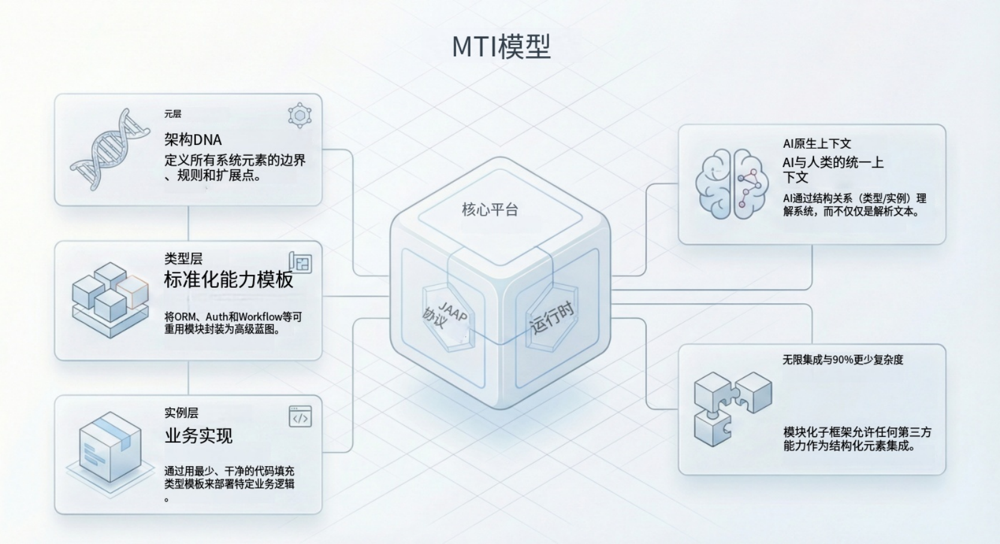

在 AI 原生开发时代，传统软件架构面临着一个独特的挑战：**不透明性（Opacity）**。

当业务逻辑被深埋在数千行复杂的“面条代码”中时，大语言模型（LLM）很难理解并安全地修改这些隐式代码库。要构建一个允许 AI Agent 真正参与协作的系统，我们必须转变思维：**系统结构不能仅仅是代码的副产物，而必须成为“一等公民”。**

这种需求催生了 **Meta-Type-Instance (MTI)** 模型——一种分层的架构模式，它将接口定义、实现逻辑与运行时配置解耦。通过构建**显式结构（Explicit Structure）**，MTI 模型将应用开发从编写不透明的文本代码，转变为对语义化元素的编排。

<!--truncate-->

## 核心问题：隐式结构 vs 显式结构

在传统的面向对象编程（OOP）中，应用的结构是**隐式**的。它仅存在于编译后代码的抽象语法树（AST）中。如果一个 AI Agent 试图修改“用户服务”，它必须解析整个文件，理解特定框架（如 Spring, Django, NestJS）的约定，并祈祷不会破坏隐藏的依赖关系。

MTI 模型通过 **元素化（Elementization）** 解决了这个问题——将应用程序分解为离散的、自描述的单元，每个单元都由严格的协议定义。

## MTI 分层架构

MTI 模型将系统的每个组件组织成三个独特的层级：

1.  **Meta（协议层）**：定义抽象能力和接口。它告诉系统“这个元素**是什么**”。
2.  **Type（实现层）**：提供具体的逻辑或驱动。它告诉系统“这个元素**如何工作**”。
3.  **Instance（配置层/实例层）**：代表业务场景中的具体用法。它配置了状态和参数。

## 深入解析三层架构

### 1. Meta：结构契约

Meta 层充当系统的“立法机构”。它定义了一族元素的标准行为和数据结构。例如，`services.Meta` 元素可能定义了所有服务必须具备 `functionList` 和 `invoke()` 方法。

- **角色**：标准化与发现。
- **AI 价值**：允许 AI 瞬间识别出“这是一个服务”或“这是一个数据库”，而无需分析底层的实现代码。

### 2. Type：逻辑封装

Type 层充当“行政机构”。它实现了 Meta 定义的逻辑。这是开发者编写代码（Python, TypeScript, Java）的地方，用于对接第三方 API、数据库或算法。

- **角色**：技术实现与复用。
- **示例**：在 `llms.Meta`（LLM 提供商）下，你可以有 `llms.OpenAI`（OpenAI 实现）和 `llms.Local`（本地模型实现）。
- **扩展性**：开发者可以通过创建自定义 Type 来扩展系统能力（例如，创建一个新的 `IoTDeviceType` 来连接工厂传感器）。

### 3. Instance：业务上下文

Instance 层代表软件的实际使用情况。Instance 是通过选择一个 Type 并配置其参数来创建的。

- **角色**：业务逻辑与状态。
- **示例**：一个“营销文案助手” Instance 使用了 `llms.OpenAI` Type，并配置了特定的 API Key 和系统提示词（System Prompt）。
- **隔离性**：修改 Instance 的配置不会影响底层的 Type 逻辑，从而确保系统稳定性。

## JitAI 如何实现：JAAP 协议

JitAI 通过 **JAAP (JitAi Ai Application Protocol)** 实现了 MTI 模型。JAAP 将应用结构提升为一种对人类和 AI Agent 都可读写的“显式结构”。

### JAAP 元素拆解

在 JitAI 中，万物皆元素，且都遵循 MTI 模式。这包括可见的组件（如页面）和不可见的组件（如逻辑函数）。

| **MTI 层级** | **JitAI 示例 (LLM)**          | **JitAI 示例 (存储)**    | **主要职责**                              |
| ------------ | ----------------------------- | ------------------------ | ----------------------------------------- |
| **Meta**     | `llms.Meta`                   | `storages.Meta`          | 定义输入/输出模式（Schema）和必需方法。   |
| **Type**     | `llms.OpenAI`, `llms.Bailian` | `storages.AliyunOssType` | 封装 SDK 调用、重试机制和 API 处理逻辑。  |
| **Instance** | `MyCreativeHelper`            | `UserAvatarStorage`      | 保存 API Key、Bucket 名称及特定业务设置。 |

### 对 AI Agent 的意义

由于 JitAI 通过 JSON 配置（如 `e.json`）显式暴露了这种结构，AI Agent 可以：

1.  **读取**：“我看到 `MyCreativeHelper` 是 `llms.OpenAI` 的一个实例。”
2.  **分析**：“它缺少了 `llms.Meta` 中定义的 `fallback_model` 配置。”
3.  **行动**：“我将更新 Instance 配置以添加回退模型。”——整个过程完全不需要触碰 `llms.OpenAI` Type 内部的 Python 代码，从而规避了风险。

## 实战指南：扩展系统

MTI 模型最强大的特性之一是**非侵入式扩展（Non-intrusive Extensibility）**。开发者可以在不修改核心平台的情况下，通过添加新的 Type 来扩展框架。

### 场景：添加自定义“钉钉通知”服务

#### 步骤 1：确定 Meta

确定新功能属于哪个家族。对于通知机器人，我们可以复用现有的通知或机器人 Meta，或者创建一个通用的服务 Meta。

- **目标**：`services.Meta`（通用服务）或自定义 `imRobots.Meta`。

#### 步骤 2：创建 Type

为你的 Type 元素创建一个新目录。

- **目录**：`imRobots/DingTalkType/`
- **定义 (**`**e.json**`**)**：声明 `type = "imRobots.Meta"`。
- **逻辑 (**`**index.py**`**)**：实现调用钉钉 Webhook API 的代码。

#### 步骤 3：创建 Instance

在可视化编辑器或配置中，实例化你的新 Type。

- **Instance**：`HR_Alert_Bot`
- **配置**：设置 HR 部门频道的特定 Webhook URL 和 Secret。

#### 步骤 4：使用

系统的其他部分（Agent、工作流）现在可以纯粹根据其定义的能力来引用 `HR_Alert_Bot`，而无需了解底层的 API 复杂性。

## 对比：MTI vs 传统 OOP

| **特性**        | **传统 OOP / MVC**            | **JitAI MTI 模型**              |
| --------------- | ----------------------------- | ------------------------------- |
| **结构来源**    | 隐式存在于代码中 (AST)        | 显式存在于配置中 (`e.json`)     |
| **AI 修改方式** | AI 必须重写代码文件（高风险） | AI 修改 Instance 配置（低风险） |
| **扩展性**      | 继承、接口实现                | 在 Meta 下注册新 Type           |
| **颗粒度**      | 类（Class）与对象（Object）   | 元素（Meta/Type/Instance）      |
| **互操作性**    | 刚性，通常需要重新编译        | 动态，基于协议的绑定            |

## 如何验证与复现

要在 JitAI 项目中观察 MTI 模型的实际运作：

1.  **定位** `**e.json**` **文件**：JitAI 应用中的每个元素都有一个 `e.json` 文件。
2.  **检查** `**type**` **字段**：该字段指向 Type 元素。
    - 例如：`"type": "pages.GridPageType"` 表示该 Instance 使用了网格页面（Grid Page）的实现。

3.  **追踪层级**：
    - 查阅 `framework/JitWeb/pages/regular-page.md`（或类似文档）。
    - 你会发现 `pages.GridPageType` 指向 `pages.Meta`。
    - 这证实了 **Meta -> Type -> Instance** 的血缘关系。

## FAQ

**Q: "Meta" 仅仅是一个接口（Interface）吗？**

A: 从概念上讲，是的。在 JitAI 中，它是一个结构契约，定义了 Type 必须支持哪些配置字段（`inputArgs`）和方法（`functionList`）。

**Q: 我可以修改 JitAI 提供的官方 Type 吗？**

A: 可以。因为它们只是系统中的元素，你可以继承它们，或者复制粘贴创建你自己的修改版（例如 `MyCustomOpenAIType`），在保持相同接口的同时覆盖特定行为。

**Q: MTI 会增加开发负担吗？**

A: 它只是转移了工作量。你不需要为每个实例编写样板代码，而是编写一次 Type 逻辑，然后快速配置多个 Instance。对于 AI Agent 来说，这种结构极大地降低了生成有效应用程序的复杂度。

## 结语

Meta-Type-Instance 模型不仅仅是一种架构偏好；它是 AI 原生软件工程的先决条件。通过解耦定义（Meta）、实现（Type）和用法（Instance），JitAI 创造了一个结构化的环境，让人类和 AI Agent 能够安全、高效地协作。
