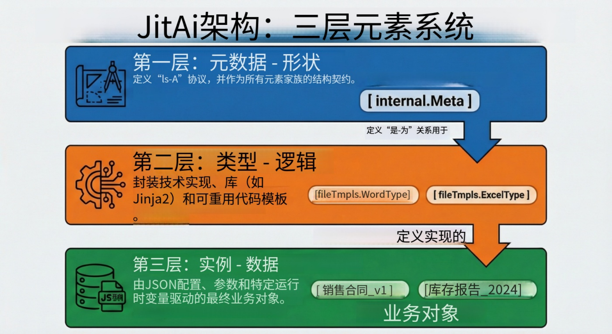

在传统软件工程中，面向对象编程（OOP）为我们带来了“类（Class）”与“对象（Object）”。当代码的阅读者和编写者仅限于人类时，这套体系运作良好。然而，当我们转向 AI 原生开发——即 AI 智能体（Agent）开始作为共同开发者和系统运维者参与其中时——传统的类继承体系往往缺乏足够的语义透明度，使得 LLM（大语言模型）难以安全地操控系统行为。

为了构建一个对 AI 真正“可理解”的软件系统，我们必须将“结构”提升为一等公民。这正是 **Meta-Type-Instance (MTI)** 模型的核心所在。不同于简单的继承关系，MTI 创造了一个三层架构空间，将接口定义（Meta）、技术实现（Type）和业务配置（Instance）彻底解耦。这种分离使得 AI 智能体能够推理系统能力（Meta）并生成业务价值（Instance），而开发者则专注于技术封装（Type）。

<!--truncate-->

## MTI 模型剖析

MTI 模型将软件元素组织为三个截然不同的抽象层级。这种层级划分不仅是为了代码组织，更是 AI 与人类在同一代码库上协作的治理模型。

### 1. Meta（元）：抽象契约

Meta 层定义了功能域的基础能力和接口契约。它告诉系统（以及 AI）组件“是什么”，而不涉及“如何工作”。它是顶层的分类标准。

- **角色**：定义结构协议（输入、输出、事件）。
- **可变性**：运行时 AI 不可变；由平台架构师定义。
- **示例**：一个“页面元（Page Meta）”定义了所有页面都必须具备 URL、标题和渲染生命周期。

### 2. Type（类型）：技术实现

Type 层提供了 Meta 的具体技术实现。这是开发者编写代码（Python, React 等）的地方，用于封装逻辑、第三方集成或复杂算法。

- **角色**：封装技术复杂性与逻辑。
- **可变性**：由开发者扩展；由 AI 选择使用。
- **示例**：在“页面元”之下，可能存在“Markdown 页面类型（MarkdownPage Type）”（用于静态文档）和“Vue 全代码页面类型（VueFullCodePage Type）”（用于复杂应用）。两者对外表现都是页面，但内部运作机制截然不同。

### 3. Instance（实例）：业务落地

Instance 层是 Type 的具体使用，配置了具体的业务数据。这是 AI 智能体操作最频繁的层级——通过调整配置文件（通常是 JSON）来创建、修改和删除实例，而无需重写核心代码。

- **角色**：满足特定的业务需求。
- **可变性**：用户和 AI 智能体高度可变。
- **示例**：“2024 Q3 财务报告”是“Markdown 页面类型”的一个具体实例。

### 架构图：MTI 层级结构



## 为什么 MTI 对 AI 智能体至关重要

在标准代码库中，业务逻辑与技术实现往往交织在一起。如果你要求 AI “添加一个钉钉通知”，它可能会尝试将 HTTP 请求代码直接注入到业务函数中。这会导致代码脆弱且难以维护。

MTI 模型充当了护栏的作用。由于 Type 封装了技术实现（例如钉钉 SDK 集成代码），AI 智能体只需要实例化该 Type 并提供必要的配置（Instance）即可。

### 扩展性的关键优势

- **复杂性隔离**：开发者可以构建复杂的 Type（例如处理分片和嵌入的“向量数据库类型”），而 AI 仅将其作为工具使用。
- **标准化发现**：AI 智能体可以查询特定 Meta 下的所有可用 Type，从而动态发现系统能力。
- **安全演进**：只要 Meta 契约保持不变，你可以在 Type 内部升级代码，而不会破坏成千上万依赖它的 Instance。

## JitAI 如何实现这一架构

JitAI 通过 **JAAP (JitAi AI Application Protocol)** 将 MTI 模型落地。与那些仅仅将 AI 嫁接在现有 API 上的平台不同，JitAI 将应用结构本身视为 AI 可读写的数据。

### JAAP 实现机制

在 JitAI 中，每个元素都遵循 MTI 结构。以 AI 知识库（AI Knowledge Base）领域为例：

- **Meta**: `rags.Meta`（定义检索能力）
- **Type**: `rags.NormalType`（标准 RAG 实现）
- **Instance**: `My_Customer_Support_KB`（特定知识库）

这种架构使得 JitAI 能够提供“双模式（Dual-Mode）”开发体验。开发者可以用 Python 编写自定义 Type（例如专有的 RAG 算法），而业务用户（或 AI）可以在可视化编辑器中立即使用该 Type 创建 Instance。

### 对比：传统开发 vs. MTI 驱动开发

| **特性**        | **传统框架**                     | **JitAI (MTI 模型)**                      |
| --------------- | -------------------------------- | ----------------------------------------- |
| **核心抽象**    | 类 (Classes) / 接口 (Interfaces) | 元 (Meta) / 类型 (Type) / 实例 (Instance) |
| **AI 交互方式** | 代码生成 (Copilot)               | 结构修改 (Agents)                         |
| **扩展性**      | 继承 / 装饰器                    | Type 扩展 / 覆写                          |
| **配置管理**    | ENV 文件 / 数据库表              | 实例 `e.json` & 配置文件                  |
| **逻辑复用**    | 库 (Libraries) / 模块 (Modules)  | 元素家族 (Element Families)               |

## 实战指南：扩展系统

MTI 最强大的功能之一是能够通过创建继承自现有 Meta 的新 Type 来扩展系统。以下是在真实场景中（例如添加自定义“钉钉机器人”集成）如何激活这种扩展性。

### 第一步：确定 Meta

确定新组件属于哪个家族。对于聊天机器人，它归属于 `imRobots` Meta。

### 第二步：创建 Type 元素

不同于编写独立脚本，你需要创建一个新的 Type 目录结构。这里封装了 SDK 逻辑。

- **路径**: `imRobots/dingTalkStreamType/`
- **定义 (**`**e.json**`**)**: 声明 `type` 指向 Meta。
- **实现**: 编写 Python 逻辑以处理钉钉 Stream 模式协议。

### 第三步：通过配置实例化

一旦 Type 定义完成，你（或 AI）只需创建一个配置文件即可生成 Instance。

- **文件**: `my_bot/e.json`
- **内容**:

JSON

```plaintext
{
  "type": "imRobots.dingTalkStreamType",
  "title": "HR 助理机器人",
  "authConfig": { "clientId": "..." }
}

```

## 如何验证与复现

要验证 JitAI 项目中的 MTI 分离，你可以直接检查文件结构：

1.  **定位定义**：导航到框架或应用目录。
2.  **检查** `**e.json**`：打开任意元素的配置文件。
3.  **查看** `**type**` **字段**：
    - 如果它指向像 `pages.MarkdownPageType` 这样的定义，你看到的是一个 **Instance**。
    - 如果你查看 `MarkdownPageType` 的源码，发现它引用了 `pages.Meta`，那么你看到的是一个 **Type**。

4.  **追踪逻辑**：观察 Instance 不包含代码，只有配置（标题、内容路径），而 Type 包含处理该配置的逻辑（`.py` 或 `.ts` 文件）。

## 常见问题 (FAQ)

**Q: MTI 与 Java/C# 中的标准类-对象（Class-Object）关系有何不同？**

A: 是的，有很大不同。虽然概念相似，但此处的 MTI 将“Type”提升为一个可以在运行时定义、替换和配置的实体，而无需重新编译核心平台。它更接近于系统工程中使用的元对象设施（MOF）标准，而非简单的 OOP 类继承。

**Q: 我可以创建自己的 Meta 吗？**

A: 可以。虽然框架提供了标准 Meta（页面、服务、模型），但高级架构师可以定义全新的 Meta，从而向平台引入全新类别的软件元素。

**Q: AI 真的理解“Type”吗？**

A: 是的。因为 Type 是 JAAP 协议中的自描述元素，AI 可以读取 Type 的定义来理解它需要什么输入以及提供什么能力，从而正确地“使用”工具，而不会产生 API 签名幻觉。

## 结语

MTI 模型解决了 AI 工程时代的一个根本挑战：如何赋予智能体构建系统的能力，而不赋予其制造混乱的权力。通过严格分离抽象契约（Meta）、技术封装（Type）和业务应用（Instance），我们创造了一个 AI 与人类可以安全协作的结构化空间。
