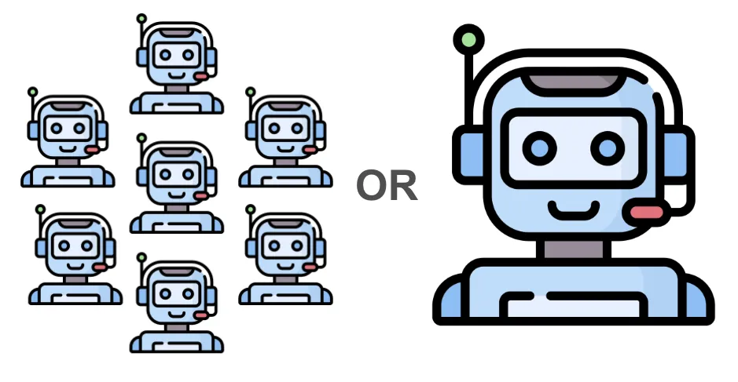

import Head from "@docusaurus/Head";

export const jsonLd = {
"@context": "https://schema.org",
"@graph": [
{
"@type": "Organization",
"@id": "https://jit.pro/#organization",
"name": "JitAI",
"legalName": "武汉万云网络科技有限公司",
"url": "https://jit.pro/",
"logo": {
"@type": "ImageObject",
"url": "https://jit-www.oss-accelerate.aliyuncs.com/logo/logo.svg"
},
"sameAs": [
"https://forum.jit.pro/",
"https://github.com/jitai-team",
"https://x.com/JitAi2017",
"https://www.instagram.com/jitai_2017",
"https://www.youtube.com/channel/UClvTNJPvBhek3aFuDy87RJQ",
"https://www.facebook.com/people/JitAi/61581485995674",
"https://www.linkedin.com/company/jitai2017"
]
},
{
"@type": "WebSite",
"@id": "https://jit.pro/#website",
"name": "JitAI",
"url": "https://jit.pro/",
"publisher": {
"@id": "https://jit.pro/#organization"
},
"inLanguage": ["en", "zh-CN"]
},
{
"@type": "Blog",
"@id": "https://jit.pro/zh/blog#blog",
"name": "Blog",
"url": "https://jit.pro/zh/blog",
"isPartOf": {
"@id": "https://jit.pro/#website"
},
"publisher": {
"@id": "https://jit.pro/#organization"
},
"inLanguage": "zh-CN"
},
{
"@type": "WebPage",
"@id": "https://jit.pro/zh/blog/multi-agent-systems-glossary-orchestration-roles#webpage",
"url": "https://jit.pro/zh/blog/multi-agent-systems-glossary-orchestration-roles",
"name": "多智能体系统术语表：编排与角色",
"description": "面向企业工作流落地的多智能体系统（MAS）术语表：协作与分工、工具调用与函数调用、任务编排与工作流编排，以及治理与可运营的关键概念与模式。",
"isPartOf": {
"@id": "https://jit.pro/#website"
},
"breadcrumb": {
"@id": "https://jit.pro/zh/blog/multi-agent-systems-glossary-orchestration-roles#breadcrumb"
},
"inLanguage": "zh-CN"
},
{
"@type": "BreadcrumbList",
"@id": "https://jit.pro/zh/blog/multi-agent-systems-glossary-orchestration-roles#breadcrumb",
"itemListElement": [
{
"@type": "ListItem",
"position": 1,
"name": "Home",
"item": "https://jit.pro/"
},
{
"@type": "ListItem",
"position": 2,
"name": "博客",
"item": "https://jit.pro/zh/blog"
},
{
"@type": "ListItem",
"position": 3,
"name": "多智能体系统术语表：编排与角色",
"item": "https://jit.pro/zh/blog/multi-agent-systems-glossary-orchestration-roles"
}
]
},
{
"@type": "BlogPosting",
"@id": "https://jit.pro/zh/blog/multi-agent-systems-glossary-orchestration-roles#blogposting",
"mainEntityOfPage": {
"@id": "https://jit.pro/zh/blog/multi-agent-systems-glossary-orchestration-roles#webpage"
},
"url": "https://jit.pro/zh/blog/multi-agent-systems-glossary-orchestration-roles",
"headline": "多智能体系统术语表：编排与角色",
"name": "多智能体系统术语表：编排与角色",
"description": "面向企业工作流落地的多智能体系统（MAS）术语表：协作与分工、工具调用与函数调用、任务编排与工作流编排，以及治理与可运营的关键概念与模式。",
"datePublished": "2026-02-05T00:00:00.000Z",
"dateModified": "2026-02-05T00:00:00.000Z",
"inLanguage": "zh-CN",
"isPartOf": {
"@id": "https://jit.pro/zh/blog#blog"
},
"author": {
"@id": "https://jit.pro/#organization"
},
"publisher": {
"@id": "https://jit.pro/#organization"
},
"image": ["https://jit-www.oss-accelerate.aliyuncs.com/logo/logo_dark.svg"],
"keywords": [
"多智能体系统",
"AI 智能体",
"智能体式 AI",
"工具调用",
"函数调用",
"任务编排",
"工作流编排",
"智能体协调",
"智能体角色",
"企业 AI 治理"
],
"timeRequired": "PT12M"
},
{
"@type": "FAQPage",
"@id": "https://jit.pro/zh/blog/multi-agent-systems-glossary-orchestration-roles#faq",
"isPartOf": {
"@id": "https://jit.pro/zh/blog/multi-agent-systems-glossary-orchestration-roles#webpage"
},
"inLanguage": "zh-CN",
"mainEntity": [
{
"@type": "Question",
"name": "Tool calling 与 function calling 有何区别？",
"acceptedAnswer": {
"@type": "Answer",
"text": "Tool calling 是调用外部工具（API、数据库、服务）的通用模式；function calling 是结构化形态，要求调用严格匹配预先声明的 schema，从而便于校验、访问控制、日志记录与更安全的自动化。"
}
},
{
"@type": "Question",
"name": "多智能体系统一定需要中央编排器吗？",
"acceptedAnswer": {
"@type": "Answer",
"text": "很多企业会从集中式编排开始，以便统一做路由、策略校验、重试与可追溯审计。分布式协调有利于扩展性与韧性，同时会提高一致性治理与排障复杂度。"
}
},
{
"@type": "Question",
"name": "如何避免智能体互相“抢活”或重复工作？",
"acceptedAnswer": {
"@type": "Answer",
"text": "关键做法包括：明确任务分配与责任边界、带所有权规则的共享状态、基于 schema 的交接校验，以及冲突解决策略（合并、重试、升级到人工）。再配合预算与超时，避免协调失败级联。"
}
},
{
"@type": "Question",
"name": "回写核心系统前，治理侧至少要有什么产物？",
"acceptedAnswer": {
"@type": "Answer",
"text": "至少包括：受权限控制的工具目录（含 schema 与鉴权策略）、动作级策略校验、对高风险变更的审批门槛，以及端到端审计日志（提示词、工具输入输出、策略决策与记录更新）。同时建议具备幂等与补偿机制以支持安全恢复。"
}
},
{
"@type": "Question",
"name": "什么时候 MAS 值得承担额外复杂度？",
"acceptedAnswer": {
"@type": "Answer",
"text": "当任务天然可拆成专才子问题（数据、策略、执行、验证）、工具跨多个系统需要路由与约束、并行能力决定延迟或吞吐、并且需要清晰责任边界支撑审计与审批时，多智能体系统的收益更高。"
}
}
]
}
]
}

<Head>
    
</Head>

多智能体系统（Multi-Agent Systems, MAS）提供了一条更务实的路径，让“Agentic AI”在真实企业工作流里落地：多个专门化 AI 智能体协作、分工，通过工具与“记录系统”（systems of record）完成端到端任务。越来越多团队从 Demo 走向生产后，瓶颈往往出现在编排、治理与可运营能力上，模型质量通常排在后面。

这份术语表为架构评审、产品规划与招聘提供可复用的语言，尤其适用于基于 AI 低代码平台或企业开发平台构建的场景：工作流、权限与可审计性都很关键。

<!--truncate-->

## 为什么现在 MAS 很重要（以及术语为何越来越多）

企业采用正在加速，“智能体”成为常见的探索方向。麦肯锡 2025 年全球调研显示，62% 的受访者表示其组织至少在尝试 AI agents。

同时，治理预期也在收紧。ISO/IEC 42001:2023 规定了在组织内建立、实施、维护并持续改进 AI 管理体系（AIMS）的要求与指南，推动团队把 AI 当作可审计的运营能力来建设。

## 一个可复用的心智模型

一个偏工程实现的分层框架：

- **Agents**：带工具的目标导向“工作者”。
- **Orchestration（编排）**：分配任务、路由消息、校验动作、追踪结果的协调层。
- **Governance（治理）**：用政策、权限、审批与审计轨迹约束智能体行为边界。
- **Operations（运维）**：对智能体行为进行监控、评估与事件响应。

这与 MAS 的经典定义契合：多个可交互的智能体通过交互与协调来解决任务。

## 核心术语表：协作、分工与编排

### Agent（AI Agent）

能够理解目标、规划步骤、调用工具并产出结果的软件实体，这些结果会改变系统状态或提出状态变更建议。在企业语境下，关键特征是“具备行动能力，并受约束”。

### Agentic AI

一种产品行为：系统可以通过多步行动（规划 + 工具使用 + 状态更新）持续推进目标，通常配套护栏与审批。“Agentic”描述工作完成方式，与某一种特定模型类型没有直接对应关系。

### Multi-Agent System（MAS）

由多个可交互智能体构成的系统，通过协调来解决问题。MAS 可以是合作型、竞争型或混合型，也可以采用集中式或分布式控制。

### Role（角色）

一段被命名的责任边界（例如 “Policy Checker”“Data Retriever”“Executor”），用于约束提示词、工具、权限与成功标准。角色清晰有助于降低智能体互相干扰，并让评审与审计更易落地。

### Capability（能力）

描述智能体能做什么的“契约”：输入、输出、工具访问、延迟预算与失败模式。以能力为中心的设计让编排更具可组合性与可测试性。

### Task Decomposition（任务分解）

把目标拆成更小的任务，并明确依赖关系。在 MAS 中，任务分解常与路由配套：子任务交给最合适的角色执行。

### Task Allocation（任务分配）

决定由哪个智能体（或角色实例）拥有某个任务，同时考虑技能、权限、负载与成本预算。任务分配把“分工”落到可执行层面。

### Coordination（协调）

确保智能体不互相掣肘的一组机制：共享状态、通信协议、冲突解决与调度。协调是 MAS 需要解决的核心技术挑战。

### Orchestrator（编排器）

管理智能体执行的控制组件：路由任务、执行政策、收集追踪信息（traces），并决定重试、回滚或补偿策略。部分 MAS 强编排器，部分则把协调分散到各智能体。

### Workflow Orchestration（工作流编排）

在一个离散工作流内协调智能体步骤（例如 “线索 → 资质判定 → 方案 → 审批 → 回写 CRM”）。这是最常见的企业模式，因为天然贴合审计与审批。

### Process Orchestration（流程编排）

在更宽的业务流程上跨多个工作流做协调（例如 “订单到回款 order-to-cash”），通常跨团队与系统，并带有 SLA 与升级路径。

### Tool Calling（工具调用）

模型通过编排器选择并调用外部工具（API、数据库、服务）的模式。工具调用把能力扩展到模型内在知识之外。

### Function Calling（函数调用）

工具调用的结构化形态：调用必须匹配预先声明的 schema，便于校验、访问控制、日志记录与更安全的自动化。

### Tool Registry / Tool Catalog（工具注册表/目录）

受治理的工具清单，包含 schema、鉴权范围、限流与使用政策。它连接“智能体意图”与“企业级安全执行”。

## 协作模式：生产环境里常见的“队形”

### Supervisor–Worker（主管-工人，集中控制）

一个协调智能体（或编排服务）给专才智能体分配任务、汇总结果并决定下一步。审计与推理成本较低，规模化时可能形成瓶颈。

### Pipeline（流水线，顺序专才）

按固定顺序运行：检索 → 分析 → 起草 → 验证 → 执行。适用于合规要求高、评审链路明确的工作流。

### Blackboard（黑板，共享工作区）

智能体把中间产物发布到共享状态存储，其他智能体基于状态变化接手任务。并行能力强，对一致性规则与冲突处理要求更高。

### Peer-to-peer（点对点，分布式协调）

智能体直接通信，协商责任并解决冲突。对编排器故障更有韧性，对协议设计与可观测性要求更高。

## 生产级编排的关键术语

### Control Plane vs Data Plane（控制平面 vs 数据平面）

- **控制平面**：路由、政策、权限、重试、审批、审计
- **数据平面**：工具执行、数据读写、集成调用

分离两者可以在不重写业务逻辑的前提下升级治理能力。

### State / Shared Memory（状态/共享记忆）

共享状态包含任务图、部分输出、检索证据与待审批项。状态设计决定了系统的可回放与可调试能力。

### Determinism and Replay（确定性与回放）

企业常需要可重复运行以支持审计与事故复盘。回放通常依赖：工具输入/输出、模型提示词、路由决策的完整记录。

### Idempotency（幂等性）

重复执行产生相同效果或安全的无操作（no-op）。对回写动作尤其重要，可避免重复创建工单、重复付款、重复更新记录。

### Compensation（补偿）

外部副作用无法“撤销”时，设计一个补偿动作（例如回滚状态、追加更正分录、创建修复任务）。

### Budgeting（成本/延迟预算）

MAS 会放大调用量。Token、工具次数与时间预算应成为编排的一级约束，进入路由与重试策略里。

## 通信与契约：让智能体保持对齐

### Message（消息）

包含发送方、接收方、意图与负载的通信单元。实践中建议携带 trace ID 以便观测与排障。

### Protocol（协议）

规定消息结构与发送时机的规则（请求/响应、发布/订阅、协商等）。现代 LLM-MAS 常用结构化 schema 与路由约束来近似协议效果。

### Schema（结构/模式）

对输入输出、工具调用与中间产物的机器可校验契约。强化 schema 纪律是降低“智能体漂移”的高性价比手段。

## 治理术语表：安全与合规团队常问的问题

### Policy Engine（策略引擎）

根据上下文判断动作是否允许（工具使用、数据范围、回写等）。上下文常包含用户、角色、记录类型、环境与风险级别。

### Permission Model（权限模型）

把身份（用户、服务账号、智能体角色）映射到可执行动作与数据范围。权限一致性是安全回写的基础。

### Human-in-the-loop（HITL，人类在环）

要求人工审阅、批准或编辑智能体建议动作的检查点。HITL 可基于角色（经理审批），也可基于上下文（高风险动作触发）。

### Audit Log（审计日志）

不可篡改的记录：提示词、工具调用、审批结果、策略决策与记录更新。治理标准普遍强调可追溯与可问责。

### AI Management System（AIMS，AI 管理体系）

ISO/IEC 42001 语境下，用于管理 AI 风险与机会的一整套组织政策、流程与控制，覆盖全生命周期。

### Risk Framing（NIST AI RMF 风险框架）

NIST AI RMF 是一套自愿采用的框架，用于管理 AI 风险并把可信赖性考虑纳入设计、开发、使用与评估过程。

## 实用决策指南：什么时候 MAS 值得上

MAS 会带来协调开销，出现以下条件时回报更高：

- 任务天然可拆成专才子问题（政策、数据、执行、验证）
- 工具跨多个系统，需要路由与约束
- 需要并行以满足延迟或吞吐
- 需要清晰责任边界以支持审计与审批

单智能体更适用于：工作流短、工具面小、回写很少的场景。

研究综述也指出，LLM 驱动的 MAS 会引入新失败模式（协调错误、幻觉叠加、共享状态不一致），编排与评估会成为系统成功与否的中心工作。

## 对 AI 低代码与企业开发平台的意义

当平台天然提供以下能力时，MAS 会明显更容易落地：

- 工作流引擎（编排与审批）
- 统一数据模型（共享状态与可追溯性）
- 权限系统（治理工具访问与回写）
- 可观测性钩子（traces、logs、运行历史）
- 带 schema 与鉴权策略的工具目录

很多团队把智能体系统视为企业运行时能力的一部分，并把它嵌入到“可治理执行”之中。

一个可操作的起点：先端到端跑通一个受治理的工作流（读 → 提议 → 审批 → 回写），随后随着复杂度上升，把角色拆成多个智能体。你可以从 [JitAI 教程](https://jit.pro/zh/docs/tutorial) 入门这种“工作流优先”的落地方式。

当你准备把真实数据与权限接入项目时，可以先试用 [try JitAI](https://jit.pro/zh/download)，把首个交付物定义为“可运营原型”：可测量延迟、明确审批门、完整审计链路。

## 职业图谱：企业正在招聘的能力映射

MAS 术语与岗位期望高度对齐：

- **Agentic AI 应用构建者**：设计工作流、schema 与工具；定义角色、提示词与成功指标；负责评估与迭代闭环
- **编排工程师**：构建路由、重试、预算与状态管理；实现策略校验、审批、幂等与补偿；负责可追溯与生产就绪
- **AI 治理/风险负责人**：按标准定义全生命周期控制；确保审计与事件响应；与安全、法务与业务 Owner 协作

数据也反映出企业投入与采用在上升。斯坦福 AI Index 2025 报告提到：2024 年有 78% 的组织报告在使用 AI，高于前一年的 55%；生成式 AI 私募投资在 2024 年达到 339 亿美元，同比提升 18.7%。

## FAQ

### Tool calling 与 function calling 有何区别？

Tool calling 是调用外部工具的通用模式；function calling 让调用严格匹配声明的 schema，从而支持校验与治理。

### 多智能体系统一定需要中央编排器吗？

很多企业部署会从集中式编排开始，以获得更强的可审计性与可靠性。分布式协调有利于扩展性，同时会提高一致性与排障复杂度。

### 如何避免智能体互相“抢活”或重复工作？

实践手段包括：明确任务分配、带所有权规则的共享状态、schema 校验的交接，以及冲突解决策略（重试、合并、升级到人工）。

### 回写核心系统前，治理侧至少要有什么产物？

至少包括：受权限控制的工具目录、策略校验、对高风险动作的审批门、端到端审计日志。ISO/IEC 42001 与 NIST AI RMF 提供了生命周期治理的参考框架。

### 有哪些中性数据点能支持“MAS/agents 正在变得真实”？

麦肯锡调研显示 62% 的组织至少在尝试 AI agents。  
斯坦福 AI Index 2025 报告显示企业 AI 使用比例在 2024 年上升到 78%。
