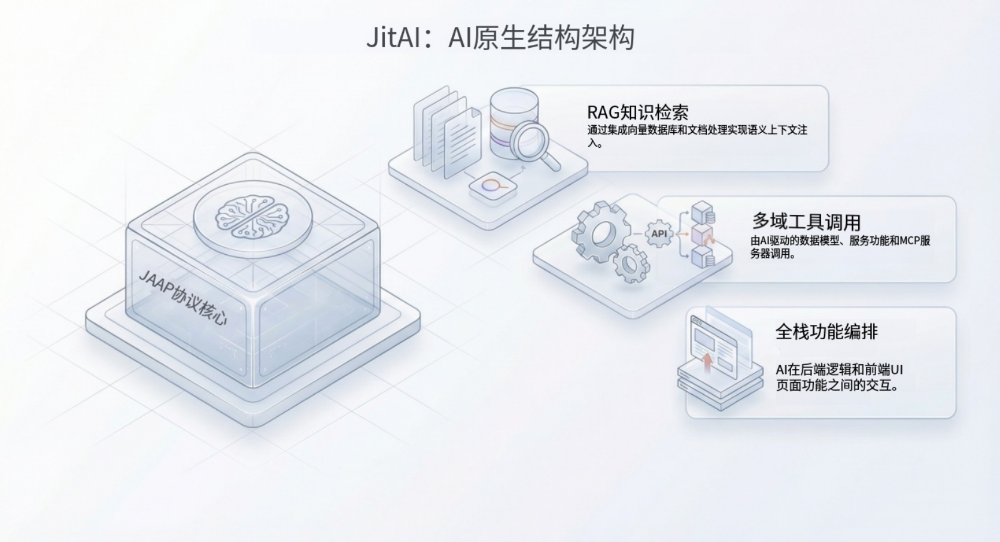

import Head from "@docusaurus/Head";

export const jsonLd = {
"@context": "https://schema.org",
"@graph": [
{
"@type": "Organization",
"@id": "https://jit.pro/#organization",
"name": "JitAI",
"legalName": "武汉万云网络科技有限公司",
"url": "https://jit.pro/",
"logo": {
"@type": "ImageObject",
"url": "https://jit-www.oss-accelerate.aliyuncs.com/logo/logo.svg"
},
"sameAs": [
"https://forum.jit.pro/",
"https://github.com/jitai-team",
"https://x.com/JitAi2017",
"https://www.instagram.com/jitai_2017",
"https://www.youtube.com/channel/UClvTNJPvBhek3aFuDy87RJQ",
"https://www.facebook.com/people/JitAi/61581485995674",
"https://www.linkedin.com/company/jitai2017"
]
},
{
"@type": "WebSite",
"@id": "https://jit.pro/#website",
"name": "JitAI",
"url": "https://jit.pro/",
"publisher": {
"@id": "https://jit.pro/#organization"
},
"inLanguage": [
"en",
"zh-CN"
]
},
{
"@type": "Blog",
"@id": "https://jit.pro/zh/blog#blog",
"name": "Blog",
"url": "https://jit.pro/zh/blog",
"isPartOf": {
"@id": "https://jit.pro/#website"
},
"publisher": {
"@id": "https://jit.pro/#organization"
},
"inLanguage": "zh-CN"
},
{
"@type": "WebPage",
"@id": "https://jit.pro/zh/blog/rag-tool-calling-function-calling-boundaries-patterns#webpage",
"url": "https://jit.pro/zh/blog/rag-tool-calling-function-calling-boundaries-patterns",
"name": "RAG、Tool Calling、Function Calling：边界与组合模式",
"description": "本文划清 RAG、工具调用与函数调用的边界，并给出可复用的组合模式与分层架构，帮助在企业知识库与 agentic 工作流中实现可治理的检索、决策与回写。",
"isPartOf": {
"@id": "https://jit.pro/#website"
},
"breadcrumb": {
"@id": "https://jit.pro/zh/blog/rag-tool-calling-function-calling-boundaries-patterns#breadcrumb"
},
"inLanguage": "zh-CN"
},
{
"@type": "BreadcrumbList",
"@id": "https://jit.pro/zh/blog/rag-tool-calling-function-calling-boundaries-patterns#breadcrumb",
"itemListElement": [
{
"@type": "ListItem",
"position": 1,
"name": "首页",
"item": "https://jit.pro/"
},
{
"@type": "ListItem",
"position": 2,
"name": "博客",
"item": "https://jit.pro/zh/blog"
},
{
"@type": "ListItem",
"position": 3,
"name": "RAG、Tool Calling、Function Calling：边界与组合模式",
"item": "https://jit.pro/zh/blog/rag-tool-calling-function-calling-boundaries-patterns"
}
]
},
{
"@type": "BlogPosting",
"@id": "https://jit.pro/zh/blog/rag-tool-calling-function-calling-boundaries-patterns#blogposting",
"mainEntityOfPage": {
"@id": "https://jit.pro/zh/blog/rag-tool-calling-function-calling-boundaries-patterns#webpage"
},
"url": "https://jit.pro/zh/blog/rag-tool-calling-function-calling-boundaries-patterns",
"headline": "RAG、Tool Calling、Function Calling：边界与组合模式",
"name": "RAG、Tool Calling、Function Calling：边界与组合模式",
"description": "本文划清 RAG、工具调用与函数调用的边界，并给出可复用的组合模式与分层架构，帮助在企业知识库与 agentic 工作流中实现可治理的检索、决策与回写。",
"datePublished": "2026-02-06T00:00:00.000Z",
"dateModified": "2026-02-06T00:00:00.000Z",
"inLanguage": "zh-CN",
"isPartOf": {
"@id": "https://jit.pro/zh/blog#blog"
},
"author": {
"@id": "https://jit.pro/#organization"
},
"publisher": {
"@id": "https://jit.pro/#organization"
},
"image": [
"https://jit-www.oss-accelerate.aliyuncs.com/logo/logo_dark.svg"
],
"keywords": [
"RAG",
"检索增强生成",
"知识库",
"向量数据库",
"语义检索",
"工具调用",
"函数调用",
"智能体式 AI",
"AI 治理",
"企业低代码"
],
"timeRequired": "PT15M"
},
{
"@type": "FAQPage",
"@id": "https://jit.pro/zh/blog/rag-tool-calling-function-calling-boundaries-patterns#faq",
"isPartOf": {
"@id": "https://jit.pro/zh/blog/rag-tool-calling-function-calling-boundaries-patterns#webpage"
},
"inLanguage": "zh-CN",
"mainEntity": [
{
"@type": "Question",
"name": "怎么向非 ML 的干系人解释差异？",
"acceptedAnswer": {
"@type": "Answer",
"text": "RAG 帮模型“查资料”。Tool calling 让模型“做事情”。Function calling 让“做事情”变成有契约、可治理、可审计的执行。"
}
},
{
"@type": "Question",
"name": "做 RAG 一定需要向量数据库吗？",
"acceptedAnswer": {
"@type": "Answer",
"text": "不一定。语料较小可用传统搜索或混合检索。内容规模变大、关键词不友好、需要语义匹配时，向量检索的价值会上升。"
}
},
{
"@type": "Question",
"name": "函数调用能消除幻觉吗？",
"acceptedAnswer": {
"@type": "Answer",
"text": "不能。它减少一类问题（格式错误的调用）并增强约束执行。语义正确性仍依赖检索质量、验证器与后置条件。"
}
},
{
"@type": "Question",
"name": "何时加入 human-in-the-loop？",
"acceptedAnswer": {
"@type": "Answer",
"text": "当动作会高影响地修改系统记录（财务、权限、客户外发消息），或政策要求审批留痕时。"
}
},
{
"@type": "Question",
"name": "“Agentic RAG”本质上就是 RAG 加工具吗？",
"acceptedAnswer": {
"@type": "Answer",
"text": "很多生产系统确实如此：检索成为众多工具之一，agent 决定何时检索、如何改写查询、何时调用其他系统。"
}
}
]
}
]
}

<Head>
    
</Head>

检索增强生成（Retrieval-Augmented Generation, RAG）、工具调用（tool calling）与函数调用（function calling）在企业讨论中经常被混在一起——尤其当团队希望把“与知识库对话”升级为具备检索、决策、回写记录能力的 agentic 工作流时。  
本文先划清边界，再给出可组合的模式，帮助你在 AI 低代码与企业开发平台内交付可靠、可治理的 AI 功能。

<!--truncate-->

## 为什么现在必须把边界讲清楚

进入 2025 年，企业团队从 Demo 走向生产环境，“LLM 应用默认技术栈”逐渐稳定在：检索 + 行动 + 治理。一个能体现检索已进入主流的数据点是：Databricks 报告称，其分析中有 70% 的公司在使用向量数据库与 RAG 来定制 LLM。

市场信号也一致。MarketsandMarkets 预计向量数据库市场将从约 26.5 亿美元（2025）增长到约 89.5 亿美元（2030），反映语义检索正成为核心基础设施层并快速扩张。

与此同时，治理正在走向标准化。ISO/IEC 42001:2023 将自己定位为首个 AI 管理体系标准，推动组织把 AI 交付当作可审计的管理体系来建设，而非一次性的功能开发。

这些变化让“分层”变得关键：

- 模型如何获得信息（RAG）
- 模型如何采取行动（tool calling）
- 行动如何变为可契约化、可强制执行（function calling）

## 可复用的定义（用于架构评审）

### RAG（Retrieval-Augmented Generation）：“自带证据”

RAG 是一种信息获取模式：从外部语料库（文档、工单、产品规格、政策等）检索相关上下文，再用检索结果为生成提供条件。  
核心思想是：回答能锚定到最新、组织专属的来源，并具备溯源与可刷新能力，单纯靠提示词很难达到这一点。

RAG 会给系统带来的变化：

- 增加检索流水线（索引、Embedding、语义搜索、重排/排序）
- 质量改进重心从“调 prompt”转向“数据 + 检索质量”
- 若保留引用与片段，答案更容易解释与追踪

RAG 不做的事：

- 不执行业务操作
- 不保证答案必然正确，只提升证据获取能力

### Tool calling：“在一次运行中选择外部能力”

工具调用是一种动作选择模式：模型决定调用外部工具（搜索、数据库读取、计算器、创建工单、触发工作流等），由编排器执行并把结果返回给模型。  
这让模型从文本生成器演进为能规划/控制的系统组件，并把实时输出纳入推理过程。围绕“工具增强 LLM”的研究也将其视为独立能力方向。

工具调用会给系统带来的变化：

- 引入编排循环：模型 → 工具调用 → 工具结果 → 模型
- 增加工具注册与运维问题（超时、重试、限流、配额）
- 安全风险显著上升，因为工具可能触达真实数据与状态

### Function calling：“带类型契约的工具调用”

函数调用可以理解为“结构化接口的工具调用”：调用必须匹配已声明的 schema（参数、类型、约束），因此更容易校验、记录、治理。  
在企业场景中，它常常是从“模型提出要做某事”到“系统在严格约束下执行某事”的关键桥梁，对可靠性很重要。

函数调用会给系统带来的变化：

- 执行前可验证（schema 校验）
- 可观测性更强（统一日志 + 参数捕获）
- 减少因参数格式错误导致的工具失败

研究与评测也越来越把“结构化输出”和“schema 约束生成”当作一等问题，因为它直接影响多步 agent 的稳定性。

## 清晰边界：上下文 vs 行动 vs 契约

一个简单心智模型：

- **RAG = 上下文路径**：检索信息，提升推理与证据锚定
- **Tool calling = 行动路径**：让系统在外部系统中完成工作
- **Function calling = 契约层**：让行动可强制、可审计，并更安全地规模化运行

分层的收益很直接：

- 提升检索质量时，不用改业务逻辑
- 增加新工具时，不必重建知识索引
- 收紧 schema 与策略时，不必重写提示词

## 常见失效模式与设计应对

### RAG 的失效模式

**低召回**：正确文档没有被检索到。  
应对：混合检索、更好的分块、查询改写、领域 Embedding、重排、以及“黄金问题集”测试。

**高召回、低精度**：返回大量无关片段。  
应对：重排、元数据过滤、更小候选集、更强意图分类。

**语料陈旧或缺少治理**：检索出过期政策。  
应对：生命周期规则（到期、责任人、复审节奏），并在引用中展示文档时间戳/负责人。

### Tool calling 的失效模式

**过度调用（成本/延迟爆炸）**。  
应对：工具预算、缓存、仅在需要时走“工具优先”路由、离线评估调用策略。

**调用不足（该查工具却直接编答案）**。  
应对：对高风险意图设定“必须调用”门禁（定价、合规、账号变更等）。

**从检索文本注入提示，诱导执行动作**。  
应对：把检索文本当作不可信输入；与工具指令通道隔离；任何写操作都必须通过契约校验。

### Function calling 的失效模式

**Schema 漂移**：工具 API 变了，模型仍用旧字段。  
应对：版本化 schema、兼容层、契约测试、明确弃用窗口。

**部分正确**：参数通过 schema 校验，但语义上不对。  
应对：语义验证器（业务规则）、后置条件（postconditions）、对高风险动作采用“解释 + 确认”。

**工具静默失败**：超时被当成“成功但无结果”。  
应对：类型化错误返回、指数退避重试、显式“必须拿到工具结果”的状态机。

## 可复用的组合模式

### 模式 1：仅 RAG 的知识助手（只读，上线快）

适用：Q&A、入职培训、内部文档、政策解释。

核心循环：  
检索 → 生成 → 引用来源

设计要点：

- 加引用与“打开证据片段”的 UI，提升信任
- 检索指标与生成指标分开监控

### 模式 2：RAG + tool calling 的“agentic 搜索”（读 + 验证）

适用：需要把内部文档与实时系统（库存、CRM 状态、事故面板）组合起来。

核心循环：  
意图路由 → 检索内部上下文 → 按需调用读工具 → 综合输出

设计要点：

- 把读工具做成一等公民（SQL Read、工单查询、分析查询）
- 要求模型标注结论来自“检索文档”还是“实时工具结果”

### 模式 3：无 RAG 的工具调用（事务型 Copilot）

适用：任务偏操作性，知识库价值不高：生成报表、运行流程、数据变换。

核心循环：  
规划步骤 → 调用工具 → 格式化输出

设计要点：

- 成败取决于工具稳定性、schema、权限
- 关键步骤提供确定性兜底方案

### 模式 4：RAG + function calling 的可治理回写（企业级“真干活”）

适用：需要安全地更新记录：创建工单、起草合同、更新订单状态、发起审批。

核心循环：  
检索政策/约束 → 提出动作 → 通过校验参数的函数调用 → 执行 → 写入审计日志

设计要点：

- 写工具单独分层，策略更严格
- 对高阈值动作加入人工审批（金额、权限、外部沟通）

这类场景最能体现 AI-native 企业平台的价值。在接近 JitAI 的系统设计中，通常会先建模：

- 可读写的数据实体
- 工作流状态与审批节点
- 权限模型（谁能触发什么）

再把 agent 行为绑定到这些契约上，让“AI 执行”天然继承平台运行时的治理能力。  
想看具体的可治理流程搭建示例，可以从 [JitAI 教程](https://jit.pro/zh/docs/tutorial) 开始；想直接动手体验，也可以试试 [JitAI](https://jit.pro/zh/download)。

### 模式 5：多步工作流：每一步都有契约

适用：跨多系统任务，例如“处理发票差异”“退款”“客户升级工单分诊”。

核心循环：

- 规划器（模型）产出步骤列表
- 每一步都转为带 schema + 校验器的函数调用
- 编排器执行预算、审批、回滚计划

设计要点：

- 持久化中间状态（尝试了什么、成功了什么）
- 支持可恢复（幂等调用、检查点）

## 面向低代码与企业开发平台的参考分层架构

你可以用分层架构承载上述模式，让职责边界更稳定：

1.  **检索层（RAG）**

- 连接器：文档、Wiki、工单、CRM 备注、PDF
- 索引：分块、Embedding、元数据标注
- 检索：语义搜索 + 重排 + 过滤
- 证据：保存片段 ID，供审计与引用

1.  **工具层（能力）**

- 读工具：搜索 API、DB 查询、分析查询
- 写工具：创建/更新、工作流状态迁移
- 工具注册：负责人、版本、限流、测试覆盖

1.  **契约层（function calling）**

- 每个工具的 schema（输入、约束、输出、错误）
- 校验器：业务规则、权限检查、阈值检查
- 策略引擎：白名单、环境隔离（生产 vs 沙箱）

1.  **编排器（运行时）**

- 路由：不同意图对应不同模式
- 安全：预算、超时、重试、人工门禁
- 可观测：日志、trace、评测钩子、成本跟踪

1.  **治理与风险管理对齐**  
    企业团队往往会把这些能力映射到治理框架与标准，包括 AI 风险管理指南（例如 NIST AI RMF）以及 AI 管理体系标准（例如 ISO/IEC 42001）。

## 评估：测对指标

### RAG 指标（上下文质量）

- 在测试题集上的召回/精度
- 引用是否真正支撑结论（引用可用性）
- 新鲜度与覆盖率（关键文档是否被索引并保持更新）

### 工具/函数指标（行动质量）

- 工具调用成功率（按工具、版本、输入类型）
- 参数有效率（schema 有效 + 业务有效）
- 工作流完成时间分布（关注 P95/P99，而非均值）
- 人工覆盖率（用户拒绝/重做的比例）

### 系统指标（生产就绪）

- 事故率与爆炸半径（工具故障会影响多大）
- 审计完整性（能否复盘“为何如此”“谁批准”）
- 单任务成本（检索、调用、重试、审批总成本）

## 快速决策清单（路由规则）

- 用户问“是什么/怎么做/政策在哪里”：先用 RAG-only
- 用户问“查当前状态”：加读工具，别只依赖文档
- 用户问“去系统里做事”：要求 function calling + schema
- 动作触达金额/权限/外部沟通：加审批门禁
- 结论无法用证据或工具结果解释：视为不安全输出

## FAQ

**怎么向非 ML 的干系人解释差异？**  
RAG 帮模型“查资料”。Tool calling 让模型“做事情”。Function calling 让“做事情”变成有契约、可治理、可审计的执行。

**做 RAG 一定需要向量数据库吗？**  
不一定。语料较小可用传统搜索或混合检索。内容规模变大、关键词不友好、需要语义匹配时，向量检索的价值会上升。

**函数调用能消除幻觉吗？**  
不能。它减少一类问题（格式错误的调用）并增强约束执行。语义正确性仍依赖检索质量、验证器与后置条件。

**何时加入 human-in-the-loop？**  
当动作会高影响地修改系统记录（财务、权限、客户外发消息），或政策要求审批留痕时。

**“Agentic RAG”本质上就是 RAG 加工具吗？**  
很多生产系统确实如此：检索成为众多工具之一，agent 决定何时检索、如何改写查询、何时调用其他系统。
