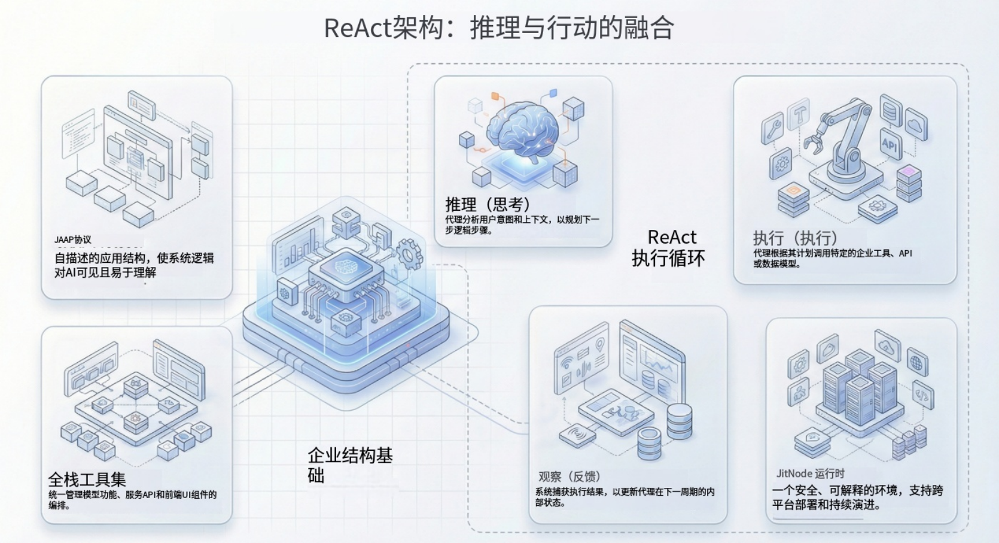

生成式 AI 的演进已迅速从被动生成文本的“聊天机器人（Chatbots）”转向能够主动执行任务的 **AI Agent（智能体）**。这一转变的核心在于 **ReAct（Reasoning and Acting，推理与行动）** 架构。与简单的“请求-响应”模式不同，ReAct Agent 在一个连续的循环中运行：观察环境、推理下一步、使用工具行动，并再次观察结果。

对于企业级开发者和架构师而言，挑战在于如何将这一架构从 Python 脚本迁移到生产级的**全栈执行引擎（Full-Stack Execution Engine）**——一个既能操作后端数据库，又能实时操控前端用户界面的系统。

本文将剖析该引擎背后的工程原理，重点关注推理循环、全栈工具调用策略以及状态管理。

<!--truncate-->

## ReAct 架构：推理 + 行动

ReAct 范式由 Yao 等人 (2022) 提出，通过交替进行“思维链追踪（Thought Traces）”与“动作执行（Action Execution）”，使大语言模型（LLM）能够解决复杂任务。

### 执行循环

一个企业级 Agent 执行引擎通常遵循以下生命周期：

1.  **输入解析（Input Parsing）**：Agent 接收用户目标（例如：“退款订单 #123 并更新库存”）。
2.  **推理（Reasoning / Thought）**：LLM 对照可用工具分析请求。它判断需要首先查询订单状态。
3.  **行动（Action）**：引擎构建对特定工具的结构化调用（例如：`getOrderStatus(id=123)`）。
4.  **观察（Observation）**：工具执行（访问数据库或 API）并返回输出（例如：`{"status": "delivered", "amount": 50}`）。
5.  **迭代（Iteration）**：LLM 观察此输出并生成下一个想法（“订单已送达。我可以继续进行退款。”）。
6.  **终止（Termination）**：循环持续进行，直到目标达成或达到最大迭代次数限制。

## “全栈”挑战：后端工具 vs. 前端工具

大多数 Agent 框架在后端工具方面表现出色——查询数据库或调用 REST API。然而，真正的企业级自动化通常需要**前端操控（Frontend Manipulation）**，例如导航 UI、填写复杂表单或触发客户端验证逻辑。

### 1. 后端工具调用

后端工具是确定性的，与函数或 API 端点 1:1 映射。

- **机制**：Agent 选择工具（例如 `update_customer_record`）。
- **执行**：引擎在安全的服务器端沙箱中执行函数。
- **安全**：需要严格的基于角色的访问控制（RBAC）以防止未经授权的数据变更 \[1\]。

### 2. 前端工具调用

前端工具允许 AI “驱动”用户界面。这在工程上要困难得多，因为它要求 Agent 感知客户端状态。

- **机制**：Agent 发出指令，由前端客户端拦截。
- **执行**：客户端执行 JavaScript 逻辑（例如 `openModal()`、`refreshTable()`）或路由导航。
- **延迟**：必须接近实时以避免 UI 卡顿。

## JitAI 的解决方案

JitAI 通过其 **AI Agent（智能体）** 元素家族提供了这一架构的生产级实现。它将“应用结构”视为一等公民，使 AI 能够原生理解并操控后端逻辑与前端组件。

### 1. ReAct Agent 元素 (aiagents.ReActType)

在 JitAI 中，创建 ReAct Agent 不仅仅是编写 Prompt，而是实例化一个 `aiagents.ReActType` 元素。该元素封装了整个推理循环，处理：

- **工具编排（Tool Orchestration）**：业务工具的动态组合。
- **上下文维护**：保留对话历史和中间变量状态。
- **生命周期管理**：处理启动、执行和完成状态。

根据内部架构，JitAI 的 Agent 支持“复杂业务逻辑的拆解与执行”，能够根据用户意图自动选择合适的工具。

### 2. 全栈工具集成

JitAI 的独特之处在于支持 Agent 原生调用**全栈元素（Full-Stack Elements）**：

- **模型函数（Model Functions）**：Agent 可以直接对数据模型执行 CRUD 操作（创建、读取、更新、删除），无需编写 SQL 或 API 包装器。例如，Agent 可以通过直接调用模型的 delete 函数来“删除这 3 个客户”。
- **服务函数（Service Functions）**：封装好的业务逻辑（Python），可作为原子工具被调用。
- **页面函数（Page Functions - 前端）**：关键在于，JitAI Agent 可以调用前端页面上定义的函数。这实现了“AI 操控网页（AI Controls Web Pages）”场景，Agent 可以主动填写表单、切换标签页或触发客户端计算。
- **MCP 服务**：支持模型上下文协议（Model Context Protocol, MCP），允许标准化连接外部数据源和工具。

### 3. 集成的状态与权限追踪

状态管理通过 **AI 助理（AI Assistant）** 的运行态（Runtime State）进行处理，它充当“记忆库”，存储用户输入、节点输出和中间变量。

此外，JitAI 强制执行**基于角色的工具权限（Role-Based Tool Permissions）**。您可以将敏感工具（如“批准贷款”）限制为特定用户角色。如果未授权用户要求 Agent 执行该任务，Agent 将基于底层的 JAAP（JitAI 应用协议）约束予以拒绝。

## 实施手册

以下是使用 JitAI 原则实现全栈 ReAct Agent 的策略指南。

### 第一阶段：定义大脑（Agent 配置）

1.  **创建元素**：实例化一个新的 `aiagents.ReActType` 元素。
2.  **选择 LLM**：选择具有强推理能力的模型（例如来自 OpenAI、Anthropic 或阿里云百炼的模型）。
3.  **系统提示词（System Prompt）**：定义 Agent 的角色和约束。
    - _提示_：使用“白名单”而非“黑名单”来约束字段和行为，以防止幻觉。

### 第二阶段：装备双手（工具注册）

1.  **后端工具**：注册现有的**服务函数**（如 `CalculateTax`）和**模型函数**（如 `QueryOrders`）作为工具。系统会自动将函数签名暴露给 LLM。
2.  **前端工具**：如果 Agent 需要操控 UI，请注册**页面函数**。例如，一个接收 JSON 对象并填充输入框的 `fillForm` 函数。
3.  **MCP 集成**：如果连接到外部系统（如 Git 仓库或 Slack），注册相应的 MCP 服务器。

### 第三阶段：编排流程（AI 助理）

1.  **封装在助理中**：将 Agent 放置在 **AI 助理（AI Assistant）** 元素内。这提供了聊天界面和会话管理。
2.  **可视化编排**：使用拖拽式设计器连接“开始（Start）”节点到“Agent”节点。
3.  **人机协同（Human-in-the-Loop）**：对于高风险操作（如“删除数据”），启用“**执行前确认（Confirm Execution）**”。这会暂停 Agent 并在工具运行前要求用户批准。

## 对比分析：Agent 架构

| **特性**     | **标准聊天机器人** | **RAG 聊天机器人** | **JitAI ReAct Agent** |
| ------------ | ------------------ | ------------------ | --------------------- |
| **主要目标** | 对话               | 信息检索           | 任务执行              |
| **逻辑引擎** | LLM (无状态)       | LLM + 向量库       | ReAct 循环 (有状态)   |
| **工具范围** | 无 (仅文本)        | 只读 (搜索)        | **全栈 (读/写/UI)**   |
| **UI 控制**  | 被动               | 被动               | **主动 (可驱动 UI)**  |
| **安全性**   | 提示注入风险       | 上下文泄露风险     | **工具执行级 RBAC**   |

_注：数据源自架构定性比较。_

## 如何验证与复现

为确保 ReAct Agent 正常运行，必须检查推理轨迹。

1.  **启用详细日志**：在 AI 助理配置中，将日志级别设置为“**输出详细运行过程日志（Output Detailed Process Logs）**”。这对于调试至关重要。
2.  **观察轨迹**：
    - _Look for the Thought (想法)_：Agent 是否正确识别了缺失信息？
    - _Look for the Action (行动)_：工具调用语法是否正确？
    - _Look for the Observation (观察)_：工具是否返回了预期的 JSON？

3.  **验证 UI 动作**：打开浏览器的开发者控制台。当 Agent 触发前端工具时，验证相应的 JavaScript 函数是否使用正确的参数被触发。

## 常见问题 (FAQ)

**Q: Agent 会陷入死循环吗？**

A: 会。ReAct Agent 有时会重复相同的想法。JitAI 通过允许在 Agent 配置中设置 `maxIterations`（最大迭代次数）来缓解这一问题。

**Q: Agent 如何知道如何使用我的自定义工具？**

A: JitAI 利用 JAAP 元素的“自描述（Self-Describing）”特性。当您注册函数时，其名称、描述和参数类型会自动序列化到 Prompt 的上下文窗口中。

**Q: 让 AI 删除数据库记录安全吗？**

A: 只有在实施了适当防护措施的情况下才安全。对于破坏性工具，您应启用“执行前确认”设置，强制在提交操作前进行人工审批步骤。

**准备好构建您的第一个全栈 Agent 了吗？**

立即下载 [JitAI 桌面版](https://jit.pro/zh/download)，并跟随 [JitAI 教程](https://jit.pro/zh/docs/devguide/ai-agent)，在几分钟内部署一个生产级 Agent。
