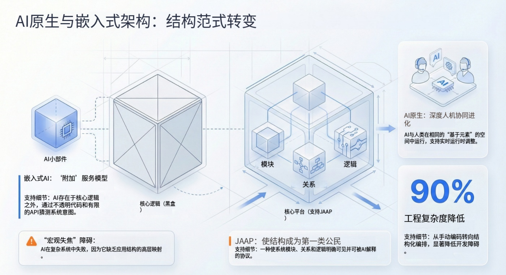

## 引言

本文探讨了开发者在将 AI 集成到软件时面临的两条截然不同的路径：一种是仅作为接口调用的「嵌入式 AI」，另一种是系统结构对 AI 透明的「AI 原生」架构。通过对比两者的架构差异，揭示了为什么将应用结构提升为「一等公民」是实现自主 AI 智能体（Agent）的关键，并介绍了 JAAP 协议如何解决传统开发中的语义坍塌与上下文瓶颈问题。

目前，业界正在目睹 AI 与软件集成方式的巨大分歧。一方面，我们看到了「AI 功能」——通过 API 嫁接在旧系统上的聊天机器人；另一方面，正在崛起的是「AI 原生应用」——从底层设计开始，就能被 AI 智能体（Agent）理解、操作和演进的系统。

对于资深开发者和架构师而言，理解「嵌入 AI」与「构建 AI 原生」之间的区别已不再是学术讨论，而是交付脆弱的演示 Demo 与部署稳健的企业级系统之间的本质区别。根本的分界线不在于你使用哪种模型（GPT-4 还是 Claude 3），也不在于向量数据库的大小，而在于应用系统的结构（Structure）对 AI 是否可见。

<!--truncate-->

## 「嵌入式 AI」的陷阱：为什么 API 还远远不够

在传统的开发范式中，应用程序是被编译的「黑盒」。当我们嵌入 AI 时，通常只是给大语言模型（LLM）提供了一个狭窄的钥匙孔（API）来窥视。

### 上下文窗口的瓶颈

尽管上下文窗口在不断扩大（128k 到 1M+ token），但将整个代码库或复杂的数据库模式（Schema）喂进提示词仍然是低效且易错的。当 AI 智能体尝试理解传统应用时，必须依赖「破碎」的检索——去猜测哪些代码片段或文档是相关的。

- **延迟**：每一轮对话处理庞大的上下文会导致不可接受的延迟。
- **细节丢失**：埋没在命令式代码（Imperative Code）中的业务逻辑（例如编译服务内部嵌套的 if-else 语句）通常对智能体是不可见的，除非显式地通过函数调用（Function Calling）定义暴露出来。

### 「黑盒」逻辑问题

在传统软件中，应用的「结构」（实体间的关系、权限、流转逻辑）是隐含的。它存在于开发者的脑海中和一行行代码里。

- **外部插件综合症**：AI 表现得像个局外人。它可以触发一个动作，但它不理解该动作在更广泛系统中的后果或状态。
- **脆弱性**：如果开发者修改了一个变量名或数据库列，AI 的提示词指令往往会失效，因为 AI 依赖的是硬编码的文本描述，而非实时的结构定义。

## 根本分界线：结构作为一等公民

要构建真正的 AI 原生应用，我们必须反转这种关系。与其让 AI 费力地解释代码，不如让应用程序以标准化的、机器可读的结构呈现自身。

### 从隐含代码到显式协议

核心转变在于将「应用结构」（Application Structure）提升为一等公民。

- **传统方式**：代码隐含地定义结构。
- **AI 原生方式**：协议显式地定义结构；代码在结构内部实现逻辑。

当结构是显式的时候，AI 智能体不需要阅读一万行 Python 代码就能理解「员工」与「部门」的关系。它只需查询结构定义即可。

### 让应用对 AI「可读」

AI 原生系统暴露了一个自描述（Self-describing）模型。这使得 AI 能够：

- **遍历关系**：理解删除一个「用户」可能会级联影响到「订单」。
- **校验权限**：在建议操作前，动态检查基于角色的访问控制（RBAC）。
- **自我修复**：检测到工具定义不再匹配底层的服务签名。

## 架构对比：嵌入式 vs. 原生

下图展示了这种架构鸿沟。在嵌入式模型中，AI 在迷宫般的断开端点中导航；在结构化原生模型中，AI 与统一的地图进行交互。

## JitAI 如何解决这一问题：JAAP 协议

JitAI 通过 JAAP（JitAi AI Application Protocol，JitAi AI 应用协议）从根本上重新定义了这种关系。与单纯串联 API 调用的平台（如 LangChain 或 Coze）不同，JitAI 强制要求应用结构是显式的，并由人类开发者与 AI 共享。

### 统一的元-类型-实例模型

JitAI 使用严谨的层级结构：元 Meta (定义) → 类型 Type (分类) → 实例 Instance (实现)。

- **共识理解**：AI 操作的不是晦涩的代码，而是应用结构本身。由于结构通过 JAAP 进行了标准化，AI 可以在运行时「看到」系统的精确能力。
- **无「翻译」损耗**：当开发者创建一个「服务元素」或「数据模型」时，它会立即以 AI 可理解的格式注册。无需手动编写复杂的 OpenAPI 规范，元素本身就是规范。

### AI 作为系统参与者

在 JitAI 架构中，AI 不是外部插件。它与人类开发者使用的是同一套类型/实例结构模型。

- **运行时理解**：AI 可以在运行时理解系统结构，并在受控前提下参与修改应用。
- **深度集成**：AI 智能体可以直接操作数据模型、调用服务函数，并与前端页面交互，因为所有这些元素都由同一个底层协议定义。

这种方法通过结构化查询取代了原始文本分析，解决了「上下文窗口」问题。AI 不需要阅读整个应用，它只需阅读「地图」。

## 实施指南：为 AI 可见性而设计

要转向这种架构（即使在 JitAI 之外），工程团队必须采用新的标准：

1.  **为逻辑定义模式 (Schema)**：停止将业务规则埋没在随意的函数中。使用状态机或规则引擎，将其逻辑导出为 JSON/YAML。
2.  **标准化工具定义**：确保代码库中的每个函数都有严谨的、机器可读的定义（输入、输出、副作用），并在 CI/CD 中自动更新。
3.  **结构与实现解耦**：创建一个描述应用「做什么」的「元数据层」，将其与「怎么做」分开。这一层正是 AI 交互的层面。

## 方法对比

下表对比了传统的 AI 嵌入方式与结构化 AI 原生方式。

| **特性**       | **嵌入式 AI (插件模型)** | **结构化 AI 原生 (系统模型)** |
| -------------- | ------------------------ | ----------------------------- |
| **主要接口**   | 自然语言 -> API 调用     | 自然语言 -> 结构化操作        |
| **系统可见性** | 低 (不透明黑盒)          | 高 (透明白盒)                 |
| **演进成本**   | 高 (必须手动更新提示词)  | 低 (结构自动更新 AI 上下文)   |
| **幻觉风险**   | 高 (基于描述进行猜测)    | 降低 (受限于合法的结构约束)   |
| **AI 的角色**  | 助手 / 外部工具          | 系统参与者 / 共同构建者       |

_(注：基于架构原则的定性对比。)_

## 如何验证「原生」能力

要判断一个平台或框架是真正的 AI 原生还是仅仅是 AI 嵌入，可以提出以下三个技术问题：

1.  **AI 能描述系统吗？**：要求 AI 列出所有可用服务及其依赖关系。如果它依赖硬编码的系统提示词来回答，它是嵌入式的；如果它查询实时的元数据注册表，它是原生的。
2.  **重构会破坏 AI 吗？**：重命名一个核心业务实体。如果 AI 智能体在不修改提示词的情况下仍能继续工作，说明系统具备结构感知能力。
3.  **「上帝提示词」是必需的吗？**：系统是否需要一个巨大的、描述 API 文档的系统提示词？真正的 AI 原生系统会根据结构图动态注入上下文，从而消除静态上下文堆砌的需求。

## 常见问题 (FAQ)

**问：构建「AI 原生」是否意味着我不能使用标准代码？**

答：不是。这意味着你的代码必须被包装在标准化协议（如 JAAP）中，或者由该协议描述，以便 AI 理解其边界和能力。你仍然可以使用 Python 或 TypeScript 等语言编写业务逻辑。

**问：这会如何影响数据隐私？**

答：结构化协议实际上增强了隐私。因为 AI 交互的是定义的元数据层，你可以从结构层面强制执行权限（例如：「AI 角色无法访问 HR 表」），而不是依赖 AI 承诺「不读取数据」。

**问：这只是针对零代码/低代码平台吗？**

答：虽然可视化工具获益巨大，但该原则同样适用于专业代码（Pro-code）环境。「结构作为一等公民」是一种架构模式，而不仅仅是 UI 特性。它与平台工程（Platform Engineering）的现代趋势相一致，即基础设施即代码/数据。

## 结论

从「嵌入 AI」到「构建 AI 原生」的转变，是下一代软件架构师面临的定义性挑战。它要求我们不再将 AI 视为神奇的聊天接口，而是将其视为需要可见、可导航结构的核心系统组件。

通过采用使应用结构显式化的协议（如 JitAI 的 [JAAP](https://jit.pro/zh/docs/reference/runtime-platform/JAAP)），开发者可以构建出 AI 不再仅仅是访客、而是具备深度推理和可靠操作能力的「原住民」系统。
