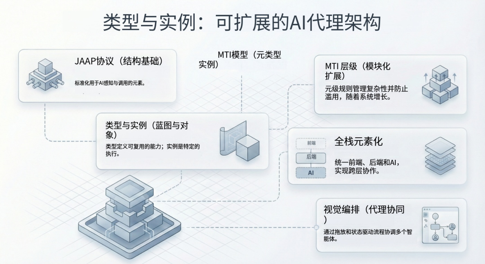

构建 AI 原生应用时，最棘手的挑战之一是“白板”问题（Blank Slate Problem）。当你要求大语言模型（LLM）从零构建一个功能时，它生成的代码往往虽然语法正确，但在结构上却是一团混乱。它会重复造轮子、幻觉出不存在的 API，并因为缺乏统一的结构上下文而导致后续维护的噩梦。

对于资深开发者和架构师而言，解决方案不在于“更好的提示词（Prompt）”，而在于更好的架构。通过将**应用结构（Application Structure）**提升为“一等公民”，我们可以将 AI 的创造力限制在它最能发挥价值的地方（业务逻辑和配置），同时将其锚定在严格、预先验证过的结构定义上。

本文将探讨 **Type（类型）与 Instance（实例）** 机制——这是一种让 AI 实现“一次学习，处处实例化”的架构模式，它将脆弱的代码生成转变为稳健的结构化配置。

<!--truncate-->

## 核心问题：为什么 AI 难以处理“扁平”代码

在传统开发中，代码通常是文件的扁平集合。当 AI Agent 试图修改这些代码时，它必须扫描数千行代码来理解上下文，这不仅消耗了巨大的 Token 窗口，还增加了出错的概率。

试想一个标准的“审批工作流”。如果你要求 AI 构建一个，它可能会生成一个包含硬编码逻辑的 Python 脚本。如果你要求构建第二个，它可能会生成一个完全不同的脚本，逻辑略有差异。最终，你得到了同一个概念的两个截然不同的实现。

缺失的一环是**语义结构**。AI 需要理解“审批工作流”是一个**Type（类型）**，而具体的请求只是该 Type 的一个**Instance（实例）**。

## 架构体系：Meta、Type 与 Instance

为了解决这个问题，我们可以采用一种类似于面向对象编程（OOP）或 Kubernetes 自定义资源定义（CRD）的层级元素系统，但针对 AI 交互进行了优化。这个层级结构由三层组成：

### 1. Meta（元元素）—— DNA

Meta 是能力的抽象定义。它定义了一个元素“是什么”，而不是“如何工作”。它是根接口。

- **示例**：`aiagents.Meta` 定义了所有 Agent 必须具备输入、输出和运行（run）方法。
- **作用**：提供系统（以及 AI）所依赖的基础契约。

### 2. Type（类型元素）—— 模版

Type 是 Meta 的可复用实现。它封装了某一类对象通用的具体逻辑、代码和行为。

- **示例**：`aiagents.ReActType` 是 `aiagents.Meta` 的一个具体实现。它包含了 ReAct（推理 + 行动）循环的实际 Python 代码。
- **作用**：这是 AI 用于“阅读”以理解能力的部分。AI 看到 `ReActType` 就知道：“我可以使用工具，我可以推理，并且我需要一个系统提示词（System Prompt）。”

### 3. Instance（实例元素）—— 实现

Instance 是 Type 的特定配置。它不包含结构性代码，只包含配置数据（通常是 JSON），用于指示 Type 在特定业务场景下应如何表现。

- **示例**：`CustomerServiceAgent`（客服 Agent）是 `aiagents.ReActType` 的一个实例。它的配置定义了具体使用哪个 LLM 模型、查询哪个知识库以及具体的系统提示词。
- **作用**：这是 AI 用于“生成”的部分。AI 不再编写新的 Python 类，而是简单地输出一个 JSON 配置文件来实例化 Type。

## JitAI 的解决方案：JAAP 协议

JitAI 通过 **JAAP (JitAi Ai Application Protocol)** 充分利用了这一模式。在 JitAI 中，应用结构不是隐藏在代码注释里的，而是显式表达且对 AI 可见的。

当你要求 JitAI “创建一个基于文档回答 FAQ 的 AI Agent”时，平台的 AI 不会编写一个新的 Python 脚本。相反，它遵循以下认知路径：

1.  **意图识别**：它识别出你需要一个 `AIAgent`。
2.  **Type 选择**：它选择 `aiagents.ReActType`，因为这最符合使用工具（知识库检索）的需求。
3.  **Instance 生成**：它生成一个配置文件（如 `e.json`），实例化 `ReActType` 并将其绑定到你指定的知识库元素。

### “理解”机制

因为 Type 是由人类工程师预先定义并验证过的，AI 不需要“猜测”如何实现 ReAct 循环或如何管理内存。它只需要填空：

- 用哪个模型？（例如：`llms.OpenAI`）
- 用哪些工具？（例如：`framework__JitAi__ai-knowledge-base.md` 对应的知识库）
- 什么提示词？（例如：“你是一个乐于助人的助手...”）

这种关注点分离意味着 AI 操作的是**结构**，而不仅仅是接口。它是在修改应用的 DNA，而不是在上面粘贴代码。

## 实施指南：利用 Type/Instance 进行开发

对于在 JitAI 上构建应用的开发者来说，这种机制将开发工作流从“编写代码”转变为“编排元素”。

### 第 1 步：定义或选择 Type

大多数情况下，你会使用内置 Type。例如，如果你需要一个数据库表，你不需要写 SQL `CREATE TABLE` 语句，而是选择 `models.NormalType`。

> **提示**：如果你有高度专业化的逻辑（例如私有 IoT 协议），你可以通过扩展 Meta 元素来创建自定义的 Type 元素。

### 第 2 步：通过 AI 实例化

不用手动编写实例配置，直接使用 Agent 生成它。

- **Prompt**：“创建一个‘销售订单’模型，包含日期、总金额和客户 ID 字段。”
- **结果**：Agent 生成一个名为 `SalesOrder` 的 `models.NormalType` 实例的 `e.json` 配置。它会自动处理数据类型（例如，将“总金额”转换为金额字段），因为它理解 Type 的模式（Schema）。

### 第 3 步：复用与扩展

一旦 Instance 被创建，它就成为系统中一个独立的、可寻址的元素。其他元素（如页面或 Agent）可以通过其全名（fullName，例如 `models.SalesOrder`）引用它。

- **收益**：如果你更新了底层的 `models.NormalType`（例如增加一个新的缓存层），所有实例（销售订单、客户等）都会通过继承关系即时获得该改进。

## 对比：传统开发 vs. Type/Instance 模式

下表对比了传统的代码生成方法与 AI 原生平台使用的 Type/Instance 模式。

| **特性**          | **传统 AI 代码生成**                | **JitAI Type/Instance 模式**              |
| ----------------- | ----------------------------------- | ----------------------------------------- |
| **代码结构**      | 扁平文件，逻辑重复                  | 层级化，逻辑继承                          |
| **AI 上下文负载** | 高（需读取完整代码库）              | 低（仅读取 Type 定义）                    |
| **维护性**        | 困难（修复 Bug 需更新所有生成文件） | 容易（修复 Type，所有 Instance 自动更新） |
| **一致性**        | 低（AI 可能对同一逻辑有不同实现）   | 高（逻辑被锁定在 Type 中）                |
| **幻觉风险**      | 高（AI 臆造库/语法）                | 低（AI 受限于配置 Schema）                |

## 实战案例：“答题卡”逻辑

让我们看一个来自“试卷管理”系统的具体案例。我们需要对学生的回答进行评分。

**传统方式：**

开发者（或 AI）编写一个脚本，查询数据库，循环遍历答案，对比字符串，计算分数，然后更新数据库。这个脚本是针对此特定交互的孤立代码。

**JitAI 方式：**

1.  **Type**：我们使用 `aiagents.ReActType`，它知道如何推理和调用工具。
2.  **工具**：我们将数据模型 `AnswerSheet`（答题卡）作为一个工具暴露给 Agent。
3.  **Instance**：我们通过 Prompt 配置 Agent：“读取答题卡详情，与标准答案对比，并更新分数。”

AI 不会编写“更新数据库”的代码。它调用的是 `AnswerSheet` 模型（它是 `models.NormalType` 的一个实例）提供的 `update` 方法。AI 仅仅是在编排预先存在的、稳健的结构化元素。

## 如何验证 / 复现

要在 JitAI 中亲眼看到这一机制：

1.  **访问开发者门户**：打开 JitAI IDE。
2.  **检查元素**：右键点击任意数据模型或 AI Agent，选择“打开源码”。
3.  **查看 e.json**：注意 `type` 字段（例如 `"type": "aiagents.ReActType"`）。这一行代码将你的特定实例连接到了框架庞大的底层逻辑上。
4.  **创建一个变体**：使用“+”按钮创建一个新 Agent。注意你只需提供配置（名称、模型、Prompt），新 Agent 立刻就具备了复杂的执行能力。

## FAQ

**Q: 我可以创建自己的 Type 吗？**

A: 可以。你可以通过扩展现有的 Meta 元素来定义自定义 Type。这允许你封装专有的业务逻辑，然后由 AI 多次实例化。

**Q: 这会限制灵活性吗？**

A: 不会。虽然结构由 Type 定义，但行为可以通过配置和指导 Instance 的自然语言 Prompt 进行高度灵活的调整。你获得了结构的稳定性，同时也保留了 AI 的灵活性。

**Q: 这不就是面向对象编程（OOP）吗？**

A: 它将 OOP 原则应用到了 AI 生成中。关键区别在于，“类”（Type）是专门设计为语义化且易于 LLM 理解的，这使得 LLM 能够充当“实例化者”。

## 结语

向 AI 原生开发的转型要求我们不再将 AI 视为编写样板代码的“超级打字员”，而是将其视为配置成熟结构的架构师。Type 与 Instance 机制为这一转变提供了必要的护栏，将潜在的混乱转化为可扩展、可维护的企业级系统。
