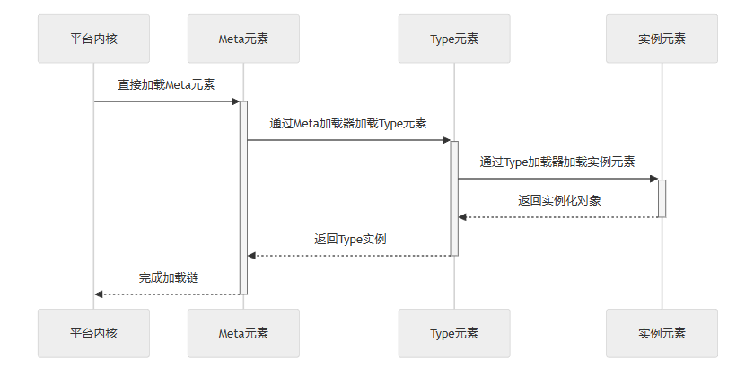

试想一下，如果浏览器面对的不是具有清晰 HTML 结构的网页，而是一堆原始的像素数据或非格式化文本，它将无法渲染页面，搜索引擎爬虫也无法进行索引。然而，这正是目前大多数大语言模型（LLM）对现代企业软件系统的感知方式：一大堆非结构化的代码文件、依赖项和配置块。

对于 AI 原生开发而言，AI 仅仅获得代码访问权是不够的，它需要一张地图。它需要一个标准协议来理解业务系统的结构，就像浏览器通过 HTML 理解网页结构一样。

这就是 **JAAP (JitAi Ai Application Protocol，JitAi AI 应用协议)** 的用武之地。JAAP 不仅仅是一个编码标准，它是一个结构协议，旨在将业务逻辑与技术实现解耦，使应用变得“自描述”，从而让开发者和 AI Agent 都能轻松阅读和理解。

<!--truncate-->

## 范式转变：结构作为一等公民

在传统软件工程中，应用程序的“架构”通常是隐式的。它存在于高级架构师的脑海中，或者掩埋在数千行胶水代码里。

- **传统代码**：结构隐藏在实现细节中。AI 必须解析整个代码库才能理解 `UserServices.py` 与 `OrderModel.py` 存在交互。
- **JAAP 代码**：结构是显式的。应用程序被定义为一组受严格协议管理的标准化**元素（Elements）**。

这种转变使得 AI 能够执行“结构化推理”。AI 不再需要猜测模块之间如何连接，而是通过读取 JAAP 定义，确切地了解哪些能力可用、它们需要什么输入以及它们之间如何关联。

## 为什么 AI 需要显式结构

当前的生成式 AI（GenAI）模型面临上下文窗口的限制。将百万行代码的单体应用全部输入提示词（Prompt）既低效又容易出错。通过将系统抽象为高级协议（JAAP），AI 可以首先导航系统的“元数据”（即结构），精确定位它需要修改或执行的逻辑，而不会淹没在样板代码中。

## 深入解析：JAAP 架构

从本质上讲，JAAP 借鉴了面向对象程序员熟悉的概念，但将其应用于整个系统架构。它将所有软件制品组织成三层层级结构：**Meta（元素）**、**Type（类型）** 和 **Instance（实例）**。



### 元素层级 (The Element Hierarchy)

系统中的每一部分——无论是页面、数据库连接、后端服务还是 API 端点——都是一个**元素（Element）**。

- **Meta（元素）**：“类的类”。它定义了基本能力。例如，`models.Meta` 定义了其下的所有内容都必须支持 CRUD 操作。
- **Type（类型）**：“类”。它提供技术实现。例如，`models.NormalType` 可能会使用特定的 SQL 方言来实现模型。
- **Instance（实例）**：“对象”。这是开发者（或 AI）实际创建的内容。例如，`models.OrderTable` 就是 `models.NormalType` 的一个实例。

### 自描述的 "e.json"

在 JAAP 中，每个元素都附带一个配置文件，通常命名为 `e.json`（Element JSON）。该文件以 LLM 易于解析和生成的格式描述了元素的元数据、依赖关系和配置参数。

AI 无需编写命令式的设置代码，只需生成一个声明式的 JSON：

> “这是一个服务元素，名为 'PaymentService'，使用 'Python 服务类型'，包含函数 A、B 和 C。”

## 对比：传统开发 vs 低代码 vs JAAP

这种方式与我们要今天使用的技术有何不同？

| **特性**        | **传统开发**                | **低代码平台 (Low-Code)** | **JAAP (AI 原生)**            |
| --------------- | --------------------------- | ------------------------- | ----------------------------- |
| **主要接口**    | 文本代码 (Java, Python, TS) | 可视化拖拽                | 结构化协议 (JSON/YAML + 代码) |
| **结构可见性**  | 隐式 (埋在代码中)           | 隐藏 (专有引擎)           | **显式 (自描述)**             |
| **AI 可访问性** | 低 (需要解析逻辑)           | 低 (GUI 对 AI 不可读)     | **高 (AI 读/写协议)**         |
| **可扩展性**    | 无限 (工作量大)             | 受限于厂商插件            | **无限 (通过新 Type 扩展)**   |
| **锁定风险**    | 框架锁定                    | 平台锁定                  | **基于协议 (潜在开放标准)**   |

**注意**：虽然低代码平台通过 GUI 隐藏了复杂性，但它们往往将开发者困在“黑盒”中。JAAP 通过基于文本的协议暴露结构，允许 AI 像开发者编辑配置文件一样轻松地与系统交互。

## 实战演练：在 JAAP 中定义一个服务

让我们看看开发者（或 Agent）如何使用 JAAP 创建一个简单的“订单计算”服务。

### 第一步：定义元素 (e.json)

AI 首先生成结构定义。这告诉运行时这个组件是什么。

JSON

```plaintext
// 路径: /applications/MyApp/services/OrderService/e.json
{
  "title": "Order Calculation Service",
  "type": "services.NormalType", // 继承自标准服务类型
  "backendBundleEntry": ".",     // 逻辑代码位置
  "functionList": [
    {
      "name": "calculateTotal",
      "title": "Calculate Order Total",
      "args": ["orderItems", "taxRate"],
      "returnType": "number"
    }
  ]
}

```

### 第二步：实现逻辑 (inner.py)

由于结构已在 `e.json` 中定义，实现文件只需包含业务逻辑，无需编写样板连接代码。

Python

```plaintext
# 路径: /applications/MyApp/services/OrderService/inner.py
from jit import app

def calculateTotal(orderItems, taxRate):
    subtotal = sum(item['price'] * item['qty'] for item in orderItems)
    return subtotal * (1 + taxRate)

```

### 第三步：AI 交互

当 AI Agent 想要使用此服务时，它不需要阅读 `inner.py`。它只需读取 `e.json` 即可知道 `OrderService` 存在并且有一个 `calculateTotal` 方法。这种对 Token 消耗的大幅减少使得 Agent 能够高效地编排庞大的系统。

## 如何验证 / 复现

- **检查目录结构**：一个符合 JAAP 的项目总是具有标准化的目录树（例如 `models/`, `services/`, `pages/`），确保 AI 确切知道在哪里查找。
- **查看 e.json**：导航到 JitAI 应用中的任何模块。你会发现 `e.json` 文件定义了其类型和关系。
- **运行时反射**：在运行的 JitAI 环境中，你可以使用 `app.getElement('services.OrderService')` API 动态检索协议中定义的元数据，验证系统的自知能力。

## JitAI 如何解决这个问题

JitAI 是第一个明确为运行 JAAP 协议而构建的平台。

- **应用的“浏览器”**：就像 Chrome 解释 HTML 来渲染网页一样，**JitNode**（JitAI 运行时）解释 JAAP 来执行企业应用。
- **统一图谱**：JitAI 维护着所有 Meta、Type 和 Instance 的实时图谱。当你要求 JitAI Assistant “添加折扣功能”时，它不仅仅是搜索字符串；它会查询这个图谱以找到 `OrderService` 实例，并在协议规定的确切位置注入新逻辑。
- **可视化与代码同步**：由于 JAAP 是基于文本的协议，JitAI 允许你在可视化编辑器（修改 `e.json`）和代码编辑器（修改 `inner.py`）之间无缝切换，保持两者完美同步。

## 常见问题 (FAQ)

Q: JAAP 是一门新的编程语言吗？

A: 不是。它是一个架构协议。你仍然使用 Python、Java 或 TypeScript 等标准语言编写业务逻辑。JAAP 只是定义了这些部分如何连接。

Q: 我可以创建自己的元素类型 (Element Types) 吗？

A: 可以。JAAP 的优势之一就是可扩展性。你可以定义一个新的 Type（例如，“Kafka 消费者类型”）并在你的应用中多次实例化它。

Q: 这会取代 Docker/Kubernetes 吗？

A: 不会。JAAP 运行在应用层。JitNode（运行 JAAP 应用的容器）本身可以作为 Docker 容器部署在 Kubernetes 集群中。

## 结论

软件开发的未来不仅仅是 AI 编写代码，而是 AI 理解系统。通过采用 JAAP，开发者为 AI 提供了其急需的结构化上下文——一种将不透明的“黑盒”应用转变为透明、自描述软件系统的通用语言。

这种“协议优先”的方法是连接今天的手工工程与未来 AI 原生自动化之间的桥梁。
